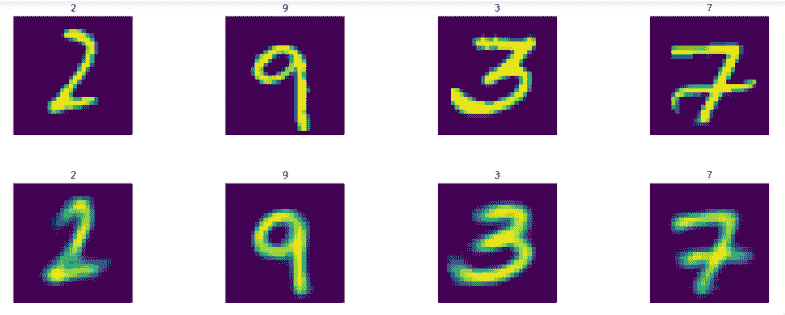

# Keras 中的变分自编码器

在 Keras 中，构建变分自编码器更容易，并且代码行更少。 Keras 变分自编码器最好使用函数式风格构建。到目前为止，我们已经使用了在 Keras 中构建模型的顺序样式，现在在这个例子中，我们将看到在 Keras 中构建 VAE 模型的函数式风格。在 Keras 建立 VAE 的步骤如下：

1.  定义隐藏层和潜在变量层中的超参数和神经元数量：

```py
import keras
from keras.layers import Lambda, Dense, Input, Layer
from keras.models import Model
from keras import backend as K

learning_rate = 0.001
batch_size = 100
n_batches = int(mnist.train.num_examples/batch_size)
# number of pixels in the MNIST image as number of inputs
n_inputs = 784
n_outputs = n_inputs
# number of hidden layers
n_layers = 2
# neurons in each hidden layer
n_neurons = [512,256]
# the dimensions of latent variables
n_neurons_z = 128
```

1.  构建输入层：

```py
x = Input(shape=(n_inputs,), name='input')
```

1.  构建编码器层，以及潜在变量的均值和方差层：

```py
# build encoder
layer = x
for i in range(n_layers):
    layer = Dense(units=n_neurons[i], activation='relu',name='enc_{0}'.format(i))(layer)

z_mean = Dense(units=n_neurons_z,name='z_mean')(layer)
z_log_var = Dense(units=n_neurons_z,name='z_log_v')(layer)
```

1.  创建噪声和后验分布：

```py
# noise distribution
epsilon = K.random_normal(shape=K.shape(z_log_var), 
          mean=0,stddev=1.0)

# posterior distribution
z = Lambda(lambda zargs: zargs[0] + K.exp(zargs[1] * 0.5) * epsilon,
    name='z')([z_mean,z_log_var])
```

1.  添加解码器层：

```py
# add generator / probablistic decoder network layers
layer = z
for i in range(n_layers-1,-1,-1):
    layer = Dense(units=n_neurons[i], activation='relu',
            name='dec_{0}'.format(i))(layer)
```

1.  定义最终输出层：

```py
y_hat = Dense(units=n_outputs, activation='sigmoid',
        name='output')(layer)
```

1.  最后，从输入层和输出层定义模型并显示模型摘要：

```py
model = Model(x,y_hat)
model.summary()
```

我们看到以下摘要：

```py
_________________________________________________________________________
Layer (type)         Output Shape          Param #     Connected to                     
=========================================================================
input (InputLayer)   (None, 784)           0                                            
_________________________________________________________________________
enc_0 (Dense)        (None, 512)           401920      input[0][0]                      
_________________________________________________________________________
enc_1 (Dense)        (None, 256)           131328      enc_0[0][0]                      
_________________________________________________________________________
z_mean (Dense)       (None, 128)           32896       enc_1[0][0]                      
_________________________________________________________________________
z_log_v (Dense)      (None, 128)           32896       enc_1[0][0]                      
_________________________________________________________________________
z (Lambda)           (None, 128)           0           z_mean[0][0]                     
                                                       z_log_v[0][0]                    
_________________________________________________________________________
dec_1 (Dense)        (None, 256)           33024       z[0][0]                          
_________________________________________________________________________
dec_0 (Dense)        (None, 512)           131584      dec_1[0][0]                      
_________________________________________________________________________
output (Dense)       (None, 784)           402192      dec_0[0][0]                      
=========================================================================
Total params: 1,165,840
Trainable params: 1,165,840
Non-trainable params: 0
_________________________________________________________________________
```

1.  定义一个计算重建和正则化损失之和的函数：

```py
def vae_loss(y, y_hat):
    rec_loss = -K.sum(y * K.log(1e-10 + y_hat) + (1-y) * 
                K.log(1e-10 + 1 - y_hat), axis=-1)
    reg_loss = -0.5 * K.sum(1 + z_log_var - K.square(z_mean) - 
                K.exp(z_log_var), axis=-1) 
    loss = K.mean(rec_loss+reg_loss)
    return loss
```

1.  使用此损失函数来编译模型：

```py
model.compile(loss=vae_loss,
    optimizer=keras.optimizers.Adam(lr=learning_rate))
```

1.  让我们训练 50 个周期的模型并预测图像，正如我们在前面的部分中所做的那样：

```py
n_epochs=50
model.fit(x=X_train_noisy,y=X_train,batch_size=batch_size,
    epochs=n_epochs,verbose=0)
Y_test_pred1 = model.predict(test_images)
Y_test_pred2 = model.predict(test_images_noisy)
```

让我们显示结果图像：

```py
display_images(test_images.reshape(-1,pixel_size,pixel_size),test_labels)
display_images(Y_test_pred1.reshape(-1,pixel_size,pixel_size),test_labels)
```

我们得到如下结果：



```py
display_images(test_images_noisy.reshape(-1,pixel_size,pixel_size),
    test_labels)
display_images(Y_test_pred2.reshape(-1,pixel_size,pixel_size),test_labels)
```

我们得到以下结果：


这很棒！！生成的图像更清晰，更清晰。