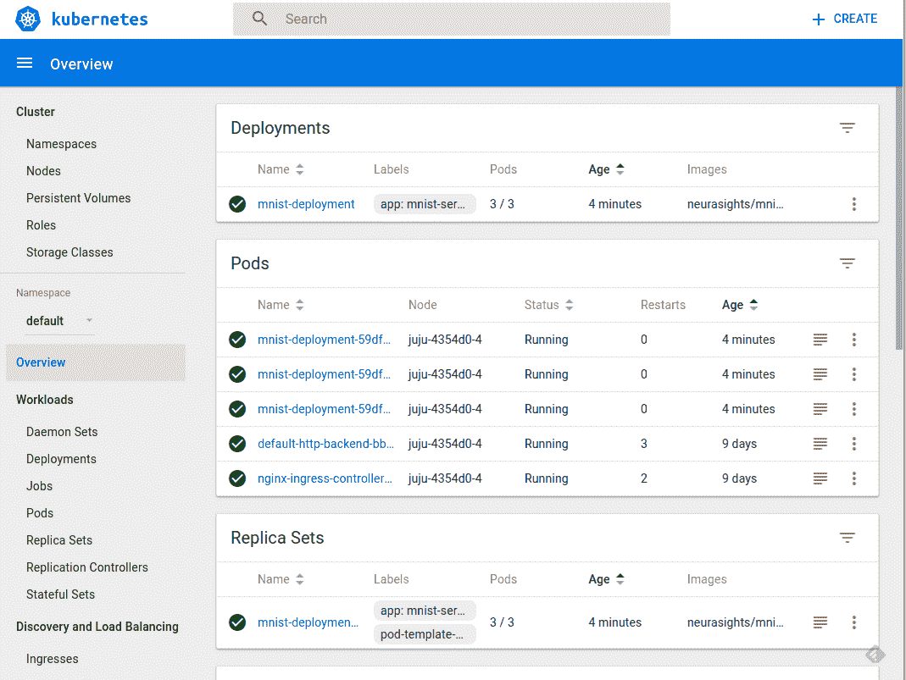
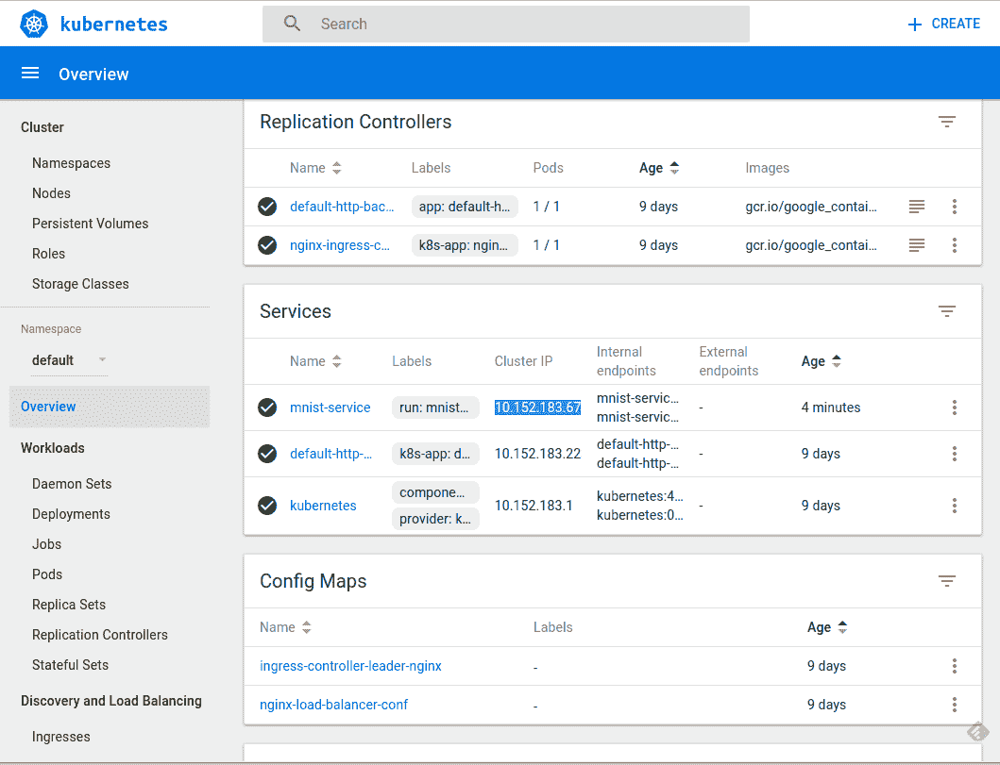

# 在 Kubernetes 部署

我们继续在 Kubernotes 中进行部署，如下所示：

1.  使用以下内容创建`mnist.yaml`文件：

```py
apiVersion: extensions/v1beta1
kind: Deployment
metadata:
 name: mnist-deployment
spec:
 replicas: 3
  template:
 metadata: labels: app: mnist-server
    spec:
 containers:  - name: mnist-container
        image: neurasights/mnist-serving
        command: 
 - /bin/sh
        args: 
 - -c 
        - tensorflow_model_server --model_name=mnist --model_base_path=/tmp/mnist_model
        ports:
  - containerPort: 8500
---
apiVersion: v1
kind: Service
metadata:
 labels: run: mnist-service
  name: mnist-service
spec:
 ports:  - port: 8500
    targetPort: 8500
  selector:
 app: mnist-server
#  type: LoadBalancer
```

如果您在 AWS 或 GCP 云中运行它，则取消注释前一个文件中的`LoadBalancer`行。 由于我们在单个节点上本地运行整个集群，因此我们没有外部 LoadBalancer。

1.  创建 Kubernetes 部署和服务：

```py
$ kubectl create -f mnist.yaml
deployment "mnist-deployment" created
service "mnist-service" created
```

1.  检查部署，窗格和服务：

```py
$ kubectl get deployments
NAME               DESIRED   CURRENT   UP-TO-DATE   AVAILABLE   AGE
mnist-deployment   3         3         3            0           1m

$ kubectl get pods
NAME                               READY  STATUS              RESTARTS  AGE
default-http-backend-bbchw         1/1 Running             3          9d
mnist-deployment-554f4b674b-pwk8z  0/1 ContainerCreating   0          1m
mnist-deployment-554f4b674b-vn6sd  0/1 ContainerCreating   0          1m
mnist-deployment-554f4b674b-zt4xt  0/1 ContainerCreating   0          1m
nginx-ingress-controller-724n5     1/1 Running             2          9d
```

```py
$ kubectl get services
NAME                   TYPE           CLUSTER-IP       EXTERNAL-IP   PORT(S)          AGE
default-http-backend   ClusterIP      10.152.183.223 <none>        80/TCP           9d
kubernetes             ClusterIP      10.152.183.1 <none>        443/TCP          9d
mnist-service          LoadBalancer   10.152.183.66 <pending>     8500:32414/TCP   1m
```

```py
$ kubectl describe service mnist-service
Name:                     mnist-service
Namespace:                default
Labels:                   run=mnist-service
Annotations:              <none>
Selector:                 app=mnist-server
Type:                     LoadBalancer
IP:                       10.152.183.66
Port:                     <unset>  8500/TCP
TargetPort:               8500/TCP
NodePort:                 <unset>  32414/TCP
Endpoints:                10.1.43.122:8500,10.1.43.123:8500,10.1.43.124:8500
Session Affinity:         None
External Traffic Policy:  Cluster
Events:                   <none>
```

1.  等到所有 pod 的状态为`Running`：

```py
$ kubectl get pods
NAME                                READY     STATUS    RESTARTS   AGE
default-http-backend-bbchw          1/1 Running   3          9d
mnist-deployment-554f4b674b-pwk8z   1/1 Running   0          3m
mnist-deployment-554f4b674b-vn6sd   1/1 Running   0          3m
mnist-deployment-554f4b674b-zt4xt   1/1 Running   0          3m
nginx-ingress-controller-724n5      1/1 Running   2          9d
```

1.  检查其中一个 pod 的日志，您应该看到如下内容：

```py
$ kubectl logs mnist-deployment-59dfc5df64-g7prf
I tensorflow_serving/model_servers/main.cc:147] Building single TensorFlow model file config: model_name: mnist model_base_path: /tmp/mnist_model
I tensorflow_serving/model_servers/server_core.cc:441] Adding/updating models.
I tensorflow_serving/model_servers/server_core.cc:492] (Re-)adding model: mnist
I tensorflow_serving/core/basic_manager.cc:705] Successfully reserved resources to load servable {name: mnist version: 1}
I tensorflow_serving/core/loader_harness.cc:66] Approving load for servable version {name: mnist version: 1}
I tensorflow_serving/core/loader_harness.cc:74] Loading servable version {name: mnist version: 1}
I external/org_tensorflow/tensorflow/contrib/session_bundle/bundle_shim.cc:360] Attempting to load native SavedModelBundle in bundle-shim from: /tmp/mnist_model/1
I external/org_tensorflow/tensorflow/cc/saved_model/loader.cc:236] Loading SavedModel from: /tmp/mnist_model/1
I external/org_tensorflow/tensorflow/core/platform/cpu_feature_guard.cc:137] Your CPU supports instructions that this TensorFlow binary was not compiled to use: AVX2 FMA
I external/org_tensorflow/tensorflow/cc/saved_model/loader.cc:155] Restoring SavedModel bundle.
I external/org_tensorflow/tensorflow/cc/saved_model/loader.cc:190] Running LegacyInitOp on SavedModel bundle.
I external/org_tensorflow/tensorflow/cc/saved_model/loader.cc:284] Loading SavedModel: success. Took 45319 microseconds.
I tensorflow_serving/core/loader_harness.cc:86] Successfully loaded servable version {name: mnist version: 1}
E1122 12:18:04.566415410 6 ev_epoll1_linux.c:1051] grpc epoll fd: 3
I tensorflow_serving/model_servers/main.cc:288] Running ModelServer at 0.0.0.0:8500 ...
```

1.  您还可以使用以下命令查看 UI 控制台：

```py
$ kubectl proxy xdg-open http://localhost:8001/ui
```

Kubernetes UI 控制台如下图所示：



由于我们在单个节点上本地运行集群，因此我们的服务仅在集群中公开，无法从外部访问。登录我们刚刚实例化的三个 pod 中的一个：

```py
$ kubectl exec -it mnist-deployment-59dfc5df64-bb24q -- /bin/bash
```

切换到主目录并运行 MNIST 客户端来测试服务：

```py
$ kubectl exec -it mnist-deployment-59dfc5df64-bb24q -- /bin/bash
root@mnist-deployment-59dfc5df64-bb24q:/# cd 
root@mnist-deployment-59dfc5df64-bb24q:~# python serving/tensorflow_serving/example/mnist_client.py --num_tests=100 --server=10.152.183.67:8500
Extracting /tmp/train-images-idx3-ubyte.gz
Extracting /tmp/train-labels-idx1-ubyte.gz
Extracting /tmp/t10k-images-idx3-ubyte.gz
Extracting /tmp/t10k-labels-idx1-ubyte.gz
....................................................................................................
Inference error rate: 7.0%
root@mnist-deployment-59dfc5df64-bb24q:~#

```

我们学习了如何在本地单个节点上运行的 Kubernetes 集群上部署 TensorFlow 服务。您可以使用相同的概念知识在您的场所内的公共云或私有云上部署服务。