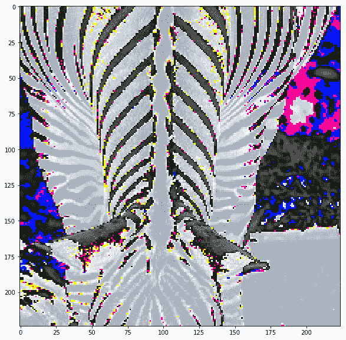
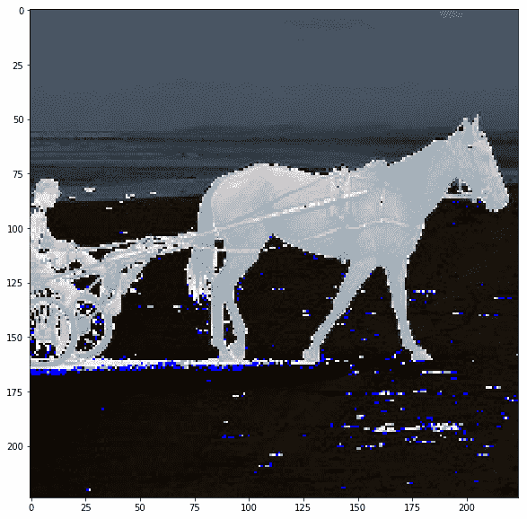
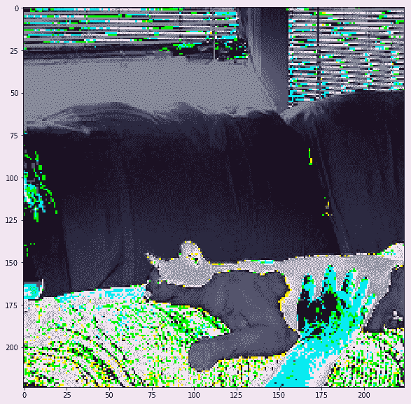
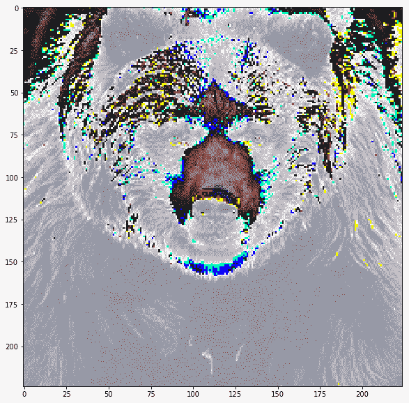
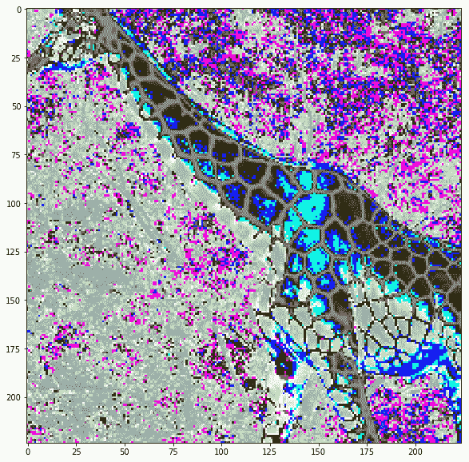
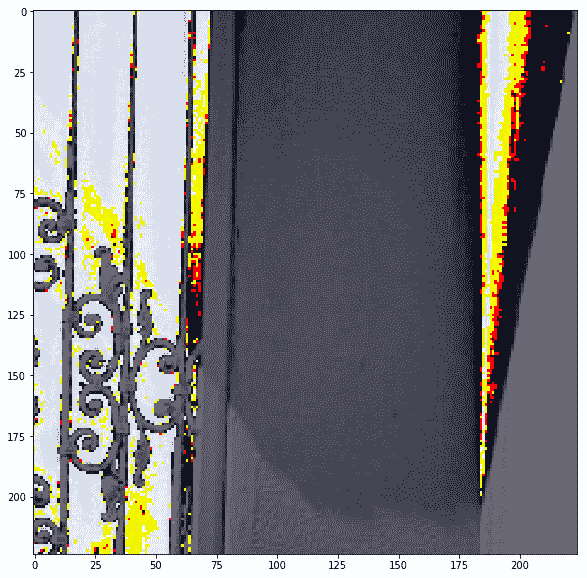
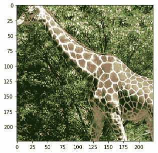
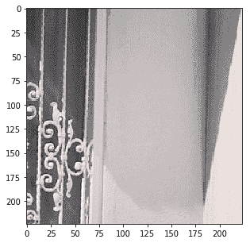

# COCO 动物数据集和预处理图像

对于我们的例子，我们将使用 COCO 动物数据集，[这是 COCO 数据集的一小部分，由斯坦福大学的研究人员提供](http://cs231n.stanford.edu/coco-animals.zip)。 COCO 动物数据集有 800 个训练图像和 200 个动物类别的测试图像：熊，鸟，猫，狗，长颈鹿，马，绵羊和斑马。为 VGG16 和 Inception 模型下载和预处理图像。

对于 VGG 模型，图像大小为 224 x 224，预处理步骤如下：

1.  将图像调整为 224×224，其函数类似于来自 TensorFlow 的  `tf.image.resize_image_with_crop_or_pad` 函数。我们实现了这个函数如下：

```py
def resize_image(self,in_image:PIL.Image, new_width, 
    new_height, crop_or_pad=True):
  img = in_image
    if crop_or_pad:
        half_width = img.size[0] // 2
  half_height = img.size[1] // 2
  half_new_width = new_width // 2
  half_new_height = new_height // 2
  img = img.crop((half_width-half_new_width,
                        half_height-half_new_height,
                        half_width+half_new_width,
                        half_height+half_new_height
                        ))
  img = img.resize(size=(new_width, new_height))

    return img
```

1.  调整大小后，将图像从 PIL.Image 转换为 NumPy 数组并检查图像是否有深度通道，因为数据集中的某些图像仅为灰度。

```py
img = self.pil_to_nparray(img)
if len(img.shape)==2:   
    # greyscale or no channels then add three channels
  h=img.shape[0]
    w=img.shape[1]
    img = np.dstack([img]*3)
```

1.  然后我们从图像中减去 VGG 数据集平均值以使数据居中。我们将新训练图像的数据居中的原因是这些特征具有与用于降雨模型的初始数据类似的范围。通过在相似范围内制作特征，我们确保再训练期间的梯度不会变得太高或太低。同样通过使数据居中，学习过程变得更快，因为对于以零均值为中心的每个通道，梯度变得均匀。

```py
means = np.array([[[123.68, 116.78, 103.94]]]) #shape=[1, 1, 3]
img = img - means
```

完整的预处理函数如下：

```py
def preprocess_for_vgg(self,incoming, height, width):
    if isinstance(incoming, six.string_types):
        img = self.load_image(incoming)
    else:
  img=incoming
    img_size = vgg.vgg_16.default_image_size
    height = img_size
    width = img_size
    img = self.resize_image(img,height,width)
    img = self.pil_to_nparray(img)
    if len(img.shape)==2:   
        # greyscale or no channels then add three channels
  h=img.shape[0]
        w=img.shape[1]
        img = np.dstack([img]*3)

    means = np.array([[[123.68, 116.78, 103.94]]]) #shape=[1, 1, 3]
  try:
        img = img - means
    except Exception as ex:
        print('Error preprocessing ',incoming)
        print(ex)

    return img
```

对于 Inception 模型，图像大小为 299 x 299，预处理步骤如下：

1.  图像大小调整为 299 x 299，其函数类似于来自 TensorFlow 的  `tf.image.resize_image_with_crop_or_pad` 函数。我们实现了之前在 VGG 预处理步骤中定义的此函数。
2.  然后使用以下代码将图像缩放到范围`(-1, +1)`：

```py
img = ((img/255.0) - 0.5) * 2.0
```

完整的预处理函数如下：

```py
def preprocess_for_inception(self,incoming):
    img_size = inception.inception_v3.default_image_size
    height = img_size
    width = img_size
    if isinstance(incoming, six.string_types):
        img = self.load_image(incoming)
    else:
  img=incoming
    img = self.resize_image(img,height,width)
    img = self.pil_to_nparray(img)
    if len(img.shape)==2:   
        # greyscale or no channels then add three channels
  h=img.shape[0]
        w=img.shape[1]
        img = np.dstack([img]*3)
    img = ((img/255.0) - 0.5) * 2.0

  return img
```

让我们加载 COCO 动物数据集：

```py
from datasetslib.coco import coco_animals
coco = coco_animals()
x_train_files, y_train, x_val_files, x_val = coco.load_data()
```

我们从验证集中的每个类中取一个图像，制作列表，  `x_test` 并预处理图像以制作列表  `images_test`：

```py
x_test = [x_val_files[25*x] for x in range(8)]
images_test=np.array([coco.preprocess_for_vgg(x) for x in x_test])
```

我们使用这个辅助函数来显示与图像相关的前五个类的图像和概率：

```py
# helper function
def disp(images,id2label=None,probs=None,n_top=5,scale=False):
    if scale:
        imgs = np.abs(images + np.array([[[[123.68, 
                116.78, 103.94]]]]))/255.0
    else:
        imgs = images    
    ids={}
    for j in range(len(images)):
        if scale:
            plt.figure(figsize=(5,5))
            plt.imshow(imgs[j])
        else:
            plt.imshow(imgs[j].astype(np.uint8) )
        plt.show()
        if probs is not None:
            ids[j] = [i[0] for i in sorted(enumerate(-probs[j]), 
                        key=lambda x:x[1])]
            for k in range(n_top):
                id = ids[j][k]
                print('Probability {0:1.2f}% of[{1:}]'
                    .format(100*probs[j,id],id2label[id]))
```

上述函数中的以下代码恢复为预处理的效果，以便显示原始图像而不是预处理图像：

```py
imgs = np.abs(images + np.array([[[[123.68, 116.78, 103.94]]]]))/255.0
```

在 Inception 模型的情况下，用于反转预处理的代码如下：

```py
imgs = (images / 2.0) + 0.5
```

您可以使用以下代码查看测试图像：

```py
images=np.array([mpimg.imread(x) for x in x_test])
disp(images)
```

按照 Jupyter 笔记本中的代码查看图像。它们看起来都有不同的尺寸，所以让我们打印它们的原始尺寸：

```py
print([x.shape for x in images])
```

尺寸是：

```py
[(640, 425, 3), (373, 500, 3), (367, 640, 3), (427, 640, 3), (428, 640, 3), (426, 640, 3), (480, 640, 3), (612, 612, 3)]
```

让我们预处理测试图像并查看尺寸：

```py
images_test=np.array([coco.preprocess_for_vgg(x) for x in x_test])
print(images_test.shape)
```

维度为：

```py
(8, 224, 224, 3)
```

在 Inception 的情况下，维度是：

```py
(8, 299, 299, 3)
```

Inception 的预处理图像不可见，但让我们打印 VGG 的预处理图像，以了解它们的外观：

```py
disp(images_test)
```
| | |
| --- | --- |
|  |  |
|  |  |
|  |  |
|  |  |

实际上图像被裁剪了，我们可以看到当我们在保持裁剪的同时反转预处理时它们的样子：

| | |
| --- | --- |
|  |  |
|  |  |
|  |  |
|  |  |

现在我们已经有来自 ImageNet 的标签以及来自 COCO 图像数据集的图像和标签，我们试试迁移学习示例。