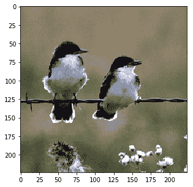
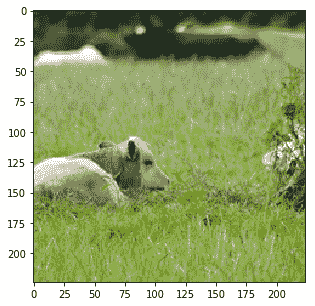

# 使用 TensorFlow 中预训练的 VGG16 进行图像分类

现在让我们首先尝试预测测试图像的类别，而不进行再训练。首先，我们清除默认图并定义图像的占位符：

```py
tf.reset_default_graph()
x_p = tf.placeholder(shape=(None,image_height, image_width,3),
                     dtype=tf.float32,name='x_p')
```

占位符  `x_p` 的形状是  `(?, 224, 224, 3)`。接下来，加载`vgg16`模型：

```py
with slim.arg_scope(vgg.vgg_arg_scope()):
     logits,_ = vgg.vgg_16(x_p,num_classes=inet.n_classes,
                            is_training=False)
```

添加 softmax 层以生成类的概率：

```py
probabilities = tf.nn.softmax(logits)
```

定义初始化函数以恢复变量，例如检查点文件中的权重和偏差。

```py
init = slim.assign_from_checkpoint_fn(
    os.path.join(model_home, '{}.ckpt'.format(model_name)),
    slim.get_variables_to_restore())
```

在 TensorFlow 会话中，初始化变量并运行概率张量以获取每个图像的概率：

```py
with tf.Session() as tfs:
    init(tfs)
    probs = tfs.run([probabilities],feed_dict={x_p:images_test})
    probs=probs[0]
```

让我们看看我们得到的课程：

```py
disp(images_test,id2label=inet.id2label,probs=probs,scale=True)
```


```py
Probability 99.15% of [zebra]
Probability 0.37% of [tiger cat]
Probability 0.33% of [tiger, Panthera tigris]
Probability 0.04% of [goose]
Probability 0.02% of [tabby, tabby cat]
```


---


```py
Probability 99.50% of [horse cart, horse-cart]
Probability 0.37% of [plow, plough]
Probability 0.06% of [Arabian camel, dromedary, Camelus dromedarius]
Probability 0.05% of [sorrel]
Probability 0.01% of [barrel, cask]
```


---


```py
Probability 19.32% of [Cardigan, Cardigan Welsh corgi] Probability 11.78% of [papillon] Probability 9.01% of [Shetland sheepdog, Shetland sheep dog, Shetland] Probability 7.09% of [Siamese cat, Siamese] Probability 6.27% of [Pembroke, Pembroke Welsh corgi]
```


---



```py
Probability 97.09% of [chickadee]
Probability 2.52% of [water ouzel, dipper]
Probability 0.23% of [junco, snowbird]
Probability 0.09% of [hummingbird]
Probability 0.04% of [bulbul]
```


---



```py
Probability 24.98% of [whippet]
Probability 16.48% of [lion, king of beasts, Panthera leo]
Probability 5.54% of [Saluki, gazelle hound]
Probability 4.99% of [brown bear, bruin, Ursus arctos]
Probability 4.11% of [wire-haired fox terrier]
```


---


```py
Probability 98.56% of [brown bear, bruin, Ursus arctos]
Probability 1.40% of [American black bear, black bear, Ursus americanus, Euarctos americanus]
Probability 0.03% of [sloth bear, Melursus ursinus, Ursus ursinus]
Probability 0.00% of [wombat]
Probability 0.00% of [beaver]
```


---


```py
Probability 20.84% of [leopard, Panthera pardus]
Probability 12.81% of [cheetah, chetah, Acinonyx jubatus]
Probability 12.26% of [banded gecko]
Probability 10.28% of [jaguar, panther, Panthera onca, Felis onca]
Probability 5.30% of [gazelle]
```


---


```py
Probability 8.09% of [shower curtain]
Probability 3.59% of [binder, ring-binder]
Probability 3.32% of [accordion, piano accordion, squeeze box]
Probability 3.12% of [radiator]
Probability 1.81% of [abaya]
```


从未见过我们数据集中的图像，并且对数据集中的类没有任何了解的预训练模型已正确识别斑马，马车，鸟和熊。它没能认出长颈鹿，因为它以前从未见过长颈鹿。我们将在我们的数据集上再训练这个模型，只需要更少的工作量和 800 个图像的较小数据集大小。但在我们这样做之前，让我们看看在 TensorFlow 中进行相同的图像预处理。