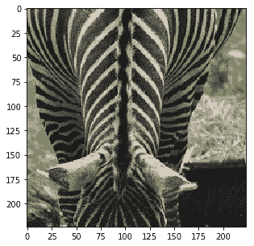
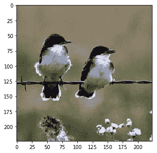

# 使用 Keras 中的再训练 VGG16 进行图像分类

让我们使用 COCO 图像数据集来再训练模型以微调分类任务。我们将删除 Keras 模型中的最后一层，并添加我们自己的完全连接层，其中`softmax`激活 8 个类。我们还将通过将前 15 层的`trainable`属性设置为`False`来演示冻结前几层。

1.  首先导入 VGG16 模型而不使用顶层变量，方法是将`include_top`设置为`False`：

```py
# load the vgg model
from keras.applications import VGG16
base_model=VGG16(weights='imagenet',include_top=False, input_shape=(224,224,3))
```

我们还在上面的代码中指定了`input_shape`，否则 Keras 会在以后抛出异常。

1.  现在我们构建分类器模型以置于导入的 VGG 模型之上：

```py
top_model = Sequential()
top_model.add(Flatten(input_shape=base_model.output_shape[1:]))
top_model.add(Dense(256, activation='relu'))
top_model.add(Dropout(0.5))
top_model.add(Dense(coco.n_classes, activation='softmax'))
```

1.  接下来，在 VGG 基础之上添加模型：

```py
model=Model(inputs=base_model.input, outputs=top_model(base_model.output))
```

1.  冻结前 15 层：

```py
for layer in model.layers[:15]:
    layer.trainable = False
```

1.  我们随机挑选了 15 层冻结，你可能想要玩这个数字。让我们编译模型并打印模型摘要：

```py
model.compile(loss='categorical_crossentropy',
     optimizer=optimizers.SGD(lr=1e-4, momentum=0.9),
     metrics=['accuracy'])
model.summary()
```

```py
_________________________________________________________________
Layer (type)                 Output Shape              Param #   
=================================================================
input_1 (InputLayer)         (None, 224, 224, 3)       0         
_________________________________________________________________
block1_conv1 (Conv2D)        (None, 224, 224, 64)      1792      
_________________________________________________________________
block1_conv2 (Conv2D)        (None, 224, 224, 64)      36928     
_________________________________________________________________
block1_pool (MaxPooling2D)   (None, 112, 112, 64)      0         
_________________________________________________________________
block2_conv1 (Conv2D)        (None, 112, 112, 128)     73856     
_________________________________________________________________
block2_conv2 (Conv2D)        (None, 112, 112, 128)     147584    
_________________________________________________________________
block2_pool (MaxPooling2D)   (None, 56, 56, 128)       0         
_________________________________________________________________
block3_conv1 (Conv2D)        (None, 56, 56, 256)       295168    
_________________________________________________________________
block3_conv2 (Conv2D)        (None, 56, 56, 256)       590080    
_________________________________________________________________
block3_conv3 (Conv2D)        (None, 56, 56, 256)       590080    
_________________________________________________________________
block3_pool (MaxPooling2D)   (None, 28, 28, 256)       0         
_________________________________________________________________
block4_conv1 (Conv2D)        (None, 28, 28, 512)       1180160   
_________________________________________________________________
block4_conv2 (Conv2D)        (None, 28, 28, 512)       2359808   
_________________________________________________________________
block4_conv3 (Conv2D)        (None, 28, 28, 512)       2359808   
_________________________________________________________________
block4_pool (MaxPooling2D)   (None, 14, 14, 512)       0         
_________________________________________________________________
block5_conv1 (Conv2D)        (None, 14, 14, 512)       2359808   
_________________________________________________________________
block5_conv2 (Conv2D)        (None, 14, 14, 512)       2359808   
_________________________________________________________________
block5_conv3 (Conv2D)        (None, 14, 14, 512)       2359808   
_________________________________________________________________
block5_pool (MaxPooling2D)   (None, 7, 7, 512)         0         
_________________________________________________________________
sequential_1 (Sequential)    (None, 8)                 6424840   
=================================================================
Total params: 21,139,528
Trainable params: 13,504,264
Non-trainable params: 7,635,264
```

我们看到近 40%的参数是冻结的和不可训练的。

1.  接下来，训练 Keras 模型 20 个周期，批量大小为 32：

```py
from keras.utils import np_utils

batch_size=32
n_epochs=20

total_images = len(x_train_files)
n_batches = total_images // batch_size
for epoch in range(n_epochs):
 print('Starting epoch ',epoch)
 coco.reset_index_in_epoch()
 for batch in range(n_batches):
 try:
     x_batch, y_batch = coco.next_batch(batch_size=batch_size)
     images=np.array([coco.preprocess_image(x) for x in x_batch])
     y_onehot = np_utils.to_categorical(y_batch,
                    num_classes=coco.n_classes)
     model.fit(x=images,y=y_onehot,verbose=0)
 except Exception as ex:
     print('error in epoch {} batch {}'.format(epoch,batch))
     print(ex)
```

1.  让我们使用新再训练的模型对图像进行分类：

```py
probs = model.predict(images_test)
```

以下是分类结果：



```py
Probability 100.00% of [zebra]
Probability 0.00% of [dog]
Probability 0.00% of [horse]
Probability 0.00% of [giraffe]
Probability 0.00% of [bear]
```


---


```py
Probability 96.11% of [horse]
Probability 1.85% of [cat]
Probability 0.77% of [bird]
Probability 0.43% of [giraffe]
Probability 0.40% of [sheep]
```


---


```py
Probability 99.75% of [dog] Probability 0.22% of [cat] Probability 0.03% of [horse] Probability 0.00% of [bear] Probability 0.00% of [zebra]
```


---



```py
Probability 99.88% of [bird]
Probability 0.11% of [horse]
Probability 0.00% of [giraffe]
Probability 0.00% of [bear]
Probability 0.00% of [cat]
```


---


```py
Probability 65.28% of [bear]
Probability 27.09% of [sheep]
Probability 4.34% of [bird]
Probability 1.71% of [giraffe]
Probability 0.63% of [dog]
```


---


```py
Probability 100.00% of [bear]
Probability 0.00% of [sheep]
Probability 0.00% of [dog]
Probability 0.00% of [cat]
Probability 0.00% of [giraffe]
```


---


```py
Probability 100.00% of [giraffe]
Probability 0.00% of [bird]
Probability 0.00% of [bear]
Probability 0.00% of [sheep]
Probability 0.00% of [zebra]
```


---


```py
Probability 81.05% of [cat] 
Probability 15.68% of [dog] 
Probability 1.64% of [bird] 
Probability 0.90% of [horse] 
Probability 0.43% of [bear]
```


除了最后的嘈杂图像外，所有类别都已正确识别。通过适当的超参数调整，也可以进行改进。

到目前为止，您已经看到了使用预训练模型进行分类并对预训练模型进行微调的示例。接下来，我们将使用 Inception v3 模型显示分类示例。