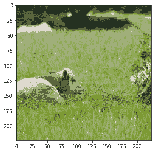
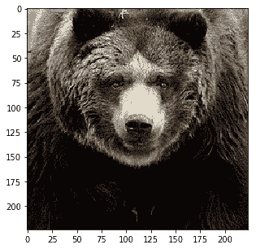

# 使用 TensorFlow 中的 Inception v3 进行图像分类

图像分类与使用 VGG 16 模型的上一节中说明的相同。 Inception v3 模型的完整代码如下：

```py
x_p = tf.placeholder(shape=(None,
                            image_height, 
                            image_width,
                            3
                           ),
                     dtype=tf.float32,
                     name='x_p')
with slim.arg_scope(inception.inception_v3_arg_scope()):
    logits,_ = inception.inception_v3(x_p,
                                      num_classes=inet.n_classes,
                                      is_training=False
                                     )
probabilities = tf.nn.softmax(logits)

init = slim.assign_from_checkpoint_fn(
        os.path.join(model_home, '{}.ckpt'.format(model_name)),
        slim.get_variables_to_restore())

with tf.Session() as tfs:
    init(tfs)
    probs = tfs.run([probabilities],feed_dict={x_p:images_test})
    probs=probs[0]
```

让我们看看我们的模型如何处理测试图像：


```py
Probability 95.15% of [zebra]
Probability 0.07% of [ostrich, Struthio camelus]
Probability 0.07% of [hartebeest]
Probability 0.03% of [sock]
Probability 0.03% of [warthog]
```

---


```py
Probability 93.09% of [horse cart, horse-cart]
Probability 0.47% of [plow, plough]
Probability 0.07% of [oxcart]
Probability 0.07% of [seashore, coast, seacoast, sea-coast]
Probability 0.06% of [military uniform]
```

---


```py
Probability 18.94% of [Cardigan, Cardigan Welsh corgi]
Probability 8.19% of [Pembroke, Pembroke Welsh corgi]
Probability 7.86% of [studio couch, day bed]
Probability 5.36% of [English springer, English springer spaniel]
Probability 4.16% of [Border collie]
```

---


```py
Probability 27.18% of [water ouzel, dipper]
Probability 24.38% of [junco, snowbird]
Probability 6.91% of [chickadee]
Probability 0.99% of [magpie]
Probability 0.73% of [brambling, Fringilla montifringilla]
```

---



```py
Probability 93.00% of [hog, pig, grunter, squealer, Sus scrofa]
Probability 2.23% of [wild boar, boar, Sus scrofa]
Probability 0.65% of [ram, tup]
Probability 0.43% of [ox]
Probability 0.23% of [marmot]
```

---



```py
Probability 84.27% of [brown bear, bruin, Ursus arctos]
Probability 1.57% of [American black bear, black bear, Ursus americanus, Euarctos americanus]
Probability 1.34% of [sloth bear, Melursus ursinus, Ursus ursinus]
Probability 0.13% of [lesser panda, red panda, panda, bear cat, cat bear, Ailurus fulgens]
Probability 0.12% of [ice bear, polar bear, Ursus Maritimus, Thalarctos maritimus]
```

---


```py
Probability 20.20% of [honeycomb]
Probability 6.52% of [gazelle]
Probability 5.14% of [sorrel]
Probability 3.72% of [impala, Aepyceros melampus]
Probability 2.44% of [Saluki, gazelle hound]
```

---


```py
Probability 41.17% of [harp]
Probability 13.64% of [accordion, piano accordion, squeeze box]
Probability 2.97% of [window shade]
Probability 1.59% of [chain]
Probability 1.55% of [pay-phone, pay-station]
```


虽然它在与 VGG 模型几乎相同的地方失败了，但并不算太糟糕。现在让我们用 COCO 动物图像和标签再训练这个模型。