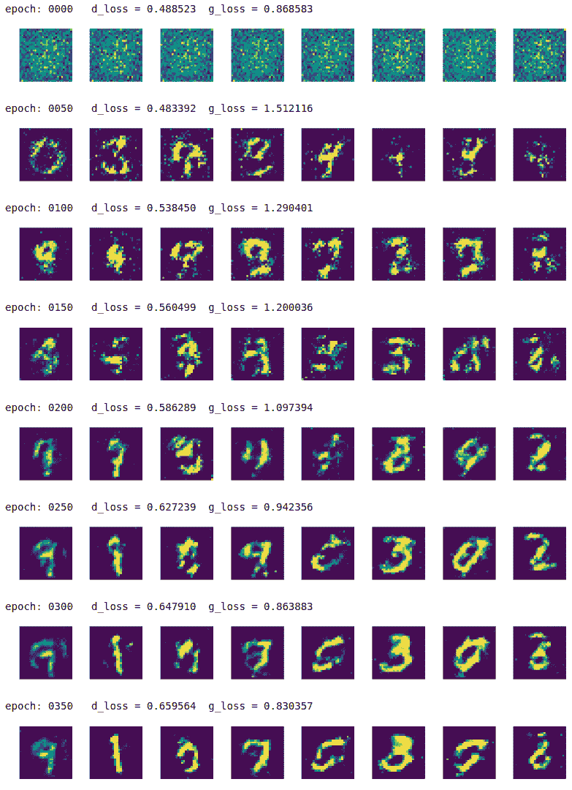

# 使用 Keras 的简单的 GAN

您可以按照 Jupyter 笔记本中的代码`ch-14a_SimpleGAN`。

现在让我们在 Keras 实现相同的模型：

1.  超参数定义与上一节保持一致：

```py
# graph hyperparameters
g_learning_rate = 0.00001
d_learning_rate = 0.01
n_x = 784  # number of pixels in the MNIST image 
# number of hidden layers for generator and discriminator
g_n_layers = 3
d_n_layers = 1
# neurons in each hidden layer
g_n_neurons = [256, 512, 1024]
d_n_neurons = [256]
```

1.  接下来，定义生成器网络：

```py
# define generator

g_model = Sequential()
g_model.add(Dense(units=g_n_neurons[0], 
                  input_shape=(n_z,),
                  name='g_0'))
g_model.add(LeakyReLU())
for i in range(1,g_n_layers):
  g_model.add(Dense(units=g_n_neurons[i],
                      name='g_{}'.format(i)
                     ))
    g_model.add(LeakyReLU())
g_model.add(Dense(units=n_x, activation='tanh',name='g_out'))
print('Generator:')
g_model.summary()
g_model.compile(loss='binary_crossentropy',
              optimizer=keras.optimizers.Adam(lr=g_learning_rate)
             )
```

这就是生成器模型的样子：

```py
Generator:
_________________________________________________________________
Layer (type)                 Output Shape              Param #   
=================================================================
g_0 (Dense)                  (None, 256)               65792     
_________________________________________________________________
leaky_re_lu_1 (LeakyReLU)    (None, 256)               0         
_________________________________________________________________
g_1 (Dense)                  (None, 512)               131584    
_________________________________________________________________
leaky_re_lu_2 (LeakyReLU)    (None, 512)               0         
_________________________________________________________________
g_2 (Dense)                  (None, 1024)              525312    
_________________________________________________________________
leaky_re_lu_3 (LeakyReLU)    (None, 1024)              0         
_________________________________________________________________
g_out (Dense)                (None, 784)               803600    
=================================================================
Total params: 1,526,288
Trainable params: 1,526,288
Non-trainable params: 0
_________________________________________________________________
```

1.  在 Keras 示例中，我们没有定义两个判别器网络，就像我们在 TensorFlow 示例中定义的那样。相反，我们定义一个判别器网络，然后将生成器和判别器网络缝合到 GAN 网络中。然后，GAN 网络仅用于训练生成器参数，判别器网络用于训练判别器参数：

```py
# define discriminator

d_model = Sequential()
d_model.add(Dense(units=d_n_neurons[0],  
                  input_shape=(n_x,),
                  name='d_0'
                 ))
d_model.add(LeakyReLU())
d_model.add(Dropout(0.3))
for i in range(1,d_n_layers):
  d_model.add(Dense(units=d_n_neurons[i], 
                      name='d_{}'.format(i)
                     ))
    d_model.add(LeakyReLU())
    d_model.add(Dropout(0.3))
d_model.add(Dense(units=1, activation='sigmoid',name='d_out'))
print('Discriminator:')
d_model.summary()
d_model.compile(loss='binary_crossentropy',
              optimizer=keras.optimizers.SGD(lr=d_learning_rate)
             )
```

这是判别器模型的外观：

```py
Discriminator:
_________________________________________________________________
Layer (type)                 Output Shape              Param #   
=================================================================
d_0 (Dense)                  (None, 256)               200960    
_________________________________________________________________
leaky_re_lu_4 (LeakyReLU)    (None, 256)               0         
_________________________________________________________________
dropout_1 (Dropout)          (None, 256)               0         
_________________________________________________________________
d_out (Dense)                (None, 1)                 257       
=================================================================
Total params: 201,217
Trainable params: 201,217
Non-trainable params: 0
_________________________________________________________________
```

1.  接下来，定义 GAN 网络，并将判别器模型的可训练属性转换为`false`，因为 GAN 仅用于训练生成器：

```py
# define GAN network
d_model.trainable=False
z_in = Input(shape=(n_z,),name='z_in')
x_in = g_model(z_in)
gan_out = d_model(x_in)

gan_model = Model(inputs=z_in,outputs=gan_out,name='gan')
print('GAN:')
gan_model.summary()
```

```py
gan_model.compile(loss='binary_crossentropy',
              optimizer=keras.optimizers.Adam(lr=g_learning_rate)
             )
```

这就是 GAN 模型的样子：

```py
GAN:
_________________________________________________________________
Layer (type)                 Output Shape              Param #   
=================================================================
z_in (InputLayer)            (None, 256)               0         
_________________________________________________________________
sequential_1 (Sequential)    (None, 784)               1526288   
_________________________________________________________________
sequential_2 (Sequential)    (None, 1)                 201217    
=================================================================
Total params: 1,727,505
Trainable params: 1,526,288
Non-trainable params: 201,217
_________________________________________________________________
```

1.  太好了，现在我们已经定义了三个模型，我们必须训练模型。训练按照以下算法进行：

```py
For each epoch:
 For each batch:  get real images x_batch
    generate noise z_batch
    generate images g_batch using generator model
    combine g_batch and x_batch into x_in and create labels y_out

    set discriminator model as trainable
    train discriminator using x_in and y_out

    generate noise z_batch
    set x_in = z_batch and labels y_out = 1

    set discriminator model as non-trainable
    train gan model using x_in and y_out, 
        (effectively training generator model)
```

为了设置标签，我们分别对真实和假图像应用标签 0.9 和 0.1。通常，建议您使用标签平滑，通过为假数据选择 0.0 到 0.3 的随机值，为实际数据选择 0.8 到 1.0。

以下是笔记本电脑训练的完整代码：

```py
n_epochs = 400
batch_size = 100
n_batches = int(mnist.train.num_examples / batch_size)
n_epochs_print = 50

for epoch in range(n_epochs+1):
  epoch_d_loss = 0.0
    epoch_g_loss = 0.0
    for batch in range(n_batches):
  x_batch, _ = mnist.train.next_batch(batch_size)
        x_batch = norm(x_batch)
        z_batch = np.random.uniform(-1.0,1.0,size=[batch_size,n_z])
        g_batch = g_model.predict(z_batch)

        x_in = np.concatenate([x_batch,g_batch])

        y_out = np.ones(batch_size*2)
        y_out[:batch_size]=0.9
        y_out[batch_size:]=0.1

        d_model.trainable=True
        batch_d_loss = d_model.train_on_batch(x_in,y_out)

        z_batch = np.random.uniform(-1.0,1.0,size=[batch_size,n_z])
        x_in=z_batch

        y_out = np.ones(batch_size)

        d_model.trainable=False
        batch_g_loss = gan_model.train_on_batch(x_in,y_out)

        epoch_d_loss += batch_d_loss 
        epoch_g_loss += batch_g_loss 
    if epoch%n_epochs_print == 0:
  average_d_loss = epoch_d_loss / n_batches
        average_g_loss = epoch_g_loss / n_batches
        print('epoch: {0:04d}   d_loss = {1:0.6f}  g_loss = {2:0.6f}'
              .format(epoch,average_d_loss,average_g_loss))
        # predict images using generator model trained            
 x_pred = g_model.predict(z_test)
        display_images(x_pred.reshape(-1,pixel_size,pixel_size))   
```

我们每 50 个周期印刷结果，最多 350 个周期：



该模型慢慢地学习从随机噪声中生成高质量的手写数字图像。

GAN 有如此多的变化，它将需要另一本书来涵盖所有不同类型的 GAN。但是，实现技术几乎与我们在此处所示的相似。