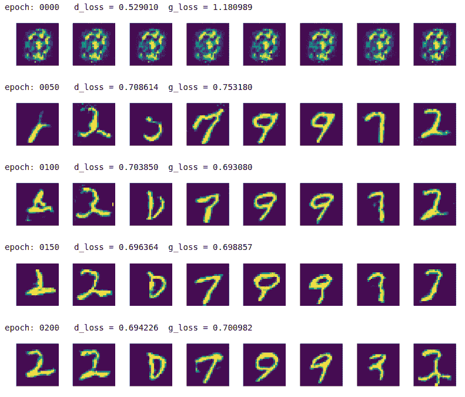

# 使用 TensorFlow 和 Keras 的深度卷积 GAN

您可以按照 Jupyter 笔记本中的代码`ch-14b_DCGAN`。

在 DCGAN 中，判别器和生成器都是使用深度卷积网络实现的：

1.  在此示例中，我们决定将生成器实现为以下网络：

```py
Generator:
_________________________________________________________________
Layer (type)                 Output Shape              Param #   
=================================================================
g_in (Dense)                 (None, 3200)              822400    
_________________________________________________________________
g_in_act (Activation)        (None, 3200)              0         
_________________________________________________________________
g_in_reshape (Reshape)       (None, 5, 5, 128)         0         
_________________________________________________________________
g_0_up2d (UpSampling2D)      (None, 10, 10, 128)       0         
_________________________________________________________________
g_0_conv2d (Conv2D)          (None, 10, 10, 64)        204864    
_________________________________________________________________
g_0_act (Activation)         (None, 10, 10, 64)        0         
_________________________________________________________________
g_1_up2d (UpSampling2D)      (None, 20, 20, 64)        0         
_________________________________________________________________
g_1_conv2d (Conv2D)          (None, 20, 20, 32)        51232     
_________________________________________________________________
g_1_act (Activation)         (None, 20, 20, 32)        0         
_________________________________________________________________
g_2_up2d (UpSampling2D)      (None, 40, 40, 32)        0         
_________________________________________________________________
g_2_conv2d (Conv2D)          (None, 40, 40, 16)        12816     
_________________________________________________________________
g_2_act (Activation)         (None, 40, 40, 16)        0         
_________________________________________________________________
g_out_flatten (Flatten)      (None, 25600)             0         
_________________________________________________________________
g_out (Dense)                (None, 784)               20071184  
=================================================================
Total params: 21,162,496
Trainable params: 21,162,496
Non-trainable params: 0
```

1.  生成器是一个更强大的网络，有三个卷积层，然后是 tanh 激活。我们将判别器网络定义如下：

```py
Discriminator:
_________________________________________________________________
Layer (type)                 Output Shape              Param #   
=================================================================
d_0_reshape (Reshape)        (None, 28, 28, 1)         0         
_________________________________________________________________
d_0_conv2d (Conv2D)          (None, 28, 28, 64)        1664      
_________________________________________________________________
d_0_act (Activation)         (None, 28, 28, 64)        0         
_________________________________________________________________
d_0_maxpool (MaxPooling2D)   (None, 14, 14, 64)        0         
_________________________________________________________________
d_out_flatten (Flatten)      (None, 12544)             0         
_________________________________________________________________
d_out (Dense)                (None, 1)                 12545     
=================================================================
Total params: 14,209
Trainable params: 14,209
Non-trainable params: 0
_________________________________________________________________
```

1.  GAN 网络由判别器和生成器组成，如前所述：

```py
GAN:
_________________________________________________________________
Layer (type)                 Output Shape              Param #   
=================================================================
z_in (InputLayer)            (None, 256)               0         
_________________________________________________________________
g (Sequential)               (None, 784)               21162496  
_________________________________________________________________
d (Sequential)               (None, 1)                 14209     
=================================================================
Total params: 21,176,705
Trainable params: 21,162,496
Non-trainable params: 14,209
_________________________________________________________________
```

当我们运行这个模型 400 个周期时，我们得到以下输出：



如您所见，DCGAN 能够从 epoch 100 本身开始生成高质量的数字。 DGCAN 已被用于样式转移，图像和标题的生成以及图像代数，即拍摄一个图像的一部分并将其添加到另一个图像的部分。 MNIST DCGAN 的完整代码在笔记本`ch-14b_DCGAN` 中提供。