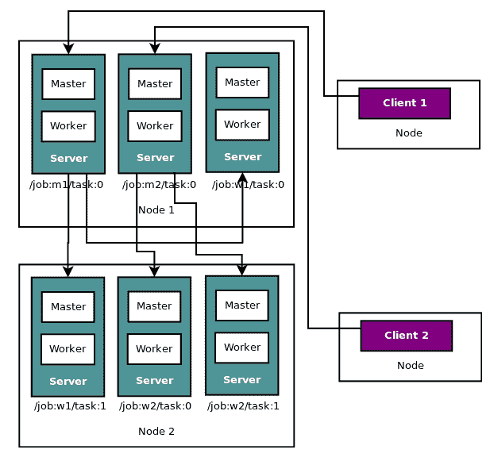

# TensorFlow 集群

TensorFlow（TF）集群是一种实现我们刚刚讨论过的分布式策略的机制。在逻辑层面，TF 集群运行一个或多个作业，并且每个作业由一个或多个任务组成。因此，工作只是任务的逻辑分组。在进程级别，每个任务都作为 TF 服务器运行。在机器级别，每个物理机器或节点可以通过运行多个服务器（每个任务一个服务器）来运行多个任务。客户端在不同的服务器上创建图，并通过调用远程会话在一台服务器上开始执行图。

作为示例，下图描绘了连接到名为`m1`的两个作业的两个客户端：

这两个节点分别运行三个任务，作业`w1`分布在两个节点上，而其他作业包含在节点中。

TF 服务器实现为两个进程：主控制器和工作器。 主控制器与其他任务协调计算，工作器是实际运行计算的工作器。 在更高级别，您不必担心 TF 服务器的内部。 出于我们的解释和示例的目的，我们将仅涉及 TF 任务。

要以数据并行方式创建和训练模型，请使用以下步骤：

1.  定义集群规范
2.  创建服务器以承载任务
3.  定义要分配给参数服务器任务的变量节点
4.  定义要在所有工作任务上复制的操作节点

1.  创建远程会话
2.  在远程会话中训练模型
3.  使用该模型进行预测