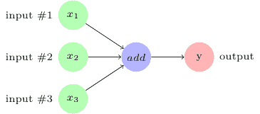

# 数据流图或计算图

**数据流图**或**计算图**是 TensorFlow 中的基本计算单元。从现在开始，我们将它们称为**计算** **图**。计算图由节点和边组成。每个节点代表一个操作（`tf.Operation`），每个边代表一个在节点之间传递的张量（`tf.Tensor`）。

TensorFlow 中的程序基本上是计算图。您可以使用表示变量，常量，占位符和操作的节点创建图，并将其提供给 TensorFlow。 TensorFlow 找到它可以触发或执行的第一个节点。触发这些节点会导致其他节点触发，依此类推。

因此，TensorFlow 程序由计算图上的两种操作组成：

*   构建计算图
*   运行计算图

TensorFlow 附带一个默认图。除非明确指定了另一个图，否则会将新节点隐式添加到默认图中。我们可以使用以下命令显式访问默认图：

```py
graph = tf.get_default_graph()
```

例如，如果我们想要定义三个输入并添加它们以产生输出`y = x1 + x2 + x3`，我们可以使用以下计算图来表示它：



在 TensorFlow 中，前一图像中的添加操作将对应于代码`y = tf.add( x1 + x2 + x3 )`。

在我们创建变量，常量和占位符时，它们会添加到图中。然后我们创建一个会话对象，以执行操作对象，评估张量对象。

让我们构建并执行一个计算图来计算`y = w × x + b`，正如我们在前面的例子中已经看到的那样：

```py
# Assume Linear Model y = w * x + b
# Define model parameters
w = tf.Variable([.3], tf.float32)
b = tf.Variable([-.3], tf.float32)
# Define model input and output
x = tf.placeholder(tf.float32)
y = w * x + b
output = 0

with tf.Session() as tfs:
   # initialize and print the variable y
   tf.global_variables_initializer().run()
   output = tfs.run(y,{x:[1,2,3,4]})
print('output : ',output)
```

在`with`块中创建和使用会话可确保在块完成时会话自动关闭。否则，必须使用`tfs.close()`命令显式关闭会话，其中`tfs`是会话名称。