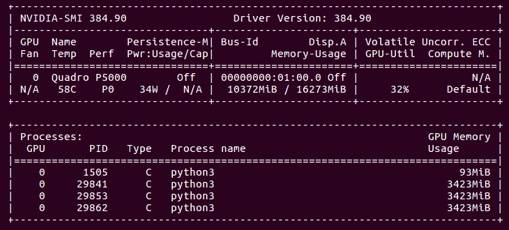

# 创建服务器实例

由于集群每个任务包含一个服务器实例，因此在每个物理节点上，通过向服务器传递集群规范，它们自己的作业名称和任务索引来启动服务器。服务器使用集群规范来确定计算中涉及的其他节点。

```py
server = tf.train.Server(clusterSpec, job_name="ps", task_index=0)
server = tf.train.Server(clusterSpec, job_name="worker", task_index=0)
server = tf.train.Server(clusterSpec, job_name="worker", task_index=1)
server = tf.train.Server(clusterSpec, job_name="worker", task_index=2)
```

在我们的示例代码中，我们有一个 Python 文件可以在所有物理机器上运行，包含以下内容：

```py
server = tf.train.Server(clusterSpec,
                         job_name=FLAGS.job_name,
                         task_index=FLAGS.task_index,
                         config=config
                         )
```

在此代码中，`job_name`和`task_index`取自命令行传递的参数。软件包`tf.flags`是一个花哨的解析器，可以访问命令行参数。 Python 文件在每个物理节点上执行如下（如果您仅使用本地主机，则在同一节点上的单独终端中执行）：

```py
# the model should be run in each physical node 
# using the appropriate arguments
$ python3 model.py --job_name='ps' --task_index=0
$ python3 model.py --job_name='worker' --task_index=0
$ python3 model.py --job_name='worker' --task_index=1
$ python3 model.py --job_name='worker' --task_index=2
```

为了在任何集群上运行代码具有更大的灵活性，您还可以通过命令行传递运行参数服务器和工作程序的计算机列表：`-ps='localhost:9001' --worker='localhost:9002,localhost:9003,``localhost:9004'`。您需要解析它们并在集群规范字典中正确设置它们。

为确保我们的参数服务器仅使用 CPU 而我们的工作器任务使用 GPU，我们使用配置对象：

```py
config = tf.ConfigProto()
config.allow_soft_placement = True

if FLAGS.job_name=='ps':
    #print(config.device_count['GPU'])
  config.device_count['GPU']=0
  server = tf.train.Server(clusterSpec,
                             job_name=FLAGS.job_name,
                             task_index=FLAGS.task_index,
                             config=config
                             )
    server.join()
    sys.exit('0')
elif FLAGS.job_name=='worker':
    config.gpu_options.per_process_gpu_memory_fraction = 0.2
  server = tf.train.Server(clusterSpec,
                             job_name=FLAGS.job_name,
                             task_index=FLAGS.task_index,
                             config=config
```

当工作器执行模型训练并退出时，参数服务器等待`server.join()`。

这就是我们的 GPU 在所有四台服务器运行时的样子：

