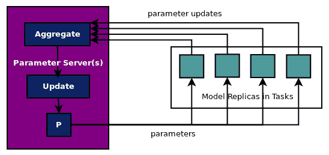

# 定义并训练图以进行同步更新

如前所述，并在此处的图中描述，在同步更新中，任务将其更新发送到参数服务器，ps 任务等待接收所有更新，聚合它们，然后更新参数。工作任务在继续下一次计算参数更新迭代之前等待更新：



此示例的完整代码位于`ch-15_mnist_dist_sync.py`中。建议您使用自己的数据集修改和浏览代码。

对于同步更新，需要对代码进行以下修改：

1.  优化器需要包装在 SyncReplicaOptimizer 中。因此，在定义优化程序后，添加以下代码：

```py
# SYNC: next line added for making it sync update
optimizer = tf.train.SyncReplicasOptimizer(optimizer,
    replicas_to_aggregate=len(workers),
    total_num_replicas=len(workers),
    )
```

1.  之后应该像以前一样添加训练操作：

```py
train_op = optimizer.minimize(loss_op,global_step=global_step)
```

1.  接下来，添加特定于同步更新方法的初始化函数定义：

```py
if is_chief:
    local_init_op = optimizer.chief_init_op()
else:
    local_init_op = optimizer.local_step_init_op()
chief_queue_runner = optimizer.get_chief_queue_runner()
init_token_op = optimizer.get_init_tokens_op()
```

1.  使用两个额外的初始化函数也可以不同地创建 supervisor 对象：

```py
# SYNC: sv is initialized differently for sync update
sv = tf.train.Supervisor(is_chief=is_chief,
 init_op = tf.global_variables_initializer(),
 local_init_op = local_init_op,
 ready_for_local_init_op = optimizer.ready_for_local_init_op,
 global_step=global_step)
```

1.  最后，在训练的会话块中，我们初始化同步变量并启动队列运行器（如果它是主要的工作者任务）：

```py
# SYNC: if block added to make it sync update
if is_chief:
    mts.run(init_token_op)
    sv.start_queue_runners(mts, [chief_queue_runner])
```

其余代码与异步更新保持一致。

用于支持分布式训练的 TensorFlow 库和函数正在不断发展。 因此，请注意添加的新函数或函数签名的更改。 在撰写本书的时候，我们使用了 TensorFlow 1.4。