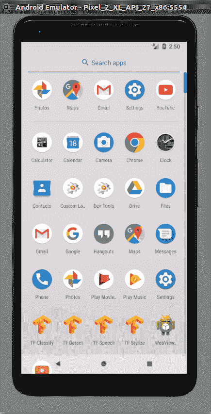

# Android 上的 TF Mobile 演示

在本节中，我们将学习如何重新创建 TensorFlow 团队在其官方仓库中提供的 Android 演示应用。 Android 演示将在您的 Android 设备上安装以下四个应用：

*   `TF Classify`：这是一个对象识别应用，用于识别设备摄像头输入中的图像，并在其中一个预定义的类中对其进行分类。它不会学习新类型的图片，但会尝试将它们分类为已经学过的类别之一。该应用使用 Google 预训练的初始模型构建。
*   `TF Detect`：这是一个物体检测应用，可检测设备相机输入中的多个物体。在连续图像进纸模式下移动相机时，它会继续识别对象。
*   `TF Stylize`：这是一个样式转移应用，可将选定的预定义样式之一传输到设备相机的输入。
*   `TF Speech`：这是一个语音识别应用，用于识别您的语音，如果它与应用中的某个预定义命令匹配，则它会在设备屏幕上突出显示该特定命令。

示例演示仅适用于 API 级别大于 21 的 Android 设备，并且该设备必须具有支持`FOCUS_MODE_CONTINUOUS_PICTURE`的现代相机。如果您的设备相机不支持此功能，[则必须添加作者提交给 TensorFlow 的路径](https://github.com/tensorflow/tensorflow/pull/15489/files)。。

在您的设备上构建和部署演示应用的最简单方法是使用 Android Studio。要以这种方式构建它，请按照下列步骤操作：

1.  安装 Android Studio。[我们通过此链接的说明在 Ubuntu 16.04 上安装了 Android Studio](https://developer.android.com/studio/install.html)。
2.  查看 TensorFlow 仓库，并应用上一篇技巧中提到的补丁。我们假设您检查了主目录中`tensorflow`文件夹中的代码。

1.  使用 Android Studio，在路径`~/tensorflow/tensorflow/examples/Android`中打开 Android 项目。您的屏幕看起来与此类似：


1.  从左侧栏中展开 Gradle Scripts 选项，然后打开`build.gradle`文件。
2.  在`build.gradle`文件中，找到`def nativeBuildSystem`定义并将其设置为`'none'`。在我们检出的代码版本中，此定义位于第 43 行：

```py
def nativeBuildSystem = 'none'
```

1.  构建演示并在真实或模拟设备上运行它。我们在这些设备上测试了应用：


1.  您还可以构建 apk 并在虚拟或实际连接的设备上安装 apk 文件。一旦应用安装在设备上，您将看到我们之前讨论的四个应用：



Android 模拟器中的 TF 示例应用程序

[您还可以按照此链接中的说明使用 Bazel或 Cmake 从源构建整个演示应用程序](https://github.com/tensorflow/tensorflow/tree/master/tensorflow/examples/android)。