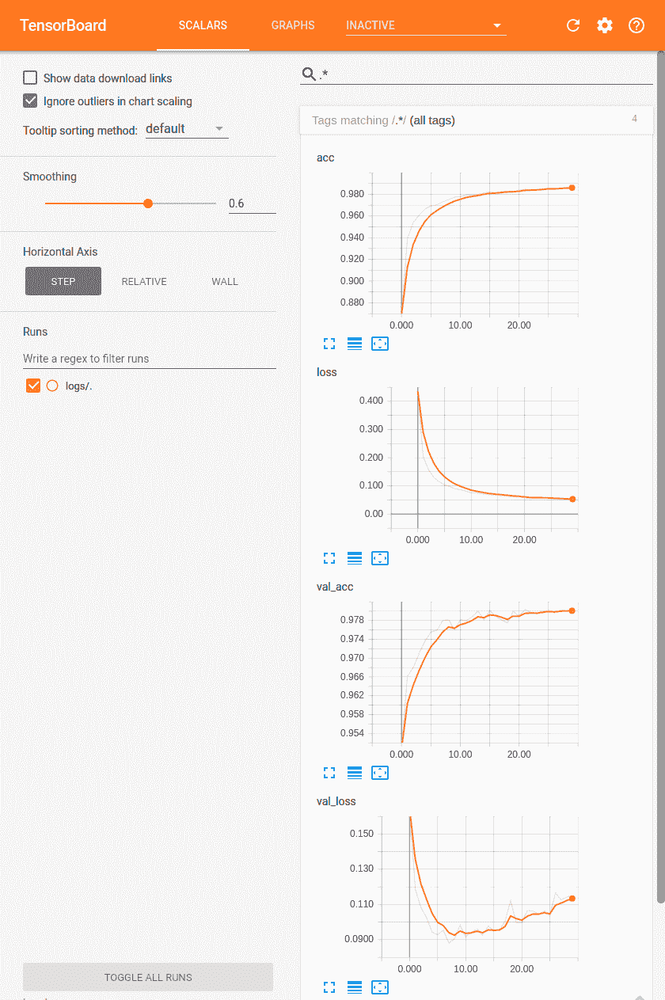
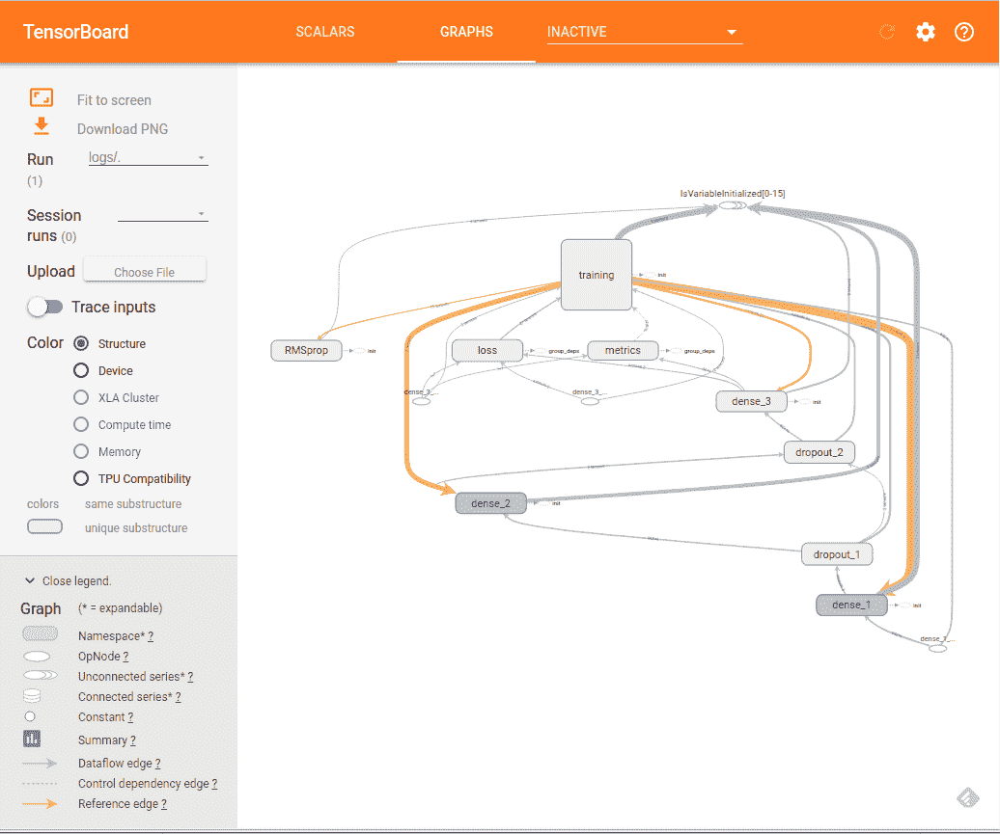

# R 中的 TensorBoard

您可以按照 Jupyter R 笔记本中的代码`ch-17d_TensorBoard_in_R`。

您可以使用  `tensorboard()` 函数查看 TensorBoard，如下所示：

```r
tensorboard('logs')
```

这里，`'logs'`是应该创建 TensorBoard 日志的文件夹。

数据将显示为执行周期并记录数据。在 R 中，收集 TensorBoard 的数据取决于所使用的包：

*   如果您使用的是`tensorflow`软件包，请将`tf$summary$scalar`操作附加到图中
*   如果您使用的是`tfestimators`软件包，则 TensorBoard 数据会自动写入创建估计器时指定的`model_dir`参数
*   如果您正在使用`keras`软件包，则必须在使用`fit()`函数训练模型时包含`callback_tensorboard()`函数

我们修改了之前提供的 Keras 示例中的训练，如下所示：

```r
# Training the model --------
tensorboard("logs")

history <- model %>% fit(
    x_train, y_train,
    batch_size = batch_size,
    epochs = epochs,
    verbose = 1,
    validation_split = 0.2,
    callbacks = callback_tensorboard("logs")
)
```

当我们执行笔记本时，我们获得了训练单元的以下输出：

```r
Started TensorBoard at http://127.0.0.1:4233 
```

当我们点击链接时，我们会看到在 TensorBoard 中绘制的标量：

TensorBoad Visualization of Plots

单击 Graphs 选项卡，我们在 TensorBoard 中看到计算图：



TensorBoard 计算图的可视化有关 R 中 TensorBoard 的更多文档，[请访问此链接](https://tensorflow.rstudio.com/tools/tensorboard.html)。