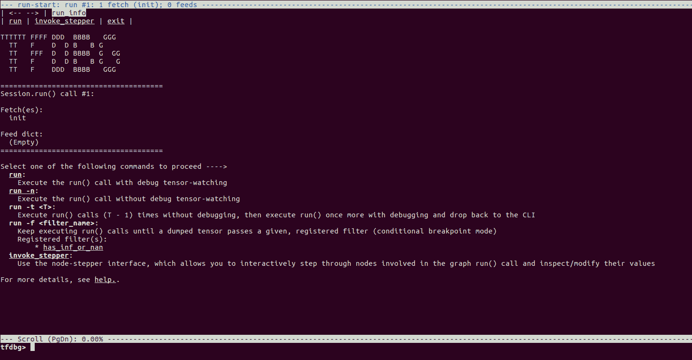
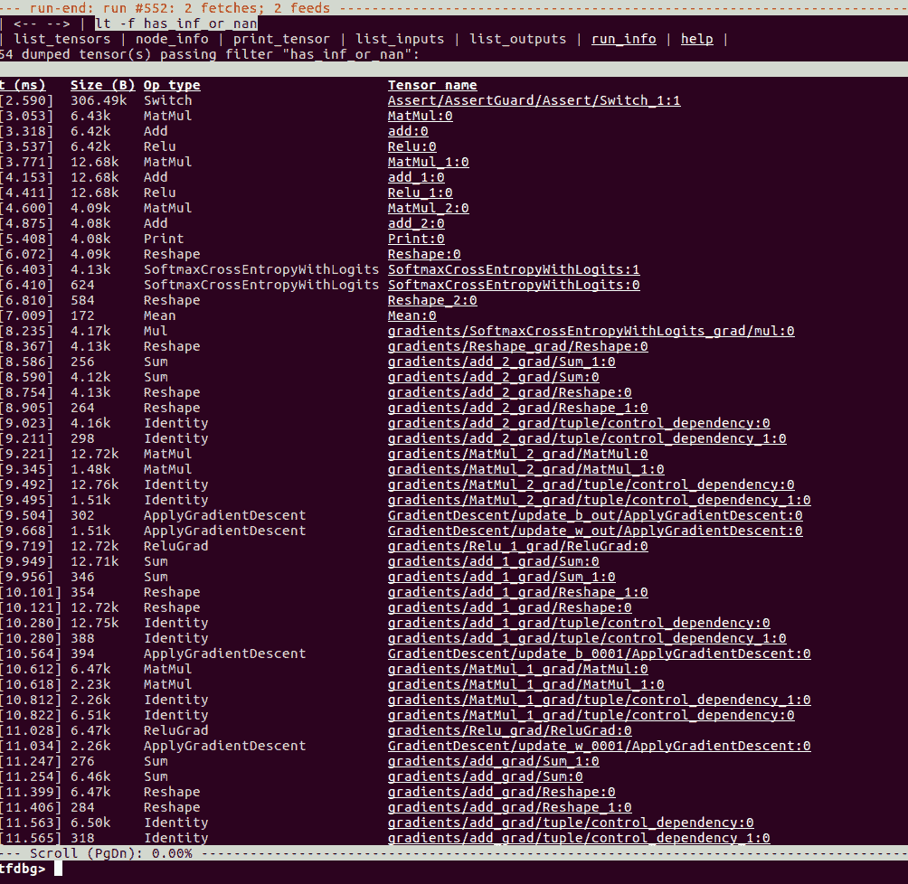
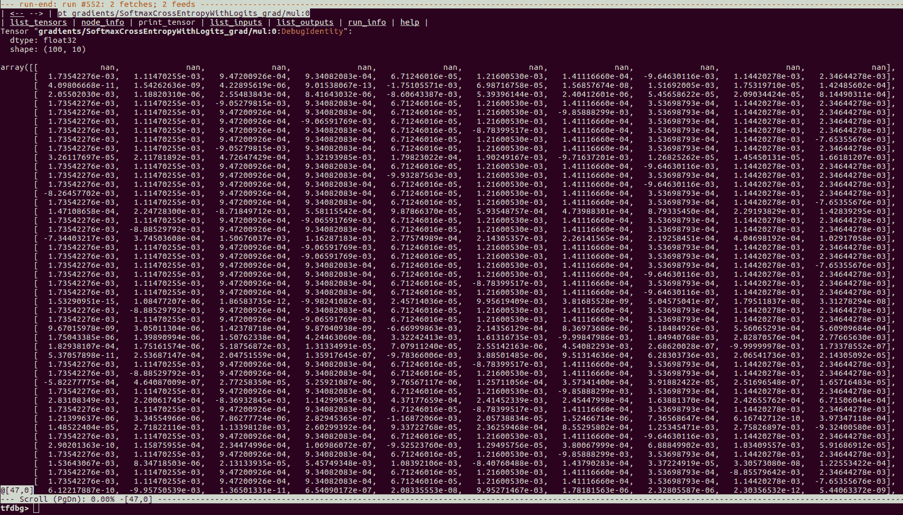

# 使用 TensorFlow 调试器（tfdbg）进行调试

TensorFlow 调试器（`tfdbg`）与其他常用调试器（如`pdb`和`gdb`）的工作方式相同。要使用调试器，该过程通常如下：

1.  在代码中的断点处设置要中断的位置并检查变量
2.  在调试模式下运行代码
3.  当代码在断点处中断时，检查它然后继续下一步

一些调试器还允许您在代码执行时以交互方式观察变量，而不仅仅是在断点处：

1.  为了使用`tfdbg`，首先导入所需的模块并将会话包装在调试器包装器中：

```py
from tensorflow.python import debug as tfd

with tfd.LocalCLIDebugWrapperSession(tf.Session()) as tfs:
```

1.  接下来，将过滤器附加到会话对象。附加过滤器与在其他调试器中设置断点相同。例如，以下代码附加`tfdbg.has_inf_or_nan`过滤器，如果任何中间张量具有`nan`或`inf`值，则会中断：

```py
tfs.add_tensor_filter('has_inf_or_nan_filter', tfd.has_inf_or_nan)
```

1.  现在，当代码执行`tfs.run()`时，调试器将在控制台中启动调试器接口，您可以在其中运行各种调试器命令来监视张量值。
2.  我们提供了在`ch-18_mnist_tfdbg.py` 文件中试用`tfdbg`的代码。当我们用`python3`执行代码文件时，我们看到`tfdbg`控制台：&lt; / li &gt;

```py
python3 ch-18_mnist_tfdbg.py
```



1.  在 `tfdbg&gt;` 提示符下输入命令`run -f has_inf_or_nan` 。代码在第一个周期后中断，因为我们使用`np.inf`值填充数据：



1.  现在您可以使用`tfdbg`控制台或可点击界面来检查各种张量的值。例如，我们查看其中一个梯度的值：



[您可以在此链接中找到有关使用`tfdbg`控制台和检查变量的更多信息](https://www.tensorflow.org/programmers_guide/debugger)。