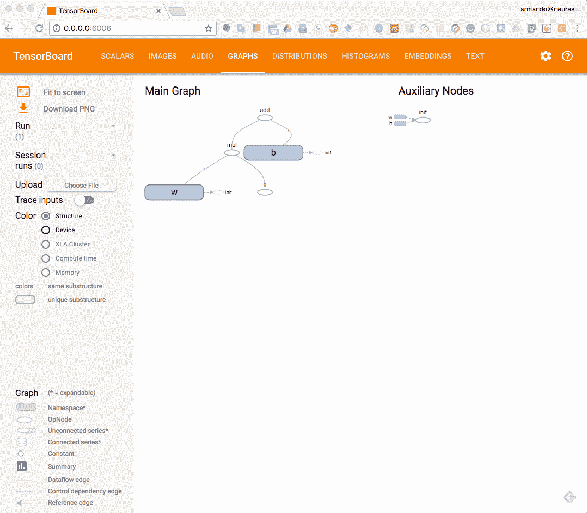

# TensorBoard 最小的例子

1.  S 通过定义线性模型的变量和占位符来实现：

```py
# Assume Linear Model y = w * x + b
# Define model parameters
w = tf.Variable([.3], name='w',dtype=tf.float32)
b = tf.Variable([-.3], name='b', dtype=tf.float32)
# Define model input and output
x = tf.placeholder(name='x',dtype=tf.float32)
y = w * x + b
```

1.  初始化会话，并在此会话的上下文中，执行以下步骤：
    *   初始化全局变量
    *   创建`tf.summary.FileWriter`将使用默认图中的事件在`tflogs`文件夹中创建输出
    *   获取节点`y`的值，有效地执行我们的线性模型

```py
with tf.Session() as tfs:
    tfs.run(tf.global_variables_initializer())
    writer=tf.summary.FileWriter('tflogs',tfs.graph)
    print('run(y,{x:3}) : ', tfs.run(y,feed_dict={x:3}))
```

1.  我们看到以下输出：

```py
run(y,{x:3}) :  [ 0.60000002]
```

当程序执行时，日志将收集在`tflogs`文件夹中，TensorBoard 将使用该文件夹进行可视化。打开命令行界面，导航到运行`ch-01_TensorFlow_101`笔记本的文件夹，然后执行以下命令：

```py
tensorboard --logdir='tflogs'
```

您会看到类似于此的输出：

```py
Starting TensorBoard b'47' at http://0.0.0.0:6006
```

打开浏览器并导航到`http://0.0.0.0:6006`。看到 TensorBoard 仪表板后，不要担心显示任何错误或警告，只需单击顶部的 GRAPHS 选项卡即可。您将看到以下屏幕：

TensorBoard console

您可以看到 TensorBoard 将我们的第一个简单模型可视化为计算图：

Computation graph in TensorBoard

现在让我们试着了解 TensorBoard 的详细工作原理。