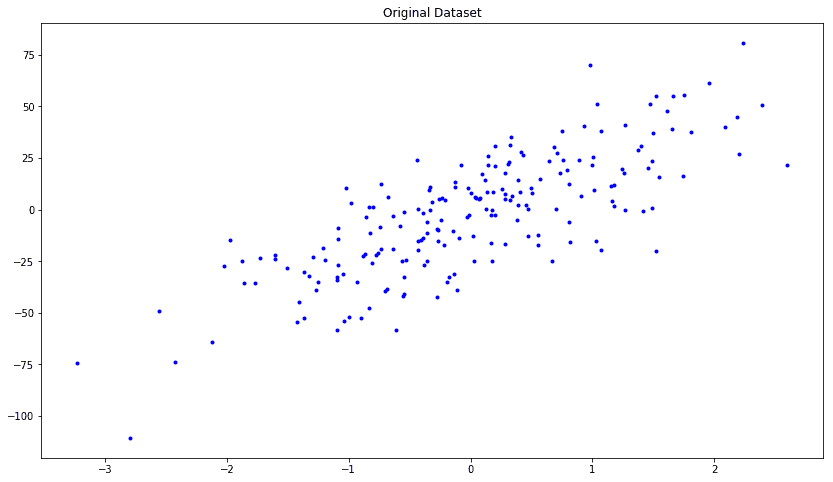

# 数据准备

要生成数据集，我们使用`sklearn`库的`datasets`模块中的`make_regression`函数：

```py
from sklearn import datasets as skds
X, y = skds.make_regression(n_samples=200,
                            n_features=1,
                            n_informative=1,
                            n_targets=1,
                            noise = 20.0)
```

这将生成一个回归数据集，其中包含一个特征的 200 个样本值和每个特征的一个目标，并添加了一些噪声。因为我们只生成一个目标，所以该函数使用一维 NumPy 数组生成`y`;因此，我们重塑`y`有两个维度：

```py
if (y.ndim == 1):
    y = y.reshape(len(y),1)
```

我们使用以下代码绘制生成的数据集以查看数据：

```py
import matplotlib.pyplot as plt
plt.figure(figsize=(14,8))
plt.plot(X,y,'b.')
plt.title('Original Dataset')
plt.show()
```

我们得到以下绘图。由于生成的数据是随机的，您可能会得到不同的绘图：



现在让我们将数据分为训练集和测试集：

```py
X_train, X_test, y_train, y_test = skms.train_test_split(X, y, 
                                                 test_size=.4, 
                                                 random_state=123)
```