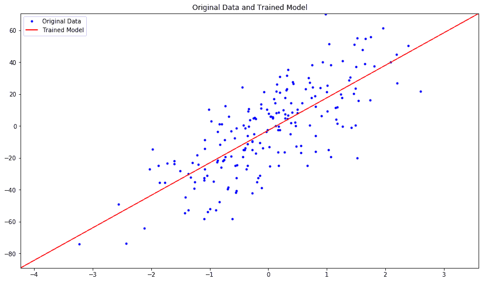
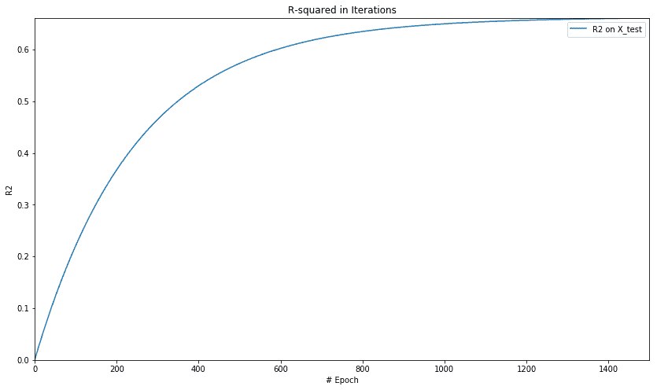

# 训练模型

现在我们已经定义了模型，损失函数和优化函数，训练模型来学习参数`w`和`b`。要训​​练模型，请定义以下全局变量：

*   `num_epochs`：运行训练的迭代次数。每次迭代，模型都会学习更好的参数，我们将在后面的图中看到。
*   `w_hat`和`b_hat`：收集估计的`w`和`b`参数。
*   `loss_epochs`，`mse_epochs`，`rs_epochs`：收集训练数据集中的总误差值，以及每次迭代中测试数据集上模型的 mse 和 r 平方值。
*   `mse_score`和`rs_score`：收集最终训练模型的 mse 和 r 平方值。

```py
num_epochs = 1500
w_hat = 0
b_hat = 0
loss_epochs = np.empty(shape=[num_epochs],dtype=float)
mse_epochs = np.empty(shape=[num_epochs],dtype=float)
rs_epochs = np.empty(shape=[num_epochs],dtype=float)

mse_score = 0
rs_score = 0
```

初始化会话和全局变量后，运行`num_epoch`次的训练循环：

```py
with tf.Session() as tfs:
   tf.global_variables_initializer().run()
   for epoch in range(num_epochs):
```

在循环的每次迭代中，在训练数据上运行优化器：

```py
tfs.run(optimizer, feed_dict={x_tensor: X_train, y_tensor: y_train})
```

使用学习的`w`和`b`值，计算误差并将其保存在`loss_val`中以便稍后绘制：

```py
loss_val = tfs.run(loss,feed_dict={x_tensor: X_train, y_tensor: y_train})
loss_epochs[epoch] = loss_val
```

计算测试数据预测值的均方误差和 r 平方值：

```py
mse_score = tfs.run(mse,feed_dict={x_tensor: X_test, y_tensor: y_test})
mse_epochs[epoch] = mse_score

rs_score = tfs.run(rs,feed_dict={x_tensor: X_test, y_tensor: y_test})
rs_epochs[epoch] = rs_score
```

最后，一旦完成循环，保存`w`和`b`的值以便稍后绘制它们：

```py
w_hat,b_hat = tfs.run([w,b])
w_hat = w_hat.reshape(1)
```

让我们在 2,000 次迭代后打印模型和测试数据的最终均方误差：

```py
print('model : Y = {0:.8f} X + {1:.8f}'.format(w_hat[0],b_hat[0]))
print('For test data : MSE = {0:.8f}, R2 = {1:.8f} '.format(
    mse_score,rs_score))
```

This gives us the following output:

```py
model : Y = 20.37448120 X + -2.75295663
For test data : MSE = 297.57995605, R2 = 0.66098368 
```

因此，我们训练的模型不是一个非常好的模型，但我们将在后面的章节中看到如何使用神经网络来改进它。

本章的目标是介绍如何使用 TensorFlow 构建和训练回归模型，而无需使用神经网络。

让我们绘制估计模型和原始数据：

```py
plt.figure(figsize=(14,8))
plt.title('Original Data and Trained Model')
x_plot = [np.min(X)-1,np.max(X)+1]
y_plot = w_hat*x_plot+b_hat
plt.axis([x_plot[0],x_plot[1],y_plot[0],y_plot[1]])
plt.plot(X,y,'b.',label='Original Data')
plt.plot(x_plot,y_plot,'r-',label='Trained Model')
plt.legend()
plt.show()
```

我们得到以下原始数据与受训模型数据的关系图：



让我们绘制每次迭代中训练和测试数据的均方误差：

```py
plt.figure(figsize=(14,8))

plt.axis([0,num_epochs,0,np.max(loss_epochs)])
plt.plot(loss_epochs, label='Loss on X_train')
plt.title('Loss in Iterations')
plt.xlabel('# Epoch')
plt.ylabel('MSE')

plt.axis([0,num_epochs,0,np.max(mse_epochs)])
plt.plot(mse_epochs, label='MSE on X_test')
plt.xlabel('# Epoch')
plt.ylabel('MSE')
plt.legend()

plt.show()
```

我们得到以下图，显示每次迭代时，均方误差减小，然后保持在 500 附近的相同水平：


让我们绘制 r 平方的值：

```py
plt.figure(figsize=(14,8))
plt.axis([0,num_epochs,0,np.max(rs_epochs)])
plt.plot(rs_epochs, label='R2 on X_test')
plt.xlabel('# Epoch')
plt.ylabel('R2')
plt.legend()
plt.show()
```

当我们绘制 r 平方超过周期的值时，我们得到以下图：



这基本上表明该模型以 r 的平均值开始，但随着模型的训练并减少误差，r 平方的值开始变高，最终在某一点变得稳定略高于 0.6。

绘制 MSE 和 r-squared 可以让我们看到我们的模型得到多快的训练以及它开始变得稳定的地方，以便进一步的训练在减少错误方面产生微不足道的好处或几乎没有好处。