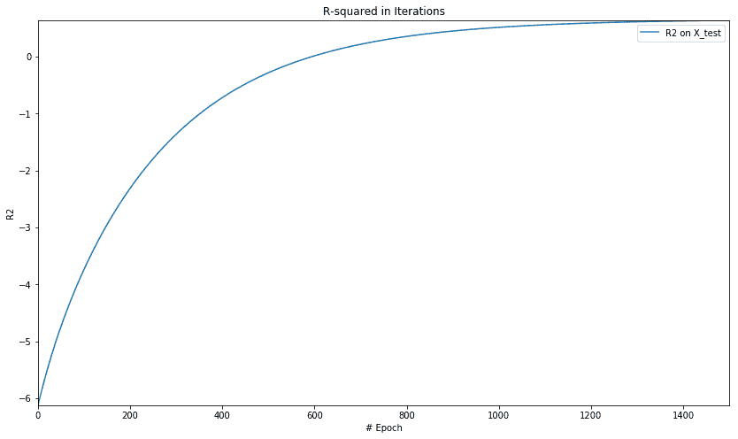

# 多元回归

现在您已经学习了如何使用 TensorFlow 创建基本回归模型，让我们尝试在不同域的示例数据集上运行它。我们作为示例数据集生成的数据集是单变量的，即目标仅依赖于一个特征。

实际上，大多数数据集都是多变量的。为了强调一点，目标取决于多个变量或特征，因此回归模型称为**多元回归**或**多维回归**。

我们首先从最受欢迎的波士顿数据集开始。该数据集包含波士顿 506 所房屋的 13 个属性，例如每个住所的平均房间数，一氧化氮浓度，到波士顿五个就业中心的加权距离等等。目标是自住房屋的中位数值。让我们深入探索这个数据集的回归模型。

从`sklearn`库加载数据集并查看其描述：

```py
boston=skds.load_boston()
print(boston.DESCR)
X=boston.data.astype(np.float32)
y=boston.target.astype(np.float32)
if (y.ndim == 1):
    y = y.reshape(len(y),1)
X = skpp.StandardScaler().fit_transform(X)
```

我们还提取`X`，一个特征矩阵，和`y`，一个前面代码中的目标向量。我们重塑`y`使其成为二维的，并将`x`中的特征缩放为平均值为零，标准差为 1。现在让我们使用这个`X`和`y`来训练回归模型，就像我们在前面的例子中所做的那样：

You may observe that the code for this example is similar to the code in the previous section on simple regression; however, we are using multiple features to train the model so it is called multi-regression.

```py
X_train, X_test, y_train, y_test = skms.train_test_split(X, y, 
    test_size=.4, random_state=123)
num_outputs = y_train.shape[1] 
num_inputs = X_train.shape[1]

x_tensor = tf.placeholder(dtype=tf.float32, 
    shape=[None, num_inputs], name="x") 
y_tensor = tf.placeholder(dtype=tf.float32, 
    shape=[None, num_outputs], name="y") 

w = tf.Variable(tf.zeros([num_inputs,num_outputs]), 
    dtype=tf.float32, name="w") 
b = tf.Variable(tf.zeros([num_outputs]), 
    dtype=tf.float32, name="b") 

model = tf.matmul(x_tensor, w) + b
loss = tf.reduce_mean(tf.square(model - y_tensor))
# mse and R2 functions
mse = tf.reduce_mean(tf.square(model - y_tensor))
y_mean = tf.reduce_mean(y_tensor)
total_error = tf.reduce_sum(tf.square(y_tensor - y_mean))
unexplained_error = tf.reduce_sum(tf.square(y_tensor - model))
rs = 1 - tf.div(unexplained_error, total_error)

learning_rate = 0.001
optimizer = tf.train.GradientDescentOptimizer(learning_rate).minimize(loss)

num_epochs = 1500
loss_epochs = np.empty(shape=[num_epochs],dtype=np.float32)
mse_epochs = np.empty(shape=[num_epochs],dtype=np.float32)
rs_epochs = np.empty(shape=[num_epochs],dtype=np.float32)

mse_score = 0
rs_score = 0

with tf.Session() as tfs:
    tfs.run(tf.global_variables_initializer())
    for epoch in range(num_epochs):
        feed_dict = {x_tensor: X_train, y_tensor: y_train}
        loss_val, _ = tfs.run([loss, optimizer], feed_dict)
        loss_epochs[epoch] = loss_val

        feed_dict = {x_tensor: X_test, y_tensor: y_test}
        mse_score, rs_score = tfs.run([mse, rs], feed_dict)
        mse_epochs[epoch] = mse_score
        rs_epochs[epoch] = rs_score

print('For test data : MSE = {0:.8f}, R2 = {1:.8f} '.format(
    mse_score, rs_score))
```

我们从模型中获得以下输出：

```py
For test data : MSE = 30.48501778, R2 = 0.64172244 
```

让我们绘制 MSE 和 R 平方值。

下图显示了 MSE 的绘图：


下图显示了 R 平方值的绘图：



正如我们在单变量数据集中看到的那样，我们看到了 MSE 和 r 平方的类似模式。