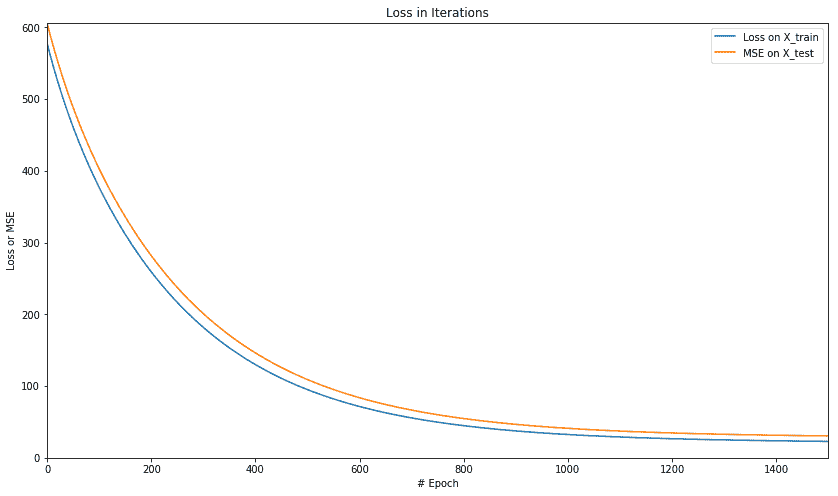
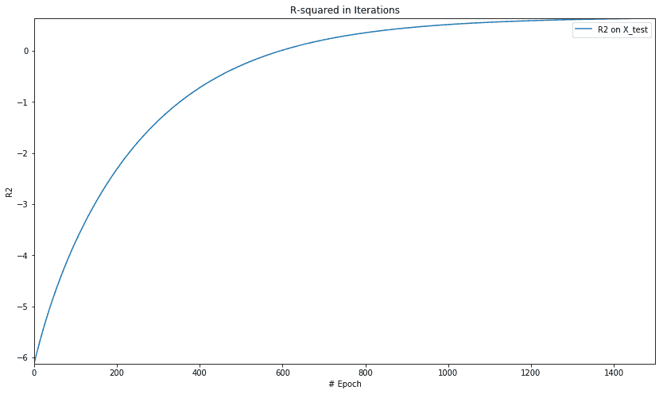

# 套索正则化

我们将 lasso 参数定义为值 0.8：

```py
lasso_param = tf.Variable(0.8, dtype=tf.float32)
lasso_loss = tf.reduce_mean(tf.abs(w)) * lasso_param
```

将套索参数设置为零意味着没有正则化，因为该项变为零。正则化项的值越高，惩罚越高。以下是套索正则化回归的完整代码，用于训练模型以预测波士顿房屋定价：

下面的代码假定训练和测试数据集已按照前面的示例进行拆分。

```py
num_outputs = y_train.shape[1]
num_inputs = X_train.shape[1]

x_tensor = tf.placeholder(dtype=tf.float32,
                          shape=[None, num_inputs], name='x')
y_tensor = tf.placeholder(dtype=tf.float32,
                          shape=[None, num_outputs], name='y')

w = tf.Variable(tf.zeros([num_inputs, num_outputs]),
                dtype=tf.float32, name='w')
b = tf.Variable(tf.zeros([num_outputs]),
                dtype=tf.float32, name='b')

model = tf.matmul(x_tensor, w) + b

lasso_param = tf.Variable(0.8, dtype=tf.float32)
lasso_loss = tf.reduce_mean(tf.abs(w)) * lasso_param

loss = tf.reduce_mean(tf.square(model - y_tensor)) + lasso_loss

learning_rate = 0.001
optimizer = tf.train.GradientDescentOptimizer(learning_rate).minimize(loss)

mse = tf.reduce_mean(tf.square(model - y_tensor))
y_mean = tf.reduce_mean(y_tensor)
total_error = tf.reduce_sum(tf.square(y_tensor - y_mean))
unexplained_error = tf.reduce_sum(tf.square(y_tensor - model))
rs = 1 - tf.div(unexplained_error, total_error)

num_epochs = 1500
loss_epochs = np.empty(shape=[num_epochs],dtype=np.float32)
mse_epochs = np.empty(shape=[num_epochs],dtype=np.float32)
rs_epochs = np.empty(shape=[num_epochs],dtype=np.float32)

mse_score = 0.0
rs_score = 0.0

num_epochs = 1500
loss_epochs = np.empty(shape=[num_epochs], dtype=np.float32)
mse_epochs = np.empty(shape=[num_epochs], dtype=np.float32)
rs_epochs = np.empty(shape=[num_epochs], dtype=np.float32)

mse_score = 0.0
rs_score = 0.0

with tf.Session() as tfs:
    tfs.run(tf.global_variables_initializer())
    for epoch in range(num_epochs):
        feed_dict = {x_tensor: X_train, y_tensor: y_train}
        loss_val,_ = tfs.run([loss,optimizer], feed_dict)
        loss_epochs[epoch] = loss_val

        feed_dict = {x_tensor: X_test, y_tensor: y_test}
        mse_score,rs_score = tfs.run([mse,rs], feed_dict)
        mse_epochs[epoch] = mse_score
        rs_epochs[epoch] = rs_score

print('For test data : MSE = {0:.8f}, R2 = {1:.8f} '.format(
    mse_score, rs_score))
```

我们得到以下输出：

```py
For test data : MSE = 30.48978233, R2 = 0.64166653
```

让我们使用以下代码绘制 MSE 和 r 平方的值：

```py
plt.figure(figsize=(14,8))

plt.axis([0,num_epochs,0,np.max([loss_epochs,mse_epochs])])
plt.plot(loss_epochs, label='Loss on X_train')
plt.plot(mse_epochs, label='MSE on X_test')
plt.title('Loss in Iterations')
plt.xlabel('# Epoch')
plt.ylabel('Loss or MSE')
plt.legend()

plt.show()

plt.figure(figsize=(14,8))

plt.axis([0,num_epochs,np.min(rs_epochs),np.max(rs_epochs)])
plt.title('R-squared in Iterations')
plt.plot(rs_epochs, label='R2 on X_test')
plt.xlabel('# Epoch')
plt.ylabel('R2')
plt.legend()

plt.show()
```

我们得到以下损失绘图：



迭代中 R 平方的图如下：



让我们用岭回归重复相同的例子。