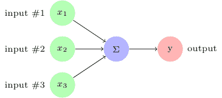
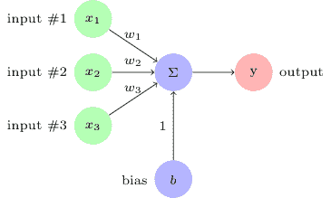
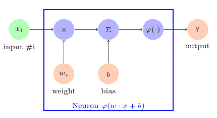

# 五、TensorFlow 和 Keras 中的神经网络和 MLP

神经网络是一种受大脑结构和功能启发的建模技术。正如大脑包含数百万个被称为神经元的微小互连单元一样，今天的神经网络由数百万个分层排列的微小互连计算单元组成。由于神经网络的计算单元仅存在于数字世界中，与大脑的物理神经元相反，它们也被称为人工神经元。类似地，神经网络（NN）也称为人工神经网络（ANN）。

在本章中，我们将进一步扩展以下主题：

*   感知机（人工神经元）
*   前馈神经网络
*   用于图像分类的**多层感知机**（**MLP**）
    *   基于 TensorFlow 的用于 MNIST 图像分类的 MLP 
    *   基于 Keras 的用于 MNIST 分类的 MLP 
    *   基于 TFLearn 的用于 MNIST 分类的 MLP 
*   用于时间序列回归的 MLP 

# 感知机

让我们了解神经网络的最基本构建块，**感知机**，也称为**人工神经元**。感知机的概念起源于 Frank Rosenblatt 于 1962 年的作品。

您可能希望阅读以下工作来探索神经网络的起源：

Frank Rosenblatt，神经动力学原理：感知器和脑机制理论，斯巴达书籍，1962 年

在最简化的视图中，感知机被建模在生物神经元之后，使得它接收一个或多个输入并将它们组合以产生输出。

如下图所示，感知机采用三个输入并将它们相加以生成输出`y`：



这种感知机太简单了，不具备任何实际用途。因此，通过添加权重，偏差和激活函数的概念来增强它。将权重添加到每个输入以获得加权和。如果加权和`Σw[i]x[i]`小于阈值，则输出为 0，否则输出为 1：


阈值称为**偏差**。让我们将偏差移到等式的左边，用`b`表示它，`Σw·x`代表`w`和`x`的向量点积。感知机的等式现在变为如下：


感知机现在看起来像下图：

 Simple perceptron with weights and bias

到目前为止，神经元是一个线性函数。为了使这个神经元产生非线性决策边界，通过称为**激活**或传递函数的非线性函数运行求和输出。有许多流行的激活函数可用：

*   `ReLU`：**整流线性单元**，将值平滑到范围`(0, x)`，

    

*   `sigmoid`：**Sigmoid** 将值平滑到`(0, 1)`，

    

*   `tanh`：**双曲正切**将值平滑到`(-1, 1)`，

    

使用激活函数，感知机的等式变为：


其中`φ(·)`是激活函数。

神经元看起来像下图：


# 多层感知机

当我们将人工神经元连接在一起时，基于明确定义的结构，我们将其称为神经网络。这是一个神经元最简单的神经网络：

Neural network with one neuron

我们连接神经元，使得一层的输出成为下一层的输入，直到最后一层的输出成为最终输出。这种神经网络被称为**前馈神经网络（FFNN）**。由于这些 FFNN 由连接在一起的神经元层组成，因此它们被称为**多层感知机（MLP）**或**深度神经网络（DNN）**。

作为示例，下图中描绘的 MLP 具有三个特征作为输入：两个隐藏层，每个神经元包含五个神经元，一个输出 y。神经元完全连接到下一层的神经元。这些层也称为致密层或仿射层，并且这种模型也称为顺序模型。


让我们重温一下我们之前探索过的一些示例数据集，并在 TensorFlow 中构建简单的神经网络（MLP 或 DNN）。

您可以按照 Jupyter 笔记本`ch-05_MLP`中的代码进行操作。

# 用于图像分类的 MLP

让我们使用不同的库（例如 TensorFlow，Keras 和 TFLearn）构建用于图像分类的 MLP 网络。 我们将在本节中使用示例的 MNIST 数据集。

MNIST 数据集包含从 0 到 9 的手写数字的`28x28`像素图像，以及它们的标签，训练集为 60K，测试集为 10K。 MNIST 数据集是使用最广泛的数据集，包括 TensorFlow 示例和教程。

[MNIST 数据集和相关文档可从此链接获得](http://yann.lecun.com/exdb/mnist/)。

让我们从纯 TensorFlow 方法开始。

# TensorFlow 中的用于 MNIST 分类的 MLP

首先，加载 MNIST 数据集，并使用以下代码定义训练和测试特征以及目标：

```py
from tensorflow.examples.tutorials.mnist import input_data
mnist_home = os.path.join(datasetslib.datasets_root, 'mnist')
mnist = input_data.read_data_sets(mnist_home, one_hot=True)

X_train = mnist.train.images
X_test = mnist.test.images
Y_train = mnist.train.labels
Y_test = mnist.test.labels

num_outputs = 10 # 0-9 digits
num_inputs = 784 # total pixels
```

我们创建了三个辅助函数，它们将帮助我们创建一个只有一个隐藏层的简单 MLP，然后是一个更大的 MLP，每层有多个层和多个神经元。

`mlp()`函数使用以下逻辑构建网络层：

1.  `mlp()`函数需要五个输入：
    *   `x`是输入特征张量
    *   `num_inputs`是输入特征的数量
    *   `num_outputs`是输出目标的数量
    *   `num_layers`是所需隐藏层数
    *   `num_neurons`是包含每层神经元数量的列表
2.  将权重和偏差列表设置为空：

```py
 w=[]
 b=[]
```

1.  为隐藏层的数量运行循环以创建权重和偏移张量并将它们附加到各自的列表：
    *   张量分别名为`w_<layer_num>`和`b_<layer_num>`。命名张量有助于调试和查找代码问题。
    *   使用`tf.random_normal()`以正态分布初始化张量。
    *   权重张量的第一个维度是来自前一层的输入数量。对于第一个隐藏层，第一个维度是`num_inputs`。权重张量的第二维是当前层中的神经元的数量。
    *   偏差都是一维张量，其中维度等于当前层中的神经元数量。

```py
     for i in range(num_layers):
        # weights
        w.append(tf.Variable(tf.random_normal(
            [num_inputs if i == 0 else num_neurons[i - 1],
             num_neurons[i]]),
            name="w_{0:04d}".format(i)
            ))
        # biases
        b.append(tf.Variable(tf.random_normal(
            [num_neurons[i]]),
            name="b_{0:04d}".format(i)
            ))
```

1.  为最后一个隐藏层创建权重和偏差。在这种情况下，权重张量的维度等于最后隐藏层中的神经元数量和输出目标的数量。偏差是一个张量，具有输出特征数量大小的单一维度：

```py
    w.append(tf.Variable(tf.random_normal(
        [num_neurons[num_layers - 1] if num_layers > 0 else num_inputs,
         num_outputs]), name="w_out"))
    b.append(tf.Variable(tf.random_normal([num_outputs]), 
        name="b_out"))
```

1.  现在开始定义层。首先，将`x`视为第一个最明显的输入层：

```py
# x is input layer
layer = x
```

1.  在循环中添加隐藏的层。每个隐藏层表示，通过激活函数`tf.nn.relu()`使线性函数`tf.matmul(layer, w[i]) + b[i]`非线性化：

```py
# add hidden layers
for i in range(num_layers):
    layer = tf.nn.relu(tf.matmul(layer, w[i]) + b[i])
```

1.  添加输出层。输出层和隐藏层之间的一个区别是输出层中没有激活函数：

```py
layer = tf.matmul(layer, w[num_layers]) + b[num_layers]
```

1.  返回包含 MLP 网络的`layer`对象：

```py
return layer
```

整个 MLP 函数的完整代码如下：

```py
def mlp(x, num_inputs, num_outputs, num_layers, num_neurons):
    w = []
    b = []
    for i in range(num_layers):
        # weights
        w.append(tf.Variable(tf.random_normal(
            [num_inputs if i == 0 else num_neurons[i - 1],
             num_neurons[i]]),
            name="w_{0:04d}".format(i)
        ))
        # biases
        b.append(tf.Variable(tf.random_normal(
            [num_neurons[i]]),
            name="b_{0:04d}".format(i)
        ))
    w.append(tf.Variable(tf.random_normal(
        [num_neurons[num_layers - 1] if num_layers > 0 else num_inputs,
         num_outputs]), name="w_out"))
    b.append(tf.Variable(tf.random_normal([num_outputs]), name="b_out"))

    # x is input layer
    layer = x
    # add hidden layers
    for i in range(num_layers):
        layer = tf.nn.relu(tf.matmul(layer, w[i]) + b[i])
    # add output layer
    layer = tf.matmul(layer, w[num_layers]) + b[num_layers]

    return layer
```

辅助函数`mnist_batch_func()`为 MNIST 数据集包装 TensorFlow 的批量函数，以提供下一批图像：

```py
def mnist_batch_func(batch_size=100):
    X_batch, Y_batch = mnist.train.next_batch(batch_size)
    return [X_batch, Y_batch]
```

此函数不言自明。 TensorFlow 为 MNIST 数据集提供此函数；但是，对于其他数据集，我们可能必须编写自己的批量函数。

辅助函数`tensorflow_classification()`训练并评估模型。

1.  `tensorflow_classification()`函数有几个输入：

*   *   `n_epochs`是要运行的训练循环的数量
    *   `n_batches`是应该运行每个循环中的训练的随机抽样批次的数量
    *   `batch_size`是每批中的样本数
    *   `batch_func`是`batch_size`并返回`X`和`Y`样本批次的函数
    *   `model`是具有神经元的实际神经网络或层
    *   `optimizer`是使用 TensorFlow 定义的优化函数
    *   `loss`是优化器优化参数的成本函数损失
    *   `accuracy_function`是计算准确率分数的函数
    *   `X_test`和`Y_test`是测试的数据集

1.  启动 TensorFlow 会话以运行训练循环：

```py
with tf.Session() as tfs:
    tf.global_variables_initializer().run()
```

1.  运行`n_epoch`循环来训练：

```py
for epoch in range(n_epochs):
```

1.  在每个循环中，取样本集的`n_batches`数量并训练模型，计算每批的损失，计算每个周期的平均损失：

```py
epoch_loss = 0.0
            for batch in range(n_batches):
                X_batch, Y_batch = batch_func(batch_size)
                feed_dict = {x: X_batch, y: Y_batch}
                _, batch_loss = tfs.run([optimizer, loss], feed_dict)
                epoch_loss += batch_loss
            average_loss = epoch_loss / n_batches
            print("epoch: {0:04d} loss = {1:0.6f}".format(
                epoch, average_loss))
```

1.  完成所有周期循环后，计算并打印用`accuracy_function`计算的精度分数：

```py
    feed_dict = {x: X_test, y: Y_test}
    accuracy_score = tfs.run(accuracy_function, 
                        feed_dict=feed_dict)
    print("accuracy={0:.8f}".format(accuracy_score))
```

`tensorflow_classification()`函数的完整代码如下：

```py
def tensorflow_classification(n_epochs, n_batches,
                              batch_size, batch_func,
                              model, optimizer, loss, accuracy_function,
                              X_test, Y_test):
    with tf.Session() as tfs:
        tfs.run(tf.global_variables_initializer())
        for epoch in range(n_epochs):
            epoch_loss = 0.0
            for batch in range(n_batches):
                X_batch, Y_batch = batch_func(batch_size)
                feed_dict = {x: X_batch, y: Y_batch}
                _, batch_loss = tfs.run([optimizer, loss], feed_dict)
                epoch_loss += batch_loss
            average_loss = epoch_loss / n_batches
            print("epoch: {0:04d} loss = {1:0.6f}".format(
                epoch, average_loss))
        feed_dict = {x: X_test, y: Y_test}
        accuracy_score = tfs.run(accuracy_function, feed_dict=feed_dict)
        print("accuracy={0:.8f}".format(accuracy_score))
```

现在让我们定义输入和输出占位符，`x`和`y`以及其他超参数：

```py
# input images
x = tf.placeholder(dtype=tf.float32, name="x", 
                    shape=[None, num_inputs]) 
# target output
y = tf.placeholder(dtype=tf.float32, name="y", 
                    shape=[None, num_outputs])
num_layers = 0
num_neurons = []
learning_rate = 0.01
n_epochs = 50
batch_size = 100
n_batches = int(mnist.train.num_examples/batch_size)
```

参数如下所述：

*   `num_layers`是隐藏层数。我们首先练习没有隐藏层，只有输入和输出层。
*   `num_neurons`是空列表，因为没有隐藏层。
*   `learning_rate`是 0.01，随机选择的小数。
*   `num_epochs`代表 50 次迭代，以学习将输入连接到输出的唯一神经元的参数。
*   `batch_size`保持在 100，这也是一个选择问题。较大的批量大小不一定提供更高的好处。您可能需要探索不同的批量大小，以找到神经网络的最佳批量大小。
*   `n_batches`：批次数大致计算为示例数除以批次中的样本数。

现在让我们将所有内容放在一起，使用到目前为止定义的变量定义网络，`loss`函数，`optimizer`函数和`accuracy`函数。

```py
model = mlp(x=x,
            num_inputs=num_inputs,
            num_outputs=num_outputs,
            num_layers=num_layers,
            num_neurons=num_neurons)

loss = tf.reduce_mean(
    tf.nn.softmax_cross_entropy_with_logits(logits=model, labels=y))
optimizer = tf.train.GradientDescentOptimizer(
    learning_rate=learning_rate).minimize(loss)

predictions_check = tf.equal(tf.argmax(model, 1), tf.argmax(y, 1))
accuracy_function = tf.reduce_mean(tf.cast(predictions_check, tf.float32))
```

在这段代码中，我们使用一个新的 tensorflow 函数来定义损失函数：

```py
tf.nn.softmax_cross_entropy_with_logits(logits=model, labels=y)
```

当使用`softmax_cross_entropy_with_logits()`函数时，请确保输出未缩放且尚未通过`softmax`激活函数。 此函数在内部使用`softmax`来缩放输出。

该函数计算模型之间的 softmax 熵（估计值`y`）和`y`的实际值。当输出属于一个类而不是一个类时，使用熵函数。在我们的示例中，图像只能属于其中一个数字。

有关此熵函数的更多信息，[请参阅此链接](https://www.tensorflow.org/api_docs/python/tf/nn/softmax_cross_entropy_with_logits)。

一旦定义了所有内容，运行`tensorflow_classification`函数来训练和评估模型：

```py
tensorflow_classification(n_epochs=n_epochs, 
   n_batches=n_batches, 
   batch_size=batch_size, 
   batch_func=mnist_batch_func, 
   model = model, 
   optimizer = optimizer, 
   loss = loss, 
   accuracy_function = accuracy_function, 
   X_test = mnist.test.images, 
   Y_test = mnist.test.labels
   )
```

我们从运行分类得到以下输出：

```py
epoch: 0000   loss = 8.364567
epoch: 0001   loss = 4.347608
epoch: 0002   loss = 3.085622
epoch: 0003   loss = 2.468341
epoch: 0004   loss = 2.099220
epoch: 0005   loss = 1.853206

--- Epoch 06 to 45 output removed for brevity ---

epoch: 0046   loss = 0.684285
epoch: 0047   loss = 0.678972
epoch: 0048   loss = 0.673685
epoch: 0049   loss = 0.668717
accuracy=0.85720009
```

我们看到单个神经元网络在 50 次迭代中缓慢地将损失从 8.3 降低到 0.66，最终得到几乎 85% 的准确率。对于这个具体的例子，这是非常糟糕的准确率，因为这只是使用 TensorFlow 进行分类使用 MLP 的演示。

我们使用更多层和神经元运行相同的代码，并获得以下准确率：

| 层数 | 每个隐藏层中的神经元数量 | 准确率 |
| --- | --- | --- |
| 0 | 0 | 0.857 |
| 1 | 8 | 0.616 |
| 2 | 256 | 0.936 |

因此，通过在每层添加两行和 256 个神经元，我们将精度提高到 0.936。我们鼓励您尝试使用不同变量值的代码来观察它如何影响损失和准确率。

# Keras 中的用于 MNIST 分类的 MLP

现在让我们与 Keras 建立相同的 MLP 网络，Keras 是 TensorFlow 的高级库。我们保留所有参数与本章中用于 TensorFlow 示例的参数相同，例如，隐藏层的激活函数保留为 ReLU 函数。

1.  从 Keras 导入所需的模块：

```py
import keras
from keras.models import Sequential
from keras.layers import Dense
from keras.optimizers import SGD
```

1.  定义超参数（我们假设数据集已经加载到`X_train`，`Y_train`，`X_test`和`Y_test`变量）：

```py
num_layers = 2
num_neurons = []
for i in range(num_layers):
   num_neurons.append(256)
learning_rate = 0.01
n_epochs = 50
batch_size = 100
```

1.  创建顺序模型：

```py
model = Sequential()
```

1.  添加第一个隐藏层。只有在第一个隐藏层中，我们必须指定输入张量的形状：

```py
model.add(Dense(units=num_neurons[0], activation='relu', 
    input_shape=(num_inputs,)))
```

1.  添加第二层：

```py
model.add(Dense(units=num_neurons[1], activation='relu'))
```

1.  使用 softmax 激活函数添加输出层：

```py
model.add(Dense(units=num_outputs, activation='softmax'))
```

1.  打印模型详细信息：

```py
model.summary()
```

我们得到以下输出：

```py
_________________________________________________________________
Layer (type)                 Output Shape              Param #   
=================================================================
dense_1 (Dense)              (None, 256)               200960    
_________________________________________________________________
dense_2 (Dense)              (None, 256)               65792     
_________________________________________________________________
dense_3 (Dense)              (None, 10)                2570      
=================================================================
Total params: 269,322
Trainable params: 269,322
Non-trainable params: 0
_________________________________________________________________
```

1.  使用 SGD 优化器编译模型：

```py
model.compile(loss='categorical_crossentropy',
   optimizer=SGD(lr=learning_rate),
   metrics=['accuracy'])
```

1.  训练模型：

```py
model.fit(X_train, Y_train,
   batch_size=batch_size,
   epochs=n_epochs)
```

在训练模型时，我们可以观察每次训练迭代的损失和准确率：

```py
Epoch 1/50
55000/55000 [========================] - 4s - loss: 1.1055 - acc: 0.7413     
Epoch 2/50
55000/55000 [========================] - 3s - loss: 0.4396 - acc: 0.8833     
Epoch 3/50
55000/55000 [========================] - 3s - loss: 0.3523 - acc: 0.9010     
Epoch 4/50
55000/55000 [========================] - 3s - loss: 0.3129 - acc: 0.9112     
Epoch 5/50
55000/55000 [========================] - 3s - loss: 0.2871 - acc: 0.9181     

--- Epoch 6 to 45 output removed for brevity ---     

Epoch 46/50
55000/55000 [========================] - 4s - loss: 0.0689 - acc: 0.9814     
Epoch 47/50
55000/55000 [========================] - 4s - loss: 0.0672 - acc: 0.9819     
Epoch 48/50
55000/55000 [========================] - 4s - loss: 0.0658 - acc: 0.9822     
Epoch 49/50
55000/55000 [========================] - 4s - loss: 0.0643 - acc: 0.9829     
Epoch 50/50
55000/55000 [========================] - 4s - loss: 0.0627 - acc: 0.9829 
```

1.  评估模型并打印损失和准确率：

```py
score = model.evaluate(X_test, Y_test)
print('\n Test loss:', score[0])
print('Test accuracy:', score[1])
```

我们得到以下输出：

```py
Test loss: 0.089410082236
Test accuracy: 0.9727
```

笔记本`ch-05_MLP`中提供了使用 Keras 进行 MNIST 分类的 MLP 的完整代码。

# TFLearn 中的用于 MNIST 分类的 MLP

现在让我们看看如何使用 TFLearn 实现相同的 MLP，TFLearn 是 TensorFlow 的另一个高级库：

1.  导入 TFLearn 库：

```py
import tflearn
```

1.  定义超参数（我们假设数据集已经加载到`X_train`，`Y_train`，`X_test`和`Y_test`变量）：

```py
num_layers = 2
num_neurons = []
for i in range(num_layers):
num_neurons.append(256)

learning_rate = 0.01
n_epochs = 50
batch_size = 100
```

1.  构建输入层，两个隐藏层和输出层（与 TensorFlow 和 Keras 部分中的示例相同）

```py
# Build deep neural network
input_layer = tflearn.input_data(shape=[None, num_inputs])
dense1 = tflearn.fully_connected(input_layer, num_neurons[0], 
    activation='relu')
dense2 = tflearn.fully_connected(dense1, num_neurons[1], 
    activation='relu')
softmax = tflearn.fully_connected(dense2, num_outputs, 
    activation='softmax')
```

1.  使用最后一步中构建的 DNN（在变量`softmax`中）定义优化器函数，神经网络和 MLP 模型（在 TFLearn 中称为 DNN）：

```py
optimizer = tflearn.SGD(learning_rate=learning_rate)
net = tflearn.regression(softmax, optimizer=optimizer, 
                         metric=tflearn.metrics.Accuracy(), 
                         loss='categorical_crossentropy')
model = tflearn.DNN(net)
```

1.  训练模型：

```py
model.fit(X_train, Y_train, n_epoch=n_epochs, 
          batch_size=batch_size, 
          show_metric=True, run_id="dense_model")
```

训练结束后，我们得到以下输出：

```py
Training Step: 27499  | total loss: 0.11236 | time: 5.853s
| SGD | epoch: 050 | loss: 0.11236 - acc: 0.9687 -- iter: 54900/55000
Training Step: 27500  | total loss: 0.11836 | time: 5.863s
| SGD | epoch: 050 | loss: 0.11836 - acc: 0.9658 -- iter: 55000/55000
--
```

1.  评估模型并打印准确率分数：

```py
score = model.evaluate(X_test, Y_test)
print('Test accuracy:', score[0])
```

我们得到以下输出：

```py
Test accuracy: 0.9637
```

与使用 TFLearn 相比，我们获得了相当的精确度。

在笔记本`ch-05_MLP`中提供了使用 TFLearn 进行 MNIST 分类的 MLP 的完整代码。

# TensorFlow，Keras 和 TFLearn 中的 MLP 总结

在前面的部分中，我们学习了如何使用 TensorFLow 及其高级库构建简单的 MLP 架构。纯 TensorFlow 的准确率约为 0.93-0.94，Keras 的准确率为 0.96-0.98，TFLearn 的准确率为 0.96-0.97。尽管我们的代码的所有示例都使用下面的 TensorFlow，但相同架构和参数的准确率差异可归因于这样的事实：尽管我们初始化了一些重要的超参数，但高级库和 TensorFlow 却抽象了许多其他超级 - 我们没有从默认值修改的参数。

我们观察到，与 Keras 和 TFLearn 相比，TensorFlow 中的代码非常详细和冗长。高级库使我们更容易构建和训练神经网络模型。

# 用于时间序列回归的 MLP

我们已经看到了图像数据分类的例子；现在让我们看一下时间序列数据的回归。我们将建立并使用 MLP 作为一个较小的单变量时间序列数据集，称为国际航空公司乘客数据集。该数据集包含多年来的乘客总数。该数据集可从此链接获得：

*   <https://www.kaggle.com/andreazzini/international-airline-passengers/data>
*   <https://datamarket.com/data/set/22u3/international-airline-passengers-monthly-totals-in-thousands-jan-49-dec-60>

让我们从准备数据集开始。

1.  首先，使用以下代码加载数据集：

```py
filename = os.path.join(datasetslib.datasets_root, 
                        'ts-data', 
                        'international-airline-passengers-cleaned.csv')
dataframe = pd.read_csv(filename,usecols=[1],header=0)
dataset = dataframe.values
dataset = dataset.astype('float32')
```

1.  利用`datasetslib`的效用函数，我们将数据集分成测试和训练集。对于时间序列数据集，我们有一个单独的函数，不会改变观察结果，因为对于时间序列回归，我们需要维持观察的顺序。我们使用 67% 的数据进行训练，33% 的数据用于测试。您可能希望尝试使用不同比例的示例。

```py
train,test=dsu.train_test_split(dataset,train_size=0.67)
```

1.  对于时间序列回归，我们转换数据集以构建监督数据集。在此示例中，我们使用两个时间步长的滞后。我们将`n_x`设置为 2，`mvts_to_xy()`函数返回输入和输出（`X`和`Y`）训练和测试集，使得`X`是两列具有时间`{t-1, t}`的值，`Y`是一列中具有时间`{t + 1}`的值。我们的学习算法假设通过找到时间`{t-1, t, t + 1}`的值之间的关系，可以学习时间`t + 1`的值。

```py
# reshape into X=t-1,t and Y=t+1
n_x=2
n_y=1
X_train, Y_train, X_test, Y_test = tsd.mvts_to_xy(train,
                                    test,n_x=n_x,n_y=n_y)
```

有关将时间序列数据集转换为监督学习问题的更多信息，[请访问此链接](http://machinelearningmastery.com/convert-time-series-supervised-learning-problem-python/)。

现在我们在我们的训练数据集上构建和训练模型：

1.  导入所需的 Keras 模块：

```py
from keras.models import Sequential
from keras.layers import Dense
from keras.optimizers import SGD
```

1.  设置构建模型所需的超参数：

```py
num_layers = 2
num_neurons = [8,8]
n_epochs = 50
batch_size = 2
```

请注意，我们使用批量大小为 2，因为数据集非常小。我们使用两层 MLP，每层只有八个神经元，因为我们的示例问题的规模很小。

1.  构建，编译和训练模型：

```py
model = Sequential()
model.add(Dense(num_neurons[0], activation='relu', 
    input_shape=(n_x,)))
model.add(Dense(num_neurons[1], activation='relu'))
model.add(Dense(units=1))
model.summary()

model.compile(loss='mse', optimizer='adam')

model.fit(X_train, Y_train,
   batch_size=batch_size,
   epochs=n_epochs)
```

请注意，我们使用 Adam 优化器而不是 SGD。 您可能想要尝试 TensorFlow 和 Keras 中可用的不同优化器。

1.  评估模型并打印均方误差（MSE）和均方根误差（RMSE）：

```py
score = model.evaluate(X_test, Y_test)
print('\nTest mse:', score)
print('Test rmse:', math.sqrt(score))
```

我们得到以下输出：

```py
Test mse: 5619.24934188
Test rmse: 74.96165247566114
```

1.  使用我们的模型预测值并绘制它们，用于测试和训练数据集：

```py
# make predictions
Y_train_pred = model.predict(X_train)
Y_test_pred = model.predict(X_test)

# shift train predictions for plotting
Y_train_pred_plot = np.empty_like(dataset)
Y_train_pred_plot[:, :] = np.nan
Y_train_pred_plot[n_x-1:len(Y_train_pred)+n_x-1, :] = Y_train_pred

# shift test predictions for plotting
Y_test_pred_plot = np.empty_like(dataset)
Y_test_pred_plot[:, :] = np.nan
Y_test_pred_plot[len(Y_train_pred)+(n_x*2)-1:len(dataset)-1, :] = \
    Y_test_pred

# plot baseline and predictions
plt.plot(dataset,label='Original Data')
plt.plot(Y_train_pred_plot,label='Y_train_pred')
plt.plot(Y_test_pred_plot,label='Y_test_pred')
plt.legend()
plt.show()
```

我们得到以下关于原始和预测时间序列值的图：


如你所见，这是一个非常好的估计。然而，在现实生活中，数据本质上是多变量和复杂的。因此，我们将在后面的章节中看到时间序列数据的循环神经网络架构。

# 总结

在本章中，我们了解了多层感知机。我们解释了如何为分类和回归问题构建和训练 MLP 模型。我们使用纯 TensorFlow，Keras 和 TFLearn 构建了 MLP 模型。对于分类，我们使用图像数据，对于回归，我们使用时间序列数据。

构建和训练 MLP 网络模型的技术对于任何其他类型的数据（例如数字或文本）是相同的。然而，对于图像数据集，CNN 架构已被证明是最佳架构，对于序列数据集，例如时间序列和文本，RNN 模型已被证明是最佳架构。

虽然我们在本章中仅使用简单的数据集示例来演示 MLP 架构，但在后面的章节中，我们将介绍具有一些大型和高级数据集的 CNN 和 RNN 架构。

