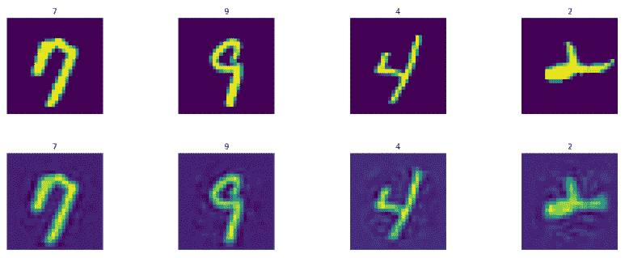
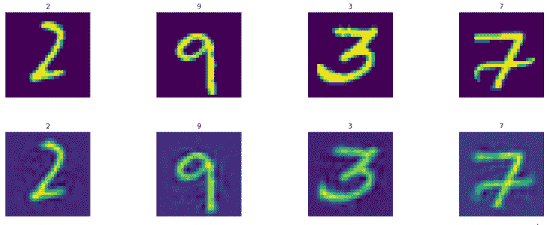
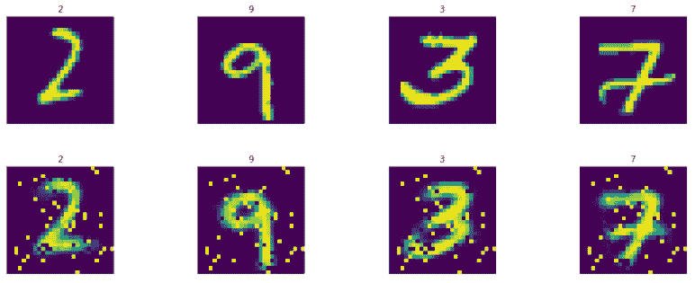
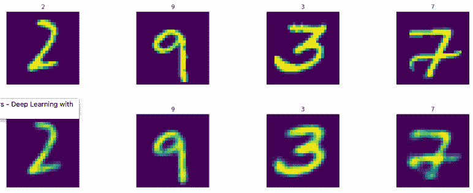
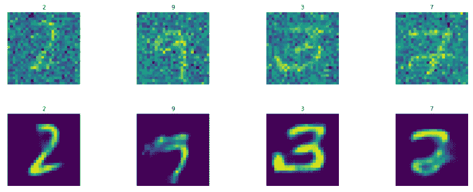

# 十、TensorFlow 和 Keras 中的自编码器

自编码器是一种神经网络架构，通常与无监督学习，降维和数据压缩相关联。自编码器通过使用隐藏层中较少数量的神经元来学习产生与输入层相同的输出。这允许隐藏层以较少数量的参数学习输入的特征。使用较少数量的神经元来学习输入数据的特征的这个过程反过来减少了输入数据集的维度。

自编码器架构有两个阶段：编码器和解码器。在编码器阶段，模型学习表示具有较小维度的压缩向量的输入，并且在解码器阶段，模型学习将压缩向量表示为输出向量。损失计算为输出和输入之间的熵距离，因此通过最小化损失，我们学习将输入编码成能够产生输入的表示的参数，以及另一组学习参数。

在本章中，您将学习如何使用 TensorFlow 和 Keras 在以下主题中创建自编码器架构：

*   自编码器类型
*   TensorFlow 和 Keras 中的栈式自编码器
*   在 TensorFlow 和 Keras 中对自编码器进行去噪
*   TensorFlow 和 Keras 中的变分自编码器

# 自编码器类型

自编码器架构可以在各种配置中找到，例如简单自编码器，稀疏自编码器，去噪自编码器和卷积自编码器。

*   **简单自编码器**：在简单的自编码器中，与输入相比，隐藏层具有较少数量的节点或神经元。例如，在 MNIST 数据集中，784 个特征的输入可以连接到 512 个节点的隐藏层或 256 个节点，其连接到 784 特征输出层。因此，在训练期间，仅由 256 个节点学习 784 个特征。 简单自编码器也称为欠完整自编码器。

    简单的自编码器可以是单层或多层。通常，单层自编码器在生产中表现不佳。多层自编码器具有多个隐藏层，分为编码器和解码器分组。编码器层将大量特征编码为较少数量的神经元，然后解码器层将学习的压缩特征解码回原始特征或减少数量的特征。多层自编码器被称为**栈式自编码器** 。
*   **稀疏自编码器**：在稀疏自编码器中，添加正则化项作为惩罚，因此，与简单自编码器相比，表示变得更稀疏。
*   **去噪自编码器**（DAE）：在 DAE 架构中，输入带有随机噪声。 DAE 重新创建输入并尝试消除噪音。 DAE 中的损失函数将去噪重建输出与原始未损坏输入进行比较。
*   **卷积自编码器**（CAE）：前面讨论过的自编码器使用全连接层，这种模式类似于多层感知机模型。我们也可以使用卷积层而不是完全连接或密集层。当我们使用卷积层来创建自编码器时，它被称为卷积自编码器。作为一个例子，我们可以为 CAE 提供以下层：

    **输入 -> 卷积 -> 池化 -> 卷积 -> 池化 -> 输出**

    第一组卷积和池化层充当编码器，将高维输入特征空间减少到低维特征空间。第二组卷积和池化层充当解码器，将其转换回高维特征空间。

*   **变分自编码器**（VAE）：变分自编码器架构是自编码器领域的最新发展。 VAE 是一种生成模型，即它产生概率分布的参数，从中可以生成原始数据或与原始数据非常相似的数据。

    在 VAE 中，编码器将输入样本转换为潜在空间中的参数，使用该参数对潜在点进行采样。然后解码器使用潜点重新生成原始输入数据。因此，在 VAE 中学习的重点转移到最大化输入数据的概率，而不是试图从输入重建输出。

现在让我们在以下部分中在 TensorFlow 和 Keras 中构建自编码器。我们将使用 MNIST 数据集来构建自编码器。自编码器将学习表示具有较少数量的神经元或特征的 MNIST 数据集的手写数字。

您可以按照 Jupyter 笔记本中的代码`ch-10_AutoEncoders_TF_and_Keras`。

像往常一样，我们首先使用以下代码读取 MNIST 数据集：

```py
from tensorflow.examples.tutorials.mnist.input_data import input_data
dataset_home = os.path.join(datasetslib.datasets_root,'mnist') 
mnist = input_data.read_data_sets(dataset_home,one_hot=False)

X_train = mnist.train.images
X_test = mnist.test.images
Y_train = mnist.train.labels
Y_test = mnist.test.labels

pixel_size = 28
```

我们从训练和测试数据集中提取四个不同的图像及其各自的标签：

```py
while True:
     train_images,train_labels = mnist.train.next_batch(4)
     if len(set(train_labels))==4:
        break
while True:
     test_images,test_labels = mnist.test.next_batch(4)
     if len(set(test_labels))==4:
        break
```

现在让我们看看使用 MNIST 数据集构建自编码器的代码。

您可以按照 Jupyter 笔记本中的代码`ch-10_AutoEncoders_TF_and_Keras`。

# TensorFlow 中的栈式自编码器

在 TensorFlow 中构建栈式自编码器模型的步骤如下：

1.  首先，定义超参数如下：

```py
learning_rate = 0.001
n_epochs = 20
batch_size = 100
n_batches = int(mnist.train.num_examples/batch_size)
```

1.  定义输入（即特征）和输出（即目标）的数量。输出数量与输入数量相同：

```py
# number of pixels in the MNIST image as number of inputs
n_inputs = 784
n_outputs = n_inputs
```

1.  定义输入和输出图像的占位符：

```py
x = tf.placeholder(dtype=tf.float32, name="x", shape=[None, n_inputs])
y = tf.placeholder(dtype=tf.float32, name="y", shape=[None, n_outputs])
```

1.  添加编码器和解码器层的神经元数量为`[512,256,256,512]`：

```py
# number of hidden layers
n_layers = 2
# neurons in each hidden layer
n_neurons = [512,256]
# add number of decoder layers:
n_neurons.extend(list(reversed(n_neurons)))
n_layers = n_layers * 2
```

1.  定义`w`和`b`参数：

```py
w=[]
b=[]

for i in range(n_layers):
    w.append(tf.Variable(tf.random_normal([n_inputs \
                  if i==0 else n_neurons[i-1],n_neurons[i]]),
                         name="w_{0:04d}".format(i) 
                        )
            ) 
    b.append(tf.Variable(tf.zeros([n_neurons[i]]),
                         name="b_{0:04d}".format(i) 
                        )
            ) 
w.append(tf.Variable(tf.random_normal([n_neurons[n_layers-1] \
                    if n_layers > 0 else n_inputs,n_outputs]),
                     name="w_out"
                    )
        )
b.append(tf.Variable(tf.zeros([n_outputs]),name="b_out"))
```

1.  构建网络并为每个层使用 sigmoid 激活函数：

```py
# x is input layer
layer = x
# add hidden layers
for i in range(n_layers):
layer = tf.nn.sigmoid(tf.matmul(layer, w[i]) + b[i])
# add output layer
layer = tf.nn.sigmoid(tf.matmul(layer, w[n_layers]) + b[n_layers]) 
model = layer
```

1.  使用`mean_squared_error`定义`loss`函数，使用`AdamOptimizer`定义`optimizer`函数：

```py
mse = tf.losses.mean_squared_error
loss = mse(predictions=model, labels=y)
optimizer = tf.train.AdamOptimizer(learning_rate=learning_rate)
optimizer = optimizer.minimize(loss)
```

1.  训练模型并预测`train`和`test`集的图像：

```py
with tf.Session() as tfs:
    tf.global_variables_initializer().run()
    for epoch in range(n_epochs):
        epoch_loss = 0.0
        for batch in range(n_batches):
            X_batch, _ = mnist.train.next_batch(batch_size)
            feed_dict={x: X_batch,y: X_batch}
            _,batch_loss = tfs.run([optimizer,loss], feed_dict)
            epoch_loss += batch_loss 
        if (epoch%10==9) or (epoch==0):
            average_loss = epoch_loss / n_batches
            print('epoch: {0:04d} loss = {1:0.6f}'
                  .format(epoch,average_loss))
    # predict images using trained autoencoder model 
    Y_train_pred = tfs.run(model, feed_dict={x: train_images})
    Y_test_pred = tfs.run(model, feed_dict={x: test_images})
```

1.  我们看到以下输出，因为损失在 20 个周期后显着减少：

```py
epoch: 0000   loss = 0.156696
epoch: 0009   loss = 0.091367
epoch: 0019   loss = 0.078550
```

1.  现在模型已经过训练，让我们显示训练模型中的预测图像。我们写了一个辅助函数`display_images`来帮助我们显示图像：

```py
import random

# Function to display the images and labels
# images should be in NHW or NHWC format
def display_images(images, labels, count=0, one_hot=False):
    # if number of images to display is not provided, then display all the images
    if (count==0):
        count = images.shape[0]

    idx_list = random.sample(range(len(labels)),count)
    for i in range(count):
        plt.subplot(4, 4, i+1)
        plt.title(labels[i])
        plt.imshow(images[i])
        plt.axis('off')
    plt.tight_layout()
    plt.show()
```

使用此函数，我们首先显示训练集中的四个图像和自编码器预测的图像。

第一行表示实际图像，第二行表示生成的图像：


生成的图像有一点点噪音，可以通过更多训练和超参数调整来消除。现在预测训练集图像并不神奇，因为我们在这些图像上训练了自编码器，因此它知道它们。让我们看一下预测测试集图像的结果。 第一行表示实际图像，第二行表示生成的图像：


哇！经过训练的自编码器能够生成相同的数字，只有从 768 中学到的 256 个特征。生成的图像中的噪声可以通过超参数调整和更多训练来改善。

# Keras 中的栈式自编码器

现在让我们在 Keras 中构建相同的自编码器。

我们使用以下命令清除笔记本中的图，以便我们可以构建一个新图，该图不会占用上一个会话或图中的任何内存：

`tf.reset_default_graph()`
`keras.backend.clear_session()`

1.  首先，我们导入 keras 库并定义超参数和层：

```py
import keras
from keras.layers import Dense
from keras.models import Sequential

learning_rate = 0.001
n_epochs = 20
batch_size = 100
n_batches = int(mnist.train.num_examples/batch_sizee
# number of pixels in the MNIST image as number of inputs
n_inputs = 784
n_outputs = n_i
# number of hidden layers
n_layers = 2
# neurons in each hidden layer
n_neurons = [512,256]
# add decoder layers:
n_neurons.extend(list(reversed(n_neurons)))
n_layers = n_layers * 2
```

1.  接下来，我们构建一个顺序模型并为其添加密集层。对于更改，我们对隐藏层使用`relu`激活，为最终层使用`linear`激活：

```py
model = Sequential()

# add input to first layer
model.add(Dense(units=n_neurons[0], activation='relu', 
    input_shape=(n_inputs,)))

for i in range(1,n_layers):
    model.add(Dense(units=n_neurons[i], activation='relu'))

# add last layer as output layer
model.add(Dense(units=n_outputs, activation='linear'))
```

1.  现在让我们显示模型摘要以查看模型的外观：

```py
model.summary()
```

该模型在五个密集层中共有 1,132,816 个参数：

```py
_________________________________________________________________
Layer (type)                 Output Shape              Param #   
=================================================================
dense_1 (Dense)              (None, 512)               401920    
_________________________________________________________________
dense_2 (Dense)              (None, 256)               131328    
_________________________________________________________________
dense_3 (Dense)              (None, 256)               65792     
_________________________________________________________________
dense_4 (Dense)              (None, 512)               131584    
_________________________________________________________________
dense_5 (Dense)              (None, 784)               402192    
=================================================================
Total params: 1,132,816
Trainable params: 1,132,816
Non-trainable params: 0
_________________________________________________________________
```

1.  让我们用上一个例子中的均方损失编译模型：

```py
model.compile(loss='mse',
    optimizer=keras.optimizers.Adam(lr=learning_rate),
    metrics=['accuracy'])

model.fit(X_train, X_train,batch_size=batch_size,
    epochs=n_epochs)
```

在 20 个周期，我们能够获得 0.0046 的损失，相比之前我们得到的 0.078550：

```py
Epoch 1/20
55000/55000 [==========================] - 18s - loss: 0.0193 - acc: 0.0117    
Epoch 2/20
55000/55000 [==========================] - 18s - loss: 0.0087 - acc: 0.0139 
...
...
...   
Epoch 20/20
55000/55000 [==========================] - 16s - loss: 0.0046 - acc: 0.0171
```

现在让我们预测并显示模型生成的训练和测试图像。第一行表示实际图像，第二行表示生成的图像。以下是 t 降雨设置图像：



以下是测试集图像：



这是我们在能够从 256 个特征生成图像时实现的非常好的准确率。

# TensorFlow 中的去噪自编码器

正如您在本章的第一部分中所了解的那样，可以使用去噪自编码器来训练模型，以便它们能够从输入到训练模型的图像中去除噪声：

1.  出于本示例的目的，我们编写以下辅助函数来帮助我们为图像添加噪声：

```py
def add_noise(X):
    return X + 0.5 * np.random.randn(X.shape[0],X.shape[1])
```

1.  然后我们为测试图像添加噪声并将其存储在单独的列表中：

```py
test_images_noisy = add_noise(test_images)
```

我们将使用这些测试图像来测试我们的去噪模型示例的输出。

1.  我们按照前面的例子构建和训练去噪自编码器，但有一点不同：在训练时，我们将噪声图像输入到输入层，我们用非噪声图像检查重建和去噪误差，如下面的代码所示：

```py
X_batch, _ = mnist.train.next_batch(batch_size)
X_batch_noisy = add_noise(X_batch)
feed_dict={x: X_batch_noisy, y: X_batch}
_,batch_loss = tfs.run([optimizer,loss], feed_dict=feed_dict)
```

笔记本`ch-10_AutoEncoders_TF_and_Keras`中提供了去噪自编码器的完整代码。

现在让我们首先显示从 DAE 模型生成的测试图像；第一行表示原始的非噪声测试图像，第二行表示生成的测试图像：

```py
display_images(test_images.reshape(-1,pixel_size,pixel_size),test_labels)
display_images(Y_test_pred1.reshape(-1,pixel_size,pixel_size),test_labels)
```

上述代码的结果如下：



接下来，当我们输入噪声测试图像时，我们显示生成的图像：

```py
display_images(test_images_noisy.reshape(-1,pixel_size,pixel_size),
    test_labels)
display_images(Y_test_pred2.reshape(-1,pixel_size,pixel_size),test_labels)
```

上述代码的结果如下：


那太酷了!!该模型学习了图像并生成了几乎正确的图像，即使是非常嘈杂的图像。通过适当的超参数调整可以进一步提高再生质量。

# Keras 中的去噪自编码器

现在让我们在 Keras 中构建相同的去噪自编码器。

由于 Keras 负责按批量大小喂养训练集，我们创建了一个嘈杂的训练集作为我们模型的输入：

```py
X_train_noisy = add_noise(X_train)
```

Keras 中 DAE 的完整代码在笔记本`ch-10_AutoEncoders_TF_and_Keras`中提供。

DAE Keras 模型如下所示：

```py
Layer (type)                 Output Shape              Param #   
=================================================================
dense_1 (Dense)              (None, 512)               401920    
_________________________________________________________________
dense_2 (Dense)              (None, 256)               131328    
_________________________________________________________________
dense_3 (Dense)              (None, 256)               65792     
_________________________________________________________________
dense_4 (Dense)              (None, 512)               131584    
_________________________________________________________________
dense_5 (Dense)              (None, 784)               402192    
=================================================================
Total params: 1,132,816
Trainable params: 1,132,816
Non-trainable params: 0
```

由于 DAE 模型很复杂，为了演示，我们不得不将周期数增加到 100 来训练模型：

```py
n_epochs=100

model.fit(x=X_train_noisy, y=X_train,
     batch_size=batch_size,
     epochs=n_epochs,
     verbose=0)

Y_test_pred1 = model.predict(test_images)
Y_test_pred2 = model.predict(test_images_noisy)
```

打印生成的图像：

```py
display_images(test_images.reshape(-1,pixel_size,pixel_size),test_labels)
display_images(Y_test_pred1.reshape(-1,pixel_size,pixel_size),test_labels)
```

第一行是原始测试图像，第二行是生成的测试图像：


```py
display_images(test_images_noisy.reshape(-1,pixel_size,pixel_size),
    test_labels)
display_images(Y_test_pred2.reshape(-1,pixel_size,pixel_size),test_labels)
```

第一行是噪声测试图像，第二行是生成的测试图像：


正如我们所看到的，去噪自编码器可以很好地从噪声版本的图像中生成图像。

# TensorFlow 中的变分自编码器

变分自编码器是自编码器的现代生成版本。让我们为同一个前面的问题构建一个变分自编码器。我们将通过提供来自原始和嘈杂测试集的图像来测试自编码器。

我们将使用不同的编码风格来构建此自编码器，以便使用 TensorFlow 演示不同的编码风格：

1.  首先定义超参数：

```py
learning_rate = 0.001
n_epochs = 20
batch_size = 100
n_batches = int(mnist.train.num_examples/batch_size)
# number of pixels in the MNIST image as number of inputs
n_inputs = 784
n_outputs = n_inputs
```

1.  接下来，定义参数字典以保存权重和偏差参数：

```py
params={}
```

1.  定义每个编码器和解码器中隐藏层的数量：

```py
n_layers = 2
# neurons in each hidden layer
n_neurons = [512,256] 
```

1.  变分编码器中的新增加是我们定义潜变量`z`的维数：

```py
n_neurons_z = 128 # the dimensions of latent variables
```

1.  我们使用激活`tanh`：

```py
activation = tf.nn.tanh
```

1.  定义输入和输出占位符：

```py
x = tf.placeholder(dtype=tf.float32, name="x", 
                    shape=[None, n_inputs]) 
y = tf.placeholder(dtype=tf.float32, name="y", 
                    shape=[None, n_outputs])
```

1.  定义输入层：

```py
# x is input layer
layer = x
```

1.  定义编码器网络的偏差和权重并添加层。变分自编码器的编码器网络也称为识别网络或推理网络或概率编码器网络：

```py
for i in range(0,n_layers):
    name="w_e_{0:04d}".format(i)
    params[name] = tf.get_variable(name=name, 
        shape=[n_inputs if i==0 else n_neurons[i-1],
        n_neurons[i]], 
        initializer=tf.glorot_uniform_initializer()
        )
    name="b_e_{0:04d}".format(i)
    params[name] = tf.Variable(tf.zeros([n_neurons[i]]),
        name=name
        )
    layer = activation(tf.matmul(layer,
        params["w_e_{0:04d}".format(i)]
        ) + params["b_e_{0:04d}".format(i)]
        )
```

1.  接下来，添加潜在变量的均值和方差的层：

```py
name="w_e_z_mean"
params[name] = tf.get_variable(name=name,
    shape=[n_neurons[n_layers-1], n_neurons_z],
    initializer=tf.glorot_uniform_initializer()
    )
name="b_e_z_mean"
params[name] = tf.Variable(tf.zeros([n_neurons_z]),
    name=name
    )
z_mean = tf.matmul(layer, params["w_e_z_mean"]) + 
            params["b_e_z_mean"]
name="w_e_z_log_var"
params[name] = tf.get_variable(name=name,
    shape=[n_neurons[n_layers-1], n_neurons_z],
    initializer=tf.glorot_uniform_initializer()
    )
name="b_e_z_log_var"
params[name] = tf.Variable(tf.zeros([n_neurons_z]),
    name="b_e_z_log_var"
    )

z_log_var = tf.matmul(layer, params["w_e_z_log_var"]) + 
            params["b_e_z_log_var"]
```

1.  接下来，定义表示与`z`方差的变量相同形状的噪声分布的`epsilon`变量：

```py
epsilon = tf.random_normal(tf.shape(z_log_var), 
    mean=0, 
    stddev=1.0,
    dtype=tf.float32, 
    name='epsilon'
    )
```

1.  根据均值，对数方差和噪声定义后验分布：

```py
z = z_mean + tf.exp(z_log_var * 0.5) * epsilon 
```

1.  接下来，定义解码器网络的权重和偏差，并添加解码器层。变分自编码器中的解码器网络也称为概率解码器或生成器网络。

```py
# add generator / probablistic decoder network parameters and layers
layer = z

for i in range(n_layers-1,-1,-1):
name="w_d_{0:04d}".format(i)
    params[name] = tf.get_variable(name=name, 
    shape=[n_neurons_z if i==n_layers-1 else n_neurons[i+1],
    n_neurons[i]], 
    initializer=tf.glorot_uniform_initializer()
    )
name="b_d_{0:04d}".format(i)
params[name] = tf.Variable(tf.zeros([n_neurons[i]]),
    name=name 
    )
layer = activation(tf.matmul(layer, params["w_d_{0:04d}".format(i)]) + 
    params["b_d_{0:04d}".format(i)])
```

1.  最后，定义输出层：

```py
name="w_d_z_mean"
params[name] = tf.get_variable(name=name,
    shape=[n_neurons[0],n_outputs],
    initializer=tf.glorot_uniform_initializer()
    )
name="b_d_z_mean"
    params[name] = tf.Variable(tf.zeros([n_outputs]),
    name=name
    )
name="w_d_z_log_var" 
params[name] = tf.Variable(tf.random_normal([n_neurons[0],
    n_outputs]),
    name=name
    )
name="b_d_z_log_var"
params[name] = tf.Variable(tf.zeros([n_outputs]),
    name=name
    )
layer = tf.nn.sigmoid(tf.matmul(layer, params["w_d_z_mean"]) + 
    params["b_d_z_mean"])

model = layer
```

1.  在变异自编码器中，我们有重建损失和正则化损失。将损失函数定义为重建损失和正则化损失的总和：

```py
rec_loss = -tf.reduce_sum(y * tf.log(1e-10 + model) + (1-y) 
                            * tf.log(1e-10 + 1 - model), 1)
reg_loss = -0.5*tf.reduce_sum(1 + z_log_var - tf.square(z_mean) 
                                - tf.exp(z_log_var), 1) 
loss = tf.reduce_mean(rec_loss+reg_loss)
```

1.  根据`AdapOptimizer`定义优化器函数：

```py
optimizer = tf.train.AdamOptimizer(learning_rate=learning_rate)
            .minimize(loss)
```

1.  现在让我们训练模型并从非噪声和噪声测试图像生成图像：

```py
with tf.Session() as tfs:
    tf.global_variables_initializer().run()
    for epoch in range(n_epochs):
        epoch_loss = 0.0
        for batch in range(n_batches):
            X_batch, _ = mnist.train.next_batch(batch_size)
            feed_dict={x: X_batch,y: X_batch}
            _,batch_loss = tfs.run([optimizer,loss], 
                            feed_dict=feed_dict)
            epoch_loss += batch_loss
        if (epoch%10==9) or (epoch==0):
            average_loss = epoch_loss / n_batches
            print("epoch: {0:04d} loss = {1:0.6f}"
                      .format(epoch,average_loss))

# predict images using autoencoder model trained
Y_test_pred1 = tfs.run(model, feed_dict={x: test_images})
Y_test_pred2 = tfs.run(model, feed_dict={x: test_images_noisy})
```

我们得到以下输出：

```py
epoch: 0000   loss = 180.444682
epoch: 0009   loss = 106.817749
epoch: 0019   loss = 102.580904

```

现在让我们显示图像：

```py
display_images(test_images.reshape(-1,pixel_size,pixel_size),test_labels)
display_images(Y_test_pred1.reshape(-1,pixel_size,pixel_size),test_labels)
```

结果如下：



```py
display_images(test_images_noisy.reshape(-1,pixel_size,pixel_size),
    test_labels)
display_images(Y_test_pred2.reshape(-1,pixel_size,pixel_size),test_labels)
```

结果如下：



同样，可以通过超参数调整和增加学习量来改善结果。

# Keras 中的变分自编码器

在 Keras 中，构建变分自编码器更容易，并且代码行更少。 Keras 变分自编码器最好使用函数式风格构建。到目前为止，我们已经使用了在 Keras 中构建模型的顺序样式，现在在这个例子中，我们将看到在 Keras 中构建 VAE 模型的函数式风格。在 Keras 建立 VAE 的步骤如下：

1.  定义隐藏层和潜在变量层中的超参数和神经元数量：

```py
import keras
from keras.layers import Lambda, Dense, Input, Layer
from keras.models import Model
from keras import backend as K

learning_rate = 0.001
batch_size = 100
n_batches = int(mnist.train.num_examples/batch_size)
# number of pixels in the MNIST image as number of inputs
n_inputs = 784
n_outputs = n_inputs
# number of hidden layers
n_layers = 2
# neurons in each hidden layer
n_neurons = [512,256]
# the dimensions of latent variables
n_neurons_z = 128
```

1.  构建输入层：

```py
x = Input(shape=(n_inputs,), name='input')
```

1.  构建编码器层，以及潜在变量的均值和方差层：

```py
# build encoder
layer = x
for i in range(n_layers):
    layer = Dense(units=n_neurons[i], activation='relu',name='enc_{0}'.format(i))(layer)

z_mean = Dense(units=n_neurons_z,name='z_mean')(layer)
z_log_var = Dense(units=n_neurons_z,name='z_log_v')(layer)
```

1.  创建噪声和后验分布：

```py
# noise distribution
epsilon = K.random_normal(shape=K.shape(z_log_var), 
          mean=0,stddev=1.0)

# posterior distribution
z = Lambda(lambda zargs: zargs[0] + K.exp(zargs[1] * 0.5) * epsilon,
    name='z')([z_mean,z_log_var])
```

1.  添加解码器层：

```py
# add generator / probablistic decoder network layers
layer = z
for i in range(n_layers-1,-1,-1):
    layer = Dense(units=n_neurons[i], activation='relu',
            name='dec_{0}'.format(i))(layer)
```

1.  定义最终输出层：

```py
y_hat = Dense(units=n_outputs, activation='sigmoid',
        name='output')(layer)
```

1.  最后，从输入层和输出层定义模型并显示模型摘要：

```py
model = Model(x,y_hat)
model.summary()
```

我们看到以下摘要：

```py
_________________________________________________________________________
Layer (type)         Output Shape          Param #     Connected to                     
=========================================================================
input (InputLayer)   (None, 784)           0                                            
_________________________________________________________________________
enc_0 (Dense)        (None, 512)           401920      input[0][0]                      
_________________________________________________________________________
enc_1 (Dense)        (None, 256)           131328      enc_0[0][0]                      
_________________________________________________________________________
z_mean (Dense)       (None, 128)           32896       enc_1[0][0]                      
_________________________________________________________________________
z_log_v (Dense)      (None, 128)           32896       enc_1[0][0]                      
_________________________________________________________________________
z (Lambda)           (None, 128)           0           z_mean[0][0]                     
                                                       z_log_v[0][0]                    
_________________________________________________________________________
dec_1 (Dense)        (None, 256)           33024       z[0][0]                          
_________________________________________________________________________
dec_0 (Dense)        (None, 512)           131584      dec_1[0][0]                      
_________________________________________________________________________
output (Dense)       (None, 784)           402192      dec_0[0][0]                      
=========================================================================
Total params: 1,165,840
Trainable params: 1,165,840
Non-trainable params: 0
_________________________________________________________________________
```

1.  定义一个计算重建和正则化损失之和的函数：

```py
def vae_loss(y, y_hat):
    rec_loss = -K.sum(y * K.log(1e-10 + y_hat) + (1-y) * 
                K.log(1e-10 + 1 - y_hat), axis=-1)
    reg_loss = -0.5 * K.sum(1 + z_log_var - K.square(z_mean) - 
                K.exp(z_log_var), axis=-1) 
    loss = K.mean(rec_loss+reg_loss)
    return loss
```

1.  使用此损失函数来编译模型：

```py
model.compile(loss=vae_loss,
    optimizer=keras.optimizers.Adam(lr=learning_rate))
```

1.  让我们训练 50 个周期的模型并预测图像，正如我们在前面的部分中所做的那样：

```py
n_epochs=50
model.fit(x=X_train_noisy,y=X_train,batch_size=batch_size,
    epochs=n_epochs,verbose=0)
Y_test_pred1 = model.predict(test_images)
Y_test_pred2 = model.predict(test_images_noisy)
```

让我们显示结果图像：

```py
display_images(test_images.reshape(-1,pixel_size,pixel_size),test_labels)
display_images(Y_test_pred1.reshape(-1,pixel_size,pixel_size),test_labels)
```

我们得到如下结果：


```py
display_images(test_images_noisy.reshape(-1,pixel_size,pixel_size),
    test_labels)
display_images(Y_test_pred2.reshape(-1,pixel_size,pixel_size),test_labels)
```

我们得到以下结果：


这很棒！！生成的图像更清晰，更清晰。

# 总结

自编码器是无监督数据学习的绝佳工具。它们通常用于降低维数，因此数据可以用较少数量的特征来表示。在本章中，您了解了各种类型的自编码器。我们使用 TensorFlow 和 Keras 练习构建三种类型的自编码器：栈式自编码器，去噪自编码器和变分自编码器。我们使用 MNIST 数据集作为示例。

在最后的章节中，您学习了如何使用 TensorFlow 和 Keras 构建各种机器学习和深度学习模型，例如回归，分类，MLP，CNN，RNN 和自编码器。在下一章中，您将了解 TensorFlow 和 Keras 的高级功能，这些功能允许我们将模型投入生产。

