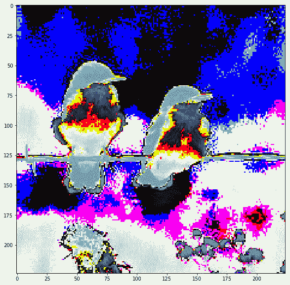
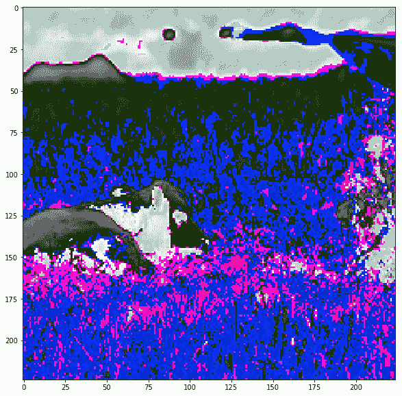
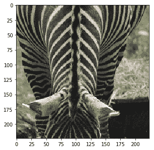
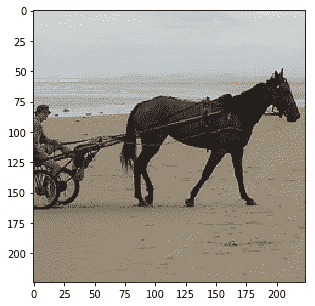
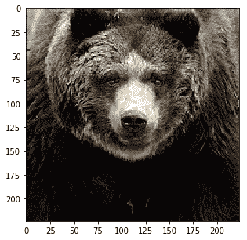
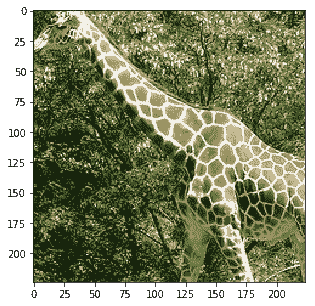
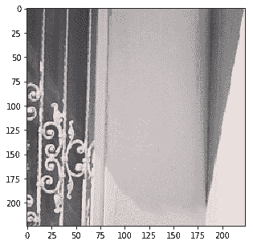
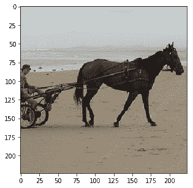

# 十二、迁移学习和预训练模型

简单来说，**迁移学习**意味着你需要训练有素的预训练模型来预测一种类，然后直接使用它或仅再训练它的一小部分，以便预测另一种类。例如，您可以采用预训练的模型来识别猫的类型，然后仅对狗的类型再训练模型的小部分，然后使用它来预测狗的类型。

如果没有迁移学习，在大型数据集上训练一个巨大的模型需要几天甚至几个月。然而，通过迁移学习，通过采用预训练的模型，并且仅训练最后几层，我们可以节省大量时间从头开始训练模型。

当没有庞大的数据集时，迁移学习也很有用。在小型数据集上训练的模型可能无法检测在大型数据集上训练的模型可以进行的特征。因此，通过迁移学习，即使数据集较小，也可以获得更好的模型。

在本章中，我们将采用预训练的模型并对新物体进行训练。我们展示了带有图像的预训练模型的示例，并将它们应用于图像分类问题。 您应该尝试找到其他预训练的模型，并将它们应用于不同的问题，如对象检测，文本生成或机器翻译。本章将介绍以下主题：

*   ImageNet 数据集
*   再训练或微调模型
*   COCO 动物数据集和预处理
*   使用 TensorFlow 中预训练的 VGG16 进行图像分类
*   TensorFlow 中的图像预处理，用于预训练的 VGG16
*   在 TensorFlow 中使用 **再训练** VGG16 进行图像分类
*   使用 Keras 中预训练的 VGG16 进行图像分类
*   使用 **再训练** VGG16 在 Keras 中进行图像分类
*   使用 TensorFlow 中的 Inception v3 进行图像分类
*   在[TensorFlow]中使用 **再训练** Inception v3 进行图像分类

# ImageNet 数据集

根据 [ImageNet](http://image-net.org)：

ImageNet 是根据 WordNet 层次结构组织的图像数据集。WordNet 中的每个有意义的概念，可能由多个单词或单词短语描述，称为同义词集或 synset。

ImageNet 有大约 100 K 个同义词集，平均每个同义词集约有 1,000 个人工注释图像。 ImageNet 仅存储对图像的引用，而图像存储在互联网上的原始位置。在深度学习论文中，ImageNet-1K 是指作为 ImageNet 的**大规模视觉识别挑战**（ **ILSVRC** ）的一部分发布的数据集，用于将数据集分类为 1,000 个类别：

可以在以下 URL 找到 1,000 个挑战类别：

+   <http://image-net.org/challenges/LSVRC/2017/browse-synsets>
+   <http://image-net.org/challenges/LSVRC/2016/browse-synsets>
+   <http://image-net.org/challenges/LSVRC/2015/browse-synsets>
+   <http://image-net.org/challenges/LSVRC/2014/browse-synsets>
+   <http://image-net.org/challenges/LSVRC/2013/browse-synsets>
+   <http://image-net.org/challenges/LSVRC/2012/browse-synsets>
+   <http://image-net.org/challenges/LSVRC/2011/browse-synsets>
+   <http://image-net.org/challenges/LSVRC/2010/browse-synsets>

我们编写了一个自定义函数来从 Google 下载 ImageNet 标签：

```py
def build_id2label(self):
    base_url = 'https://raw.githubusercontent.com/tensorflow/models/master/research/inception/inception/data/'
  synset_url = '{}/imagenet_lsvrc_2015_synsets.txt'.format(base_url)
    synset_to_human_url = '{}/imagenet_metadata.txt'.format(base_url)

    filename, _ = urllib.request.urlretrieve(synset_url)
    synset_list = [s.strip() for s in open(filename).readlines()]
    num_synsets_in_ilsvrc = len(synset_list)
    assert num_synsets_in_ilsvrc == 1000

  filename, _ = urllib.request.urlretrieve(synset_to_human_url)
    synset_to_human_list = open(filename).readlines()
    num_synsets_in_all_imagenet = len(synset_to_human_list)
    assert num_synsets_in_all_imagenet == 21842

  synset2name = {}
    for s in synset_to_human_list:
        parts = s.strip().split('\t')
        assert len(parts) == 2
  synset = parts[0]
        name = parts[1]
        synset2name[synset] = name

    if self.n_classes == 1001:
        id2label={0:'empty'}
        id=1
  else:
        id2label = {}
        id=0

  for synset in synset_list:
        label = synset2name[synset]
        id2label[id] = label
        id += 1

  return id2label
```

我们将这些标签加载到我们的 Jupyter 笔记本中，如下所示：

```py
### Load ImageNet dataset for labels
from datasetslib.imagenet import imageNet
inet = imageNet()
inet.load_data(n_classes=1000)  
#n_classes is 1001 for Inception models and 1000 for VGG models
```

在 ImageNet-1K 数据集上训练过的热门预训练图像分类模型如下表所示：

| **模型名称** | **Top-1 准确率** | **Top-5 准确率** | **Top-5 错误率** | **原始文件的链接** |
| --- | --- | --- | --- | --- |
| AlexNet |  |  | 15.3% | <https://www.cs.toronto.edu/~fritz/absps/imagenet.pdf> |
| 盗梦空间也称为 Inception V1 | 69.8 | 89.6 | 6.67% | <https://arxiv.org/abs/1409.4842> |
| BN-启-V2 也称为 Inception V2 | 73.9 | 91.8 | 4.9% | <https://arxiv.org/abs/1502.03167> |
| Inception v3 | 78.0 | 93.9 | 3.46% | <https://arxiv.org/abs/1512.00567> |
| 成立 V4 | 80.2 | 95.2 |  | <http://arxiv.org/abs/1602.07261> |
| Inception-Resnet-V2 | 80.4 | 95.2 |  | <http://arxiv.org/abs/1602.07261> |
| VGG16 | 71.5 | 89.8 | 7.4% | <https://arxiv.org/abs/1409.1556> |
| VGG19 | 71.1 | 89.8 | 7.3% | <https://arxiv.org/abs/1409.1556> |
| ResNet V1 50 | 75.2 | 92.2 | 7.24% | <https://arxiv.org/abs/1512.03385> |
| Resnet V1 101 | 76.4 | 92.9 |  | <https://arxiv.org/abs/1512.03385> |
| Resnet V1 152 | 76.8 | 93.2 |  | <https://arxiv.org/abs/1512.03385> |
| ResNet V2 50 | 75.6 | 92.8 |  | <https://arxiv.org/abs/1603.05027> |
| ResNet V2 101 | 77.0 | 93.7 |  | <https://arxiv.org/abs/1603.05027> |
| ResNet V2 152 | 77.8 | 94.1 |  | <https://arxiv.org/abs/1603.05027> |
| ResNet V2 200 | 79.9 | 95.2 |  | <https://arxiv.org/abs/1603.05027> |
| Xception | 79.0 | 94.5 |  | <https://arxiv.org/abs/1610.02357> |
| MobileNet V1 版本 | 41.3 至 70.7 | 66.2 至 89.5 |  | <https://arxiv.org/pdf/1704.04861.pdf> |

在上表中，Top-1 和 Top-5 指标指的是模型在 ImageNet 验证数据集上的表现。

Google Research 最近发布了一种名为 MobileNets 的新模型。 MobileNets 采用移动优先策略开发，牺牲了低资源使用的准确性。 MobileNets 旨在消耗低功耗并提供低延迟，以便在移动和嵌入式设备上提供更好的体验。谷歌为 MobileNet 模型提供了 16 个预训练好的检查点文件，每个模型提供不同数量的参数和**乘法累加**（ **MAC** ）。 MAC 和参数越高，资源使用和延迟就越高。因此，您可以在更高的准确性与更高的资源使用/延迟之间进行选择。

| **模型检查点** | **百万 MAC** | **百万参数** | **Top-1 准确率** | **Top-5 准确率** |
| --- | --- | --- | --- | --- |
| [MobileNet_v1_1.0_224](http://download.tensorflow.org/models/mobilenet_v1_1.0_224_2017_06_14.tar.gz) | 569 | 4.24 | 70.7 | 89.5 |
| [MobileNet_v1_1.0_192](http://download.tensorflow.org/models/mobilenet_v1_1.0_192_2017_06_14.tar.gz) | 418 | 4.24 | 69.3 | 88.9 |
| [MobileNet_v1_1.0_160](http://download.tensorflow.org/models/mobilenet_v1_1.0_160_2017_06_14.tar.gz) | 291 | 4.24 | 67.2 | 87.5 |
| [MobileNet_v1_1.0_128](http://download.tensorflow.org/models/mobilenet_v1_1.0_128_2017_06_14.tar.gz) | 186 | 4.24 | 64.1 | 85.3 |
| [MobileNet_v1_0.75_224](http://http//download.tensorflow.org/models/mobilenet_v1_0.75_224_2017_06_14.tar.gz) | 317 | 2.59 | 68.4 | 88.2 |
| [MobileNet_v1_0.75_192](http://download.tensorflow.org/models/mobilenet_v1_0.75_192_2017_06_14.tar.gz) | 233 | 2.59 | 67.4 | 87.3 |
| [MobileNet_v1_0.75_160](http://download.tensorflow.org/models/mobilenet_v1_0.75_160_2017_06_14.tar.gz) | 162 | 2.59 | 65.2 | 86.1 |
| [MobileNet_v1_0.75_128](http://download.tensorflow.org/models/mobilenet_v1_0.75_128_2017_06_14.tar.gz) | 104 | 2.59 | 61.8 | 83.6 |
| [MobileNet_v1_0.50_224](http://download.tensorflow.org/models/mobilenet_v1_0.50_224_2017_06_14.tar.gz) | 150 | 1.34 | 64.0 | 85.4 |
| [MobileNet_v1_0.50_192](http://download.tensorflow.org/models/mobilenet_v1_0.50_192_2017_06_14.tar.gz) | 110 | 1.34 | 62.1 | 84.0 |
| [MobileNet_v1_0.50_160](http://download.tensorflow.org/models/mobilenet_v1_0.50_160_2017_06_14.tar.gz) | 77 | 1.34 | 59.9 | 82.5 |
| [MobileNet_v1_0.50_128](http://download.tensorflow.org/models/mobilenet_v1_0.50_128_2017_06_14.tar.gz) | 49 | 1.34 | 56.2 | 79.6 |
| [MobileNet_v1_0.25_224](http://download.tensorflow.org/models/mobilenet_v1_0.25_224_2017_06_14.tar.gz) | 41 | 0.47 | 50.6 | 75.0 |
| [MobileNet_v1_0.25_192](http://download.tensorflow.org/models/mobilenet_v1_0.25_192_2017_06_14.tar.gz) | 34 | 0.47 | 49.0 | 73.6 |
| [MobileNet_v1_0.25_160](http://download.tensorflow.org/models/mobilenet_v1_0.25_160_2017_06_14.tar.gz) | 21 | 0.47 | 46.0 | 70.7 |
| [MobileNet_v1_0.25_128](http://download.tensorflow.org/models/mobilenet_v1_0.25_128_2017_06_14.tar.gz) | 14 | 0.47 | 41.3 | 66.2 |

有关 MobileNets 的更多信息，请访问以下资源：

<https://research.googleblog.com/2017/06/mobilenets-open-source-models-for.html>

<https://github.com/tensorflow/models/blob/master/research/slim/nets/mobilenet_v1.md>

[https://arxiv.org/pdf/1704.04861.pdf.](https://arxiv.org/pdf/1704.04861.pdf)

# 再训练或微调模型

在像 ImageNet 这样的大型和多样化数据集上训练的模型能够检测和捕获一些通用特征，如曲线，边缘和形状。其中一些特征很容易适用于其他类型的数据集。因此，在迁移学习中，我们采用这样的通用模型，并使用以下一些技术来微调或再训练它们到我们的数据集：

*   **废除并替换最后一层：** m 通常的做法是删除最后一层并添加与我们的数据集匹配的新分类层。例如，ImageNet 模型使用 1,000 个类别进行训练，但我们的 COCO 动物数据集只有 8 个类别，因此我们删除了 softmax 层，该层使用 softmax 层生成 1,000 个类别的概率，该层生成 8 个类别的概率。通常，当新数据集几乎与训练模型的数据集类似时使用此技术，因此仅需要再训练最后一层。
*   **冻结前几层**：另一种常见做法是冻结前几层，以便仅使用新数据集更新最后未冻结层的权重。我们将看到一个例子，我们冻结前 15 层，同时只再训练最后 10 层。通常，当新数据集与训练模型的数据集非常不相似时使用此技术，因此不仅需要训练最后的层。
*   **调整超参数**：您还可以在再训练之前调整超参数，例如更改学习率或尝试不同的损失函数或不同的优化器。

TensorFlow 和 Keras 均提供预训练模型。

我们将在文件夹`tensorflow/models/research/slim/nets`中通过 TensorFlow Slim 演示我们的示例，TensorFlow Slim 在编写时有几个预训练的模型。我们将使用 TensorFlow Slim 来实例化预训练的模型，然后从下载的检查点文件加载权重。然后，加载的模型将用于使用新数据集进行预测。然后我们将再训练模型以微调预测。

我们还将通过`keras.applications`模块中提供的 Keras 预训练模型演示迁移学习。虽然 TensorFlow 有大约 20 多个预训练模型，但`keras.appplications`只有以下 7 种预训练模型：

*   [Xception](https://keras.io/applications/#xception)

*   [VGG16](https://keras.io/applications/#vgg16)

*   [VGG19](https://keras.io/applications/#vgg19)

*   [ResNet50](https://keras.io/applications/#resnet50)

*   [InceptionV3](https://keras.io/applications/#inceptionv3)

*   [InceptionResNetV2](https://keras.io/applications/#inceptionresnetv2)

*   [MobileNet](https://keras.io/applications/#mobilenet)

# COCO 动物数据集和预处理图像

对于我们的例子，我们将使用 COCO 动物数据集，[这是 COCO 数据集的一小部分，由斯坦福大学的研究人员提供](http://cs231n.stanford.edu/coco-animals.zip)。 COCO 动物数据集有 800 个训练图像和 200 个动物类别的测试图像：熊，鸟，猫，狗，长颈鹿，马，绵羊和斑马。为 VGG16 和 Inception 模型下载和预处理图像。

对于 VGG 模型，图像大小为 224 x 224，预处理步骤如下：

1.  将图像调整为 224×224，其函数类似于来自 TensorFlow 的  `tf.image.resize_image_with_crop_or_pad` 函数。我们实现了这个函数如下：

```py
def resize_image(self,in_image:PIL.Image, new_width, 
    new_height, crop_or_pad=True):
  img = in_image
    if crop_or_pad:
        half_width = img.size[0] // 2
  half_height = img.size[1] // 2
  half_new_width = new_width // 2
  half_new_height = new_height // 2
  img = img.crop((half_width-half_new_width,
                        half_height-half_new_height,
                        half_width+half_new_width,
                        half_height+half_new_height
                        ))
  img = img.resize(size=(new_width, new_height))

    return img
```

1.  调整大小后，将图像从 PIL.Image 转换为 NumPy 数组并检查图像是否有深度通道，因为数据集中的某些图像仅为灰度。

```py
img = self.pil_to_nparray(img)
if len(img.shape)==2:   
    # greyscale or no channels then add three channels
  h=img.shape[0]
    w=img.shape[1]
    img = np.dstack([img]*3)
```

1.  然后我们从图像中减去 VGG 数据集平均值以使数据居中。我们将新训练图像的数据居中的原因是这些特征具有与用于降雨模型的初始数据类似的范围。通过在相似范围内制作特征，我们确保再训练期间的梯度不会变得太高或太低。同样通过使数据居中，学习过程变得更快，因为对于以零均值为中心的每个通道，梯度变得均匀。

```py
means = np.array([[[123.68, 116.78, 103.94]]]) #shape=[1, 1, 3]
img = img - means
```

完整的预处理函数如下：

```py
def preprocess_for_vgg(self,incoming, height, width):
    if isinstance(incoming, six.string_types):
        img = self.load_image(incoming)
    else:
  img=incoming
    img_size = vgg.vgg_16.default_image_size
    height = img_size
    width = img_size
    img = self.resize_image(img,height,width)
    img = self.pil_to_nparray(img)
    if len(img.shape)==2:   
        # greyscale or no channels then add three channels
  h=img.shape[0]
        w=img.shape[1]
        img = np.dstack([img]*3)

    means = np.array([[[123.68, 116.78, 103.94]]]) #shape=[1, 1, 3]
  try:
        img = img - means
    except Exception as ex:
        print('Error preprocessing ',incoming)
        print(ex)

    return img
```

对于 Inception 模型，图像大小为 299 x 299，预处理步骤如下：

1.  图像大小调整为 299 x 299，其函数类似于来自 TensorFlow 的  `tf.image.resize_image_with_crop_or_pad` 函数。我们实现了之前在 VGG 预处理步骤中定义的此函数。
2.  然后使用以下代码将图像缩放到范围`(-1, +1)`：

```py
img = ((img/255.0) - 0.5) * 2.0
```

完整的预处理函数如下：

```py
def preprocess_for_inception(self,incoming):
    img_size = inception.inception_v3.default_image_size
    height = img_size
    width = img_size
    if isinstance(incoming, six.string_types):
        img = self.load_image(incoming)
    else:
  img=incoming
    img = self.resize_image(img,height,width)
    img = self.pil_to_nparray(img)
    if len(img.shape)==2:   
        # greyscale or no channels then add three channels
  h=img.shape[0]
        w=img.shape[1]
        img = np.dstack([img]*3)
    img = ((img/255.0) - 0.5) * 2.0

  return img
```

让我们加载 COCO 动物数据集：

```py
from datasetslib.coco import coco_animals
coco = coco_animals()
x_train_files, y_train, x_val_files, x_val = coco.load_data()
```

我们从验证集中的每个类中取一个图像，制作列表，  `x_test` 并预处理图像以制作列表  `images_test`：

```py
x_test = [x_val_files[25*x] for x in range(8)]
images_test=np.array([coco.preprocess_for_vgg(x) for x in x_test])
```

我们使用这个辅助函数来显示与图像相关的前五个类的图像和概率：

```py
# helper function
def disp(images,id2label=None,probs=None,n_top=5,scale=False):
    if scale:
        imgs = np.abs(images + np.array([[[[123.68, 
                116.78, 103.94]]]]))/255.0
    else:
        imgs = images    
    ids={}
    for j in range(len(images)):
        if scale:
            plt.figure(figsize=(5,5))
            plt.imshow(imgs[j])
        else:
            plt.imshow(imgs[j].astype(np.uint8) )
        plt.show()
        if probs is not None:
            ids[j] = [i[0] for i in sorted(enumerate(-probs[j]), 
                        key=lambda x:x[1])]
            for k in range(n_top):
                id = ids[j][k]
                print('Probability {0:1.2f}% of[{1:}]'
                    .format(100*probs[j,id],id2label[id]))
```

上述函数中的以下代码恢复为预处理的效果，以便显示原始图像而不是预处理图像：

```py
imgs = np.abs(images + np.array([[[[123.68, 116.78, 103.94]]]]))/255.0
```

在 Inception 模型的情况下，用于反转预处理的代码如下：

```py
imgs = (images / 2.0) + 0.5
```

您可以使用以下代码查看测试图像：

```py
images=np.array([mpimg.imread(x) for x in x_test])
disp(images)
```

按照 Jupyter 笔记本中的代码查看图像。它们看起来都有不同的尺寸，所以让我们打印它们的原始尺寸：

```py
print([x.shape for x in images])
```

尺寸是：

```py
[(640, 425, 3), (373, 500, 3), (367, 640, 3), (427, 640, 3), (428, 640, 3), (426, 640, 3), (480, 640, 3), (612, 612, 3)]
```

让我们预处理测试图像并查看尺寸：

```py
images_test=np.array([coco.preprocess_for_vgg(x) for x in x_test])
print(images_test.shape)
```

维度为：

```py
(8, 224, 224, 3)
```

在 Inception 的情况下，维度是：

```py
(8, 299, 299, 3)
```

Inception 的预处理图像不可见，但让我们打印 VGG 的预处理图像，以了解它们的外观：

```py
disp(images_test)
```
| | |
| --- | --- |
|  |  |
|  |  |
|  |  |
|  |  |

实际上图像被裁剪了，我们可以看到当我们在保持裁剪的同时反转预处理时它们的样子：

| | |
| --- | --- |
|  |  |
|  |  |
|  |  |
|  |  |

现在我们已经有来自 ImageNet 的标签以及来自 COCO 图像数据集的图像和标签，我们试试迁移学习示例。

# TensorFlow 中的 VGG16

您可以按照 Jupyter 笔记本中的代码`ch-12a_VGG16_TensorFlow`。

对于 TensorFlow 中 VGG16 的所有示例，我们首先从[这里](http://download.tensorflow.org/models/vgg_16_2016_08_28.tar.gz)下载检查点文件并使用以下内容初始化变量码：

```py
model_name='vgg_16'
model_url='http://download.tensorflow.org/models/'
model_files=['vgg_16_2016_08_28.tar.gz']
model_home=os.path.join(models_root,model_name) 

dsu.download_dataset(source_url=model_url,
    source_files=model_files,
    dest_dir = model_home,
    force=False,
    extract=True)
```

我们还定义了一些常见的导入和变量：

```py
from tensorflow.contrib import slim
from tensorflow.contrib.slim.nets import vgg
image_height=vgg.vgg_16.default_image_size
image_width=vgg.vgg_16.default_image_size
```

# 使用 TensorFlow 中预训练的 VGG16 进行图像分类

现在让我们首先尝试预测测试图像的类别，而不进行再训练。首先，我们清除默认图并定义图像的占位符：

```py
tf.reset_default_graph()
x_p = tf.placeholder(shape=(None,image_height, image_width,3),
                     dtype=tf.float32,name='x_p')
```

占位符  `x_p` 的形状是  `(?, 224, 224, 3)`。接下来，加载`vgg16`模型：

```py
with slim.arg_scope(vgg.vgg_arg_scope()):
     logits,_ = vgg.vgg_16(x_p,num_classes=inet.n_classes,
                            is_training=False)
```

添加 softmax 层以生成类的概率：

```py
probabilities = tf.nn.softmax(logits)
```

定义初始化函数以恢复变量，例如检查点文件中的权重和偏差。

```py
init = slim.assign_from_checkpoint_fn(
    os.path.join(model_home, '{}.ckpt'.format(model_name)),
    slim.get_variables_to_restore())
```

在 TensorFlow 会话中，初始化变量并运行概率张量以获取每个图像的概率：

```py
with tf.Session() as tfs:
    init(tfs)
    probs = tfs.run([probabilities],feed_dict={x_p:images_test})
    probs=probs[0]
```

让我们看看我们得到的课程：

```py
disp(images_test,id2label=inet.id2label,probs=probs,scale=True)
```


```py
Probability 99.15% of [zebra]
Probability 0.37% of [tiger cat]
Probability 0.33% of [tiger, Panthera tigris]
Probability 0.04% of [goose]
Probability 0.02% of [tabby, tabby cat]
```


---



```py
Probability 99.50% of [horse cart, horse-cart]
Probability 0.37% of [plow, plough]
Probability 0.06% of [Arabian camel, dromedary, Camelus dromedarius]
Probability 0.05% of [sorrel]
Probability 0.01% of [barrel, cask]
```


---


```py
Probability 19.32% of [Cardigan, Cardigan Welsh corgi] Probability 11.78% of [papillon] Probability 9.01% of [Shetland sheepdog, Shetland sheep dog, Shetland] Probability 7.09% of [Siamese cat, Siamese] Probability 6.27% of [Pembroke, Pembroke Welsh corgi]
```


---


```py
Probability 97.09% of [chickadee]
Probability 2.52% of [water ouzel, dipper]
Probability 0.23% of [junco, snowbird]
Probability 0.09% of [hummingbird]
Probability 0.04% of [bulbul]
```


---


```py
Probability 24.98% of [whippet]
Probability 16.48% of [lion, king of beasts, Panthera leo]
Probability 5.54% of [Saluki, gazelle hound]
Probability 4.99% of [brown bear, bruin, Ursus arctos]
Probability 4.11% of [wire-haired fox terrier]
```


---



```py
Probability 98.56% of [brown bear, bruin, Ursus arctos]
Probability 1.40% of [American black bear, black bear, Ursus americanus, Euarctos americanus]
Probability 0.03% of [sloth bear, Melursus ursinus, Ursus ursinus]
Probability 0.00% of [wombat]
Probability 0.00% of [beaver]
```


---


```py
Probability 20.84% of [leopard, Panthera pardus]
Probability 12.81% of [cheetah, chetah, Acinonyx jubatus]
Probability 12.26% of [banded gecko]
Probability 10.28% of [jaguar, panther, Panthera onca, Felis onca]
Probability 5.30% of [gazelle]
```


---


```py
Probability 8.09% of [shower curtain]
Probability 3.59% of [binder, ring-binder]
Probability 3.32% of [accordion, piano accordion, squeeze box]
Probability 3.12% of [radiator]
Probability 1.81% of [abaya]
```


从未见过我们数据集中的图像，并且对数据集中的类没有任何了解的预训练模型已正确识别斑马，马车，鸟和熊。它没能认出长颈鹿，因为它以前从未见过长颈鹿。我们将在我们的数据集上再训练这个模型，只需要更少的工作量和 800 个图像的较小数据集大小。但在我们这样做之前，让我们看看在 TensorFlow 中进行相同的图像预处理。

# TensorFlow 中的图像预处理，用于预训练的 VGG16

我们为 TensorFlow 中的预处理步骤定义一个函数，如下所示：

```py
def tf_preprocess(filelist):
    images=[]
    for filename in filelist:
        image_string = tf.read_file(filename)
        image_decoded = tf.image.decode_jpeg(image_string, channels=3)
        image_float = tf.cast(image_decoded, tf.float32)
        resize_fn = tf.image.resize_image_with_crop_or_pad
        image_resized = resize_fn(image_float, image_height, image_width)
        means = tf.reshape(tf.constant([123.68, 116.78, 103.94]), 
                                        [1, 1, 3])
        image = image_resized - means
        images.append(image)

    images = tf.stack(images)
    return images
```

在这里，我们创建 images 变量而不是占位符：

```py
images=tf_preprocess([x for x in x_test])
```

我们按照与以前相同的过程来定义 VGG16 模型，恢复变量然后运行预测：

```py
with slim.arg_scope(vgg.vgg_arg_scope()):
    logits,_ = vgg.vgg_16(images,
                          num_classes=inet.n_classes,
                          is_training=False
                         )
probabilities = tf.nn.softmax(logits)

init = slim.assign_from_checkpoint_fn(
        os.path.join(model_home, '{}.ckpt'.format(model_name)),
        slim.get_variables_to_restore())
```

我们获得与以前相同的类概率。我们只是想证明预处理也可以在 TensorFlow 中完成。但是，TensorFlow 中的预处理仅限于 TensorFlow 提供的功能，并将您与框架深深联系在一起。

我们建议您将预处理管道与 TensorFlow Model Training 和 Predictions 代码分开。 保持独立使其具有模块化并具有其他优势，例如您可以保存数据以便在多个模型中重复使用。

# 使用 TensorFlow 中的再训练的 VGG16 进行图像分类

现在，我们将为 COCO 动物数据集再训练 VGG16 模型。让我们从定义三个占位符开始：

*   `is_training` 占位符指定我们是否将模型用于训练或预测
*   `x_p` 是输入占位符，形状为`(None, image_height, image_width, 3）`
*   `y_p` 是输出占位符，形状为`(None, 1)`

```py
is_training = tf.placeholder(tf.bool,name='is_training')
x_p = tf.placeholder(shape=(None,image_height, image_width,3),
                    dtype=tf.float32,name='x_p')
y_p = tf.placeholder(shape=(None,1),dtype=tf.int32,name='y_p')
```

正如我们在策略部分中所解释的那样，我们将从检查点文件中恢复除最后一层之外的层，这被称为  `vgg/fc8` 层：

```py
with slim.arg_scope(vgg.vgg_arg_scope()):
    logits, _ = vgg.vgg_16(x_p,num_classes=coco.n_classes,
                            is_training=is_training)

probabilities = tf.nn.softmax(logits)
# restore except last last layer fc8
fc7_variables=tf.contrib.framework.get_variables_to_restore(exclude=['vgg_16/fc8'])
fc7_init = tf.contrib.framework.assign_from_checkpoint_fn(
    os.path.join(model_home, '{}.ckpt'.format(model_name)),
    fc7_variables)
```

接下来，定义要初始化但未恢复的最后一个层的变量：

```py
# fc8 layer
fc8_variables = tf.contrib.framework.get_variables('vgg_16/fc8')
fc8_init = tf.variables_initializer(fc8_variables)
```

正如我们在前面章节中所学到的，用`tf.losses.` `sparse_softmax_cross_entropy()`定义损失函数。

```py
tf.losses.sparse_softmax_cross_entropy(labels=y_p, logits=logits)
loss = tf.losses.get_total_loss()
```

训练最后一层几个周期，然后训练整个网络几层。因此，定义两个单独的优化器和训练操作。

```py
learning_rate = 0.001
fc8_optimizer = tf.train.GradientDescentOptimizer(learning_rate)
fc8_train_op = fc8_optimizer.minimize(loss, var_list=fc8_variables)

full_optimizer = tf.train.GradientDescentOptimizer(learning_rate)
full_train_op = full_optimizer.minimize(loss)
```

我们决定对两个优化器函数使用相同的学习率，但如果您决定进一步调整超参数，则可以定义单独的学习率。

像往常一样定义精度函数：

```py
y_pred = tf.to_int32(tf.argmax(logits, 1))
n_correct_pred = tf.equal(y_pred, y_p)
accuracy = tf.reduce_mean(tf.cast(n_correct_pred, tf.float32))
```

最后，我们运行最后一层 10 个周期的训练，然后使用批量大小为 32 的 10 个周期的完整网络。我们还使用相同的会话来预测类：

```py
fc8_epochs = 10
full_epochs = 10
coco.y_onehot = False
coco.batch_size = 32
coco.batch_shuffle = True

total_images = len(x_train_files)
n_batches = total_images // coco.batch_size

with tf.Session() as tfs:
        fc7_init(tfs) 
        tfs.run(fc8_init) 

        for epoch in range(fc8_epochs):
            print('Starting fc8 epoch ',epoch)
            coco.reset_index()
            epoch_accuracy=0
            for batch in range(n_batches):
                x_batch, y_batch = coco.next_batch()
                images=np.array([coco.preprocess_for_vgg(x) \
                            for x in x_batch])
                feed_dict={x_p:images,y_p:y_batch,is_training:True}
                tfs.run(fc8_train_op, feed_dict = feed_dict)
                feed_dict={x_p:images,y_p:y_batch,is_training:False}
                batch_accuracy = tfs.run(accuracy,feed_dict=feed_dict)
                epoch_accuracy += batch_accuracy
                except Exception as ex:
            epoch_accuracy /= n_batches
            print('Train accuracy in epoch {}:{}'
                .format(epoch,epoch_accuracy))

        for epoch in range(full_epochs):
            print('Starting full epoch ',epoch)
            coco.reset_index()
            epoch_accuracy=0
            for batch in range(n_batches):
                x_batch, y_batch = coco.next_batch()
                images=np.array([coco.preprocess_for_vgg(x) \
                        for x in x_batch])                    
                feed_dict={x_p:images,y_p:y_batch,is_training:True}
                tfs.run(full_train_op, feed_dict = feed_dict )
                feed_dict={x_p:images,y_p:y_batch,is_training:False}
                batch_accuracy = tfs.run(accuracy,feed_dict=feed_dict)
                epoch_accuracy += batch_accuracy
            epoch_accuracy /= n_batches
            print('Train accuracy in epoch {}:{}'
                    .format(epoch,epoch_accuracy))

        # now run the predictions
        feed_dict={x_p:images_test,is_training: False}
        probs = tfs.run([probabilities],feed_dict=feed_dict)
        probs=probs[0]
```

让我们看看打印我们的预测结果：

```py
disp(images_test,id2label=coco.id2label,probs=probs,scale=True)
```


```py
Probability 100.00% of [zebra]
```


---


```py
Probability 100.00% of [horse]
```


---


```py
Probability 98.88% of [cat]
```


---


```py
Probability 100.00% of [bird]
```


---


```py
Probability 68.88% of [bear]
Probability 31.06% of [sheep]
Probability 0.02% of [dog]
Probability 0.02% of [bird]
Probability 0.01% of [horse]
```


---


```py
Probability 100.00% of [bear]
Probability 0.00% of [dog]
Probability 0.00% of [bird]
Probability 0.00% of [sheep]
Probability 0.00% of [cat]
```


---



```py
Probability 100.00% of [giraffe]
```


---



```py
Probability 61.36% of [cat]
Probability 16.70% of [dog]
Probability 7.46% of [bird]
Probability 5.34% of [bear]
Probability 3.65% of [giraffe]
```


它正确识别了猫和长颈鹿，并将其他概率提高到 100%。它仍然犯了一些错误，因为最后一张照片被归类为猫，这实际上是裁剪后的噪音图片。我们会根据这些结果对您进行改进。

# Keras 的 VGG16

您可以按照 Jupyter 笔记本 `ch-12a_VGG16_Keras` 中的代码进行操作。

现在让我们对 Keras 进行相同的分类和再训练。您将看到我们可以轻松地使用较少量的代码在 Keras 中使用 VGG16 预训练模型。

# 使用 Keras 中预训练的 VGG16 进行图像分类

加载模型是一个单行操作：

```py
from keras.applications import VGG16
model=VGG16(weights='imagenet')
```

我们可以使用这个模型来预测类的概率：

```py
probs = model.predict(images_test)
```

以下是此分类的结果：


```py
Probability 99.41% of [zebra]
Probability 0.19% of [tiger cat]
Probability 0.13% of [goose]
Probability 0.09% of [tiger, Panthera tigris]
Probability 0.02% of [mushroom]
```


---


```py
Probability 87.50% of [horse cart, horse-cart]
Probability 5.58% of [Arabian camel, dromedary, Camelus dromedarius]
Probability 4.72% of [plow, plough]
Probability 1.03% of [dogsled, dog sled, dog sleigh]
Probability 0.31% of [wreck]
```


---


```py
Probability 34.96% of [Siamese cat, Siamese]
Probability 12.71% of [toy terrier]
Probability 10.15% of [Boston bull, Boston terrier]
Probability 6.53% of [Italian greyhound]
Probability 6.01% of [Cardigan, Cardigan Welsh corgi]
```


---


```py
Probability 56.41% of [junco, snowbird]
Probability 38.08% of [chickadee]
Probability 1.93% of [bulbul]
Probability 1.35% of [hummingbird]
Probability 1.09% of [house finch, linnet, Carpodacus mexicanus]
```


---


```py
Probability 54.19% of [brown bear, bruin, Ursus arctos]
Probability 28.07% of [lion, king of beasts, Panthera leo]
Probability 0.87% of [Norwich terrier]
Probability 0.82% of [Lakeland terrier]
Probability 0.73% of [wild boar, boar, Sus scrofa]
```


---


```py
Probability 88.64% of [brown bear, bruin, Ursus arctos]
Probability 7.22% of [American black bear, black bear, Ursus americanus, Euarctos americanus]
Probability 4.13% of [sloth bear, Melursus ursinus, Ursus ursinus]
Probability 0.00% of [badger]
Probability 0.00% of [wombat]
```


---


```py
Probability 38.70% of [jaguar, panther, Panthera onca, Felis onca]
Probability 33.78% of [leopard, Panthera pardus]
Probability 14.22% of [cheetah, chetah, Acinonyx jubatus]
Probability 6.15% of [banded gecko]
Probability 1.53% of [snow leopard, ounce, Panthera uncia]
```


---


```py
Probability 12.54% of [shower curtain] 
Probability 2.82% of [binder, ring-binder] 
Probability 2.28% of [toilet tissue, 
    toilet paper, bathroom tissue] 
Probability 2.12% of [accordion, piano accordion, squeeze box] 
Probability 2.05% of [bath towel]
```


它无法识别绵羊，长颈鹿以及狗的图像被裁剪出来的最后一张噪音图像。现在，让我们用我们的数据集再训练 Keras 中的模型。

# 使用 Keras 中的再训练 VGG16 进行图像分类

让我们使用 COCO 图像数据集来再训练模型以微调分类任务。我们将删除 Keras 模型中的最后一层，并添加我们自己的完全连接层，其中`softmax`激活 8 个类。我们还将通过将前 15 层的`trainable`属性设置为`False`来演示冻结前几层。

1.  首先导入 VGG16 模型而不使用顶层变量，方法是将`include_top`设置为`False`：

```py
# load the vgg model
from keras.applications import VGG16
base_model=VGG16(weights='imagenet',include_top=False, input_shape=(224,224,3))
```

我们还在上面的代码中指定了`input_shape`，否则 Keras 会在以后抛出异常。

1.  现在我们构建分类器模型以置于导入的 VGG 模型之上：

```py
top_model = Sequential()
top_model.add(Flatten(input_shape=base_model.output_shape[1:]))
top_model.add(Dense(256, activation='relu'))
top_model.add(Dropout(0.5))
top_model.add(Dense(coco.n_classes, activation='softmax'))
```

1.  接下来，在 VGG 基础之上添加模型：

```py
model=Model(inputs=base_model.input, outputs=top_model(base_model.output))
```

1.  冻结前 15 层：

```py
for layer in model.layers[:15]:
    layer.trainable = False
```

1.  我们随机挑选了 15 层冻结，你可能想要玩这个数字。让我们编译模型并打印模型摘要：

```py
model.compile(loss='categorical_crossentropy',
     optimizer=optimizers.SGD(lr=1e-4, momentum=0.9),
     metrics=['accuracy'])
model.summary()
```

```py
_________________________________________________________________
Layer (type)                 Output Shape              Param #   
=================================================================
input_1 (InputLayer)         (None, 224, 224, 3)       0         
_________________________________________________________________
block1_conv1 (Conv2D)        (None, 224, 224, 64)      1792      
_________________________________________________________________
block1_conv2 (Conv2D)        (None, 224, 224, 64)      36928     
_________________________________________________________________
block1_pool (MaxPooling2D)   (None, 112, 112, 64)      0         
_________________________________________________________________
block2_conv1 (Conv2D)        (None, 112, 112, 128)     73856     
_________________________________________________________________
block2_conv2 (Conv2D)        (None, 112, 112, 128)     147584    
_________________________________________________________________
block2_pool (MaxPooling2D)   (None, 56, 56, 128)       0         
_________________________________________________________________
block3_conv1 (Conv2D)        (None, 56, 56, 256)       295168    
_________________________________________________________________
block3_conv2 (Conv2D)        (None, 56, 56, 256)       590080    
_________________________________________________________________
block3_conv3 (Conv2D)        (None, 56, 56, 256)       590080    
_________________________________________________________________
block3_pool (MaxPooling2D)   (None, 28, 28, 256)       0         
_________________________________________________________________
block4_conv1 (Conv2D)        (None, 28, 28, 512)       1180160   
_________________________________________________________________
block4_conv2 (Conv2D)        (None, 28, 28, 512)       2359808   
_________________________________________________________________
block4_conv3 (Conv2D)        (None, 28, 28, 512)       2359808   
_________________________________________________________________
block4_pool (MaxPooling2D)   (None, 14, 14, 512)       0         
_________________________________________________________________
block5_conv1 (Conv2D)        (None, 14, 14, 512)       2359808   
_________________________________________________________________
block5_conv2 (Conv2D)        (None, 14, 14, 512)       2359808   
_________________________________________________________________
block5_conv3 (Conv2D)        (None, 14, 14, 512)       2359808   
_________________________________________________________________
block5_pool (MaxPooling2D)   (None, 7, 7, 512)         0         
_________________________________________________________________
sequential_1 (Sequential)    (None, 8)                 6424840   
=================================================================
Total params: 21,139,528
Trainable params: 13,504,264
Non-trainable params: 7,635,264
```

我们看到近 40%的参数是冻结的和不可训练的。

1.  接下来，训练 Keras 模型 20 个周期，批量大小为 32：

```py
from keras.utils import np_utils

batch_size=32
n_epochs=20

total_images = len(x_train_files)
n_batches = total_images // batch_size
for epoch in range(n_epochs):
 print('Starting epoch ',epoch)
 coco.reset_index_in_epoch()
 for batch in range(n_batches):
 try:
     x_batch, y_batch = coco.next_batch(batch_size=batch_size)
     images=np.array([coco.preprocess_image(x) for x in x_batch])
     y_onehot = np_utils.to_categorical(y_batch,
                    num_classes=coco.n_classes)
     model.fit(x=images,y=y_onehot,verbose=0)
 except Exception as ex:
     print('error in epoch {} batch {}'.format(epoch,batch))
     print(ex)
```

1.  让我们使用新再训练的模型对图像进行分类：

```py
probs = model.predict(images_test)
```

以下是分类结果：


```py
Probability 100.00% of [zebra]
Probability 0.00% of [dog]
Probability 0.00% of [horse]
Probability 0.00% of [giraffe]
Probability 0.00% of [bear]
```


---


```py
Probability 96.11% of [horse]
Probability 1.85% of [cat]
Probability 0.77% of [bird]
Probability 0.43% of [giraffe]
Probability 0.40% of [sheep]
```


---


```py
Probability 99.75% of [dog] Probability 0.22% of [cat] Probability 0.03% of [horse] Probability 0.00% of [bear] Probability 0.00% of [zebra]
```


---


```py
Probability 99.88% of [bird]
Probability 0.11% of [horse]
Probability 0.00% of [giraffe]
Probability 0.00% of [bear]
Probability 0.00% of [cat]
```


---


```py
Probability 65.28% of [bear]
Probability 27.09% of [sheep]
Probability 4.34% of [bird]
Probability 1.71% of [giraffe]
Probability 0.63% of [dog]
```


---


```py
Probability 100.00% of [bear]
Probability 0.00% of [sheep]
Probability 0.00% of [dog]
Probability 0.00% of [cat]
Probability 0.00% of [giraffe]
```


---


```py
Probability 100.00% of [giraffe]
Probability 0.00% of [bird]
Probability 0.00% of [bear]
Probability 0.00% of [sheep]
Probability 0.00% of [zebra]
```


---


```py
Probability 81.05% of [cat] 
Probability 15.68% of [dog] 
Probability 1.64% of [bird] 
Probability 0.90% of [horse] 
Probability 0.43% of [bear]
```


除了最后的嘈杂图像外，所有类别都已正确识别。通过适当的超参数调整，也可以进行改进。

到目前为止，您已经看到了使用预训练模型进行分类并对预训练模型进行微调的示例。接下来，我们将使用 Inception v3 模型显示分类示例。

# TensorFlow 中的 Inception v3

您可以按照 Jupyter 笔记本中的代码`ch-12c_InceptionV3_TensorFlow`。

TensorFlow 的 Inception v3 在 1,001 个标签上训练，而不是 1,000 个。此外，用于训练的图像被不同地预处理。我们在前面的部分中展示了预处理代码。让我们直接深入了解使用 TensorFlow 恢复 Inception v3 模型。

让我们下载 Inception v3 的检查点文件：

```py
# load the inception V3 model
model_name='inception_v3'
model_url='http://download.tensorflow.org/models/'
model_files=['inception_v3_2016_08_28.tar.gz']
model_home=os.path.join(models_root,model_name) 

dsu.download_dataset(source_url=model_url,
    source_files=model_files,
    dest_dir = model_home,
    force=False,
    extract=True)
```

定义初始模块和变量的常见导入：

```py
### define common imports and variables
from tensorflow.contrib.slim.nets import inception
image_height=inception.inception_v3.default_image_size
image_width=inception.inception_v3.default_image_size
```

# 使用 TensorFlow 中的 Inception v3 进行图像分类

图像分类与使用 VGG 16 模型的上一节中说明的相同。 Inception v3 模型的完整代码如下：

```py
x_p = tf.placeholder(shape=(None,
                            image_height, 
                            image_width,
                            3
                           ),
                     dtype=tf.float32,
                     name='x_p')
with slim.arg_scope(inception.inception_v3_arg_scope()):
    logits,_ = inception.inception_v3(x_p,
                                      num_classes=inet.n_classes,
                                      is_training=False
                                     )
probabilities = tf.nn.softmax(logits)

init = slim.assign_from_checkpoint_fn(
        os.path.join(model_home, '{}.ckpt'.format(model_name)),
        slim.get_variables_to_restore())

with tf.Session() as tfs:
    init(tfs)
    probs = tfs.run([probabilities],feed_dict={x_p:images_test})
    probs=probs[0]
```

让我们看看我们的模型如何处理测试图像：


```py
Probability 95.15% of [zebra]
Probability 0.07% of [ostrich, Struthio camelus]
Probability 0.07% of [hartebeest]
Probability 0.03% of [sock]
Probability 0.03% of [warthog]
```

---


```py
Probability 93.09% of [horse cart, horse-cart]
Probability 0.47% of [plow, plough]
Probability 0.07% of [oxcart]
Probability 0.07% of [seashore, coast, seacoast, sea-coast]
Probability 0.06% of [military uniform]
```

---


```py
Probability 18.94% of [Cardigan, Cardigan Welsh corgi]
Probability 8.19% of [Pembroke, Pembroke Welsh corgi]
Probability 7.86% of [studio couch, day bed]
Probability 5.36% of [English springer, English springer spaniel]
Probability 4.16% of [Border collie]
```

---


```py
Probability 27.18% of [water ouzel, dipper]
Probability 24.38% of [junco, snowbird]
Probability 6.91% of [chickadee]
Probability 0.99% of [magpie]
Probability 0.73% of [brambling, Fringilla montifringilla]
```

---


```py
Probability 93.00% of [hog, pig, grunter, squealer, Sus scrofa]
Probability 2.23% of [wild boar, boar, Sus scrofa]
Probability 0.65% of [ram, tup]
Probability 0.43% of [ox]
Probability 0.23% of [marmot]
```

---


```py
Probability 84.27% of [brown bear, bruin, Ursus arctos]
Probability 1.57% of [American black bear, black bear, Ursus americanus, Euarctos americanus]
Probability 1.34% of [sloth bear, Melursus ursinus, Ursus ursinus]
Probability 0.13% of [lesser panda, red panda, panda, bear cat, cat bear, Ailurus fulgens]
Probability 0.12% of [ice bear, polar bear, Ursus Maritimus, Thalarctos maritimus]
```

---


```py
Probability 20.20% of [honeycomb]
Probability 6.52% of [gazelle]
Probability 5.14% of [sorrel]
Probability 3.72% of [impala, Aepyceros melampus]
Probability 2.44% of [Saluki, gazelle hound]
```

---


```py
Probability 41.17% of [harp]
Probability 13.64% of [accordion, piano accordion, squeeze box]
Probability 2.97% of [window shade]
Probability 1.59% of [chain]
Probability 1.55% of [pay-phone, pay-station]
```


虽然它在与 VGG 模型几乎相同的地方失败了，但并不算太糟糕。现在让我们用 COCO 动物图像和标签再训练这个模型。

# 使用 TensorFlow 中的再训练的 Inception v3 进行图像分类

Inception v3 的再训练与 VGG16 不同，因为我们使用 softmax 激活层作为输出，`tf.losses.softmax_cross_entropy()`作为损耗函数。

1.  首先定义占位符：

```py
is_training = tf.placeholder(tf.bool,name='is_training')
x_p = tf.placeholder(shape=(None,
                            image_height, 
                            image_width,
                            3
                           ),
                     dtype=tf.float32,
                     name='x_p')
y_p = tf.placeholder(shape=(None,coco.n_classes),
                     dtype=tf.int32,
                     name='y_p')
```

1.  接下来，加载模型：

```py
with slim.arg_scope(inception.inception_v3_arg_scope()):
    logits,_ = inception.inception_v3(x_p,
                                      num_classes=coco.n_classes,
                                      is_training=True
                                     )
probabilities = tf.nn.softmax(logits)
```

1.  接下来，定义函数以恢复除最后一层之外的变量：

```py
with slim.arg_scope(inception.inception_v3_arg_scope()):
    logits,_ = inception.inception_v3(x_p,
                                      num_classes=coco.n_classes,
                                      is_training=True
                                     )
probabilities = tf.nn.softmax(logits)

# restore except last layer
checkpoint_exclude_scopes=["InceptionV3/Logits", 
                           "InceptionV3/AuxLogits"]
exclusions = [scope.strip() for scope in checkpoint_exclude_scopes]

variables_to_restore = []
for var in slim.get_model_variables():
    excluded = False
    for exclusion in exclusions:
        if var.op.name.startswith(exclusion):
            excluded = True
            break
    if not excluded:
        variables_to_restore.append(var)

init_fn = slim.assign_from_checkpoint_fn(
    os.path.join(model_home, '{}.ckpt'.format(model_name)),
    variables_to_restore)
```

1.  定义损失，优化程序和训练操作：

```py
tf.losses.softmax_cross_entropy(onehot_labels=y_p, logits=logits)
loss = tf.losses.get_total_loss()
learning_rate = 0.001
optimizer = tf.train.GradientDescentOptimizer(learning_rate)
train_op = optimizer.minimize(loss)
```

1.  训练模型并在同一会话中完成训练后运行预测：

```py
n_epochs=10
coco.y_onehot = True
coco.batch_size = 32
coco.batch_shuffle = True
total_images = len(x_train_files)
n_batches = total_images // coco.batch_size

with tf.Session() as tfs:
    tfs.run(tf.global_variables_initializer())
    init_fn(tfs) 

    for epoch in range(n_epochs):
        print('Starting epoch ',epoch)
        coco.reset_index()
        epoch_accuracy=0
        epoch_loss=0
        for batch in range(n_batches):
            x_batch, y_batch = coco.next_batch()
            images=np.array([coco.preprocess_for_inception(x) \
                    for x in x_batch])
            feed_dict={x_p:images,y_p:y_batch,is_training:True}
            batch_loss,_ = tfs.run([loss,train_op], 
                            feed_dict = feed_dict)
            epoch_loss += batch_loss 
       epoch_loss /= n_batches
       print('Train loss in epoch {}:{}'
            .format(epoch,epoch_loss))

   # now run the predictions
   feed_dict={x_p:images_test,is_training: False}
   probs = tfs.run([probabilities],feed_dict=feed_dict)
   probs=probs[0]
```

我们看到每个周期的损失都在减少：

```py
INFO:tensorflow:Restoring parameters from /home/armando/models/inception_v3/inception_v3.ckpt
Starting epoch  0
Train loss in epoch 0:2.7896385192871094
Starting epoch  1
Train loss in epoch 1:1.6651896286010741
Starting epoch  2
Train loss in epoch 2:1.2332031989097596
Starting epoch  3
Train loss in epoch 3:0.9912329530715942
Starting epoch  4
Train loss in epoch 4:0.8110128355026245
Starting epoch  5
Train loss in epoch 5:0.7177265572547913
Starting epoch  6
Train loss in epoch 6:0.6175705575942994
Starting epoch  7
Train loss in epoch 7:0.5542363750934601
Starting epoch  8
Train loss in epoch 8:0.523461252450943
Starting epoch  9
Train loss in epoch 9:0.4923107647895813
```

这次结果正确识别了绵羊，但错误地将猫图片识别为狗：


```py
Probability 98.84% of [zebra]
Probability 0.84% of [giraffe]
Probability 0.11% of [sheep]
Probability 0.07% of [cat]
Probability 0.06% of [dog]
```

---



```py
Probability 95.77% of [horse]
Probability 1.34% of [dog]
Probability 0.89% of [zebra]
Probability 0.68% of [bird]
Probability 0.61% of [sheep]
```

---


```py
Probability 94.83% of [dog] 
Probability 4.53% of [cat] 
Probability 0.56% of [sheep] 
Probability 0.04% of [bear] 
Probability 0.02% of [zebra]
```

---


```py
Probability 42.80% of [bird]
Probability 25.64% of [cat]
Probability 15.56% of [bear]
Probability 8.77% of [giraffe]
Probability 3.39% of [sheep]
```

---


```py
Probability 72.58% of [sheep] 
Probability 8.40% of [bear] 
Probability 7.64% of [giraffe] 
Probability 4.02% of [horse] 
Probability 3.65% of [bird]
```

---


```py
Probability 98.03% of [bear] 
Probability 0.74% of [cat] 
Probability 0.54% of [sheep] 
Probability 0.28% of [bird] 
Probability 0.17% of [horse]
```

---


```py
Probability 96.43% of [giraffe] 
Probability 1.78% of [bird] 
Probability 1.10% of [sheep] 
Probability 0.32% of [zebra] 
Probability 0.14% of [bear]
```

---


```py
Probability 34.43% of [horse] 
Probability 23.53% of [dog] 
Probability 16.03% of [zebra] 
Probability 9.76% of [cat] 
Probability 9.02% of [giraffe]
```


# 总结

迁移学习是一项伟大的发现，它允许我们通过将在较大数据集中训练的模型应用于不同的数据集来节省时间。当数据集很小时，迁移学习也有助于热启动训练过程。在本章中，我们学习了如何使用预训练的模型，如 VGG16 和 Inception v3，将不同数据集中的图像分类为他们所训练的数据集。我们还学习了如何使用 TensorFlow 和 Keras 中的示例再训练预训练模型，以及如何预处理图像以供给两个模型。

我们还了解到有几种模型在 ImageNet 数据集上进行了训练。尝试查找在不同数据集上训练的其他模型，例如视频数据集，语音数据集或文本/ NLP 数据集。尝试使用这些模型再训练并在您自己的数据集中使用您自己的深度学习问题。

