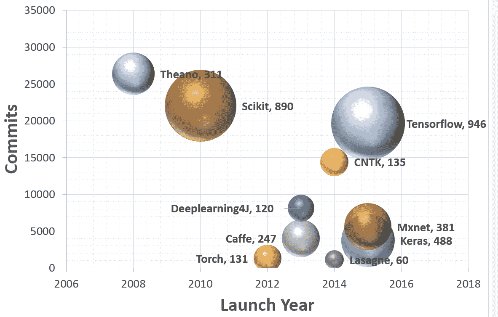
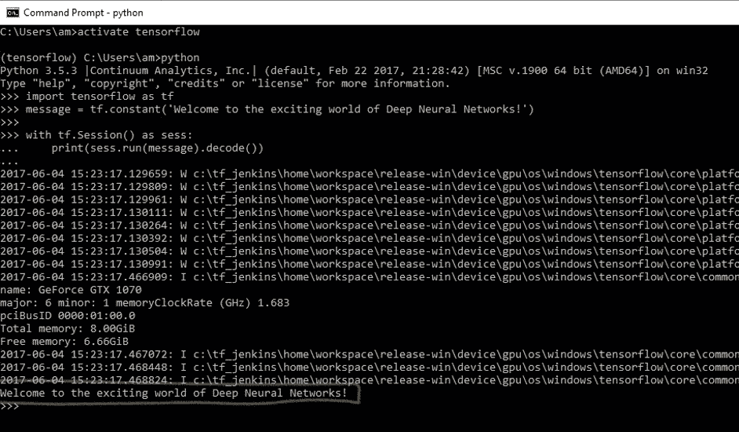
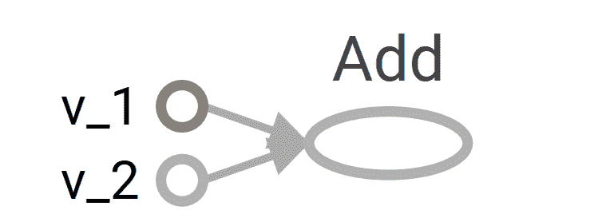
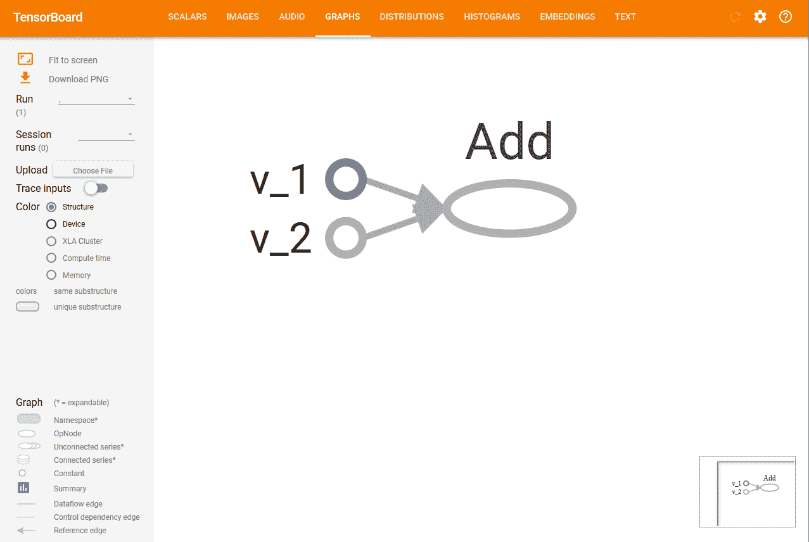
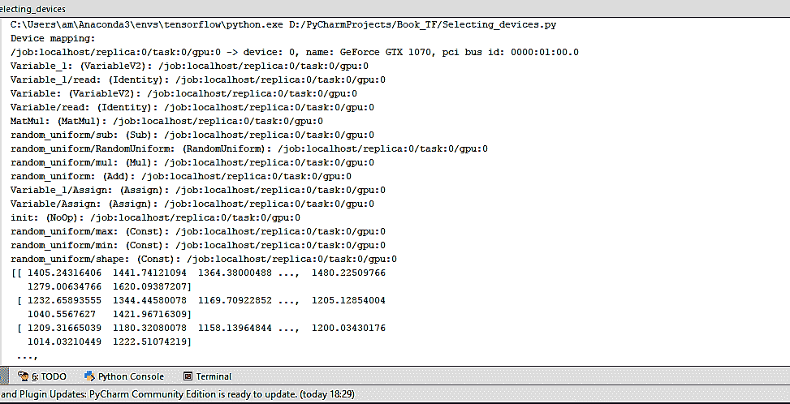
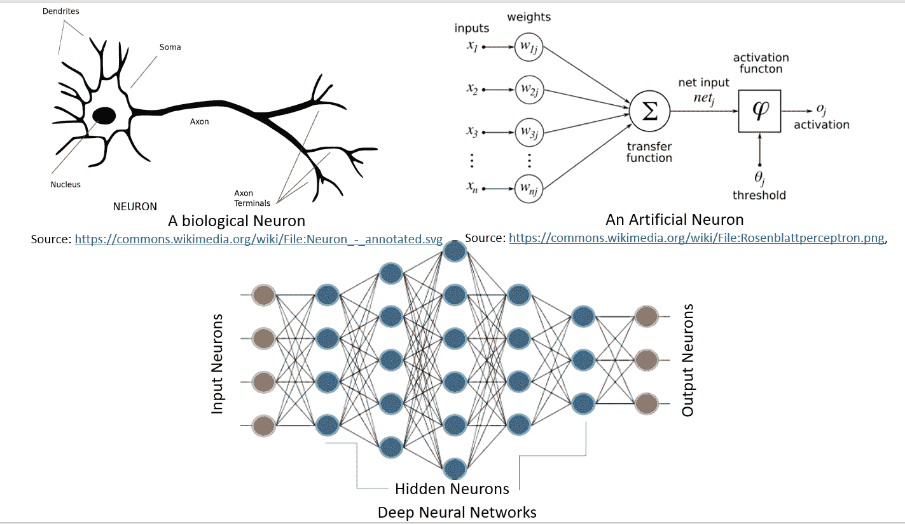

# TensorFlow-简介

曾经尝试仅使用 NumPy 用 Python 编写用于神经网络的代码的任何人都知道它很繁琐。 为一个简单的单层前馈网络编写代码需要 40 条线，这增加了编写代码和执行时间方面的难度。

TensorFlow 使得一切变得更容易，更快捷，从而减少了实现想法与部署之间的时间。 在这本书中，您将学习如何发挥 TensorFlow 的功能来实现深度神经网络。

在本章中，我们将介绍以下主题：

*   安装 TensorFlow
*   TensorFlow 中的 Hello world
*   了解 TensorFlow 程序结构
*   使用常量，变量和占位符
*   使用 TensorFlow 执行矩阵操作
*   使用数据流程图
*   从 0.x 迁移到 1.x
*   使用 XLA 增强计算性能
*   调用 CPU / GPU 设备
*   TensorFlow 用于深度学习
*   基于 DNN 的问题所需的不同 Python 软件包

# 介绍

TensorFlow 是 Google Brain 团队针对**深层神经网络**（**DNN**）开发的功能强大的开源软件库。 它于 2015 年 11 月首次在 Apache 2.x 许可下提供； 截止到今天，其 GitHub 存储库（ [https://github.com/tensorflow/tensorflow](https://github.com/tensorflow/tensorflow) ）提交了超过 17,000 次提交，在短短两年内大约有 845 个贡献者。 这本身就是 TensorFlow 受欢迎程度和性能的衡量标准。 下图显示了流行的深度学习框架的比较，可以明显看出 TensorFlow 是其中的佼佼者：



The Figure is based on data taken from the Github repositories of each as on 12 July 2017\. Each Bubble has a legend: (Framework, contributors).

首先让我们了解 TensorFlow 到底是什么，以及为什么它在 DNN 研究人员和工程师中如此受欢迎。 TensorFlow 是开源深度学习库，它允许使用单个 TensorFlow API 在一个或多个 CPU，服务器，台式机或移动设备上的 GPU 上部署深度神经网络计算。 您可能会问，还有很多其他深度学习库，例如 Torch，Theano，Caffe 和 MxNet。 是什么让 TensorFlow 与众不同？ TensorFlow 等大多数其他深度学习库具有自动区分功能，许多都是开源的，大多数都支持 CPU / GPU 选项，具有经过预训练的模型，并支持常用的 NN 体系结构，例如**循环神经网络**（**RNN**），**卷积神经网络**（**CNN**）和**深度置信网络**（**DBN**）。 那么，TensorFlow 还有什么呢？ 让我们为您列出它们：

*   它适用于所有很酷的语言。 TensorFlow 适用于 Python，C ++，Java，R 和 Go。
*   TensorFlow 可在多个平台上运行，甚至可以移动和分布式。
*   所有云提供商（AWS，Google 和 Azure）都支持它。
*   Keras 是高级神经网络 API，已与 TensorFlow 集成。
*   它具有更好的计算图可视化效果，因为它是本机的，而 Torch / Theano 中的等效视图看上去并不那么酷。
*   TensorFlow 允许模型部署并易于在生产中使用。
*   TensorFlow 具有很好的社区支持。
*   TensorFlow 不仅仅是一个软件库； 它是一套包含 TensorFlow，TensorBoard 和 TensorServing 的软件。

Google 研究博客（ [https://research.googleblog.com/2016/11/celebrating-tensorflows-first-year.html](https://research.googleblog.com/2016/11/celebrating-tensorflows-first-year.html) ）列出了世界各地使用 TensorFlow 进行的一些引人入胜的项目：

*   Google 翻译正在使用 TensorFlow 和**张量处理单元**（**TPU**）
*   可以使用基于强化学习的模型生成旋律的 Magenta 项目采用 TensorFlow
*   澳大利亚海洋生物学家正在使用 TensorFlow 来发现和了解濒临灭绝的海牛
*   一位日本农民使用 TensorFlow 开发了一个应用，该应用使用大小和形状等物理参数对黄瓜进行分类

列表很长，使用 TensorFlow 的可能性更大。 本书旨在向您提供对应用于深度学习模型的 TensorFlow 的理解，以便您可以轻松地将它们适应于数据集并开发有用的应用程序。 每章都包含一组配方，涉及技术问题，依赖项，实际代码及其理解。 我们已经将这些食谱彼此构建在一起，以便在每一章的最后，您都拥有一个功能齐全的深度学习模型。

# 安装 TensorFlow

在本食谱中，您将学习如何在不同的 OS（Linux，Mac 和 Windows）上全新安装 TensorFlow 1.3。 我们将找到安装 TensorFlow 的必要要求。 TensorFlow 可以在 Ubuntu 和 macOS 上使用本机 pip，Anaconda，virtualenv 和 Docker 安装。 对于 Windows 操作系统，可以使用本机 pip 或 Anaconda。

由于 Anaconda 可以在所有三个 OS 上工作，并且提供了一种简便的方法，不仅可以在同一系统上进行安装，还可以在同一系统上维护不同的项目环境，因此在本书中，我们将集中精力使用 Anaconda 安装 TensorFlow。 可从 [https://conda.io/docs/user-guide/index.html](https://conda.io/docs/user-guide/index.html) 阅读有关 Anaconda 及其管理环境的更多详细信息。

本书中的代码已在以下平台上经过测试：

*   Windows 10，Anaconda 3，Python 3.5，TensorFlow GPU，CUDA 工具包 8.0，cuDNN v5.1，NVDIA®GTX 1070
*   Windows 10 / Ubuntu 14.04 / Ubuntu 16.04 / macOS Sierra，Anaconda3，Python 3.5，TensorFlow（CPU）

# 做好准备

TensorFlow 安装的前提条件是系统已安装 Python 2.5 或更高版本。 本书中的食谱是为 Python 3.5（Anaconda 3 发行版）设计的。 要准备安装 TensorFlow，请首先确保已安装 Anaconda。 您可以从 [https://www.continuum.io/downloads](https://www.continuum.io/downloads) 下载并安装适用于 Windows / macOS 或 Linux 的 Anaconda。

安装后，您可以在终端窗口中使用以下命令来验证安装：

```py
conda --version
```

安装 Anaconda 后，我们将继续下一步，确定是安装 TensorFlow CPU 还是 GPU。 尽管几乎所有计算机都支持 TensorFlow CPU，但只有当计算机具有具有 CUDA 计算能力 3.0 或更高版本的 NVDIA®GPU 卡（台式机最低为 NVDIA®GTX 650）时，才能安装 TensorFlow GPU。

**CPU versus GPU: Central Processing Unit** (**CPU**) consists of a few cores (4-8) optimized for sequential serial processing. A **Graphical Processing Unit** (**GPU**) on the other hand has a massively parallel architecture consisting of thousands of smaller, more efficient cores (roughly in 1,000s) designed to handle multiple tasks simultaneously.

对于 TensorFlow GPU，必须安装 CUDA 工具包 7.0 或更高版本，安装正确的 NVDIA®驱动程序，并安装 cuDNN v3 或更高版本。 在 Windows 上，此外，需要某些 DLL 文件。 您可以下载所需的 DLL 文件，也可以安装 Visual Studio C ++。 要记住的另一件事是 cuDNN 文件安装在另一个目录中。 需要确保目录位于系统路径中。 也可以选择将相关文件复制到相应文件夹中的 CUDA 库中。

# 怎么做...

我们按以下步骤进行：

1.  在命令行中使用以下命令创建 conda 环境（如果使用 Windows，最好在命令行中以管理员身份进行操作）：

```py
conda create -n tensorflow python=3.5
```

2.  激活 conda 环境：

```py
# Windows    
activate tensorflow
#Mac OS/ Ubuntu:    
source activate tensorflow

```

3.  该命令应更改提示：

```py
# Windows
(tensorflow)C:>
# Mac OS/Ubuntu    
(tensorflow)$
```

4.  接下来，根据要在 conda 环境中安装的 TensorFlow 版本，输入以下命令：

```py
## Windows
# CPU Version only(tensorflow)C:>pip install --ignore-installed --upgrade https://storage.googleapis.com/tensorflow/windows/cpu/tensorflow-1.3.0cr2-cp35-cp35m-win_amd64.whl

# GPU Version  
(tensorflow)C:>pip install --ignore-installed --upgrade https://storage.googleapis.com/tensorflow/windows/gpu/tensorflow_gpu-1.3.0cr2-cp35-cp35m-win_amd64.whl
```

```py
## Mac OS
# CPU only Version
(tensorflow)$ pip install --ignore-installed --upgrade https://storage.googleapis.com/tensorflow/mac/cpu/tensorflow-1.3.0cr2-py3-none-any.whl# GPU version(tensorflow)$ pip install --ignore-installed --upgrade https://storage.googleapis.com/tensorflow/mac/gpu/tensorflow_gpu-1.3.0cr2-py3-none-any.whl
```

```py
## Ubuntu# CPU only Version(tensorflow)$ pip install --ignore-installed --upgrade https://storage.googleapis.com/tensorflow/linux/cpu/tensorflow-1.3.0cr2-cp35-cp35m-linux_x86_64.whl# GPU Version
(tensorflow)$ pip install --ignore-installed --upgrade https://storage.googleapis.com/tensorflow/linux/gpu/tensorflow_gpu-1.3.0cr2-cp35-cp35m-linux_x86_64.whl
```

5.  在命令行上，输入`python`。
6.  编写以下代码：

```py
import tensorflow as tf
message = tf.constant('Welcome to the exciting world of Deep Neural Networks!')
with tf.Session() as sess:
    print(sess.run(message).decode())
```

7.  您将收到以下输出：



8.  在 Windows 上使用命令`deactivate`在 MAC / Ubuntu 上使用`source deactivate`在命令行上禁用 conda 环境。

# 这个怎么运作...

Google 使用 Wheels 标准分发 TensorFlow。 它是具有`.whl`扩展名的 ZIP 格式存档。 Anaconda 3 中的默认 Python 解释器 Python 3.6 没有安装轮子。 在撰写本书时，仅对 Linux / Ubuntu 支持 Python 3.6。 因此，在创建 TensorFlow 环境时，我们指定了 Python 3.5。 这将在名为`tensorflow`的 conda 环境中安装 pip，python 和 wheel 以及其他一些软件包。

创建 conda 环境后，可使用`source activate/activate`命令激活该环境。 在激活的环境中，将`pip install`命令与适当的 TensorFlow-API URL 配合使用以安装所需的 TensorFlow。 尽管存在使用 Conda forge 安装 TensorFlow CPU 的 Anaconda 命令，但 TensorFlow 文档建议使用`pip install`。 在 conda 环境中安装 TensorFlow 之后，我们可以将其停用。 现在您可以执行第一个 TensorFlow 程序了。

程序运行时，您可能会看到一些警告（W）消息，一些信息（I）消息以及最后的代码输出：

```py
Welcome to the exciting world of Deep Neural Networks!
```

恭喜您成功安装并执行了第一个 TensorFlow 代码！ 在下一个食谱中，我们将更深入地研究代码。

# 还有更多...

此外，您还可以安装 Jupyter 笔记本：

1.  如下安装`ipython`：

```py
conda install -c anaconda ipython

```

2.  安装`nb_conda_kernels`：

```py
conda install -channel=conda-forge nb_conda_kernels

```

3.  启动`Jupyter notebook`：

```py
jupyter notebook 
```

This will result in the opening of a new browser window.

如果您的系统上已经安装了 TensorFlow，则可以使用`pip install --upgrade tensorflow`对其进行升级。

# TensorFlow 中的 Hello world

您学习用任何计算机语言编写的第一个程序是 Hello world。 我们在本书中保持约定，并从 Hello world 程序开始。 我们在上一节中用于验证 TensorFlow 安装的代码如下：

```py
import tensorflow as tf
message = tf.constant('Welcome to the exciting world of Deep Neural Networks!')
 with tf.Session() as sess:
     print(sess.run(message).decode()) 
```

让我们深入研究这个简单的代码。

# 怎么做...

1.  导入`tensorflow`会导入 TensorFlow 库，并允许您使用其出色的功能。

```py
 import tensorflow as tf 
```

2.  由于我们要打印的消息是一个常量字符串，因此我们使用`tf.constant`：

```py
message = tf.constant('Welcome to the exciting world of Deep Neural Networks!')

```

3.  要执行 graph 元素，我们需要使用`with`定义 Session 并使用`run`运行会话：

```py
with tf.Session() as sess:
     print(sess.run(message).decode()) 
```

4.  根据您的计算机系统和操作系统，输出包含一系列警告消息（W），声称如果针对您的特定计算机进行编译，代码可以更快地运行：

```py
The TensorFlow library wasn't compiled to use SSE instructions, but these are available on your machine and could speed up CPU computations. 
The TensorFlow library wasn't compiled to use SSE2 instructions, but these are available on your machine and could speed up CPU computations. 
The TensorFlow library wasn't compiled to use SSE3 instructions, but these are available on your machine and could speed up CPU computations. 
The TensorFlow library wasn't compiled to use SSE4.1 instructions, but these are available on your machine and could speed up CPU computations. 
The TensorFlow library wasn't compiled to use SSE4.2 instructions, but these are available on your machine and could speed up CPU computations. 
The TensorFlow library wasn't compiled to use AVX instructions, but these are available on your machine and could speed up CPU computations. 
The TensorFlow library wasn't compiled to use AVX2 instructions, but these are available on your machine and could speed up CPU computations. 
The TensorFlow library wasn't compiled to use FMA instructions, but these are available on your machine and could speed up CPU computations. 
```

5.  如果您正在使用 TensorFlow GPU，则还会获得信息性消息列表（I），其中提供了所用设备的详细信息：

```py
Found device 0 with properties:  
name: GeForce GTX 1070 
major: 6 minor: 1 memoryClockRate (GHz) 1.683 
pciBusID 0000:01:00.0 
Total memory: 8.00GiB 
Free memory: 6.66GiB 
DMA: 0  
0:   Y  
Creating TensorFlow device (/gpu:0) -> (device: 0, name: GeForce GTX 1070, pci bus id: 0000:01:00.0) 
```

6.  最后是我们要求在会话中打印的消息：

```py
Welcome to the exciting world of Deep Neural Networks
```

# 这个怎么运作...

前面的代码分为三个主要部分。 **导入块**包含我们的代码将使用的所有库； 在当前代码中，我们仅使用 TensorFlow。 `import tensorflow as tf`语句使 Python 可以访问所有 TensorFlow 的类，方法和符号。 第二块包含图形定义部分； 在这里，我们建立了所需的计算图。 在当前情况下，我们的图仅由一个节点组成，张量常数消息由字节字符串`"Welcome to the exciting world of Deep Neural Networks"`组成。 我们代码的第三部分是**作为会话运行计算图**； 我们使用`with`关键字创建了一个会话。 最后，在会话中，我们运行上面创建的图。

现在让我们了解输出。 收到的警告消息告诉您，TensorFlow 代码可能会以更高的速度运行，这可以通过从源代码安装 TensorFlow 来实现（我们将在本章稍后的内容中进行此操作）。 收到的信息消息会通知您有关用于计算的设备。 对它们而言，这两种消息都相当无害，但是如果您不希望看到它们，则添加以下两行代码即可解决问题：

```py
import os
os.environ['TF_CPP_MIN_LOG_LEVEL']='2'   
```

该代码将忽略直到级别 2 的所有消息。级别 1 用于提供信息，级别 2 用于警告，级别 3 用于错误消息。

程序将打印运行图形的结果，该图形是使用`sess.run()`语句运行的。 运行图形的结果将馈送到`print`函数，可使用`decode`方法对其进行进一步修改。 `sess.run`评估消息中定义的张量。 `print`功能在`stdout`上打印评估结果：

```py
b'Welcome to the exciting world of Deep Neural Networks' 
```

这表示结果是`byte string`。 要删除字符串引号和`b`（用于**字节**），我们使用方法`decode()`。

# 了解 TensorFlow 程序结构

TensorFlow 与其他编程语言非常不同。 我们首先需要为要创建的任何神经网络构建一个蓝图。 这是通过将程序分为两个独立的部分来完成的，即计算图的定义及其执行。 首先，这对于常规程序员而言似乎很麻烦，但是执行图与图定义的这种分离赋予了 TensorFlow 强大的力量，即可以在多个平台上工作和并行执行的能力。

**计算图**：计算图是节点和边的网络。 在本节中，定义了所有要使用的数据，即张量对象（常量，变量和占位符）和所有要执行的计算，即操作对象（简称为 ops）。 每个节点可以有零个或多个输入，但只有一个输出。 网络中的节点表示对象（张量和运算），边缘表示在运算之间流动的张量。 计算图定义了神经网络的蓝图，但其中的张量尚无与其关联的值。

为了构建计算图，我们定义了我们需要执行的所有常量，变量和操作。 常量，变量和占位符将在下一个配方中处理。 数学运算将在矩阵处理的配方中详细介绍。 在这里，我们使用一个简单的示例来描述结构，该示例定义并执行图以添加两个向量。

**图形的执行**：使用会话对象执行图形的执行。 *会话对象封装了评估张量和操作对象的环境*。 这是实际计算和信息从一层传输到另一层的地方。 不同张量对象的值仅初始化，访问并保存在会话对象中。 到目前为止，张量对象仅仅是抽象的定义，在这里它们就变成了现实。

# 怎么做...

我们按以下步骤进行：

1.  我们考虑一个简单的例子，将两个向量相加，我们有两个输入向量`v_1`和`v_2`，它们将被作为`Add`操作的输入。 我们要构建的图形如下：



2.  定义计算图的相应代码如下：

```py
v_1 = tf.constant([1,2,3,4]) 
v_2 = tf.constant([2,1,5,3]) 
v_add = tf.add(v_1,v_2)  # You can also write v_1 + v_2 instead 
```

3.  接下来，我们在会话中执行图：

```py
with tf.Session() as sess: 
    prin(sess.run(v_add)) 
```

上面的两个命令等效于以下代码。 使用`with`块的优点是不需要显式关闭会话。

```py
sess = tf.Session() 
print(ses.run(tv_add)) 
sess.close() 
```

4.  这导致打印两个向量的和：

```py
[3 3 8 7] 
```

Remember that each Session needs to be explicitly closed using the `close()` method, `with` block implicitly closes the session when it ends.

# 这个怎么运作...

计算图的构建非常简单； 您将继续添加变量和运算，并按照您逐层构建神经网络的顺序将它们传递（使张量流动）。 TensorFlow 还允许您使用`with tf.device()`将特定设备（CPU / GPU）与计算图的不同对象一起使用。 在我们的示例中，计算图由三个节点组成，`v_1`和`v_2`代表两个向量，`Add`是对其执行的操作。

现在，要使该图更生动，我们首先需要使用`tf.Session()`定义一个会话对象； 我们给会话对象起了名字`sess`。 接下来，我们使用 Session 类中定义的`run`方法运行它，如下所示：

```py
run (fetches, feed_dict=None, options=None, run_metadata) 
```

这将评估`fetches`中的张量； 我们的示例在提取中具有张量`v_add`。 `run`方法将执行导致`v_add`的图形中的每个张量和每个操作。 如果您在提取中包含`v_1`而不是`v_add`，则结果将是向量`v_1`的值：

```py
[1,2,3,4]  
```

访存可以是单个张量/运算对象，也可以是多个张量/操作对象，例如，如果访存为`[v_1, v_2, v_add]`，则输出将为以下内容：

```py
[array([1, 2, 3, 4]), array([2, 1, 5, 3]), array([3, 3, 8, 7])] 
```

在同一程序代码中，我们可以有许多会话对象。

# 还有更多...

您一定想知道为什么我们必须编写这么多行代码才能进行简单的矢量加法或打印一条小消息。 好吧，您可以很方便地以单线方式完成此工作：

```py
print(tf.Session().run(tf.add(tf.constant([1,2,3,4]),tf.constant([2,1,5,3])))) 
```

编写这种类型的代码不仅会影响计算图，而且在 for 循环中重复执行相同的操作（OP）时可能会占用大量内存。 养成显式定义所有张量和操作对象的习惯，不仅使代码更具可读性，而且还有助于您以更简洁的方式可视化计算图。

Visualizing the graph using TensorBoard is one of the most useful capabilities of TensorFlow, especially when building complicated neural networks. The computational graph that we built can be viewed with the help of Graph Object.

如果您正在使用 Jupyter Notebook 或 Python Shell，则使用`tf.InteractiveSession`代替`tf.Session`更为方便。 `InteractiveSession`使其成为默认会话，因此您可以使用`eval()`直接调用运行张量对象，而无需显式调用该会话，如以下示例代码中所述：

```py
sess = tf.InteractiveSession() 

v_1 = tf.constant([1,2,3,4]) 
v_2 = tf.constant([2,1,5,3]) 

v_add = tf.add(v_1,v_2) 

print(v_add.eval()) 

sess.close() 
```

# 使用常量，变量和占位符

用最简单的术语讲，TensorFlow 提供了一个库来定义和执行带有张量的不同数学运算。 张量基本上是 n 维矩阵。 所有类型的数据，即标量，向量和矩阵都是张量的特殊类型：

| **数据类型** | **张量** | **形状** |
| 标量 | 0 维张量 | [] |
| 向量 | 一维张量 | [D <sub>0</sub> ] |
| 矩阵 | 二维张量 | [D <sub>0</sub> ，D <sub>1</sub> ] |
| 张量 | N-D 张量 | [D <sub>0</sub> ，D <sub>1</sub> ，.... D <sub>n-1</sub> ] |

TensorFlow 支持三种类型的张量：

*   常数
*   变数
*   占位符

**常量**：常数是无法更改其值的张量。

**变量**：当值需要在会话中更新时，我们使用变量张量。 例如，在神经网络的情况下，需要在训练期间更新权重，这是通过将权重声明为变量来实现的。 在使用之前，需要对变量进行显式初始化。 另一个要注意的重要事项是常量存储在计算图定义中。 每次加载图形时都会加载它们。 换句话说，它们是昂贵的内存。 另一方面，变量是分开存储的。 它们可以存在于参数服务器上。

**占位符**：这些占位符用于将值输入 TensorFlow 图。 它们与`feed_dict`一起用于输入数据。 它们通常用于在训练神经网络时提供新的训练示例。 在会话中运行图形时，我们为占位符分配一个值。 它们使我们无需数据即可创建操作并构建计算图。 需要注意的重要一点是，占位符不包含任何数据，因此也无需初始化它们。

# 怎么做...

让我们从常量开始：

1.  我们可以声明一个标量常量：

```py
t_1 = tf.constant(4)   
```

2.  形状为[1,3]的常数向量可以声明如下：

```py
t_2 = tf.constant([4, 3, 2]) 
```

3.  为了创建一个所有元素都为零的张量，我们使用`tf.zeros()`。 该语句创建一个形状为`[M,N]`和`dtype`的零矩阵（`int32`，`float32`等）：

```py
tf.zeros([M,N],tf.dtype)   
```

让我们举个例子：

```py
zero_t = tf.zeros([2,3],tf.int32) 
# Results in an 2×3 array of zeros: [[0 0 0], [0 0 0]] 
```

4.  我们还可以创建与现有 Numpy 数组形状相同的张量常数或张量常数，如下所示：

```py
tf.zeros_like(t_2) 
# Create a zero matrix of same shape as t_2  
tf.ones_like(t_2) 
# Creates a ones matrix of same shape as t_2
```

5.  我们可以将所有元素设置为一个来创建张量； 在这里，我们创建一个形状为`[M,N]`的 1 矩阵：

```py
tf.ones([M,N],tf.dtype) 
```

让我们举个例子：

```py
ones_t = tf.ones([2,3],tf.int32) 
# Results in an 2×3 array of ones:[[1 1 1], [1 1 1]] 
```

让我们继续序列：

1.  我们可以在总的 num 值内生成从开始到结束的一系列均匀间隔的向量：

```py
tf.linspace(start, stop, num) 
```

2.  相应的值相差`(stop-start)/(num-1)`。
3.  让我们举个例子：

```py
range_t = tf.linspace(2.0,5.0,5) 
# We get: [ 2\.    2.75  3.5   4.25  5\.  ]  
```

4.  从头开始生成一系列数字（默认值= 0），以增量递增（默认值= 1），直到但不包括限制：

```py
tf.range(start,limit,delta) 
```

这是一个例子：

```py
range_t = tf.range(10) 
# Result: [0 1 2 3 4 5 6 7 8 9] 

```

TensorFlow 允许创建具有不同分布的**随机张量**：

1.  要根据形状为`[M,N]`的正态分布创建随机值，其中均值（默认值= 0.0），标准差（默认值= 1.0），种子，我们可以使用以下方法：

```py
t_random = tf.random_normal([2,3], mean=2.0, stddev=4, seed=12) 

# Result: [[ 0.25347459  5.37990952  1.95276058], [-1.53760314  1.2588985   2.84780669]]
```

2.  要从形状为`[M,N]`的截断正态分布（带有平均值（默认值= 0.0）和带有种子的标准偏差（默认值= 1.0））创建随机值，我们可以使用以下方法：

```py
t_random = tf.truncated_normal([1,5], stddev=2, seed=12) 
# Result: [[-0.8732627 1.68995488 -0.02361972 -1.76880157 -3.87749004]]
```

3.  要根据给定的形状`[M,N]`的伽玛分布在`[minval (default=0), maxval]`范围内创建带有种子的随机值，请执行以下操作：

```py
t_random = tf.random_uniform([2,3], maxval=4, seed=12) 

# Result: [[ 2.54461002  3.69636583  2.70510912], [ 2.00850058  3.84459829  3.54268885]] 
```

4.  要将给定张量随机裁剪为指定大小，请执行以下操作：

```py
tf.random_crop(t_random, [2,5],seed=12) 
```

在这里，`t_random`是已经定义的张量。 这将导致从张量`t_random`中随机裁剪出`[2,5]`张量。

很多时候，我们需要以随机顺序展示训练样本； 我们可以使用`tf.random_shuffle()`沿其第一维随机调整张量。 如果`t_random`是我们想要改组的张量，那么我们使用以下代码：

```py
tf.random_shuffle(t_random) 
```

5.  随机生成的张量受初始种子值的影响。 为了在多个运行或会话中获得相同的随机数，应将种子设置为恒定值。 当使用大量随机张量时，我们可以使用`tf.set_random_seed()`为所有随机生成的张量设置种子。 以下命令将所有会话的随机张量的种子设置为`54`：

```py
tf.set_random_seed(54)  
```

Seed can have only integer value.

现在转到变量：

1.  它们是使用变量类创建的。 变量的定义还包括应从中初始化变量的常数/随机值。 在下面的代码中，我们创建两个不同的张量变量`t_a`和`t_b`。 都将初始化为形状为`[50, 50]`，`minval=0`和`maxval=10`的随机均匀分布：

```py
rand_t = tf.random_uniform([50,50], 0, 10, seed=0) 
t_a = tf.Variable(rand_t) 
t_b = tf.Variable(rand_t) 
```

Variables are often used to represent weights and biases in a neural network.

2.  在下面的代码中，我们定义了两个变量权重和偏差。 权重变量使用正态分布随机初始化，均值为零，标准差为 2，权重的大小为 100×100。 偏差由 100 个元素组成，每个元素都初始化为零。 在这里，我们还使用了可选的参数名称来为计算图中定义的变量命名。

```py
weights = tf.Variable(tf.random_normal([100,100],stddev=2)) 
bias = tf.Variable(tf.zeros[100], name = 'biases') 
```

3.  在所有前面的示例中，变量的初始化源都是某个常量。 我们还可以指定一个要从另一个变量初始化的变量。 以下语句将从先前定义的权重中初始化`weight2`：

```py
weight2=tf.Variable(weights.initialized_value(), name='w2') 
```

4.  变量的定义指定如何初始化变量，但是我们必须显式初始化所有声明的变量。 在计算图的定义中，我们通过声明一个初始化操作对象来实现：

```py
intial_op = tf.global_variables_initializer(). 
```

5.  在运行图中，还可以使用`tf.Variable.initializer`分别初始化每个变量：

```py
bias = tf.Variable(tf.zeros([100,100]))
 with tf.Session() as sess:
     sess.run(bias.initializer)
```

6.  **保存变量**：我们可以使用`Saver`类保存变量。 为此，我们定义一个`saver`操作对象：

```py
saver = tf.train.Saver()  
```

7.  在常量和变量之后，我们来到最重要的元素占位符，它们用于将数据馈入图形。 我们可以使用以下内容定义占位符：

```py
tf.placeholder(dtype, shape=None, name=None) 
```

8.  `dtype`指定占位符的数据类型，并且在声明占位符时必须指定。 在这里，我们为`x`定义一个占位符，并使用`feed_dict`为随机 4×5 矩阵计算`y = 2 * x`：

```py
x = tf.placeholder("float")
y = 2 * x
data = tf.random_uniform([4,5],10)
with tf.Session() as sess:
     x_data = sess.run(data)
     print(sess.run(y, feed_dict = {x:x_data})) 

```

# 这个怎么运作...

All constants, variables, and placeholders will be defined in the computation graph section of the code. If we use the print statement in the definition section, we will only get information about the type of tensor, and not its value.

为了找出该值，我们需要创建会话图，并显式使用`run`命令，并将所需的张量值设为`fetches`：

```py
print(sess.run(t_1))  
# Will print the value of t_1 defined in step 1 
```

# 还有更多...

很多时候，我们将需要恒定的大尺寸张量对象。 在这种情况下，为了优化内存，最好将它们声明为具有可训练标志设置为`False`的变量：

```py
t_large = tf.Variable(large_array, trainable = False) 
```

TensorFlow 的设计可完美地与 Numpy 配合使用，因此所有 TensorFlow 数据类型均基于 Numpy 的数据类型。 使用`tf.convert_to_tensor()`，我们可以将给定值转换为张量类型，并将其与 TensorFlow 函数和运算符一起使用。 该函数接受 Numpy 数组，Python 列表和 Python 标量，并允许与张量对象互操作。

下表列出了一些常见的 TensorFlow 支持的数据类型（摘自 [TensorFlow.org](http://TensorFlow.org) ）：

| **数据类型** | **TensorFlow 类型** |
| `DT_FLOAT` | `tf.float32` |
| `DT_DOUBLE` | `tf.float64` |
| `DT_INT8` | `tf.int8` |
| `DT_UINT8` | `tf.uint8` |
| `DT_STRING` | `tf.string` |
| `DT_BOOL` | `tf.bool` |
| `DT_COMPLEX64` | `tf.complex64` |
| `DT_QINT32` | `tf.qint32` |

请注意，与 Python / Numpy 序列不同，TensorFlow 序列不可​​迭代。 尝试以下代码：

```py
for i in tf.range(10)  
```

您会得到一个错误：

```py
#TypeError("'Tensor' object is not iterable.")
```

# 使用 TensorFlow 执行矩阵操作

矩阵运算（例如执行乘法，加法和减法）是任何神经网络中信号传播中的重要运算。 通常在计算中，我们需要随机，零，一或恒等矩阵。

本食谱将向您展示如何获取不同类型的矩阵以及如何对它们执行不同的矩阵操作。

# 怎么做...

我们按以下步骤进行：

1.  我们开始一个交互式会话，以便可以轻松评估结果：

```py
import tensorflow as tf

#Start an Interactive Session
sess = tf.InteractiveSession()

#Define a 5x5 Identity matrix
I_matrix = tf.eye(5)
print(I_matrix.eval()) 
# This will print a 5x5 Identity matrix

#Define a Variable initialized to a 10x10 identity matrix
X = tf.Variable(tf.eye(10))
X.initializer.run()  # Initialize the Variable
print(X.eval()) 
# Evaluate the Variable and print the result

#Create a random 5x10 matrix
A = tf.Variable(tf.random_normal([5,10]))
A.initializer.run()

#Multiply two matrices
product = tf.matmul(A, X)
print(product.eval())

#create a random matrix of 1s and 0s, size 5x10
b = tf.Variable(tf.random_uniform([5,10], 0, 2, dtype= tf.int32))
b.initializer.run()
print(b.eval())
b_new = tf.cast(b, dtype=tf.float32)
#Cast to float32 data type

# Add the two matrices
t_sum = tf.add(product, b_new)
t_sub = product - b_new
print("A*X _b\n", t_sum.eval())
print("A*X - b\n", t_sub.eval()) 

```

2.  可以按以下方式执行其他一些有用的矩阵操作，例如按元素进行乘法，与标量相乘，按元素进行除法，按元素进行除法的余数：

```py
import tensorflow as tf

# Create two random matrices
a = tf.Variable(tf.random_normal([4,5], stddev=2))
b = tf.Variable(tf.random_normal([4,5], stddev=2))

#Element Wise Multiplication
A = a * b

#Multiplication with a scalar 2
B = tf.scalar_mul(2, A)

# Elementwise division, its result is
C = tf.div(a,b)

#Element Wise remainder of division
D = tf.mod(a,b)

init_op = tf.global_variables_initializer()
with tf.Session() as sess:
     sess.run(init_op)
     writer = tf.summary.FileWriter('graphs', sess.graph)
     a,b,A_R, B_R, C_R, D_R = sess.run([a , b, A, B, C, D])
     print("a\n",a,"\nb\n",b, "a*b\n", A_R, "\n2*a*b\n", B_R, "\na/b\n", C_R, "\na%b\n", D_R)

writer.close() 
```

`tf.div` returns a tensor of the same type as the first argument.

# 这个怎么运作...

矩阵的所有算术运算（例如加，乘，除，乘（元素乘），mod 和叉）都要求两个张量矩阵的数据类型相同。 如果不是这样，它们将产生错误。 我们可以使用`tf.cast()`将张量从一种数据类型转换为另一种数据类型。

# 还有更多...

如果我们要在整数张量之间进行除法，最好使用`tf.truediv(a,b)`，因为它首先将整数张量强制转换为浮点，然后执行逐元素除法。

# 使用数据流程图

TensorFlow 使用 TensorBoard 提供计算图的图形图像。 这使得理解，调试和优化复杂的神经网络程序变得很方便。 TensorBoard 还可以提供有关网络执行情况的定量指标。 它读取 TensorFlow 事件文件，其中包含您在运行 TensorFlow 会话时生成的摘要数据。

# 怎么做...

1.  使用 TensorBoard 的第一步是确定您想要的 OP 摘要。 对于 DNN，习惯上要知道损耗项（目标函数）如何随时间变化。 在自适应学习率的情况下，学习率本身随时间变化。 我们可以在`tf.summary.scalar` OP 的帮助下获得所需术语的摘要。 假设变量损失定义了误差项，并且我们想知道它是如何随时间变化的，那么我们可以这样做，如下所示：

```py
loss = tf... 
tf.summary.scalar('loss', loss) 
```

2.  您还可以使用`tf.summary.histogram`可视化特定图层的梯度，权重甚至输出的分布：

```py
output_tensor  = tf.matmul(input_tensor, weights) + biases 
tf.summary.histogram('output', output_tensor)
```

3.  摘要将在会话期间生成。 您可以在计算图中定义`tf.merge_all_summaries` OP，而不用单独执行每个摘要操作，以便一次运行即可获得所有摘要。
4.  然后需要使用`tf.summary.Filewriter`将生成的摘要写入事件文件：

```py
writer = tf.summary.Filewriter('summary_dir', sess.graph) 
```

5.  这会将所有摘要和图形写入`'summary_dir'`目录。
6.  现在，要可视化摘要，您需要从命令行调用 TensorBoard：

```py
tensorboard --logdir=summary_dir 
```

7.  接下来，打开浏览器并输入地址`http://localhost:6006/`（或运行 TensorBoard 命令后收到的链接）。
8.  您将看到类似以下的内容，顶部带有许多选项卡。 图表标签会显示图表：



# 从 0.x 迁移到 1.x

TensorFlow 1.x 不提供向后兼容性。 这意味着适用于 TensorFlow 0.x 的代码可能不适用于 TensorFlow 1.0。 因此，如果您有适用于 TensorFlow 0.x 的代码，则需要对其进行升级（旧的 GitHub 存储库或您自己的代码）。 本食谱将指出 TensorFlow 0.x 和 TensorFlow 1.0 之间的主要区别，并向您展示如何使用脚本`tf_upgrade.py`自动升级 TensorFlow 1.0 的代码。

# 怎么做...

这是我们进行食谱的方法：

1.  首先，从 [https://github.com/tensorflow/tensorflow/tree/master/tensorflow/tools/compatibility](https://github.com/tensorflow/tensorflow/tree/master/tensorflow/tools/compatibility) 下载`tf_upgrade.py`。
2.  如果要将一个文件从 TensorFlow 0.x 转换为 TensorFlow 1.0，请在命令行中使用以下命令：

```py
python tf_upgrade.py --infile old_file.py --outfile upgraded_file.py

```

3.  例如，如果您有一个名为`test.py`的 TensorFlow 程序文件，则将使用以下命令，如下所示：

```py
python tf_upgrade.py --infile test.py --outfile test_1.0.py
```

4.  这将导致创建一个名为`test_1.0.py`的新文件。
5.  如果要迁移目录的所有文件，请在命令行中使用以下命令：

```py
python tf_upgrade.py --intree InputDIr --outtree OutputDir
 # For example, if you have a directory located at /home/user/my_dir you can migrate all the python files in the directory located at /home/user/my-dir_1p0 using the above command as:
python tf_upgrade.py --intree /home/user/my_dir --outtree /home/user/my_dir_1p0
```

6.  在大多数情况下，该目录还包含数据集文件。 您可以使用以下方法确保将非 Python 文件也复制到新目录（上例中为`my-dir_1p0`）：

```py
python tf_upgrade.py --intree /home/user/my_dir --outtree /home/user/my_dir_1p0 -copyotherfiles True

```

7.  在所有这些情况下，都会生成一个`report.txt`文件。 该文件包含转换的详细信息以及过程中的任何错误。
8.  读取`report.txt`文件，然后手动升级脚本无法更新的部分代码。

# 还有更多...

`tf_upgrade.py`具有某些限制：

*   它不能更改`tf.reverse()`的参数：您将必须手动修复它
*   对于参数列表重新排序的方法，例如`tf.split()`和`tf.reverse_split()`，它将尝试引入关键字参数，但实际上无法对其重新排序
*   您将必须手动将`tf.get.variable_scope().reuse_variables()`之类的结构替换为以下内容：

```py
with tf.variable_scope(tf.get_variable_scope(), resuse=True):
```

# 使用 XLA 增强计算性能

**加速线性代数**（**XLA**）是线性代数的特定领域编译器。 根据 [https://www.tensorflow.org/performance/xla/](https://www.tensorflow.org/performance/xla/) 的说法，它仍处于实验阶段，可用于优化 TensorFlow 计算。 它可以提高服务器和移动平台上的执行速度，内存使用率和可移植性。 它提供双向 **JIT**（**即时**）编译或 **AoT**（**预先**）编译。 使用 XLA，您可以生成平台相关的二进制文件（适用于 x64，ARM 等大量平台），可以针对内存和速度进行优化。

# 做好准备

目前，XLA 不包含在 TensorFlow 的二进制发行版中。 需要从源代码构建它。 要从源代码构建 TensorFlow，需要具备 LLVM 和 Bazel 以及 TensorFlow 的知识。 [TensorFlow.org](http://TensorFlow.org) 仅在 MacOS 和 Ubuntu 中支持从源代码构建。 从源代码构建 TensorFlow 所需的步骤如下（ [https://www.tensorflow.org/install/install_sources](https://www.tensorflow.org/install/install_sources) ）：

1.  确定要安装的 TensorFlow-仅具有 CPU 支持的 TensorFlow 或具有 GPU 支持的 TensorFlow。
2.  克隆 TensorFlow 存储库：

```py
git clone https://github.com/tensorflow/tensorflow 
cd tensorflow 
git checkout Branch #where Branch is the desired branch  
```

3.  安装以下依赖项：

4.  配置安装。 在此步骤中，您需要选择不同的选项，例如 XLA，Cuda 支持，动词等等：

```py
./configure 
```

5.  接下来，使用 bazel-build：
6.  对于仅 CPU 版本，请使用：

```py
bazel build --config=opt //tensorflow/tools/pip_package:build_pip_package

```

7.  如果您有兼容的 GPU 设备，并且需要 GPU 支持，请使用：

```py
bazel build --config=opt --config=cuda //tensorflow/tools/pip_package:build_pip_package

```

8.  成功运行后，您将获得一个脚本`build_pip_package`。
9.  如下运行此脚本以构建`whl`文件：

```py
bazel-bin/tensorflow/tools/pip_package/build_pip_package /tmp/tensorflow_pkg
```

10.  安装`pip`软件包：

```py
sudo pip install /tmp/tensorflow_pkg/tensorflow-1.1.0-py2-none-any.whl

```

现在您可以开始了。

# 怎么做...

TensorFlow 生成 TensorFlow 图。 借助 XLA，可以在任何新型设备上运行 TensorFlow 图。

1.  **JIT 编译**：这将在会话级别打开 JIT 编译：

```py
# Config to turn on JIT compilation
 config = tf.ConfigProto()
 config.graph_options.optimizer_options.global_jit_level = tf.OptimizerOptions.ON_1

 sess = tf.Session(config=config) 
```

2.  这是为了手动打开 JIT 编译：

```py
jit_scope = tf.contrib.compiler.jit.experimental_jit_scope

x = tf.placeholder(np.float32)
with jit_scope():
   y = tf.add(x, x)  # The "add" will be compiled with XLA. 
```

3.  我们还可以通过将运算符放在特定的 XLA 设备`XLA_CPU`或`XLA_GPU`上，通过 XLA 运行计算：

```py
with tf.device \ ("/job:localhost/replica:0/task:0/device:XLA_GPU:0"):
   output = tf.add(input1, input2) 
```

**AoT 编译**：在这里，我们将 tfcompile 作为独立版本将 TensorFlow 图转换为适用于不同设备（移动设备）的可执行代码。

TensorFlow.org 讲述了 tfcompile：

tfcompile takes a subgraph, identified by the TensorFlow concepts of feeds and fetches, and generates a function that implements that subgraph. The feeds are the input arguments for the function, and the fetches are the output arguments for the function. All inputs must be fully specified by the feeds; the resulting pruned subgraph cannot contain placeholder or variable nodes. It is common to specify all placeholders and variables as feeds, which ensures the resulting subgraph no longer contains these nodes. The generated function is packaged as a cc_library, with a header file exporting the function signature, and an object file containing the implementation. The user writes code to invoke the generated function as appropriate.

有关执行此操作的高级步骤，可以参考 [https://www.tensorflow.org/performance/xla/tfcompile](https://www.tensorflow.org/performance/xla/tfcompile) 。

# 调用 CPU / GPU 设备

TensorFlow 支持 CPU 和 GPU。 它还支持分布式计算。 我们可以在一台或多台计算机系统中的多个设备上使用 TensorFlow。 TensorFlow 将支持的设备命名为 CPU 设备的`"/device:CPU:0"`（或`"/cpu:0"`），将第 i <sup>个</sup> GPU 的设备命名为`"/device:GPU:I"`（或`"/gpu:I"`）。

如前所述，GPU 比 CPU 快得多，因为它们具有许多小型内核。 但是，就计算速度而言，将 GPU 用于所有类型的计算并不总是一个优势。 与 GPU 相关的开销有时可能比 GPU 提供的并行计算的优势在计算上更为昂贵。 为了解决这个问题，TensorFlow 规定将计算放在特定的设备上。 默认情况下，如果同时存在 CPU 和 GPU，则 TensorFlow 会优先考虑 GPU。

# 怎么做...

TensorFlow 将设备表示为字符串。 在这里，我们将向您展示如何在 TensorFlow 中手动分配用于矩阵乘法的设备。 为了验证 TensorFlow 确实在使用指定的设备（CPU 或 GPU），我们使用`log_device_placement`标志设置为`True`，即`config=tf.ConfigProto(log_device_placement=True)`创建会话：

1.  如果您不确定设备并希望 TensorFlow 选择现有和受支持的设备，则可以将`allow_soft_placement`标志设置为`True`：

```py
config=tf.ConfigProto(allow_soft_placement=True, log_device_placement=True) 
```

2.  手动选择 CPU 进行操作：

```py
with tf.device('/cpu:0'): 
    rand_t = tf.random_uniform([50,50], 0, 10, dtype=tf.float32, seed=0) 
    a = tf.Variable(rand_t) 
    b = tf.Variable(rand_t) 
    c = tf.matmul(a,b) 
    init = tf.global_variables_initializer() 

sess = tf.Session(config) 
sess.run(init) 
print(sess.run(c))    
```

3.  我们得到以下输出：



我们可以看到，在这种情况下，所有设备都是`'/cpu:0'`。

4.  手动选择单个 GPU 进行操作：

```py
with tf.device('/gpu:0'): 
    rand_t = tf.random_uniform([50,50], 0, 10, dtype=tf.float32, seed=0) 
    a = tf.Variable(rand_t) 
    b = tf.Variable(rand_t) 
    c = tf.matmul(a,b) 
    init = tf.global_variables_initializer() 

sess = tf.Session(config=tf.ConfigProto(log_device_placement=True)) 
sess.run(init) 
print(sess.run(c)) 
```

5.  现在，输出更改为以下内容：


6.  每次操作后的`'/cpu:0'`现在由`'/gpu:0'`代替。
7.  手动选择多个 GPU：

```py
c=[]
for d in ['/gpu:1','/gpu:2']:
     with tf.device(d):
         rand_t = tf.random_uniform([50, 50], 0, 10, dtype=tf.float32, seed=0)
         a = tf.Variable(rand_t)
         b = tf.Variable(rand_t)
         c.append(tf.matmul(a,b))
         init = tf.global_variables_initializer()

sess = tf.Session(config=tf.ConfigProto(allow_soft_placement=True,log_device_placement=True))
sess.run(init)
print(sess.run(c))
sess.close() 
```

8.  在这种情况下，如果系统具有三个 GPU 设备，则第一组乘法将由`'/gpu:1'`进行，第二组乘法将由`'/gpu:2'`进行。

# 这个怎么运作...

`tf.device()`参数选择设备（CPU 或 GPU）。 `with`块确保选择设备的操作。 `with`块中定义的所有变量，常量和操作都将使用`tf.device()`中选择的设备。 会话配置使用`tf.ConfigProto`控制。 通过设置`allow_soft_placement`和`log_device_placement`标志，我们告诉 TensorFlow 在指定设备不可用的情况下自动选择可用设备，并在执行会话时提供日志消息作为输出，描述设备的分配。

# TensorFlow 用于深度学习

今天的 DNN 是 AI 社区的流行语。 使用 DNN 的候选人最近赢得了许多数据科学/凝视竞赛。 自 1962 年 Rosenblat 提出感知器以来，就一直使用 DNN 的概念，而 1986 年 Rumelhart，Hinton 和 Williams 发明了梯度下降算法后，DNN 就变得可行了。 直到最近，DNN 才成为 AI / ML 爱好者和全世界工程师的最爱。

造成这种情况的主要原因是现代计算功能的可用性，例如 GPU 和 TensorFlow 之类的工具，这些功能使只需几行代码即可更轻松地访问 GPU 并构建复杂的神经网络。

作为机器学习爱好者，您必须已经熟悉神经网络和深度学习的概念，但是为了完整起见，我们将在此处介绍基础知识并探索 TensorFlow 的哪些功能使其成为深度学习的热门选择。

神经网络是一种受生物学启发的模型，用于计算和学习。 像生物神经元一样，它们从其他细胞（神经元或环境）中获取加权输入。 该加权输入经过一个处理元素，并产生可以是二进制（触发或不触发）或连续（概率，预测）的输出。 **人工神经网络**（**ANN**）是这些神经元的网络，可以随机分布或以分层结构排列。 这些神经元通过一组权重和与之相关的偏见来学习。

下图很好地说明了生物学中的神经网络与人工神经网络的相似性：



由 Hinton 等人定义的深度学习。 （ [https://www.cs.toronto.edu/~hinton/absps/NatureDeepReview.pdf](https://www.cs.toronto.edu/~hinton/absps/NatureDeepReview.pdf) ），由包含多个处理层（隐藏层）的计算模型组成。 层数的增加导致学习时间的增加。 由于数据集很大，因此学习时间进一步增加，正如当今的 CNN 或**生成对抗网络**（**GAN**）的标准一样。 因此，要实际实现 DNN，我们需要很高的计算能力。 NVDIA®的 GPU 的出现使其变得可行，然后 Google 的 TensorFlow 使得无需复杂的数学细节即可实现复杂的 DNN 结构成为可能，并且大型数据集的可用性为 DNN 提供了必要的条件。 TensorFlow 是最受欢迎的深度学习库，其原因如下：

*   TensorFlow 是一个强大的库，用于执行大规模的数值计算，例如矩阵乘法或自动微分。 这两个计算对于实现和训练 DNN 是必需的。
*   TensorFlow 在后端使用 C / C ++，这使其计算速度更快。
*   TensorFlow 具有高级的机器学习 API（`tf.contrib.learn`），使配置，训练和评估大量机器学习模型变得更加容易。
*   在 TensorFlow 之上，可以使用高级深度学习库 Keras。 Keras 非常易于使用，可以轻松快速地制作原型。 它支持各种 DNN，例如 RNN，CNN，甚至是两者的组合。

# 怎么做...

任何深度学习网络都包含四个重要组成部分：数据集，定义模型（网络结构），训练/学习和预测/评估。 我们可以在 TensorFlow 中完成所有这些操作； 让我们看看如何：

*   **数据集**：DNN 依赖于大量数据。 可以收集或生成数据，或者也可以使用可用的标准数据集。 TensorFlow 支持三种主要方法来读取数据。 有不同的数据集。 我们将用来训练本书中构建的模型的一些数据集如下：
*   **MNIST**：这是最大的手写数字数据库（0-9）。 它由 60,000 个示例的训练集和 10,000 个示例的测试集组成。 数据集保存在 Yann LeCun 的主页（ [http://yann.lecun.com/exdb/mnist/](http://yann.lecun.com/exdb/mnist/) ）中。 数据集包含在`tensorflow.examples.tutorials.mnist`中的 TensorFlow 库中。
*   **CIFAR10**：此数据集包含 10 类 60,000 张 32 x 32 彩色图像，每类 6,000 张图像。 训练集包含 50,000 张图像和测试数据集-10,000 张图像。 数据集的十类是：飞机，汽车，鸟，猫，鹿，狗，青蛙，马，船和卡车。 数据由多伦多大学计算机科学系（ [https://www.cs.toronto.edu/~kriz/cifar.html](https://www.cs.toronto.edu/~kriz/cifar.html) ）维护。
*   **WORDNET**：这是英语的词汇数据库。 它包含名词，动词，副词和形容词，它们被分组为认知同义词（同义词集），也就是说，代表相同概念的单词（例如，关闭和关闭或汽车和汽车）被分组为无序集合。 它包含 155,287 个单词，按 117,659 个同义词集进行组织，总计 206,941 个单词感对。 数据由普林斯顿大学（ [https://wordnet.princeton.edu/](https://wordnet.princeton.edu/) ）维护。

*   **ImageNET**：这是根据 WORDNET 层次结构组织的图像数据集（目前仅名词）。 每个有意义的概念（同义词集）由多个单词或单词短语描述。 每个同义词集平均由 1,000 张图像表示。 目前，它具有 21,841 个同义词集和总共 14,197,122 张图像。 自 2010 年以来，每年组织一次 **ImageNet 大规模视觉识别挑战赛**（**ILSVRC**），以将图像分类为 1,000 个对象类别之一。 这项工作由普林斯顿大学，斯坦福大学，A9 和 Google（ [http://www.image-net.org/](http://www.image-net.org/)）赞助。
*   **YouTube-8M**：这是一个大规模的标记视频数据集，包含数百万个 YouTube 视频。 它有大约 700 万个 YouTube 视频 URL，分为 4716 个类别，分为 24 个顶级类别。 它还提供了预处理支持和帧级功能。 该数据集由 Google Research（ [https://research.google.com/youtube8m/](https://research.google.com/youtube8m/) ）维护。

**读取数据**：在 TensorFlow 中可以通过三种方式读取数据：通过`feed_dict`馈送，从文件读取以及使用预加载的数据。 我们将在整本书中使用本食谱中描述的组件来阅读和提供数据。 在接下来的步骤中，您将学习每个步骤。

1.  **馈送**：在这种情况下，使用`run()`或`eval()`函数调用中的`feed_dict`参数在运行每个步骤时提供数据。 这是在占位符的帮助下完成的，该方法使我们可以传递 Numpy 数据数组。 考虑使用 TensorFlow 的以下代码部分：

```py
... 
y = tf.placeholder(tf.float32) 
x = tf.placeholder(tf.float32). 
... 
with tf.Session as sess: 
   X_Array = some Numpy Array 
   Y_Array = other Numpy Array 
   loss= ... 
sess.run(loss,feed_dict = {x: X_Array, y: Y_Array}). 
... 
```

这里，`x`和`y`是占位符； 使用它们，我们在`feed_dict`的帮助下传递包含`X`值的数组和包含`Y`值的数组。

2.  **从文件中读取**：当数据集非常大时，可以使用此方法来确保并非所有数据都一次占用内存（想象 60 GB YouTube-8m 数据集）。 从文件读取的过程可以按照以下步骤完成：

```py
filename_queue = tf.train.string_input_producer(files) 
# where files is the list of filenames created above 
```

此功能还提供了随机播放和设置最大时期数的选项。 文件名的整个列表将添加到每个时期的队列中。 如果选择了改组选项（`shuffle=True`），则文件名将在每个时期被改组。

```py
reader = tf.TextLineReader() 
key, value = reader.read(filename_queue)
```

```py
record_defaults = [[1], [1], [1]]
col1, col2, col3 = tf.decode_csv(value, record_defaults=record_defaults) 

```

3.  **预加载数据**：当数据集较小且可以完全加载到内存中时使用。 为此，我们可以将数据存储为常量或变量。 在使用变量时，我们需要将可训练标记设置为 False，以便在训练期间数据不会更改。 作为 TensorFlow 常量：

```py
# Preloaded data as constant
training_data = ... 
training_labels = ... 
with tf.Session as sess: 
   x_data = tf.Constant(training_data) 
   y_data = tf.Constant(training_labels) 
...
```

```py
# Preloaded data as Variables
training_data = ... 
training_labels = ... 
with tf.Session as sess: 
   data_x = tf.placeholder(dtype=training_data.dtype, shape=training_data.shape) 
   data_y = tf.placeholder(dtype=training_label.dtype, shape=training_label.shape) 
   x_data = tf.Variable(data_x, trainable=False, collections[]) 
   y_data = tf.Variable(data_y, trainable=False, collections[]) 
... 
```

按照惯例，数据分为三部分-训练数据，验证数据和测试数据。

4.  **定义模型**：建立一个描述网络结构的计算图。 它涉及指定超参数，变量和占位符序列，其中信息从一组神经元流向另一组神经元，并传递损失/错误函数。 您将在本章的后续部分中了解有关计算图的更多信息。

5.  **训练/学习**：DNN 中的学习通常基于梯度下降算法，（将在第 2 章，“回归”中详细介绍） 目的是找到训练变量（权重/偏差），以使误差或损失（由用户在步骤 2 中定义）最小。 这是通过初始化变量并使用`run()`实现的：

```py
with tf.Session as sess: 
   .... 
   sess.run(...) 
   ... 
```

6.  **评估模型**：训练完网络后，我们将使用`predict()`对验证数据和测试数据进行评估。 通过评估，我们可以估算出模型对数据集的拟合程度。 因此，我们可以避免过度拟合或拟合不足的常见错误。 对模型满意后，便可以将其部署到生产中。

# 还有更多

在 TensorFlow 1.3 中，添加了一个称为 TensorFlow Estimators 的新功能。 TensorFlow 估计器使创建神经网络模型的任务变得更加容易，它是一个高级 API，封装了训练，评估，预测和服务的过程。 它提供了使用预制估算器的选项，也可以编写自己的自定义估算器。 有了预制的估算器，就不再需要担心构建计算或创建会话，它就可以处理所有这些。

目前，TensorFlow 估算器有六个预制的估算器。 使用 TensorFlow 预制的 Estimators 的另一个优势是，它本身也可以创建可在 TensorBoard 上可视化的摘要。 有关估算器的更多详细信息，请访问 [https://www.tensorflow.org/programmers_guide/estimators](https://www.tensorflow.org/programmers_guide/estimators) 。

# 基于 DNN 的问题所需的不同 Python 软件包

TensorFlow 负责大多数神经网络的实现。 但是，这还不够。 对于预处理任务，序列化甚至是绘图，我们需要更多的 Python 软件包。

# 怎么做...

以下列出了一些常用的 Python 软件包：

1.  **Numpy**：这是使用 Python 进行科学计算的基本软件包。 它支持 n 维数组和矩阵。 它还具有大量的高级数学功能。 它是 TensorFlow 所需的必需软件包，因此，如果尚未安装`pip install tensorflow`，则将其安装。
2.  **Matplolib**：这是 Python 2D 绘图库。 只需几行代码，您就可以使用它来创建图表，直方图，条形图，误差图，散点图和功率谱。 可以使用`pip:`安装

```py
pip install matplotlib 
# or using Anaconda    
conda install -c conda-forge matplotlib
```

3.  **OS**：这是基本 Python 安装中包含的内容。 它提供了一种使用与操作系统相关的功能（如读取，写入和更改文件和目录）的简便方法。
4.  **Pandas**：这提供了各种数据结构和数据分析工具。 使用 Pandas，您可以在内存数据结构和不同格式之间读取和写入数据。 我们可以读取`.csv`和文本文件。 可以使用`pip install`或`conda install`进行安装。
5.  **Seaborn**：这是基于 Matplotlib 构建的专门统计数据可视化工具。
6.  **H5fs**：H5fs​​是适用于 Linux 的文件系统（也是具有 FUSE 实现的其他操作系统，例如 macOS X），可以在 **HDFS** （**分层数据格式文件系统**）上运行 。
7.  **PythonMagick**：它是`ImageMagick`库的 Python 绑定。 它是显示，转换和编辑光栅图像和矢量图像文件的库。 它支持 200 多种图像文件格式。 可以使用`ImageMagick.`提供的源代码版本进行安装。某些`.whl`格式也可用于方便的`pip install`（ [http://www.lfd.uci.edu/%7Egohlke/pythonlibs/#pythonmagick](http://www.lfd.uci.edu/%7Egohlke/pythonlibs/#pythonmagick) ）。

8.  **TFlearn**：TFlearn 是建立在 TensorFlow 之上的模块化透明的深度学习库。 它为 TensorFlow 提供了更高级别的 API，以促进并加速实验。 它目前支持大多数最新的深度学习模型，例如卷积，LSTM，BatchNorm，BiRNN，PReLU，残差网络和生成网络。 它仅适用于 TensorFlow 1.0 或更高版本。 要安装，请使用`pip install tflearn`。
9.  **Keras**：Keras 也是神经网络的高级 API，它使用 TensorFlow 作为其后端。 它也可以在 Theano 和 CNTK 之上运行。 这是非常用户友好的，添加图层只是一项工作。 可以使用`pip install keras`安装。

# 也可以看看

您可以在下面找到一些 Web 链接以获取有关 TensorFlow 安装的更多信息

*   [https://www.tensorflow.org/install/](https://www.tensorflow.org/install/)
*   [https://www.tensorflow.org/install/install_sources](https://www.tensorflow.org/install/install_sources)
*   [http://llvm.org/](http://llvm.org/)
*   [https://bazel.build/](https://bazel.build/)