# 二、回归

本章说明如何使用 TensorFlow 进行回归。 在本章中，我们将介绍以下主题：

*   选择损失函数
*   TensorFlow 中的优化器
*   从 CSV 文件读取和预处理数据
*   房价估计 -- 简单线性回归
*   房价估计 -- 多元线性回归
*   MNIST 数据集上的逻辑回归

# 介绍

回归是用于数学建模，分类和预测的最古老但功能非常强大的工具之一。 回归在工程，物理科学，生物学，金融市场到社会科学等各个领域都有应用。 它是数据科学家手中的基本工具。

回归通常是机器学习中人们使用的第一个算法。 它使我们能够通过学习因变量和自变量之间的关系来根据数据进行预测。 例如，在房价估计的情况下，我们确定房屋面积（**自变量**）与其价格（**因变量**）之间的关系； 然后，可以使用这种关系来预测给定房屋面积的任何房屋的价格。 我们可以有多个影响因变量的自变量。 因此，回归有两个重要的组成部分：自变量和因变量之间的**关系**，以及不同自变量对因变量的**影响强度**。

有多种可用的回归方法：

*   **线性回归**：这是最广泛使用的建模技术之一。 它已有 200 多年的历史，几乎从所有可能的角度进行了探索。 线性回归假设输入变量（`X`）和单个输出变量（`Y`）之间存在**线性关系**。 它涉及寻找以下形式的预测值`Y`的线性方程：


在这里，`X = (x[1], x[2], ..., x[n])`是`n`个输入变量和`W = (w[1], w[2], ... w[n])`是线性系数，以`b`为偏差项。 目标是找到系数`W`的最佳估计，以使预测`Y`的误差最小。 线性系数`W`使用最小二乘法估计，即最小化预测值（`Y_hat`）和值（`Y`）之间的平方差之和。因此，我们尝试最小化*损失*函数：


在这里，总和是所有训练样本的总和。 根据输入变量`X`的数量和类型，可以使用不同类型的线性回归：简单线性回归（一个输入变量，一个输出变量），多个线性回归（许多独立输入变量，一个输出变量） ）或多元线性回归（许多独立的输入变量和多个输出变量）。 有关线性回归的更多信息，请参考[这个页面](https://en.wikipedia.org/wiki/Linear_regression)。

*   **Logistic 回归**：用于确定事件的概率。 按照惯例，事件表示为分类因变量。 使用`logit`函数（`sigmoid`函数）表示事件的可能性：


现在的目标是估计权重`W = (w1, w2, ... wn)`和偏差项`b`。 在逻辑回归中，使用最大似然估计器或随机梯度下降法估计系数。 通常将损耗定义为互熵项，如下所示：


Logistic 回归用于分类问题，例如，给定医学数据，我们可以使用 Logistic 回归对一个人是否患有癌症进行分类。 如果输出分类变量具有两个或多个级别，则可以使用多项逻辑回归。 用于两个或多个输出变量的另一种常用技术是“一对多”。 对于多类逻辑回归，对交叉熵*损失*函数的修改如下：


在此， `K`是类别的总数。 有关逻辑回归的更多信息，请参见[这个页面](https://en.wikipedia.org/wiki/Logistic_regression)。

这是两种常用的回归技术。

*   **正则化**：当存在大量输入要素时，需要进行正则化以确保预测的模型不复杂。 正则化有助于防止数据过度拟合。 它还可以用于获得凸的*损失*函数。 有两种类型的正则化，L1 和 L2 正则化，在以下几点中进行了描述：


在希腊字母上方，lambda（`λ`）是正则化参数。

# 选择损失函数

如前所述，在回归中，我们定义`loss`函数或目标函数，目的是找到使损失最小的系数。 在本食谱中，您将学习如何在 TensorFlow 中定义`loss`函数，并根据眼前的问题选择合适的`loss`函数。

# 准备

声明`loss`函数需要将系数定义为变量，将数据集定义为占位符。 一个人可以具有恒定的学习率或变化的学习率和正则化常数。 在以下代码中，令`m`为样本数，`n`为要素数，`P`为类数。 我们应该在代码之前定义以下全局参数：

```py
m = 1000
n = 15
P = 2
```

# 操作步骤

现在让我们看一下如何进行配方：

1.  在标准线性回归的情况下，我们只有一个输入变量和一个输出变量：

```py
# Placeholder for the Training Data
X = tf.placeholder(tf.float32, name='X')
Y = tf.placeholder(tf.float32, name='Y')

# Variables for coefficients initialized to 0
w0 = tf.Variable(0.0)
w1 = tf.Variable(0.0)

# The Linear Regression Model
Y_hat = X*w1 + w0

# Loss function
loss = tf.square(Y - Y_hat, name='loss')
```

2.  在多元线性回归的情况下，输入变量大于 1，而输出变量保持为 1。 现在，您可以定义形状为`[m, n]`的`X`占位符，其中`m`是样本数，`n`是要素数，然后代码如下：

```py
# Placeholder for the Training DataX = tf.placeholder(tf.float32, name='X', shape=[m,n])
Y = tf.placeholder(tf.float32, name='Y')

# Variables for coefficients initialized to 0w0 = tf.Variable(0.0)
w1 = tf.Variable(tf.random_normal([n,1]))

# The Linear Regression ModelY_hat = tf.matmul(X, w1) + w0

# Multiple linear regression loss functionloss = tf.reduce_mean(tf.square(Y - Y_hat, name='loss')
```

3.  在逻辑回归的情况下，`loss`函数由交叉熵定义。 现在，输出`Y`的尺寸将等于训练数据集中的类数。 通过`P`个类，我们将具有以下内容：

```py
# Placeholder for the Training DataX = tf.placeholder(tf.float32, name='X', shape=[m,n])
Y = tf.placeholder(tf.float32, name='Y', shape=[m,P])

# Variables for coefficients initialized to 0w0 = tf.Variable(tf.zeros([1,P]), name=’bias’)
w1 = tf.Variable(tf.random_normal([n,1]), name=’weights’)
# The Linear Regression ModelY_hat = tf.matmul(X, w1) + w0

# Loss functionentropy = tf.nn.softmax_cross_entropy_with_logits(Y_hat,Y)
loss = tf.reduce_mean(entropy)
```

4.  如果我们要对损失添加 L1 正则化，则代码如下：

```py
lamda = tf.constant(0.8)  # regularization parameter
regularization_param = lamda*tf.reduce_sum(tf.abs(W1))

# New loss
loss += regularization_param
```

5.  对于 L2 正则化，我们可以使用以下代码：

```py
lamda = tf.constant(0.8)  # regularization parameter
regularization_param = lamda*tf.nn.l2_loss(W1)

# New loss
loss += regularization_param
```

# 工作原理

您学习了如何实现不同类型的`loss`函数。 根据手头的回归任务，您可以选择相应的`loss`函数或自行设计。 也可以在损耗项中组合 L1 和 L2 正则化。

# 更多

`loss`函数应为凸形以确保收敛。 平滑，可微凸的`loss`函数可提供更好的收敛性。 随着学习的进行，`loss`函数的值应减小并最终变得稳定。

# TensorFlow 中的优化器

从中学数学开始，您必须知道函数的一阶导数的最大值和最小值为零。 梯度下降算法基于相同的原理-调整系数（权重和偏差），以使`loss`函数的梯度减小。 在回归中，我们使用梯度下降来优化`loss`函数并获得系数。 在本食谱中，您将学习如何使用 TensorFlow 的梯度下降优化器及其某些变体。

# 准备

系数（`W`和`b`）的更新与`loss`函数的梯度的负值成比例地完成。 根据训练样本的大小，梯度下降有三种变化：

*   **普通梯度下降**：在普通梯度下降（有时也称为**全量梯度下降**）中，为每个时期的整个训练集计算`loss`函数的梯度。 对于非常大的数据集，此过程可能很慢且难以处理。 对于凸`loss`函数，可以保证收敛到全局最小值，但是对于非凸`loss`函数，可以收敛到局部最小值。
*   **随机梯度下降**：在随机梯度下降中，一次显示一个训练样本，权重和偏差得到更新，以使`loss`函数的梯度减小，然后我们移至下一个训练样本 。 重复整个过程许多时期。 由于它一次执行一次更新，因此它比普通更新要快，但是同时，由于频繁更新，`loss`函数可能会有很大差异。
*   **小批量梯度下降**：结合了前两种产品的最佳质量； 在这里，为一批训练样本更新了参数。

# 操作步骤

我们按以下步骤进行：

1.  我们决定的第一件事是我们想要的优化器。 TensorFlow 为您提供了各种各样的优化器。 我们从最流行，最简单的梯度下降优化器开始：

```py
tf.train.GradientDescentOptimizer(learning_rate)
```

2.  `GradientDescentOptimizer`的`learning_rate`参数可以是常数或张量。 其值可以在 0 到 1 之间。
3.  必须告知优化器要优化的功能。 这是使用其方法来完成的，最小化。 该方法计算梯度并将梯度应用于学习系数。 TensorFlow 文档中定义的功能如下：

```py
minimize(
     loss,
     global_step=None,
     var_list=None,
     gate_gradients=GATE_OP,
     aggregation_method=None,
     colocate_gradients_with_ops=False,
     name=None,
     grad_loss=None
 )
```

4.  结合所有这些，我们定义计算图：

```py
 ...
optimizer = tf.train.GradientDescentOptimizer(learning_rate=0.01)
train_step = optimizer.minimize(loss)
...

#Execution Graph
with tf.Session() as sess:
    ...
    sess.run(train_step, feed_dict = {X:X_data, Y:Y_data})
    ...
```

5.  馈送到`feed_dict`的`X`和`Y`数据可以是单个`X`和`Y`点（随机梯度），整个训练集（普通）或批次。

6.  梯度下降的另一个变化是增加了动量项（我们将在第 3 章“神经网络感知机”中找到更多相关信息）。 为此，我们使用优化器`tf.train.MomentumOptimizer()`。 它同时将`learning_rate`和`momentum`作为`init`参数：

```py
optimizer = tf.train.MomentumOtimizer(learning_rate=0.01, momentum=0.5).minimize(loss)
```

7.  如果使用`tf.train.AdadeltaOptimizer()`，则可以自适应地单调降低学习率，它使用两个`init`自变量`learning_rate`和衰减因子`rho`：

```py
optimizer = tf.train.AdadeltaOptimizer(learning_rate=0.8, rho=0.95).minimize(loss)
```

8.  TensorFlow 还支持 Hinton 的 RMSprop，其工作方式类似于 Adadelta -- `tf.train.RMSpropOptimizer()`：

```py
optimizer = tf.train.RMSpropOptimizer(learning_rate=0.01, decay=0.8, momentum=0.1).minimize(loss)
```

Adadelta 和 RMSprop 之间有一些细微的差异。 要了解有关它们的更多信息，可以参考[这里](http://www.cs.toronto.edu/~tijmen/csc321/slides/lecture_slides_lec6.pdf)和[这里](https://arxiv.org/pdf/1212.5701.pdf)。

9.  TensorFlow 支持的另一种流行的优化器是 Adam 优化器。 该方法使用第一个和第二个梯度矩的估计来计算不同系数的个体自适应学习率：

```py
 optimizer = tf.train.AdamOptimizer().minimize(loss)
```

10.  除了这些，TensorFlow 还提供以下优化器：

```py
tf.train.AdagradOptimizer  #Adagrad Optimizer
tf.train.AdagradDAOptimizer #Adagrad Dual Averaging optimizer 
tf.train.FtrlOptimizer #Follow the regularized leader optimizer
tf.train.ProximalGradientDescentOptimizer #Proximal GD optimizer
tf.train.ProximalAdagradOptimizer # Proximal Adagrad optimizer
```

# 更多

通常建议您从较高的学习率值入手，并随着学习的进行逐渐降低。 这有助于对训练进行微调。 我们可以使用 TensorFlow `tf.train.exponential_decay`方法来实现。 根据 TensorFlow 文档：

训练模型时，通常建议随着训练的进行降低学习率。 此函数将指数衰减函数应用于提供的初始学习率。 它需要一个`global_step`值来计算衰减的学习率。 您可以只传递一个 TensorFlow 变量，该变量在每个训练步骤中都会递增。该函数返回递减的学习率。

参数：

+   `learning_rate`: `float32`或`float64`标量张量或 Python 数字。 初始学习率。
+   `global_step`: `float32`或`float64`标量张量或 Python 数字。 用于衰减计算的全局步长。 不能为负。
+   `decay_steps`: `float32`或`float64`标量张量或 Python 数字。 必须是正的。 请参阅前面介绍的衰减计算。
+   `decay_rate`: `float32`或`float64`标量张量或 Python 数字。 衰减率。
+   `staircase`: 布尔值。 如果`True`，在离散时间间隔衰减学习率。
+   `name`: 字符串。 操作的可选名称。 默认为`'ExponentialDecay'`。

返回值：

与`learning_rate`类型相同的标量张量。 学习率衰减。

要实现指数衰减的学习率，请考虑以下代码示例：

```py
global_step = tf.Variable(0, trainable = false)
initial_learning_rate = 0.2
learning_rate = tf.train.exponential_decay(initial_learning_rate, global_step, decay_steps=100000, decay_rate=0.95, staircase=True)
# Pass this learning rate to optimizer as before.
```

# 另见

以下是一些针对不同优化器的良好链接：

*   [Arxiv 1609.04747](https://arxiv.org/pdf/1609.04747.pdf) ：该白皮书很好地概述了各种优化算法。
*   [这是 TensorFlow.org 链接](https://www.tensorflow.org/api_guides/python/train#Optimizers)，其中详细介绍了如何使用 TensorFlow 中包含的不同优化器。
*   [Arxiv 1412.6980](https://arxiv.org/pdf/1412.6980.pdf)：有关 Adam 优化器的论文。

# 从 CSV 文件读取和预处理数据

你们大多数人已经熟悉 Pandas 及其在处理大型数据集文件中的实用性。 TensorFlow 还提供了读取文件的方法。 在第一章中，我们介绍了从 TensorFlow 中读取文件的方法。 在本食谱中，我们将重点介绍如何在训练之前从 CSV 文件读取和预处理数据。

# 准备

我们将考虑 Harrison 和 Rubinfield 在 1978 年收集的[波士顿住房价格数据集](http://lib.stat.cmu.edu/datasets/boston)。该数据集包含 506 个样本案例。 每个房屋都有 14 个属性：

*   **`CRIM`**：按城镇划分的人均犯罪率
*   **`ZN`**：已划定 25,000 平方英尺以上土地的居住用地比例
*   **`INDIA`**：每个城镇的非零售营业面积比例
*   **`CHAS`**：查尔斯河虚拟变量（如果束缚河，则为 1；否则为 0）
*   **`NOX`**：一氧化氮浓度（百万分之几）
*   **`RM`**：每个住宅的平均房间数
*   **`AGE`**：1940 年之前建造的自有住房的比例
*   **`DIS`**：到五个波士顿就业中心的加权距离
*   **`RAD`**：径向公路的可达性指数
*   **`TAX`**：每 10,000 美元的全值财产税率
*   **`PTRATIO`**：按城镇划分的师生比率
*   **`B`**：`1000(Bk-0.63)^2`，其中`Bk`是按城镇划分的黑人比例
*   **`LSTAT`**：人口状况降低的百分比
*   **`MEDV`**：自有住房的中位数价值，单位为 1,000 美元

# 操作步骤

我们按以下步骤进行：

1.  导入所需的模块并声明全局变量：

```py
import tensorflow as tf

# Global parameters 
DATA_FILE = 'boston_housing.csv' BATCH_SIZE = 10
NUM_FEATURES = 14
```

2.  接下来，我们定义一个函数，该函数将文件名作为参数，并以等于`BATCH_SIZE`的大小批量返回张量：

```py
defdata_generator(filename):
    """
    Generates Tensors in batches of size Batch_SIZE.
    Args: String Tensor
    Filename from which data is to be read
    Returns: Tensors
    feature_batch and label_batch
    """
```

3.  定义文件名`f_queue`和`reader`：

```py
f_queue = tf.train.string_input_producer(filename)
reader = tf.TextLineReader(skip_header_lines=1) 
# Skips the first line
_, value = reader.read(f_queue)
```

4.  我们指定了数据丢失时要使用的数据。 解码`.csv`并选择我们需要的功能。 对于示例，我们选择`RM`，`PTRATIO`和`LSTAT`：

```py
record_defaults = [ [0.0] for _ in range(NUM_FEATURES)]
data = tf.decode_csv(value, record_defaults=record_defaults)
features = tf.stack(tf.gather_nd(data,[[5],[10],[12]]))
label = data[-1]
```

5.  定义参数以生成批处理，并使用`tf.train.shuffle_batch()`随机调整张量。 函数返回张量-`feature_batch`和`label_batch`：

```py
# minimum number elements in the queue after a dequeuemin_after_dequeue = 10 * BATCH_SIZE

# the maximum number of elements in the queue capacity = 20 * BATCH_SIZE

# shuffle the data to generate BATCH_SIZE sample pairs feature_batch, label_batch = tf.train.shuffle_batch([features, label], batch_size=BATCH_SIZE,
                                                 capacity=capacity, min_after_dequeue=min_after_dequeue)

return feature_batch, label_batch
```

6.  我们定义了另一个函数来在会话中生成批处理：

```py
def generate_data(feature_batch, label_batch):
    with tf.Session() as sess:
        # intialize the queue threads
        coord = tf.train.Coordinator()
        threads = tf.train.start_queue_runners(coord=coord)
        for _ in range(5): 
            # Generate 5 batches
            features, labels = sess.run([feature_batch, label_batch])
            print (features, "HI")
        coord.request_stop()
        coord.join(threads)
```

7.  现在，我们可以使用这两个函数来批量获取数据。 在这里，我们只是打印数据。 学习时，我们将在此时执行优化步骤：

```py
if __name__ =='__main__':
    feature_batch, label_batch = data_generator([DATA_FILE])
    generate_data(feature_batch, label_batch)
```

# 更多

我们可以使用第一章中介绍的 TensorFlow 控件操作和张量操作来预处理数据。 例如，在波士顿房价的情况下，大约有 16 个数据行，其中`MEDV`为`50.0`。 这些数据点最有可能包含缺失或审查的值，建议不要在训练中考虑它们。 我们可以使用以下代码将它们从训练数据集中删除：

```py
condition = tf.equal(data[13], tf.constant(50.0))
data = tf.where(condition, tf.zeros(NUM_FEATURES), data[:])
```

在这里，我们首先定义一个张量布尔条件，如果`MEDV`等于`50.0`，则为真。 然后，如果条件为真，则使用 TensorFlow `tf.where()`操作分配全零。

# 房价估计 -- 简单线性回归

在此配方中，我们将基于波士顿房价数据集上的房间数（`RM`）执行简单的线性回归。

# 准备

我们的目标是预测最后一栏（`MEDV`）中给出的房价。 在此配方中，我们直接从 TensorFlow Contrib 数据集中加载数据集。 我们使用随机梯度下降优化器优化单个训练样本的系数。

# 操作步骤

我们按以下步骤进行：

1.  第一步是导入我们需要的所有软件包：

```py
import tensorflow as tf
import numpy as np
import matplotlib.pyplot as plt
```

2.  在神经网络中，所有输入都线性相加以产生活动。 为了进行有效的训练，应该对输入进行标准化，因此我们定义了对输入数据进行标准化的函数：

```py
def normalize(X):
    """ Normalizes the array X"""
    mean = np.mean(X)
    std = np.std(X)
    X = (X - mean)/std
    return X
```

3.  现在，我们使用 TensorFlow `contrib`数据集加载波士顿房价数据集，并将其分为`X_train`和`Y_train`。 我们可以选择在此处标准化数据：

```py
# Data
boston = tf.contrib.learn.datasets.load_dataset('boston')
X_train, Y_train = boston.data[:,5], boston.target
#X_train = normalize(X_train)  # This step is optional here
n_samples = len(X_train)
```

4.  我们为训练数据声明 TensorFlow 占位符：

```py
# Placeholder for the Training Data
X = tf.placeholder(tf.float32, name='X')
Y = tf.placeholder(tf.float32, name='Y')
```

5.  我们为权重和偏差创建 TensorFlow 变量，初始值为零：

```py
# Variables for coefficients initialized to 0
b = tf.Variable(0.0)
w = tf.Variable(0.0)
```

6.  我们定义了用于预测的线性回归模型：

```py
# The Linear Regression Model
Y_hat = X * w + b
```

7.  定义`loss`函数：

```py
# Loss function
loss = tf.square(Y - Y_hat, name='loss')
```

8.  我们选择梯度下降优化器：

```py
# Gradient Descent with learning rate of 0.01 to minimize loss
optimizer = tf.train.GradientDescentOptimizer(learning_rate=0.01).minimize(loss)
```

9.  声明初始化操作：

```py
# Initializing Variables
init_op = tf.global_variables_initializer()
total = []
```

10.  现在，我们开始计算图。 我们进行了 100 个时期的训练：

```py
# Computation Graph
with tf.Session() as sess:
    # Initialize variables
    sess.run(init_op)
    writer = tf.summary.FileWriter('graphs', sess.graph)
    # train the model for 100 epochs
    for i in range(100):
        total_loss = 0
        for x,y in zip(X_train,Y_train):
            _, l = sess.run ([optimizer, loss],            feed_dict={X:x, Y:y})
            total_loss += l
        total.append(total_loss / n_samples)
        print('Epoch {0}: Loss {1}'.format(i, total_loss/n_samples))
     writer.close()
     b_value, w_value = sess.run([b,w])
```

11.  查看结果：

```py
Y_pred = X_train * w_value + b_value
print('Done')
# Plot the result
plt.plot(X_train, Y_train, 'bo', label='Real Data')
plt.plot(X_train,Y_pred,  'r', label='Predicted Data')
plt.legend()
plt.show()
plt.plot(total)
plt.show()
```

# 工作原理

从图中可以看出，我们的简单线性回归器试图将线性线拟合到给定的数据集：

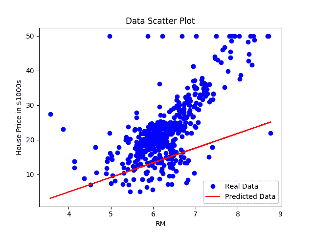

在下图中，我们可以看到，随着我们的模型学习到数据，`loss`函数如预期的那样下降：

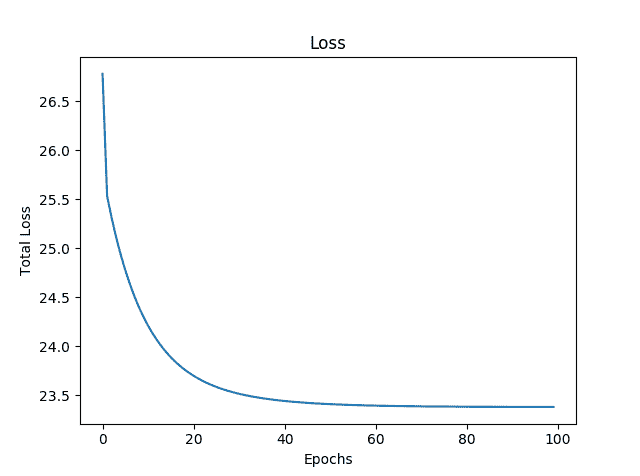

以下是我们的简单线性回归器的 TensorBoard 图：

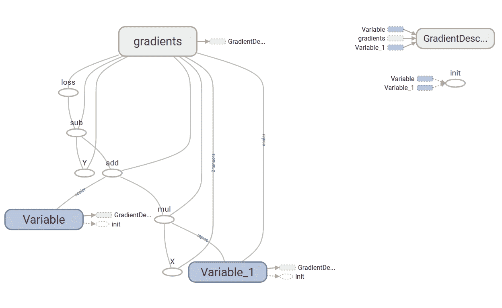

该图具有两个名称作用域节点，即`Variable`和`Variable_1`，它们是分别表示偏差和权重的高级节点。 名为`gradient`的节点也是高级节点。 扩展节点，我们可以看到它接受了七个输入并计算了`gradient`，然后`GradientDescentOptimizer`使用了这些梯度来计算权重和偏差并应用更新：

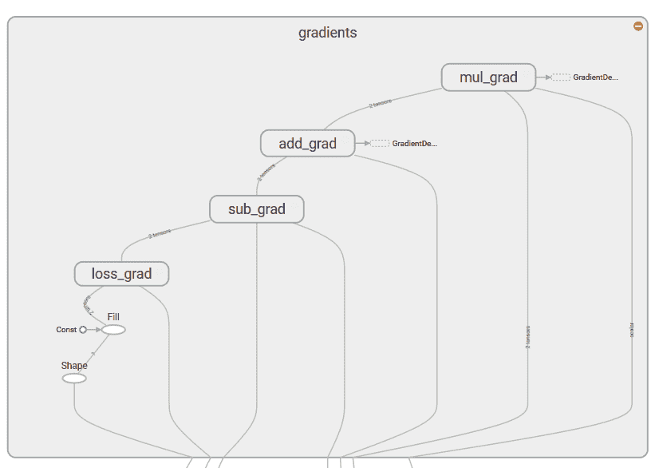

# 更多

好吧，我们执行了简单的线性回归，但是如何找出模型的性能呢？ 有多种方法可以做到这一点。 从统计上讲，我们可以计算 R 方或将我们的数据分为训练和交叉验证集，并检查验证集的准确性（损失项）。

# 房价估计 -- 多元线性回归

我们可以通过对权重和占位符的声明进行一些修改来对同一数据进行多元线性回归。 在多重线性回归的情况下，由于每个要素都有不同的值范围，因此规范化必不可少。 这是使用所有 13 种输入功能对波士顿房价数据集进行多元线性回归的代码。

# 操作步骤

这是我们进行食谱的方法：

1.  第一步是导入我们需要的所有软件包：

```py
import tensorflow as tf
 import numpy as np
 import matplotlib.pyplot as plt
```

2.  由于所有要素的数据范围都不同，因此我们需要对要素数据进行规范化。 我们为其定义了归一化函数。 同样，在这里，我们通过添加总是固定为一个值的另一输入来将偏差与权重相结合。 为此，我们定义函数`append_bias_reshape()`。 有时会使用此技术来简化编程：

```py
def normalize(X)
    """ Normalizes the array X """
    mean = np.mean(X)
    std = np.std(X)
    X = (X - mean)/std
    return X

def append_bias_reshape(features,labels):
    m = features.shape[0]
    n = features.shape[1]
    x = np.reshape(np.c_[np.ones(m),features],[m,n + 1])
    y = np.reshape(labels,[m,1])
    return x, y
```

3.  现在，我们使用 TensorFlow contrib 数据集加载波士顿房价数据集，并将其分为`X_train`和`Y_train`。 观察到这次`X_train`包含所有功能。 我们可以在此处选择对数据进行规范化，也可以使用附加偏差并为网络重塑数据：

```py
# Data
boston = tf.contrib.learn.datasets.load_dataset('boston')
X_train, Y_train = boston.data, boston.target
X_train = normalize(X_train)
X_train, Y_train = append_bias_reshape(X_train, Y_train)
m = len(X_train)  
#Number of training examples
n = 13 + 1   
# Number of features + bias
```

4.  声明 TensorFlow 占位符以获取训练数据。 观察`X`占位符形状的变化。

```py
# Placeholder for the Training Data
X = tf.placeholder(tf.float32, name='X', shape=[m,n])
Y = tf.placeholder(tf.float32, name='Y')
```

5.  我们为权重和偏差创建 TensorFlow 变量。 这次，权重用随机数初始化：

```py
# Variables for coefficients
w = tf.Variable(tf.random_normal([n,1]))
```

6.  定义要用于预测的线性回归模型。 现在我们需要矩阵乘法来完成任务：

```py
# The Linear Regression Model
Y_hat = tf.matmul(X, w) 
```

7.  为了更好的区分，我们定义`loss`函数：

```py
# Loss function
loss = tf.reduce_mean(tf.square(Y - Y_hat, name='loss'))
```

8.  选择合适的优化器：

```py
# Gradient Descent with learning rate of 0.01 to minimize loss
optimizer = tf.train.GradientDescentOptimizer(learning_rate=0.01).minimize(loss)
```

9.  定义初始化操作：

```py
# Initializing Variables
init_op = tf.global_variables_initializer()
total = []
```

10.  启动计算图：

```py
with tf.Session() as sess:
    # Initialize variables
    sess.run(init_op)
    writer = tf.summary.FileWriter('graphs', sess.graph)
    # train the model for 100 epcohs
    for i in range(100):
       _, l = sess.run([optimizer, loss], feed_dict={X: X_train, Y: Y_train})
       total.append(l)
       print('Epoch {0}: Loss {1}'.format(i, l))
     writer.close()
     w_value, b_value = sess.run([w, b])
```

11.  绘制`loss`函数：

```py
plt.plot(total)
plt.show()
```

同样在这里，我们发现损失随着训练的进行而减少：

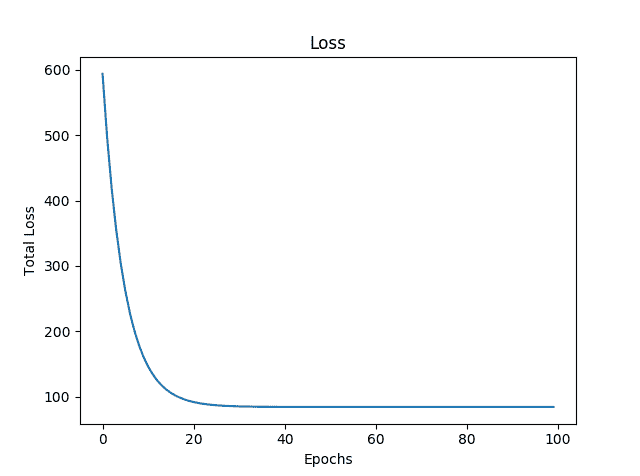

# 工作原理

在此配方中，我们使用了所有 13 个功能来训练模型。 简单线性回归和多元线性回归之间的重要区别在于权重，系数的数量始终等于输入要素的数量。 以下是我们构建的多元线性回归模型的 TensorBoard 图：

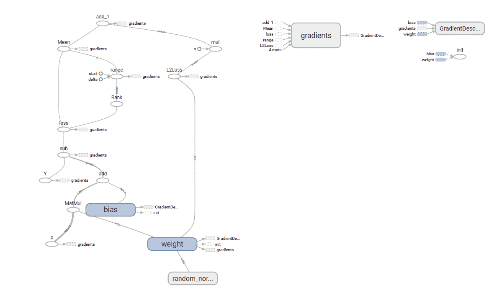

# 更多

我们现在可以使用从模型中学到的系数来预测房价：

```py
N= 500
X_new = X_train [N,:]
Y_pred =  (np.matmul(X_new, w_value) + b_value).round(1)
print('Predicted value: ${0}  Actual value: / ${1}'.format(Y_pred[0]*1000, Y_train[N]*1000) , '\nDone')
```

# MNIST 数据集上的逻辑回归

此配方基于[这个页面](https://www.tensorflow.org/get_started/mnist/beginners)提供的 MNIST 的逻辑回归，但我们将添加一些 TensorBoard 摘要以更好地理解它。 你们大多数人必须已经熟悉 MNIST 数据集-就像机器学习的 ABC 一样。 它包含手写数字的图像和每个图像的标签，说明它是哪个数字。

对于逻辑回归，我们对输出 Y 使用一热编码。因此，我们有 10 位代表输出； 每个位可以具有 0 或 1 的值，并且为 1 热点意味着对于标签 Y 中的每个图像，10 个位中只有 1 个位的值为 1，其余为 0。 在这里，您可以看到手写数字 8 的图像及其热编码值`[0 0 0 0 0 0 0 0 0 1 0]`：

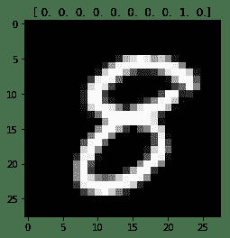

# 操作步骤

这是我们进行食谱的方法：

1.  与往常一样，第一步是导入所需的模块：

```py
import tensorflow as tf
import matplotlib.pyplot as plt,  matplotlib.image as mpimg
```

2.  我们从模块`input_data`中给出的 TensorFlow 示例中获取 MNIST 的输入数据。 `one_hot`标志设置为`True`以启用标签的`one_hot`编码。 这导致生成两个张量，形状为`[55000, 784]`的`mnist.train.images`和形状为`[55000, 10]`的`mnist.train.labels`。 `mnist.train.images`的每个条目都是像素强度，其值在 0 到 1 之间：

```py
from tensorflow.examples.tutorials.mnist import input_data
mnist = input_data.read_data_sets("MNIST_data/", one_hot=True)
```

3.  为训练数据集输入`x`创建占位符，并在 TensorFlow 图上标记`y`：

```py
x = tf.placeholder(tf.float32, [None, 784], name='X')
y = tf.placeholder(tf.float32, [None, 10],name='Y')
```

4.  创建学习变量​​，权重和偏置：

```py
W = tf.Variable(tf.zeros([784, 10]), name='W')
b = tf.Variable(tf.zeros([10]), name='b')
```

5.  创建逻辑回归模型。 TensorFlow OP 被赋予`name_scope("wx_b")`：

```py
with tf.name_scope("wx_b") as scope:
    y_hat = tf.nn.softmax(tf.matmul(x,W) + b)
```

6.  添加摘要 OP，以在训练时收集数据。 我们使用直方图摘要，以便我们可以看到权重和偏差随时间相对于彼此的值如何变化。 我们将可以在 TensorBoard 直方图选项卡中看到以下内容：

```py
w_h = tf.summary.histogram("weights", W)
b_h = tf.summary.histogram("biases", b)
```

7.  定义`cross-entropy`和`loss`函数，并添加名称范围和摘要以更好地可视化。 在这里，我们使用标量汇总来获取`loss`函数随时间的变化。 标量摘要在“事件”选项卡下可见：

```py
with tf.name_scope('cross-entropy') as scope:
    loss = tf.reduce_mean(tf.nn.softmax_cross_entropy_with_logits(labels=y, logits=y_hat)
    tf.summary.scalar('cross-entropy', loss)
```

8.  使用具有学习率`0.01`的 TensorFlow `GradientDescentOptimizer`。 再次，为了更好地可视化，我们定义了`name_scope`：

```py
with tf.name_scope('Train') as scope:
    optimizer = tf.train.GradientDescentOptimizer(0.01).minimize(loss)
```

9.  声明变量的初始化操作：

```py
# Initializing the variables
init = tf.global_variables_initializer()
```

10.  我们结合了所有汇总操作：

```py
merged_summary_op = tf.summary.merge_all()
```

11.  现在，我们定义会话并将摘要存储在定义的文件夹中：

```py
with tf.Session() as sess:
    sess.run(init)  # initialize all variables
    summary_writer = tf.summary.FileWriter('graphs', sess.graph)  # Create an event file
    # Training
    for epoch in range(max_epochs):
        loss_avg = 0
        num_of_batch = int(mnist.train.num_examples/batch_size)
        for i in range(num_of_batch):
            batch_xs, batch_ys = mnist.train.next_batch(100)  # get the next batch of data
            _, l, summary_str = sess.run([optimizer,loss, merged_summary_op], feed_dict={x: batch_xs, y: batch_ys})  # Run the optimizer
           loss_avg += l
           summary_writer.add_summary(summary_str, epoch*num_of_batch + i)  # Add all summaries per batch
        loss_avg = loss_avg/num_of_batch
        print('Epoch {0}: Loss {1}'.format(epoch, loss_avg))
    print('Done')
    print(sess.run(accuracy, feed_dict={x: mnist.test.images,y: mnist.test.labels}))
```

12.  在 30 个周期后，我们的准确度为 86.5%，在 50 个周期后为 89.36%，在 100 个周期后，准确度提高到 90.91%。

# 工作原理

我们使用张量`tensorboard --logdir=garphs`启动 TensorBoard。 在浏览器中，导航到网址`localhost:6006`，以查看 TensorBoard。 先前模型的图形如下：

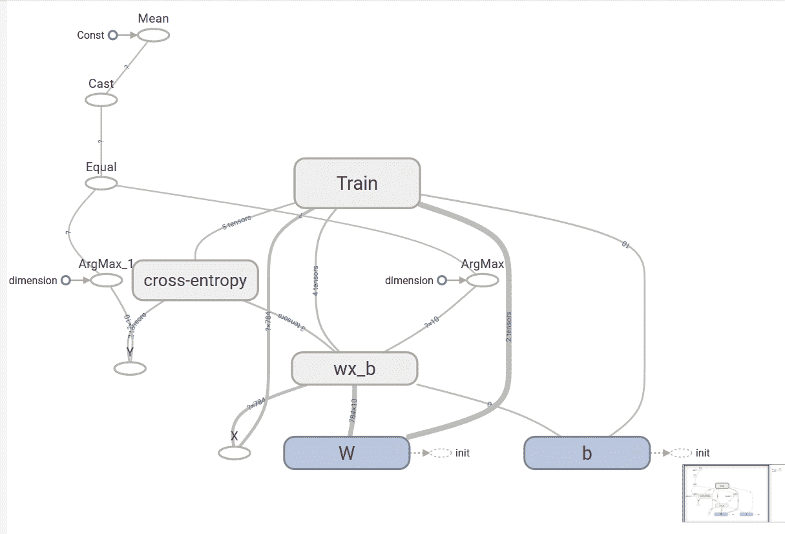

在“直方图”标签下，我们可以看到**权重**和**偏置**的直方图：

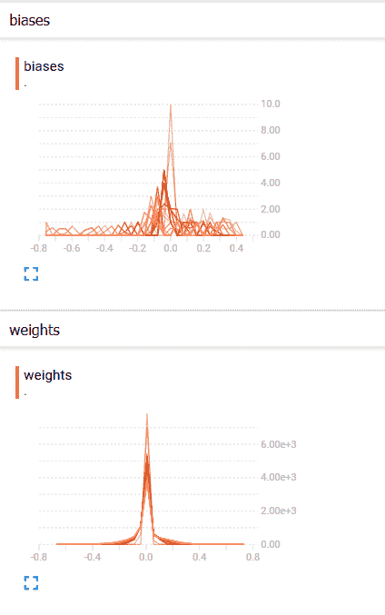

**权重**和**偏置**的分布如下：

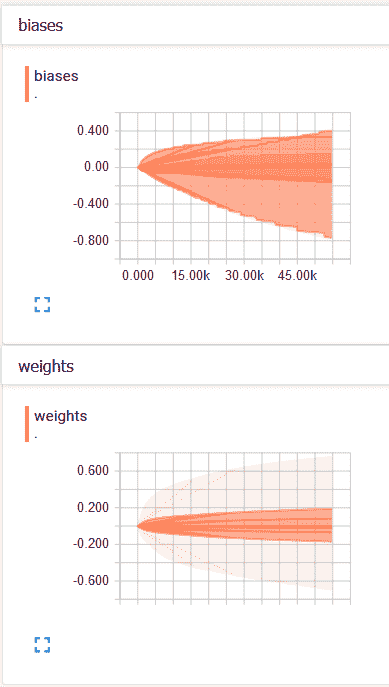

我们可以看到，随着时间的推移，偏差和权重都发生了变化。 从我们的案例来看，偏差更大，从 TensorBoard 中的分布可以看出。

在“事件”选项卡下，我们可以看到标量摘要，在这种情况下为交叉熵。 下图显示交叉熵损失随时间减少：

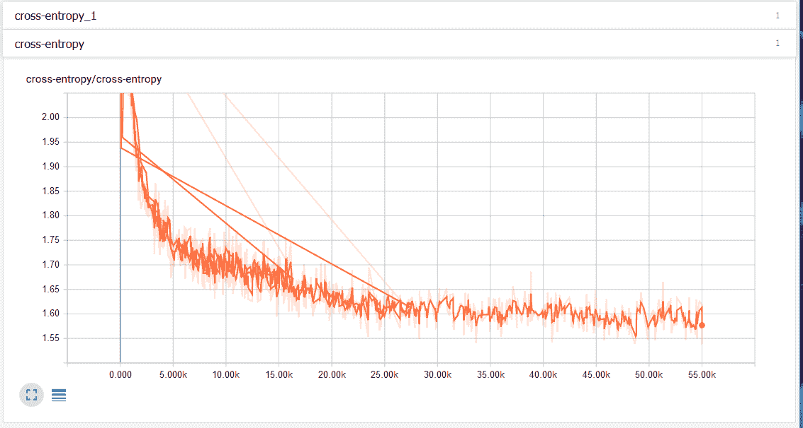

# 另见

如果您有兴趣了解更多信息，这些是一些很好的资源：

*   [关于 TensorBoard 和可视化](https://www.tensorflow.org/get_started/summaries_and_tensorboard)
*   [这是一门有关统计和概率的很好的课程](https://www.khanacademy.org/math/statistics-probability/describing-relationships-quantitative-data)
*   [有关回归的更多详细信息](https://onlinecourses.science.psu.edu/stat501/node/250)