# 三、神经网络：感知机

自最近十年以来，神经网络一直处于机器学习研究和应用的最前沿。 **深层神经网络**（**DNN**），传递学习以及计算效率高的 GPU 的可用性已帮助在图像识别，语音识别甚至文本生成领域取得了重大进展。 在本章中，我们将专注于基本的神经网络感知机，即人工神经元的完全连接的分层体系结构。 本章将包括以下食谱：

*   激活函数
*   单层感知机
*   反向传播算法的梯度计算
*   使用 MLP 的 MNIST 分类器
*   使用 MLP 进行函数逼近-预测波士顿房价
*   调整超参数
*   更高级别的 API -- Keras

# 介绍

神经网络，通常也称为**连接器模型**，是受人脑启发的。 像人的大脑一样，神经网络是通过称为**权重**的突触强度相互连接的大量人工神经元的集合。 正如我们通过长辈提供给我们的示例进行学习一样，人工神经网络也可以通过作为训练数据集提供给他们的示例进行学习。 有了足够数量的训练数据集，人工神经网络可以概括信息，然后也可以将其用于看不见的数据。 太棒了，它们听起来像魔术！

神经网络并不是什么新鲜事物。 第一个神经网络模型由 [McCulloch Pitts（MCP）](http://vordenker.de/ggphilosophy/mcculloch_a-logical-calculus.pdf)最早在 1943 年提出。 建造了第一台计算机！）该模型可以执行 AND/OR/NOT 之类的逻辑运算。 MCP 模型具有固定的权重和偏差； 没有学习的可能。 几年后，[Frank Rosenblatt 在 1958 年解决了这个问题](https://blogs.umass.edu/brain-wars/files/2016/03/rosenblatt-1957.pdf)。 他提出了第一个学习神经网络，称为**感知机**。

从那时起，众所周知，添加多层神经元并建立一个深而密集的网络将有助于神经网络解决复杂的任务。 正如母亲为孩子的成就感到自豪一样，科学家和工程师对使用[**神经网络**（**NN**）](https://www.youtube.com/watch?v=jPHUlQiwD9Y)。 这些声明不是虚假的，但是由于硬件计算的限制和复杂的网络结构，当时根本不可能实现它们。 这导致了 1970 年代和 1980 年代的 **AI 寒冬**。 在这些寒战中，由于很少或几乎没有对基于 AI 的项目提供资金，因此该领域的进展放缓了。

随着 DNN 和 GPU 的出现，情况发生了变化。 今天，我们拥有的网络可以在较少的调整参数的情况下实现更好的性能，诸如辍学和迁移学习之类的技术可以进一步减少训练时间，最后，硬件公司正在提出专门的硬件芯片来执行基于 NN 的快速计算。

人工神经元是所有神经网络的核心。 它由两个主要部分组成-加法器（对加权后的神经元的所有输入求和），以及处理单元，对加权后的总和进行加权，并基于称为**激活函数**的预定义函数生成输出。 。 每个人工神经元都有其自己的一组权重和阈值（偏差）。 它通过不同的学习算法来学习这些权重和阈值：

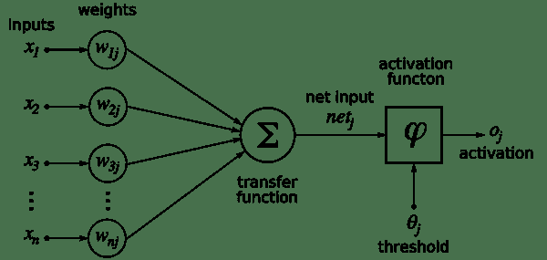

[来源](https://commons.wikimedia.org/wiki/File:Rosenblattperceptron.png)

当仅存在此类神经元的一层时，它称为感知机。 输入层称为**第零层**，因为它仅缓冲输入。 存在的唯一神经元层形成输出层。 输出层的每个神经元都有自己的权重和阈值。 当存在许多这样的层时，该网络称为**多层感知机**（**MLP**）。 一个 MLP 具有一个或多个隐藏层。 这些隐藏层具有不同数量的隐藏神经元。 每个隐藏层的神经元具有相同的激活函数：

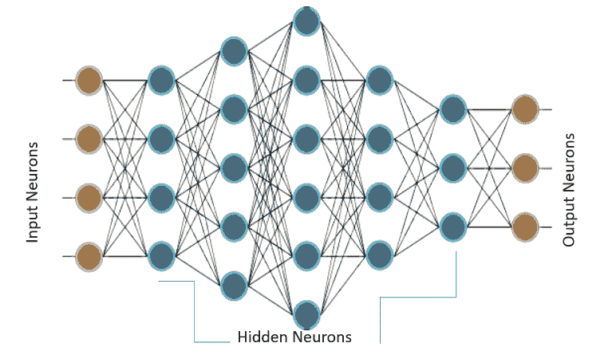

上图显示了一个 MLP，它具有四个输入，五个隐藏层，每个隐藏层分别具有 4、5、6、4 和 3 个神经元，而在输出层中具有三个神经元。 在 MLP 中，下层的所有神经元都与其上一层的所有神经元相连。 因此，MLP 也称为**全连接层**。 MLP 中的信息流始终是从输入到输出。 由于没有反馈或跳跃，因此这些网络也称为**前馈网络**。

使用**梯度下降算法**训练感知机。 在第 2 章“回归”中，您了解了梯度下降； 在这里，我们对其进行更深入的研究。 感知机通过有监督的学习算法进行学习，也就是说，网络由训练数据集中存在的所有输入的期望输出提供。 在输出中，我们定义一个误差函数或目标函数`J(W)`，这样，当网络完全学习了所有训练数据时，目标函数将最小。

更新输出层和隐藏层的权重，以使目标函数的梯度减小：

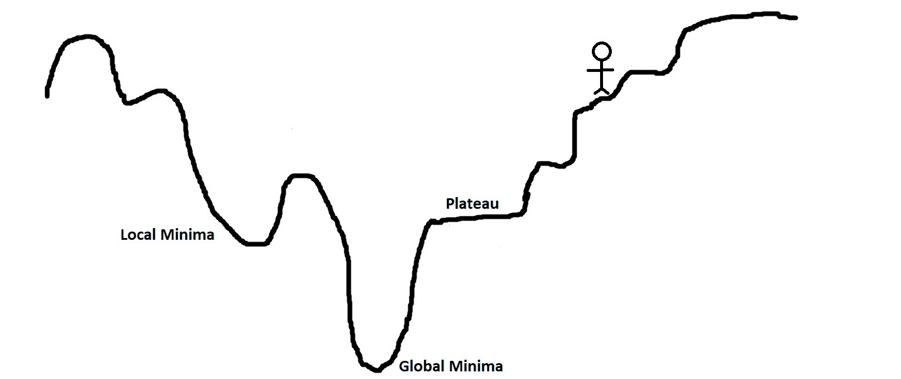

为了更好地理解它，请对山丘，高原和坑坑洼洼的景观进行可视化处理。 目的是扎根（目标函数的全局最小值）。 如果您站在山顶上而必须下山，那么很明显的选择是，您将沿着山下坡，即向负坡度（或负坡度）移动。 以相同的方式，感知机中的权重与目标函数的梯度的负值成比例地变化。

梯度值越高，权重值的变化越大，反之亦然。 现在，这一切都很好，但是当梯度达到零，因此权重没有变化时，我们到达高原时就会遇到问题。 当我们进入一个小坑（局部极小值）时，我们也可能遇到问题，因为当我们尝试移动到任一侧时，坡度将增加，从而迫使网络停留在坑中。

如第 2 章，“回归”中所讨论的，梯度下降有多种变体，旨在提高收敛性，避免了陷入局部极小值或高原的问题（增加动量，可变学习率）。

TensorFlow 借助不同的优化器自动计算这些梯度。 但是，需要注意的重要一点是，由于 TensorFlow 将计算梯度，而梯度也将涉及激活函数的导数，因此重要的是，您选择的激活函数是可微的，并且在整个训练场景中最好具有非零梯度 。

感知机梯度下降的主要方法之一不同于第 2 章，“回归”，应用是为输出层定义目标函数，但可用于查找目标层，以及隐藏层的神经元的权重变化。 这是使用**反向传播**（**BPN**）算法完成的，其中输出端的错误会向后传播到隐藏层，并用于确定权重变化。 您将很快了解更多信息。

# 激活函数

每个神经元必须具有激活函数。 它们使神经元具有建模复杂非线性数据集所需的非线性特性。 该函数获取所有输入的加权和，并生成一个输出信号。 您可以将其视为输入和输出之间的转换。 使用适当的激活函数，我们可以将输出值限制在定义的范围内。

如果`x[j]`是第`j`个输入，则`W[j]`的第`j`行输入到我们的神经元，并且`b`是我们神经元的偏见，即神经元的输出（从生物学的角度来说，是神经元的发射） 通过激活函数，在数学上表示为：


在此， `g`表示激活函数。 激活函数`∑(W[j]x[j]) + b`的参数称为神经元的**激活**。

# 准备

我们对给定输入刺激的反应受神经元激活函数的控制。 有时我们的回答是二进制的是或否。 例如，当开个玩笑时，我们要么笑要么不笑。 在其他时间，响应似乎是线性的，例如由于疼痛而哭泣。 有时，响应似乎在一定范围内。

模仿类似的行为，人工神经元使用了许多不同的激活函数。 在本食谱中，您将学习如何在 TensorFlow 中定义和使用一些常见的激活函数。

# 操作步骤

我们继续执行激活函数，如下所示：

1.  **阈值激活函数**：这是最简单的激活函数。 在此，如果神经元的活动性大于零，则神经元会触发；否则，神经元会触发。 否则，它不会触发。 这是阈值激活函数随神经元活动变化而变化的图，以及在 TensorFlow 中实现阈值激活函数的代码：

```py
import tensorflow as tf 
import numpy as np 
import matplotlib.pyplot as plt 

# Threshold Activation function 
def threshold (x):  
    cond = tf.less(x, tf.zeros(tf.shape(x), dtype = x.dtype))  
    out = tf.where(cond, tf.zeros(tf.shape(x)), tf.ones(tf.shape(x)))  
    return out 
# Plotting Threshold Activation Function 
h = np.linspace(-1,1,50) 
out = threshold(h) 
init = tf.global_variables_initializer()
with tf.Session() as sess:  
     sess.run(init)  
     y = sess.run(out) 
     plt.xlabel('Activity of Neuron') 
     plt.ylabel('Output of Neuron') 
     plt.title('Threshold Activation Function') 
     plt.plot(h, y)
```

以下是上述代码的输出：

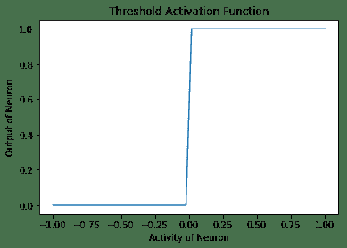

2.  **Sigmoid 激活函数**：在这种情况下，神经元的输出由函数`g(x) = 1 / (1 + exp(-x))`指定。 在 TensorFlow 中，有一种方法`tf.sigmoid`，它提供了 Sigmoid 激活。 此函数的范围在 0 到 1 之间。形状上看起来像字母 **S** ，因此名称为 Sigmoid：

```py
# Plotting Sigmoidal Activation function 
h = np.linspace(-10,10,50) 
out = tf.sigmoid(h) 
init = tf.global_variables_initializer()
with tf.Session() as sess:  
    sess.run(init)  
    y = sess.run(out) 
    plt.xlabel('Activity of Neuron') 
    plt.ylabel('Output of Neuron') 
    plt.title('Sigmoidal Activation Function') 
    plt.plot(h, y)
```

以下是以下代码的输出：

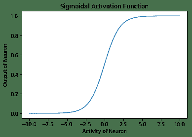

3.  **双曲正切激活函数**：在数学上，它是`(1 - exp(-2x) / (1 + exp(-2x))`。在形状上，它类似于 Sigmoid 函数，但是它以 0 为中心，范围为 -1 至 1。TensorFlow 具有内置函数`tf.tanh`，用于双曲正切激活函数：

```py
# Plotting Hyperbolic Tangent Activation function 
h = np.linspace(-10,10,50) 
out = tf.tanh(h) 
init = tf.global_variables_initializer()
with tf.Session() as sess:  
    sess.run(init)  
    y = sess.run(out) 
    plt.xlabel('Activity of Neuron') 
    plt.ylabel('Output of Neuron') 
    plt.title('Hyperbolic Tangent Activation Function') 
    plt.plot(h, y)
```

以下是上述代码的输出：

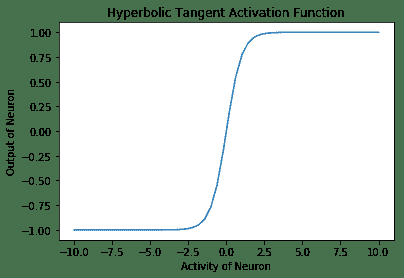

4.  **线性激活函数**：在这种情况下，神经元的输出与神经元的活动相同。 此函数不受任何限制：

```py
# Linear Activation Function
b = tf.Variable(tf.random_normal([1,1], stddev=2))
w = tf.Variable(tf.random_normal([3,1], stddev=2))
linear_out = tf.matmul(X_in, w) + b
init = tf.global_variables_initializer()
with tf.Session() as sess:
    sess.run(init)
    out = sess.run(linear_out)

print(out)

```

5.  **整流线性单元**（**ReLU**）激活函数再次内置在 TensorFlow 库中。 激活函数类似于线性激活函数，但有一个大变化-对于活动的负值，神经元不触发（零输出），对于活动的正值，神经元的输出与给定的活动相同：

```py
# Plotting ReLU Activation function
h = np.linspace(-10,10,50)
out = tf.nn.relu(h)
init = tf.global_variables_initializer()
with tf.Session() as sess:  
    sess.run(init)  
    y = sess.run(out) 
plt.xlabel('Activity of Neuron') 
plt.ylabel('Output of Neuron') 
plt.title('ReLU Activation Function') 
plt.plot(h, y)
```

以下是 ReLu 激活函数的输出：

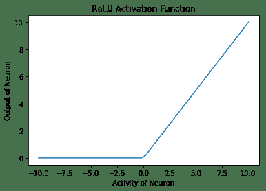

6.  **Softmax 激活函数**是归一化的指数函数。 一个神经元的输出不仅取决于其自身的活动，还取决于该层中存在的所有其他神经元的活动总和。 这样的一个优点是，它使神经元的输出保持较小，因此梯度不会爆炸。 数学上，它是`y[i] = exp(x[i]) / ∑j exp(x[j])`：

```py
# Plotting Softmax Activation function 
h = np.linspace(-5,5,50) 
out = tf.nn.softmax(h) 
init = tf.global_variables_initializer()
with tf.Session() as sess:  
    sess.run(init)  
    y = sess.run(out) 
    plt.xlabel('Activity of Neuron') 
    plt.ylabel('Output of Neuron') 
    plt.title('Softmax Activation Function') 
    plt.plot(h, y)
```

以下是上述代码的输出：

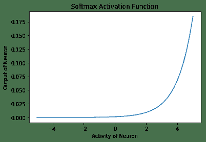

# 工作原理

以下是功能的说明：

*   **门控激活函数**由 McCulloch Pitts Neuron 和初始感知机使用。 它不可微且在`x = 0`处不连续。 因此，不可能使用此激活函数来使用梯度下降或其变体进行训练。
*   **Sigmoid 激活函数**曾经非常流行。 如果看曲线，它看起来像是阈值激活函数的连续版本。 它具有消失的梯度问题，即，函数的梯度在两个边缘附近变为零。 这使得训练和优化变得困难。
*   **双曲正切激活函数**再次和 Sigmoid 类似，并具有非线性特性。 该函数以零为中心，并且与 Sigmoid 曲线相比具有更陡峭的导数。 像 Sigmoid 一样，这也遭受消失的梯度问题的困扰。
*   **线性激活函数**顾名思义是线性的。 该函数从两侧都是无界的`[-inf, inf]`。 其线性是其主要问题。 线性函数的总和将是线性函数，线性函数的线性函数也将是线性函数。 因此，使用此功能，无法掌握复杂数据集中存在的非线性。
*   **ReLU 激活函数**是线性激活函数的整流版本，当在多层中使用时，此整流可以捕获非线性。 使用 ReLU 的主要优点之一是它导致稀疏激活。 在任何时候，所有具有负活动的神经元都不会放电。 这使网络在计算方面更轻便。 ReLU 神经元患有垂死的 ReLU 问题，也就是说，不激发的神经元的梯度将变为零，因此将无法进行任何训练并保持静止（死）。 尽管存在这个问题，如今的 ReLU 还是隐藏层最常用的激活函数之一。
*   **Softmax 激活函数**通常用作输出层的激活函数。 该函数的范围为`[0, 1]`。 它用于表示多类分类问题中某类的概率。 所有单位的输出总和将始终为 1。

# 更多

神经网络已用于各种任务。 这些任务可以大致分为两类：函数逼近（回归）和分类。 根据手头的任务，一个激活函数可能会优于另一个。 通常，最好将 ReLU 神经元用于隐藏层。 对于分类任务，softmax 通常是更好的选择，对于回归问题，最好使用 S 形或双曲正切。

# 另见

*   [该链接提供了 TensorFlow 中定义的激活函数及其使用方法的详细信息](https://www.tensorflow.org/versions/r0.12/api_docs/python/nn/activation_functions_)
*   [关于激活函数的不错总结](https://en.wikipedia.org/wiki/Activation_function)

# 单层感知机

简单的感知机是单层神经网络。 它使用阈值激活函数，并且正如 Marvin Minsky 论文所证明的那样，只能解决线性可分离的问题。 尽管这将单层感知机的应用限制为仅是线性可分离的问题，但看到它学习仍然总是令人惊奇。

# 准备

由于感知机使用阈值激活函数，因此我们无法使用 TensorFlow 优化器来更新权重。 我们将不得不使用权重更新规则：


这是学习率。 为了简化编程，可以将偏置作为附加权重添加，输入固定为 +1。 然后，前面的等式可用于同时更新权重和偏差。

# 操作步骤

这是我们处理单层感知机的方法：

1.  导入所需的模块：

```py
import tensorflow as tf 
import numpy as np 

```

2.  定义要使用的超参数：

```py
# Hyper parameters 
eta = 0.4  # learning rate parameter 
epsilon = 1e-03 # minimum accepted error 
max_epochs = 100 # Maximum Epochs 

```

3.  定义`threshold`函数：

```py
# Threshold Activation function 
def threshold (x): 
    cond = tf.less(x, tf.zeros(tf.shape(x), dtype = x.dtype)) 
    out = tf.where(cond, tf.zeros(tf.shape(x)), tf.ones(tf.shape(x))) 
    return out 
```

4.  指定训练数据。 在此示例中，我们采用三个输入神经元（`A`，`B`和`C`）并对其进行训练以学习逻辑`AB + BC`：

```py
# Training Data  Y = AB + BC, sum of two linear functions. 
T, F = 1., 0\. 
X_in = [ 
    [T, T, T, T], 
    [T, T, F, T], 
    [T, F, T, T], 
    [T, F, F, T], 
    [F, T, T, T], 
    [F, T, F, T], 
    [F, F, T, T], 
    [F, F, F, T], 
    ] 
Y = [ 
    [T], 
    [T], 
    [F], 
    [F], 
    [T], 
    [F], 
    [F], 
    [F] 
] 

```

5.  定义要使用的变量，计算图以计算更新，最后执行计算图：

```py
W = tf.Variable(tf.random_normal([4,1], stddev=2, seed = 0)) 
h = tf.matmul(X_in, W)  
Y_hat = threshold(h) 
error = Y - Y_hat 
mean_error = tf.reduce_mean(tf.square(error)) 
dW =  eta * tf.matmul(X_in, error, transpose_a=True) 
train = tf.assign(W, W+dW) 
init = tf.global_variables_initializer() 
err = 1 
epoch = 0 
with tf.Session() as sess: 
    sess.run(init) 
    while err > epsilon and epoch < max_epochs: 
        epoch += 1 
        err, _ = sess.run([mean_error, train]) 
        print('epoch: {0}  mean error: {1}'.format(epoch, err)) 

    print('Training complete') 
```

以下是上述代码的输出：

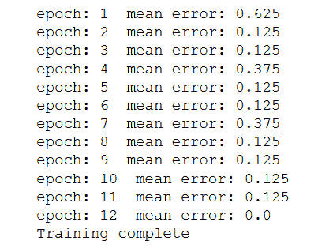

# 更多

如果我们使用 S 形激活函数代替阈值激活函数，您会怎么办？

你猜对了； 首先，我们可以使用 TensorFlow 优化器来更新权重。 其次，网络的行为类似于逻辑回归器。

# 反向传播算法的梯度计算

BPN 算法是神经网络中研究最多的算法之一。 它用于将错误从输出层传播到隐藏层的神经元，然后将其用于更新权重。 整个学习可以分为两阶段-前向阶段和后向阶段。

**向前传递**：输入被馈送到网络，信号从输入层通过隐藏层传播，最后传播到输出层。 在输出层，计算误差和`loss`函数。

**向后传递**：在向后传递中，首先为输出层神经元然后为隐藏层神经元计算`loss`函数的梯度。 然后使用梯度更新权重。

重复两次遍历，直到达到收敛为止。

# 准备

首先为网络呈现`M`个训练对`(X,  Y)`，并以`X`作为输入， `Y`为所需的输出。 输入通过激活函数`g(h)`从输入传播到隐藏层，直到输出层。 输出`Y_hat`是网络的输出，误差为`Y - Y_hat`。

`loss`函数`J(W)`如下：


在此， `i`在输出层（1 到 N）的所有神经元上变化。 `W[ij]`的权重变化，将输出层第`i`个神经元连接到隐藏层第`j`个神经元，然后可以使用`J(W)`的梯度并使用链规则进行区分来确定隐藏层神经元：


此处， `O[j]`是隐藏层神经元的输出， `j`和`h`表示活动。 这很容易，但是现在我们如何找到`W[jk]`，它连接第`n`个隐藏层的神经元`k`和第`n+1`隐藏层的神经元`j`？流程是相同的，我们将使用`loss`函数的梯度和链规则进行微分，但是这次我们将针对`W[jk]`进行计算：


现在方程式就位了，让我们看看如何在 TensorFlow 中做到这一点。 在本食谱中，我们使用相同的[旧 MNIST 数据集](http://yann.lecun.com/exdb/mnist/)。

# 操作步骤

现在让我们开始学习反向传播算法：

1.  导入模块：

```py
import tensorflow as tf 
from tensorflow.examples.tutorials.mnist import input_data 
```

2.  加载数据集； 我们通过设置`one_hot = True`使用一键编码标签：

```py
mnist = input_data.read_data_sets("MNIST_data/", one_hot=True) 

```

3.  定义超参数和其他常量。 在这里，每个手写数字的大小为`28 x 28 = 784`像素。 数据集分为 10 类，因为数字可以是 0 到 9 之间的任何数字。这两个是固定的。 学习率，最大时期数，要训练的迷你批次的批次大小以及隐藏层中神经元的数量都是超参数。 可以与他们一起玩耍，看看它们如何影响网络行为：

```py
# Data specific constants
 n_input = 784 # MNIST data input (img shape: 28*28)
 n_classes = 10 # MNIST total classes (0-9 digits)

 # Hyperparameters
 max_epochs = 10000
 learning_rate = 0.5
 batch_size = 10
 seed = 0
 n_hidden = 30  # Number of neurons in the hidden layer 

```

4.  我们将需要`sigmoid`函数的导数进行权重更新，因此我们对其进行定义：

```py
def sigmaprime(x):
     return tf.multiply(tf.sigmoid(x), tf.subtract(tf.constant(1.0), tf.sigmoid(x))) 
```

5.  为训练数据创建占位符：

```py
x_in = tf.placeholder(tf.float32, [None, n_input])
y = tf.placeholder(tf.float32, [None, n_classes])
```

6.  创建模型：

```py
def multilayer_perceptron(x, weights, biases):
     # Hidden layer with RELU activation
     h_layer_1 = tf.add(tf.matmul(x, weights['h1']), biases['h1'])
     out_layer_1 = tf.sigmoid(h_layer_1)
     # Output layer with linear activation
     h_out = tf.matmul(out_layer_1, weights['out']) + biases['out']
     return tf.sigmoid(h_out), h_out, out_layer_1, h_layer_1 
```

7.  定义`weights`和`biases`的变量：

```py
weights = {
     'h1': tf.Variable(tf.random_normal([n_input, n_hidden], seed = seed)),
     'out': tf.Variable(tf.random_normal([n_hidden, n_classes], seed = seed)) }

 biases = {
     'h1': tf.Variable(tf.random_normal([1, n_hidden], seed = seed)),
     'out': tf.Variable(tf.random_normal([1, n_classes], seed = seed))} 
```

8.  创建用于向前通过，误差，梯度和更新计算的计算图：

```py
# Forward Pass
 y_hat, h_2, o_1, h_1 = multilayer_perceptron(x_in, weights, biases)

 # Error
 err = y_hat - y

 # Backward Pass
 delta_2 = tf.multiply(err, sigmaprime(h_2))
 delta_w_2 = tf.matmul(tf.transpose(o_1), delta_2)

 wtd_error = tf.matmul(delta_2, tf.transpose(weights['out']))
 delta_1 = tf.multiply(wtd_error, sigmaprime(h_1))
 delta_w_1 = tf.matmul(tf.transpose(x_in), delta_1)

 eta = tf.constant(learning_rate)

 # Update weights
 step = [
     tf.assign(weights['h1'],tf.subtract(weights['h1'], tf.multiply(eta, delta_w_1)))
   , tf.assign(biases['h1'],tf.subtract(biases['h1'], tf.multiply(eta, tf.reduce_mean(delta_1, axis=[0]))))
   , tf.assign(weights['out'], tf.subtract(weights['out'], tf.multiply(eta, delta_w_2)))
   , tf.assign(biases['out'], tf.subtract(biases['out'], tf.multiply(eta,tf.reduce_mean(delta_2, axis=[0]))))
 ] 
```

9.  为`accuracy`定义操作：

```py
acct_mat = tf.equal(tf.argmax(y_hat, 1), tf.argmax(y, 1))
accuracy = tf.reduce_sum(tf.cast(acct_mat, tf.float32)) 
```

10.  初始化变量：

```py
init = tf.global_variables_initializer() 
```

11.  执行图：

```py
with tf.Session() as sess:
     sess.run(init)
     for epoch in range(max_epochs):
         batch_xs, batch_ys = mnist.train.next_batch(batch_size)
         sess.run(step, feed_dict = {x_in: batch_xs, y : batch_ys})
         if epoch % 1000 == 0:
             acc_test = sess.run(accuracy, feed_dict =
                        {x_in: mnist.test.images,
                         y : mnist.test.labels})
             acc_train = sess.run(accuracy, feed_dict=
             {x_in: mnist.train.images,
              y: mnist.train.labels})
             print('Epoch: {0}  Accuracy Train%: {1}  Accuracy Test%: {2}'
                   .format(epoch,acc_train/600,(acc_test/100))) 
```

结果如下：

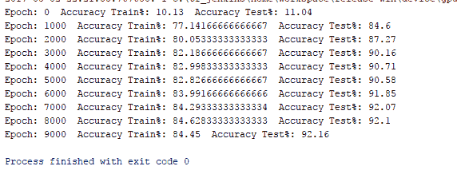

# 工作原理

在这里，我们正在以 10 的批量大小训练网络。如果增加它，网络性能就会下降。 同样，在测试数据上检查训练网络的准确性； 对其进行测试的测试数据的大小为 1,000。

# 更多

我们的一个隐藏层多层感知机在训练数据上的准确度为 84.45，在测试数据上的准确度为 92.1。 很好，但还不够好。 MNIST 数据库用作机器学习中分类问题的基准。 接下来，我们了解使用 TensorFlow 的内置优化器如何影响网络性能。

# 另见

*   [MNIST 数据库](http://yann.lecun.com/exdb/mnist/)
*   [反向传播算法的简化解释](http://neuralnetworksanddeeplearning.com/chap2.html)
*   [反向传播算法的另一种直观解释](http://cs231n.github.io/optimization-2/)
*   [关于反向传播算法的另一种方法，它提供了详细信息，以及推导以及如何将其应用于不同的 neyworks](https://page.mi.fu-berlin.de/rojas/neural/chapter/K7.pdf)

# 使用 MLP 的 MNIST 分类器

TensorFlow 支持自动分化； 我们可以使用 TensorFlow 优化器来计算和应用梯度。 它使用梯度自动更新定义为变量的张量。 在此配方中，我们将使用 TensorFlow 优化器来训练网络。

# 准备

在反向传播算法配方中，我们定义了层，权重，损耗，梯度，并手动通过梯度进行更新。 为了更好地理解，手动使用方程式进行操作是一个好主意，但是随着网络中层数的增加，这可能会非常麻烦。

在本食谱中，我们将使用强大的 TensorFlow 功能（例如 Contrib（层））来定义神经网络层，并使用 TensorFlow 自己的优化器来计算和应用梯度。 我们在第 2 章和“回归”中了解了如何使用不同的 TensorFlow 优化器。 contrib 可用于向神经网络模型添加各种层，例如添加构建块。 我们在这里使用的一种方法是`tf.contrib.layers.fully_connected`，在 TensorFlow 文档中定义如下：

```py
fully_connected(
     inputs,
     num_outputs,
     activation_fn=tf.nn.relu,
     normalizer_fn=None,
     normalizer_params=None,
     weights_initializer=initializers.xavier_initializer(),
     weights_regularizer=None,
     biases_initializer=tf.zeros_initializer(),
     biases_regularizer=None,
     reuse=None,
     variables_collections=None,
     outputs_collections=None,
     trainable=True,
     scope=None
 ) 
```

这将添加一个完全连接的层。

`fully_connected` creates a variable called weights, representing a fully connected weight matrix, which is multiplied by the inputs to produce a tensor of hidden units. If a `normalizer_fn` is provided (such as `batch_norm`), it is then applied. Otherwise, if `normalizer_fn` is None and a `biases_initializer` is provided then a biases variable would be created and added to the hidden units. Finally, if `activation_fn` is not None, it is applied to the hidden units as well.

# 操作步骤

我们按以下步骤进行：

1.  第一步是更改`loss`函数； 尽管对于分类，最好使用交叉熵`loss`函数。 我们目前继续**均方误差**（**MSE**）：

```py
loss = tf.reduce_mean(tf.square(y - y_hat, name='loss'))
```

2.  接下来，我们使用`GradientDescentOptimizer`：

```py
optimizer = tf.train.GradientDescentOptimizer(learning_rate= learning_rate)
 train = optimizer.minimize(loss) 
```

3.  仅通过这两个更改，对于同一组超参数，测试数据集的准确性仅为 61.3%。 增加`max_epoch`，我们可以提高精度，但这将不是 TensorFlow 功能的有效利用。
4.  这是一个分类问题，因此最好使用交叉熵损失，用于隐藏层的 ReLU 激活函数以及用于输出层的 softmax。 进行所需的更改，完整代码如下：

```py
import tensorflow as tf
 import tensorflow.contrib.layers as layers

 from tensorflow.python import debug as tf_debug

 # Network Parameters
 n_hidden = 30
 n_classes = 10
 n_input = 784

 # Hyperparameters
 batch_size = 200
 eta = 0.001
 max_epoch = 10

 # MNIST input data
 from tensorflow.examples.tutorials.mnist import input_data
 mnist = input_data.read_data_sets("/tmp/data/", one_hot=True)

 def multilayer_perceptron(x):
     fc1 = layers.fully_connected(x, n_hidden, activation_fn=tf.nn.relu, scope='fc1')
     #fc2 = layers.fully_connected(fc1, 256, activation_fn=tf.nn.relu, scope='fc2')
     out = layers.fully_connected(fc1, n_classes, activation_fn=None, scope='out')
     return out

 # build model, loss, and train op
 x = tf.placeholder(tf.float32, [None, n_input], name='placeholder_x')
 y = tf.placeholder(tf.float32, [None, n_classes], name='placeholder_y')
 y_hat = multilayer_perceptron(x)

 loss = tf.reduce_mean(tf.nn.softmax_cross_entropy_with_logits(logits=y_hat, labels=y))
 train = tf.train.AdamOptimizer(learning_rate= eta).minimize(loss)
 init = tf.global_variables_initializer()

 with tf.Session() as sess:
     sess.run(init)
     for epoch in range(10):
         epoch_loss = 0.0
         batch_steps = int(mnist.train.num_examples / batch_size)
         for i in range(batch_steps):
             batch_x, batch_y = mnist.train.next_batch(batch_size)
             _, c = sess.run([train, loss],
                                feed_dict={x: batch_x, y: batch_y})
             epoch_loss += c / batch_steps
         print ('Epoch %02d, Loss = %.6f' % (epoch, epoch_loss))

     # Test model
     correct_prediction = tf.equal(tf.argmax(y_hat, 1), tf.argmax(y, 1))
     accuracy = tf.reduce_mean(tf.cast(correct_prediction, tf.float32))
     print ("Accuracy%:", accuracy.eval({x: mnist.test.images, y: mnist.test.labels})) 
```

# 工作原理

改进的 MNIST MLP 分类器在测试数据集上的准确性达到了 96%，只有一个隐藏层并且在 10 个周期内。 仅在几行代码中我们就获得了约 96% 的准确度，这就是 TensorFlow 的强大功能：

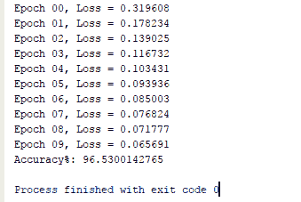

# 使用 MLP 预测波士顿房价的函数近似

[Hornik 等人的工作](http://www.cs.cmu.edu/~bhiksha/courses/deeplearning/Fall.2016/notes/Sonia_Hornik.pdf)证明了以下：

"multilayer feedforward networks with as few as one hidden layer are indeed capable of universal approximation in a very precise and satisfactory sense."

在本食谱中，我们将向您展示如何使用 MLP 进行函数逼近； 具体来说，我们将预测波士顿的房价。 我们已经熟悉了数据集； 在第 2 章，“回归”中，我们使用回归技术进行房价预测，现在我们将使用 MLP 进行相同的操作。

# 准备

对于函数逼近，`loss`函数应为 MSE。 输入应该标准化，而隐藏层可以是 ReLU，而输出层则最好是 Sigmoid 。

# 操作步骤

这是我们从使用 MLP 进行函数逼近开始的方法：

1.  导入所需的模块-`sklearn`用于数据集，预处理数据，并将其拆分为训练和测试； Pandas 用于了解数据集； `matplotlib`和`seaborn`用于可视化：

```py
import tensorflow as tf 
import tensorflow.contrib.layers as layers 
from sklearn import datasets 
import matplotlib.pyplot as plt 
from sklearn.model_selection  import train_test_split 
from sklearn.preprocessing import MinMaxScaler 
import pandas as pd 
import seaborn as sns 
%matplotlib inline
```

2.  加载数据集并创建一个 Pandas 数据帧以了解数据：

```py
# Data 
boston = datasets.load_boston() 
df = pd.DataFrame(boston.data, columns=boston.feature_names) 
df['target'] = boston.target 
```

3.  让我们获取有关数据的一些详细信息：

```py
#Understanding Data 
df.describe() 
```

下图很好地说明了这一概念：


4.  查找不同输入要素和目标之间的关联：

```py
# Plotting correlation 
color map _ , ax = plt.subplots( figsize =( 12 , 10 ) ) 
corr = df.corr(method='pearson') 
cmap = sns.diverging_palette( 220 , 10 , as_cmap = True ) 
_ = sns.heatmap( corr, cmap = cmap, square=True, cbar_kws={ 'shrink' : .9 }, ax=ax, annot = True, annot_kws = { 'fontsize' : 12 })
```

以下是上述代码的输出：

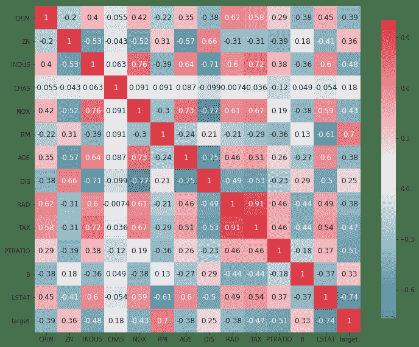

5.  从前面的代码中，我们可以看到`RM`，`PTRATIO`和`LSTAT`这三个参数的相关性在大小上大于 0.5。 我们选择它们进行训练。 将数据集拆分为训练和测试数据集。 我们还使用`MinMaxScaler`归一化我们的数据集。 需要注意的一个重要变化是，由于我们的神经网络使用了 Sigmoid 激活函数（Sigmoid 的输出只能在 0-1 之间），因此我们也必须将目标值`Y`标准化：

```py
# Create Test Train Split 
X_train, X_test, y_train, y_test = train_test_split(df [['RM', 'LSTAT', 'PTRATIO']], df[['target']], test_size=0.3, random_state=0) 
# Normalize data 
X_train = MinMaxScaler().fit_transform(X_train) 
y_train = MinMaxScaler().fit_transform(y_train) 
X_test = MinMaxScaler().fit_transform(X_test) 
y_test = MinMaxScaler().fit_transform(y_test)
```

6.  定义常量和超参数：

```py
#Network Parameters 
m = len(X_train) 
n = 3 # Number of features 
n_hidden = 20 # Number of hidden neurons 
# Hyperparameters 
batch_size = 200 
eta = 0.01 
max_epoch = 1000
```

7.  创建具有一个隐藏层的多层感知机模型：

```py
def multilayer_perceptron(x): 
    fc1 = layers.fully_connected(x, n_hidden, activation_fn=tf.nn.relu, scope='fc1') 
    out = layers.fully_connected(fc1, 1, activation_fn=tf.sigmoid, scope='out') 
    return out
```

8.  声明训练数据的占位符，并定义损失和优化器：

```py
# build model, loss, and train op 
x = tf.placeholder(tf.float32, name='X', shape=[m,n]) 
y = tf.placeholder(tf.float32, name='Y') 
y_hat = multilayer_perceptron(x) 
correct_prediction = tf.square(y - y_hat) 
mse = tf.reduce_mean(tf.cast(correct_prediction, "float")) 
train = tf.train.AdamOptimizer(learning_rate= eta).minimize(mse) 
init = tf.global_variables_initializer()
```

9.  执行计算图：

```py
# Computation Graph 
with tf.Session() as sess: # Initialize variables
     sess.run(init) writer = tf.summary.FileWriter('graphs', sess.graph) 
# train the model for 100 epcohs 
    for i in range(max_epoch): 
        _, l, p = sess.run([train, loss, y_hat], feed_dict={x: X_train, y: y_train}) 
        if i%100 == 0: 
            print('Epoch {0}: Loss {1}'.format(i, l))
    print("Training Done") 
print("Optimization Finished!") 
# Test model correct_prediction = tf.square(y - y_hat) 
# Calculate accuracy 
accuracy = tf.reduce_mean(tf.cast(correct_prediction, "float"))
print(" Mean Error:", accuracy.eval({x: X_train, y: y_train})) plt.scatter(y_train, p) 
writer.close()
```

# 工作原理

该模型只有一个隐藏层，因此可以预测训练数据集的价格，平均误差为 0.0071。 下图显示了房屋的估计价格与实际价格之间的关系：

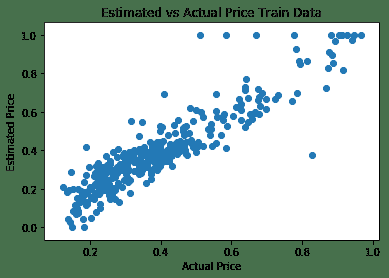

# 更多

在这里，我们使用 TensorFlow ops Layers（Contrib）来构建神经网络层。 由于避免了分别声明每一层的权重和偏差，因此使我们的工作稍微容易一些。 如果我们使用像 Keras 这样的 API，可以进一步简化工作。 这是在 Keras 中使用 TensorFlow 作为后端的相同代码：

```py
#Network Parameters
m = len(X_train)
n = 3 # Number of features
n_hidden = 20 # Number of hidden neurons

# Hyperparameters
batch = 20
eta = 0.01
max_epoch = 100
# Build Model 
model = Sequential() 
model.add(Dense(n_hidden,  
model.add(Dense(1, activation='sigmoid')) 
model.summary() 
# Summarize the model 
#Compile model 
model.compile(loss='mean_squared_error', optimizer='adam') 
#Fit the model 
model.fit(X_train, y_train, validation_data=(X_test, y_test),epochs=max_epoch, batch_size=batch, verbose=1) 
#Predict the values and calculate RMSE and R2 score 
y_test_pred = model.predict(X_test) 
y_train_pred = model.predict(X_train) 
r2 = r2_score( y_test, y_test_pred ) 
rmse = mean_squared_error( y_test, y_test_pred ) 
print( "Performance Metrics R2 : {0:f}, RMSE : {1:f}".format( r2, rmse ) )
```

前面的代码在预测值和实际值之间给出了以下结果。 我们可以看到，通过消除异常值可以改善结果（某些房屋的最高价格与其他参数无关，位于最右边的点）：

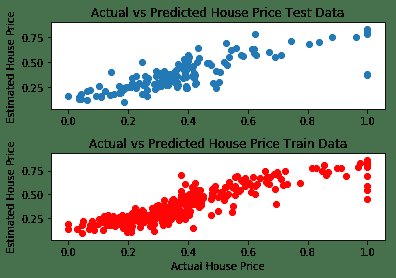

# 调整超参数

正如您现在必须已经观察到的那样，神经网络的性能在很大程度上取决于超参数。 因此，重要的是要了解这些参数如何影响网络。 超参数的常见示例是学习率，正则化器，正则化系数，隐藏层的尺寸，初始权重值，甚至是为优化权重和偏差而选择的优化器。

# 操作步骤

这是我们进行食谱的方法：

1.  调整超参数的第一步是构建模型。 完全按照我们以前的方式在 TensorFlow 中构建模型。
2.  添加一种将模型保存在`model_file`中的方法。 在 TensorFlow 中，可以使用`Saver`对象完成此操作。 然后将其保存在会话中：

```py
... saver = tf.train.Saver() ... with tf.Session() as sess: ... #Do the training steps ... save_path = saver.save(sess, "/tmp/model.ckpt") print("Model saved in file: %s" % save_path)
```

3.  接下来，确定要调整的超参数。
4.  为超参数选择可能的值。 在这里，您可以进行随机选择，等距选择或手动选择。 这三个分别称为随机搜索，网格搜索或用于优化超参数的手动搜索。 例如，这是针对学习率的：

```py
# Random Choice: generate 5 random values of learning rate 
# lying between 0 and 1 
learning_rate =  
#Grid Search: generate 5 values starting from 0, separated by 
# 0.2 
learning_rate = [i for i in np.arange(0,1,0.2)] 
#Manual Search: give any values you seem plausible manually learning_rate = [0.5, 0.6, 0.32, 0.7, 0.01]
```

5.  我们选择对我们选择的`loss`函数具有最佳响应的参数。 因此，我们可以在开始时将`loss`函数的最大值定义为`best_loss`（在精度的情况下，您将从模型中选择所需的最小精度）：

```py
best_loss = 2 
# It can be any number, but it would be better if you keep it same as the loss you achieved from your base model defined in steps 1 and 2
```

6.  将模型包装在`for`循环中以提高学习率； 然后保存任何可以更好地估计损失的模型：

```py
... # Load and preprocess data 
... # Hyperparameters 
Tuning epochs = [50, 60, 70] 
batches = [5, 10, 20] 
rmse_min = 0.04 
for epoch in epochs: 
    for batch in batches: 
        model = get_model() 
        model.compile(loss='mean_squared_error', optimizer='adam') 
        model.fit(X_train, y_train, validation_data=(X_test, y_test),epochs=epoch, batch_size=batch, verbose=1) 
        y_test_pred = model.predict(X_test) 
        rmse = mean_squared_error( y_test, y_test_pred ) 
        if rmse < rmse_min: 
            rmse_min = rmse 
            # serialize model to JSON 
            model_json = model.to_json() 
            with open("model.json", "w") as json_file: 
                json_file.write(model_json) 
                # serialize weights to HDF5  
                model.save_weights("model.hdf5") 
                print("Saved model to disk")
```

# 更多

还有另一种称为**贝叶斯优化**的方法，该方法也可以用于调整超参数。 在其中，我们定义了一个采集函数以及一个高斯过程。 高斯过程使用一组先前评估的参数以及由此产生的精度来假设大约未观测到的参数。 使用此信息的采集功能建议使用下一组参数。 有一个包装程序甚至可用于[基于梯度的超参数优化](https://github.com/lucfra/RFHO)。

# 另见

*   [两个用于超级参数优化的出色开源软件包的很好介绍：Hyperopt 和 scikit-optimize](https://roamanalytics.com/2016/09/15/optimizing-the-hyperparameter-of-which-hyperparameter-optimizer-to-use/)
*   [另一个有关 Hyperopt 的内容](http://fastml.com/optimizing-hyperparams-with-hyperopt/)
*   [Bengio 和其他人撰写的有关超参数优化各种算法的详细论文](https://papers.nips.cc/paper/4443-algorithms-for-hyper-parameter-optimization.pdf)

# 更高级别的 API -- Keras

Keras 是将 TensorFlow 作为后端使用的高级 API。 向其添加层就像添加一行代码一样容易。 在建立模型架构之后，您可以使用一行代码来编译和拟合模型。 以后，它可以用于预测。 变量，占位符甚至会话的声明均由 API 管理。

# 操作步骤

我们对 Keras 进行如下操作：

1.  第一步，我们定义模型的类型。 Keras 提供了两种类型的模型：顺序模型 API 和模型类 API。 Keras 提供了各种类型的神经网络层：

```py
# Import the model and layers needed  
from keras.model import Sequential 
from keras.layers import Dense 

model = Sequential() 
```

2.  借助`model.add()`将图层添加到模型中。 Keras 为密集连接的神经网络`layer Dense(units, activation=None, use_bias=True, kernel_initializer='glorot_uniform', bias_initializer='zeros', kernel_regularizer=None, bias_regularizer=None, activity_regularizer=None, kernel_constraint=None, bias_constraint=None)`提供了一个密集层的选项。 根据 Keras 文档：

Dense implements the operation: `output = activation(dot(input, kernel) + bias)` where activation is the element-wise activation function passed as the activation argument, kernel is a weights matrix created by the layer, and bias is a bias vector created by the layer (only applicable if `use_bias` is `True`).

3.  我们可以使用它来添加任意数量的图层，每个隐藏的图层都由上一层提供。 我们只需要为第一层指定输入尺寸：

```py
#This will add a fully connected neural network layer with 32 neurons, each taking 13 inputs, and with activation function ReLU 
mode.add(Dense(32, input_dim=13, activation='relu')) )) 
model.add(10, activation='sigmoid')
```

4.  定义模型后，我们需要选择`loss`函数和优化器。 Keras 提供了多种`loss_functions`：`mean_squared_error`，`mean_absolute_error`，`mean_absolute_percentage_error`，`categorical_crossentropy`； 和优化程序：SGD，RMSprop，Adagrad，Adadelta，Adam 等。 决定了这两个条件后，我们可以使用`compile(self, optimizer, loss, metrics=None, sample_weight_mode=None)`配置学习过程：

```py
model.compile(optimizer='rmsprop', 
          loss='categorical_crossentropy', 
          metrics=['accuracy']) 
```

5.  接下来，使用`fit`方法训练模型：

```py
model.fit(data, labels, epochs=10, batch_size=32) 
```

6.  最后，可以借助`predict`方法`predict(self, x, batch_size=32, verbose=0)`进行预测：

```py
model.predict(test_data, batch_size=10) 
```

# 更多

Keras 提供了添加卷积层，池化层，循环层甚至本地连接层的选项。 [Keras 文档](https://keras.io/models/sequential/)中提供了每种方法的详细说明。

# 另见

```py
McCulloch, Warren S., and Walter Pitts. A logical calculus of the ideas immanent in nervous activity The bulletin of mathematical biophysics 5.4 (1943): 115-133. http://vordenker.de/ggphilosophy/mcculloch_a-logical-calculus.pdf

Rosenblatt, Frank (1957), The Perceptron--a perceiving and recognizing automaton. Report 85-460-1, Cornell Aeronautical Laboratory. https://blogs.umass.edu/brain-wars/files/2016/03/rosenblatt-1957.pdf

The Thinking Machine, CBS Broadcast https://www.youtube.com/watch?v=jPHUlQiwD9Y
```