# 四、卷积神经网络

**卷积神经网络**（**CNN** 或有时称为 **ConvNets**）令人着迷。 在短时间内，它们成为一种破坏性技术，打破了从文本，视频到语音的多个领域中的所有最新技术成果，远远超出了最初用于图像处理的范围。 在本章中，我们将介绍一些方法，如下所示：

*   创建一个卷积网络对手写 MNIST 编号进行分类
*   创建一个卷积网络对 CIFAR-10 进行分类
*   使用 VGG19 传输样式以进行图像重绘
*   使用预训练的 VGG16 网络进行迁移学习
*   创建 DeepDream 网络

# 介绍

CNN 由许多神经网络层组成。 卷积和池化两种不同类型的层通常是交替的。 网络中每个过滤器的深度从左到右增加。 最后一级通常由一个或多个完全连接的层组成：


An example of Convolutional Neural Network as seen is https://commons.wikimedia.org/wiki/File:Typical_cnn.png

卷积网络背后有三个主要的直觉：**局部接受域**，**共享权重**和**池化**。 让我们一起回顾一下。

# 当地接受领域

如果我们要保留通常在图像中发现的空间信息，则使用像素矩阵表示每个图像会很方便。 然后，编码局部结构的一种简单方法是将相邻输入神经元的子矩阵连接到属于下一层的单个隐藏神经元中。 单个隐藏的神经元代表一个局部感受野。 请注意，此操作名为**卷积**，它为这种类型的网络提供了名称。

当然，我们可以通过重叠子矩阵来编码更多信息。 例如，假设每个子矩阵的大小为`5 x 5`，并且这些子矩阵用于`28 x 28`像素的 MNIST 图像。 然后，我们将能够在下一个隐藏层中生成`23 x 23`个局部感受野神经元。 实际上，在触摸图像的边界之前，可以仅将子矩阵滑动 23 个位置。

让我们定义从一层到另一层的特征图。 当然，我们可以有多个可以从每个隐藏层中独立学习的特征图。 例如，我们可以从`28 x 28`个输入神经元开始处理 MNIST 图像，然后在下一个隐藏的区域中调用`k`个特征图，每个特征图的大小为`23 x 23`神经元（步幅为`5 x 5`）。

# 权重和偏见

假设我们想通过获得独立于输入图像中放置同一特征的能力来摆脱原始像素表示的困扰。 一个简单的直觉是对隐藏层中的所有神经元使用相同的权重和偏差集。 这样，每一层将学习从图像派生的一组位置无关的潜在特征。

# 一个数学例子

一种了解卷积的简单方法是考虑应用于矩阵的滑动窗口函数。 在下面的示例中，给定输入矩阵`I`和内核`K`，我们得到了卷积输出。 将`3 x 3`内核`K`（有时称为**过滤器**或**特征检测器**）与输入矩阵逐元素相乘，得到输出卷积矩阵中的一个单元格。 通过在`I`上滑动窗口即可获得所有其他单元格：

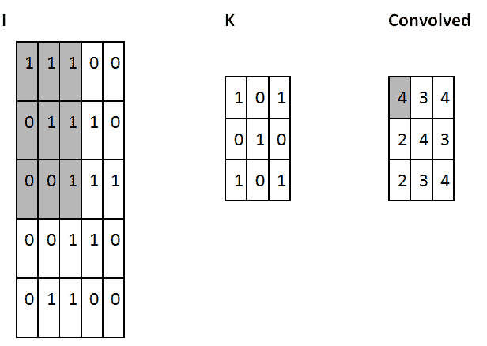

An example of convolutional operation: in bold the cells involved in the computation

在此示例中，我们决定在触摸`I`的边界后立即停止滑动窗口（因此输出为`3 x 3`）。 或者，我们可以选择用零填充输入（以便输出为`5 x 5`）。 该决定与所采用的**填充**选择有关。

另一个选择是关于**步幅**，这与我们的滑动窗口采用的移位类型有关。 这可以是一个或多个。 较大的跨度将生成较少的内核应用程序，并且较小的输出大小，而较小的跨度将生成更多的输出并保留更多信息。

过滤器的大小，步幅和填充类型是超参数，可以在网络训练期间进行微调。

# TensorFlow 中的 ConvNets

在 TensorFlow 中，如果要添加卷积层，我们将编写以下内容：

```py
tf.nn.conv2d(input, filter, strides, padding, use_cudnn_on_gpu=None, data_format=None, name=None)
```

以下是参数：

*   `input`：张量必须为以下类型之一：`float32`和`float64`。
*   `filter`：张量必须与输入具有相同的类型。
*   `strides`：整数列表。 长度为 1 的 4D。输入每个维度的滑动窗口的步幅。 必须与格式指定的尺寸顺序相同。
*   `padding`：来自`SAME`，`VALID`的字符串。 要使用的填充算法的类型。
*   `use_cudnn_on_gpu`：可选的布尔值。 默认为`True`。
*   `data_format`：来自`NHWC`和`NCHW`的可选字符串。 默认为`NHWC`。 指定输入和输出数据的数据格式。 使用默认格式`NHWC`时，数据按以下顺序存储：[`batch`，`in_height`，`in_width`和`in_channels`]。 或者，格式可以是`NCHW`，数据存储顺序为：[`batch`，`in_channels`，`in_height, in_width`]。
*   `name`：操作的名称（可选）。

下图提供了卷积的示例：

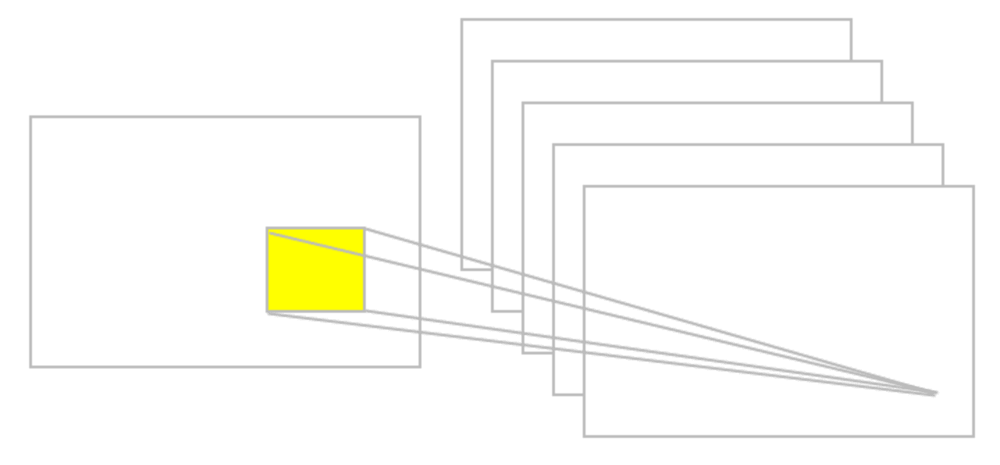

An example of convolutional operation

# 汇聚层

假设我们要总结特征图的输出。 同样，我们可以使用从单个特征图生成的输出的空间连续性，并将子矩阵的值聚合为一个单个输出值，以综合方式描述与该物理区域相关的含义。

# 最大池

一个简单而常见的选择是所谓的**最大池化运算符**，它仅输出在该区域中观察到的最大激活。 在 TensorFlow 中，如果要定义大小为`2 x 2`的最大池化层，我们将编写以下内容：

```py
tf.nn.max_pool(value, ksize, strides, padding, data_format='NHWC', name=None)
```

这些是参数：

*   `value`：形状为[`batch`，`height`，`width`，`channels`]且类型为`tf.float32`的 4-D 张量。
*   `ksize`：长度`>= 4`的整数的列表。输入张量每个维度的窗口大小。
*   `strides`：长度`>= 4`的整数的列表。输入张量每个维度的滑动窗口的步幅。
*   `padding`：`VALID`或`SAME`的字符串。
*   `data_format`：字符串。 支持`NHWC`和`NCHW`。
*   `name`：操作的可选名称。

下图给出了最大池化操作的示例：

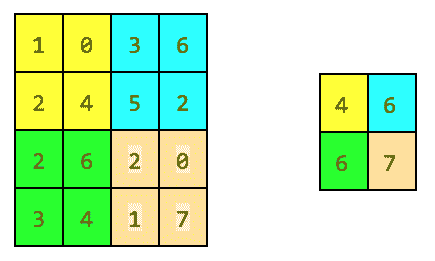

An example of pooling operation

# 平均池化

另一个选择是“平均池化”，它可以将一个区域简单地汇总为在该区域中观察到的激活平均值。

TensorFlow 实现了大量池化层，[可在线获取完整列表](https://www.tensorflow.org/api_guides/python/nn#Pooling)。简而言之，所有池化操作仅是对给定区域的汇总操作。

# ConvNets 摘要

CNN 基本上是卷积的几层，具有非线性激活函数，并且池化层应用于结果。 每层应用不同的过滤器（数百或数千）。 要理解的主要观察结果是未预先分配滤波器，而是在训练阶段以最小化合适损失函数的方式来学习滤波器。 已经观察到，较低的层将学会检测基本特征，而较高的层将逐渐检测更复杂的特征，例如形状或面部。 请注意，得益于合并，后一层中的单个神经元可以看到更多的原始图像，因此它们能够组成在前几层中学习的基本特征。

到目前为止，我们已经描述了 ConvNets 的基本概念。 CNN 在沿时间维度的一维中对音频和文本数据应用卷积和池化操作，在沿（高度 x 宽度）维的图像中对二维图像应用卷积和池化操作，对于沿（高度 x 宽度 x 时间）维的视频中的三个维度应用卷积和池化操作。 对于图像，在输入体积上滑动滤镜会生成一个贴图，该贴图为每个空间位置提供滤镜的响应。

In other words, a ConvNet has multiple filters stacked together that learn to recognize specific visual features independently of the location in the image. Those visual features are simple in the initial layers of the network and then more and more sophisticated deeper in the network.

# 创建一个卷积网络对手写 MNIST 编号进行分类

在本食谱中，您将学习如何创建一个简单的三层卷积网络来预测 MNIST 数字。 深度网络由具有 ReLU 和最大池化的两个卷积层以及两个完全连接的最终层组成。

# 做好准备

MNIST 是一组 60,000 张代表手写数字的图像。 本食谱的目的是高精度地识别这些数字。

# 怎么做...

让我们从食谱开始：

1.  导入`tensorflow`，`matplotlib`，`random`和`numpy`。 然后，导入`minst`数据并执行一键编码。 请注意，TensorFlow 具有一些内置库来处理`MNIST`，我们将使用它们：

```py
from __future__ import  division, print_function 
import tensorflow as tf 
import matplotlib.pyplot as plt 
import numpy as np 
# Import MNIST data 
from tensorflow.examples.tutorials.mnist import input_data 
mnist = input_data.read_data_sets("MNIST_data/", one_hot=True) 
```

2.  内省一些数据以了解`MNIST`是什么。 这使我们知道了训练数据集中有多少张图像，测试数据集中有多少张图像。 我们还将可视化一些数字，只是为了理解它们的表示方式。 多单位输出可以使我们直观地认识到即使对于人类来说，识别手写数字也有多困难。

```py
def train_size(num): 
    print ('Total Training Images in Dataset = ' + str(mnist.train.images.shape)) 
    print ('--------------------------------------------------') 
    x_train = mnist.train.images[:num,:] 
    print ('x_train Examples Loaded = ' + str(x_train.shape)) 
    y_train = mnist.train.labels[:num,:] 
    print ('y_train Examples Loaded = ' + str(y_train.shape)) 
    print('') 
    return x_train, y_train 
def test_size(num): 
    print ('Total Test Examples in Dataset = ' + str(mnist.test.images.shape)) 
    print ('--------------------------------------------------') 
    x_test = mnist.test.images[:num,:] 
    print ('x_test Examples Loaded = ' + str(x_test.shape)) 
    y_test = mnist.test.labels[:num,:] 
    print ('y_test Examples Loaded = ' + str(y_test.shape)) 
    return x_test, y_test 
def display_digit(num): 
    print(y_train[num]) 
    label = y_train[num].argmax(axis=0) 
    image = x_train[num].reshape([28,28]) 
    plt.title('Example: %d  Label: %d' % (num, label)) 
    plt.imshow(image, cmap=plt.get_cmap('gray_r')) 
    plt.show() 
def display_mult_flat(start, stop): 
    images = x_train[start].reshape([1,784]) 
    for i in range(start+1,stop): 
        images = np.concatenate((images, x_train[i].reshape([1,784]))) 
    plt.imshow(images, cmap=plt.get_cmap('gray_r')) 
    plt.show() 
x_train, y_train = train_size(55000) 
display_digit(np.random.randint(0, x_train.shape[0])) 
display_mult_flat(0,400) 
```

让我们看一下前面代码的输出：

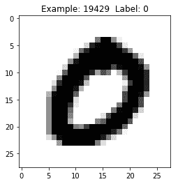

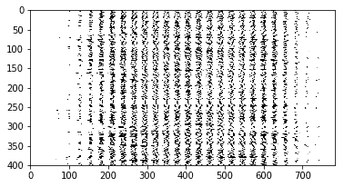

An example of MNIST handwritten numbers

3.  设置学习参数`batch_size`和`display_step`。 另外，假设 MNIST 图像共享`28 x 28`像素，请设置`n_input = 784`，表示输出数字`[0-9]`的输出`n_classes = 10`，且丢失概率`= 0.85`：

```py
# Parameters 
learning_rate = 0.001 
training_iters = 500 
batch_size = 128 
display_step = 10 
# Network Parameters 
n_input = 784 
# MNIST data input (img shape: 28*28) 
n_classes = 10 
# MNIST total classes (0-9 digits) 
dropout = 0.85 
# Dropout, probability to keep units 
```

4.  设置 TensorFlow 计算图输入。 让我们定义两个占位符以存储预测和真实标签：

```py
x = tf.placeholder(tf.float32, [None, n_input]) 
y = tf.placeholder(tf.float32, [None, n_classes]) 
keep_prob = tf.placeholder(tf.float32)  
```

5.  使用输入`x`，权重`W`，偏差`b`和给定的步幅定义卷积层。 激活函数为 ReLU，填充为`SAME`：

```py
def conv2d(x, W, b, strides=1): 
    x = tf.nn.conv2d(x, W, strides=[1, strides, strides, 1], padding='SAME') 
    x = tf.nn.bias_add(x, b) 
    return tf.nn.relu(x)
```

6.  使用输入`x`，`ksize`和`SAME`填充定义一个最大池化层：

```py
def maxpool2d(x, k=2): 
    return tf.nn.max_pool(x, ksize=[1, k, k, 1], strides=[1, k, k, 1], padding='SAME') 
```

7.  用两个卷积层定义一个卷积网络，然后是一个完全连接的层，一个退出层和一个最终输出层：

```py
def conv_net(x, weights, biases, dropout): 
    # reshape the input picture 
    x = tf.reshape(x, shape=[-1, 28, 28, 1]) 
    # First convolution layer 
    conv1 = conv2d(x, weights['wc1'], biases['bc1']) 
    # Max Pooling used for downsampling 
    conv1 = maxpool2d(conv1, k=2) 
    # Second convolution layer 
    conv2 = conv2d(conv1, weights['wc2'], biases['bc2']) 
    # Max Pooling used for downsampling 
    conv2 = maxpool2d(conv2, k=2) 
    # Reshape conv2 output to match the input of fully connected layer  
    fc1 = tf.reshape(conv2, [-1, weights['wd1'].get_shape().as_list()[0]]) 
    # Fully connected layer 
    fc1 = tf.add(tf.matmul(fc1, weights['wd1']), biases['bd1']) 
    fc1 = tf.nn.relu(fc1) 
    # Dropout 
    fc1 = tf.nn.dropout(fc1, dropout) 
    # Output the class prediction 
    out = tf.add(tf.matmul(fc1, weights['out']), biases['out']) 
    return out
```

8.  定义图层权重和偏差。 第一转换层具有`5 x 5`卷积，1 个输入和 32 个输出。 第二个卷积层具有`5 x 5`卷积，32 个输入和 64 个输出。 全连接层具有`7 x 7 x 64`输入和 1,024 输出，而第二层具有 1,024 输入和 10 输出，对应于最终数字类别。 所有权重和偏差均使用`randon_normal`分布进行初始化：

```py
weights = { 
    # 5x5 conv, 1 input, and 32 outputs 
    'wc1': tf.Variable(tf.random_normal([5, 5, 1, 32])), 
    # 5x5 conv, 32 inputs, and 64 outputs 
    'wc2': tf.Variable(tf.random_normal([5, 5, 32, 64])), 
    # fully connected, 7*7*64 inputs, and 1024 outputs 
    'wd1': tf.Variable(tf.random_normal([7*7*64, 1024])), 
    # 1024 inputs, 10 outputs for class digits 
    'out': tf.Variable(tf.random_normal([1024, n_classes])) 
} 
biases = { 
    'bc1': tf.Variable(tf.random_normal([32])), 
    'bc2': tf.Variable(tf.random_normal([64])), 
    'bd1': tf.Variable(tf.random_normal([1024])), 
    'out': tf.Variable(tf.random_normal([n_classes])) 
} 
```

9.  使用给定的权重和偏差构建卷积网络。 基于`cross_entropy`和`logits`定义`loss`功能，并使用 Adam 优化器来最小化成本。 优化后，计算精度：

```py
pred = conv_net(x, weights, biases, keep_prob) 
cost = tf.reduce_mean(tf.nn.softmax_cross_entropy_with_logits(logits=pred, labels=y)) 
optimizer = tf.train.AdamOptimizer(learning_rate=learning_rate).minimize(cost) 
correct_prediction = tf.equal(tf.argmax(pred, 1), tf.argmax(y, 1)) 
accuracy = tf.reduce_mean(tf.cast(correct_prediction, tf.float32)) 
init = tf.global_variables_initializer()
```

10.  启动图形并迭代`training_iterats`次，每次在输入中输入`batch_size`来运行优化器。 请注意，我们使用`mnist.train`数据进行训练，该数据与`minst`分开。 每个`display_step`都会计算出当前的部分精度。 最后，在 2,048 张测试图像上计算精度，没有丢失。

```py
train_loss = [] 
train_acc = [] 
test_acc = [] 
with tf.Session() as sess: 
    sess.run(init) 
    step = 1 
    while step <= training_iters: 
        batch_x, batch_y = mnist.train.next_batch(batch_size) 
        sess.run(optimizer, feed_dict={x: batch_x, y: batch_y, 
                                       keep_prob: dropout}) 
        if step % display_step == 0: 
            loss_train, acc_train = sess.run([cost, accuracy],  
                                             feed_dict={x: batch_x, 
                                                        y: batch_y, 
                                                        keep_prob: 1.}) 
            print "Iter " + str(step) + ", Minibatch Loss= " + \ 
                  "{:.2f}".format(loss_train) + ", Training Accuracy= " + \ 
                  "{:.2f}".format(acc_train) 
            # Calculate accuracy for 2048 mnist test images.  
            # Note that in this case no dropout 
            acc_test = sess.run(accuracy,  
                                feed_dict={x: mnist.test.images, 
                                      y: mnist.test.labels, 
                                      keep_prob: 1.}) 
            print "Testing Accuracy:" + \ 
               "{:.2f}".format(acc_train) 
            train_loss.append(loss_train) 
            train_acc.append(acc_train) 
            test_acc.append(acc_test)             
        step += 1
```

11.  绘制每次迭代的 Softmax 损失以及训练和测试精度：

```py
eval_indices = range(0, training_iters, display_step) 
# Plot loss over time 
plt.plot(eval_indices, train_loss, 'k-') 
plt.title('Softmax Loss per iteration') 
plt.xlabel('Iteration') 
plt.ylabel('Softmax Loss') 
plt.show() 
# Plot train and test accuracy 
plt.plot(eval_indices, train_acc, 'k-', label='Train Set Accuracy') 
plt.plot(eval_indices, test_acc, 'r--', label='Test Set Accuracy') 
plt.title('Train and Test Accuracy') 
plt.xlabel('Generation') 
plt.ylabel('Accuracy') 
plt.legend(loc='lower right') 
plt.show() 
```

以下是前面代码的输出。 我们首先看一下每次迭代的 Softmax：

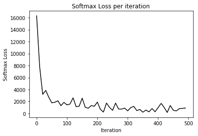

An example of loss decrease

接下来我们看一下火车和文本的准确性：

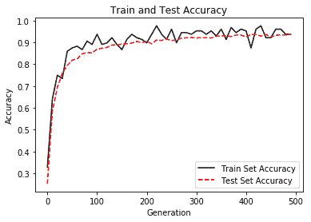

An example of train and test accuracy increase

# 这个怎么运作...

使用卷积网络，我们将 MNIST 数据集的性能提高了近 95%。 我们的卷积网络由两层组成，分别是卷积，ReLU 和最大池化，然后是两个完全连接的带有丢弃的层。 训练以 Adam 为优化器，以 128 的大小批量进行，学习率为 0.001，最大迭代次数为 500。

# 创建一个卷积网络对 CIFAR-10 进行分类

在本食谱中，您将学习如何对从 CIFAR-10 拍摄的图像进行分类。 CIFAR-10 数据集由 10 类 60,000 张`32 x 32`彩色图像组成，每类 6,000 张图像。 有 50,000 张训练图像和 10,000 张测试图像。 下图取自[这里](https://www.cs.toronto.edu/~kriz/cifar.html)：

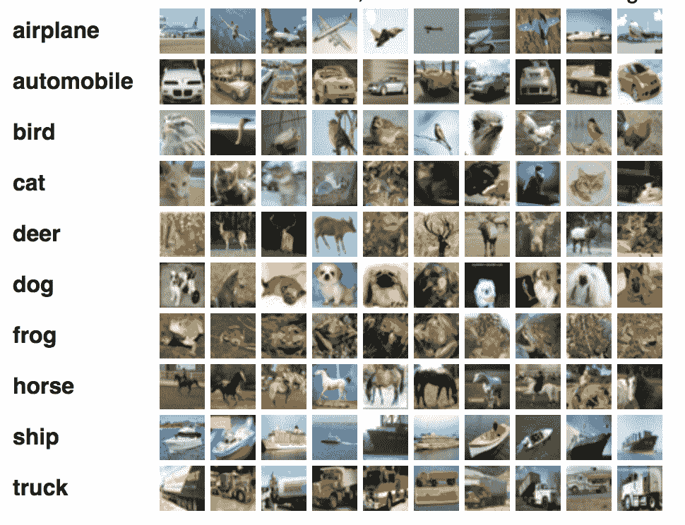

Examples of CIFAR images

# 做好准备

在本食谱中，我们使用`tflearn`-一个更高级别的框架-抽象了一些 TensorFlow 内部结构，使我们可以专注于深度网络的定义。 TFLearn 可从[这里](http://tflearn.org/)获得，[该代码是标准发行版的一部分](https://github.com/tflearn/tflearn/tree/master/examples)。 

# 怎么做...

我们按以下步骤进行：

1.  为卷积网络，`dropout`，`fully_connected`和`max_pool`导入一些`utils`和核心层。 此外，导入一些对图像处理和图像增强有用的模块。 请注意，TFLearn 为卷积网络提供了一些已经定义的更高层，这使我们可以专注于代码的定义：

```py
from __future__ import division, print_function, absolute_import 
import tflearn 
from tflearn.data_utils import shuffle, to_categorical 
from tflearn.layers.core import input_data, dropout, fully_connected 
from tflearn.layers.conv import conv_2d, max_pool_2d 
from tflearn.layers.estimator import regression 
from tflearn.data_preprocessing import ImagePreprocessing 
from tflearn.data_augmentation import ImageAugmentation 
```

2.  加载 CIFAR-10 数据，并将其分为`X`列数据，`Y`列标签，用于测试的`X_test`和用于测试标签的`Y_test`。 随机排列`X`和`Y`可能会很有用，以避免取决于特定的数据配置。 最后一步是对`X`和`Y`进行一次热编码：

```py
# Data loading and preprocessing 
from tflearn.datasets import cifar10 
(X, Y), (X_test, Y_test) = cifar10.load_data() 
X, Y = shuffle(X, Y) 
Y = to_categorical(Y, 10) 
Y_test = to_categorical(Y_test, 10)
```

3.  将`ImagePreprocessing()`用于零中心（在整个数据集上计算平均值）和 STD 归一化（在整个数据集上计算 std）。 TFLearn 数据流旨在通过在 GPU 执行模型训练时在 CPU 上预处理数据来加快训练速度。

```py
# Real-time data preprocessing 
img_prep = ImagePreprocessing() 
img_prep.add_featurewise_zero_center() 
img_prep.add_featurewise_stdnorm()
```

4.  通过左右随机执行以及随机旋转来增强数据集。 此步骤是一个简单的技巧，用于增加可用于训练的数据：

```py
# Real-time data augmentation 
img_aug = ImageAugmentation() 
img_aug.add_random_flip_leftright() 
img_aug.add_random_rotation(max_angle=25.) 
```

5.  使用先前定义的图像准备和扩充来创建卷积网络。 网络由三个卷积层组成。 第一个使用 32 个卷积滤波器，滤波器的大小为 3，激活函数为 ReLU。 之后，有一个`max_pool`层用于缩小尺寸。 然后有两个级联的卷积滤波器与 64 个卷积滤波器，滤波器的大小为 3，激活函数为 ReLU。 之后，有一个用于缩小规模的`max_pool`，一个具有 512 个神经元且具有激活函数 ReLU 的全连接网络，其次是辍学的可能性为 50%。 最后一层是具有 10 个神经元和激活函数`softmax`的完全连接的网络，用于确定手写数字的类别。 请注意，已知这种特定类型的卷积网络对于 CIFAR-10 非常有效。 在这种特殊情况下，我们将 Adam 优化器与`categorical_crossentropy`和学习率`0.001`结合使用：

```py
# Convolutional network building 
network = input_data(shape=[None, 32, 32, 3], 
                     data_preprocessing=img_prep, 
                     data_augmentation=img_aug) 
network = conv_2d(network, 32, 3, activation='relu') 
network = max_pool_2d(network, 2) 
network = conv_2d(network, 64, 3, activation='relu') 
network = conv_2d(network, 64, 3, activation='relu') 
network = max_pool_2d(network, 2) 
network = fully_connected(network, 512, activation='relu') 
network = dropout(network, 0.5) 
network = fully_connected(network, 10, activation='softmax') 
network = regression(network, optimizer='adam', 
                     loss='categorical_crossentropy', 
                     learning_rate=0.001)
```

6.  实例化卷积网络并使用`batch_size=96`将火车运行 50 个周期：

```py
# Train using classifier 
model = tflearn.DNN(network, tensorboard_verbose=0) 
model.fit(X, Y, n_epoch=50, shuffle=True, validation_set=(X_test, Y_test), 
          show_metric=True, batch_size=96, run_id='cifar10_cnn') 
```

# 这个怎么运作...

TFLearn 隐藏了 TensorFlow 公开的许多实现细节，并且在许多情况下，它使我们可以专注于具有更高抽象级别的卷积网络的定义。 我们的管道在 50 次迭代中达到了 88% 的精度。 下图是 Jupyter 笔记本中执行的快照：

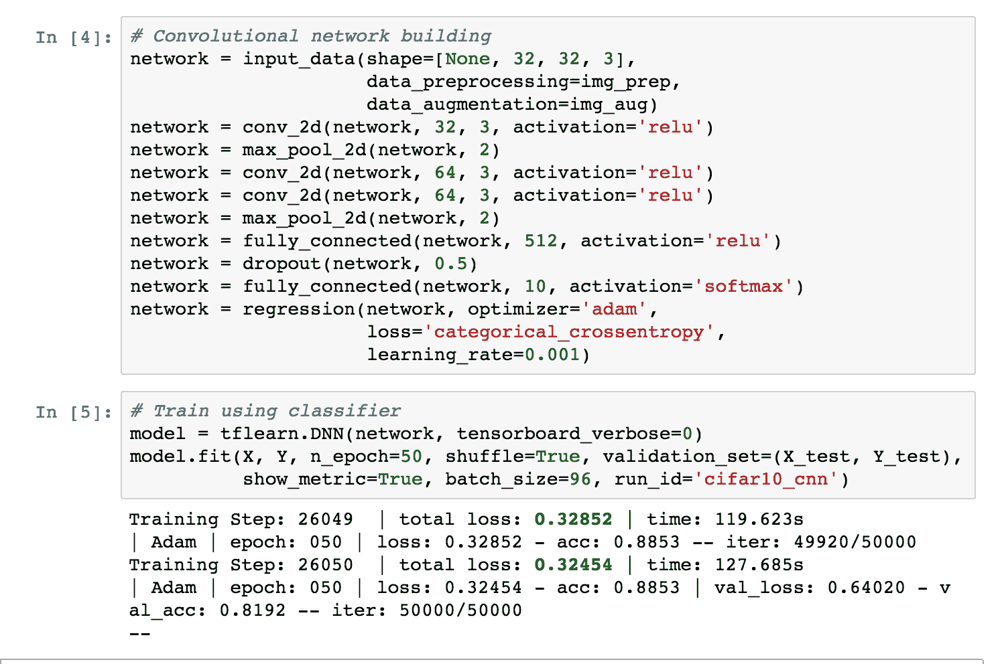

An example of Jupyter execution for CIFAR10 classification

# 还有更多...

要安装 TFLearn，请参阅[《安装指南》](http://tflearn.org/installation)，如果您想查看更多示例，可以在线获取[一长串久经考验的解决方案](http://tflearn.org/examples/)。

# 使用 VGG19 传输样式以进行图像重绘

在本食谱中，您将教计算机如何绘画。 关键思想是拥有绘画模型图像，神经网络可以从该图像推断绘画风格。 然后，此样式将转移到另一张图片，并相应地重新粉刷。 该食谱是对`log0`开发的代码的修改，[可以在线获取](https://github.com/log0/neural-style-painting/blob/master/TensorFlow%20Implementation%20of%20A%20Neural%20Algorithm%20of%20Artistic%20Style.ipynb)。

# 做好准备

我们将实现在论文[《一种艺术风格的神经算法》](https://arxiv.org/abs/1508.06576)中描述的算法，作者是 Leon A. Gatys，亚历山大 S. Ecker 和 Matthias Bethge。 因此，最好先阅读[该论文](https://arxiv.org/abs/1508.06576)。 此食谱将重复使用在线提供的预训练模型 [VGG19](http://www.vlfeat.org/matconvnet/models/beta16/imagenet-vgg-verydeep-19.mat)，该模型应在本地下载。 我们的风格图片将是一幅可在线获得的[梵高著名画作](https://commons.wikimedia.org/wiki/File:VanGogh-starry_night.jpg)，而我们的内容图片则是[从维基百科下载的玛丽莲梦露的照片](https://commons.wikimedia.org/wiki/File:Marilyn_Monroe_in_1952.jpg)。 内容图像将根据梵高的样式重新绘制。

# 怎么做...

让我们从食谱开始：

1.  导入一些模块，例如`numpy`，`scipy`，`tensorflow`和`matplotlib`。 然后导入`PIL`来处理图像。 请注意，由于此代码在 Jupyter 笔记本上运行，您可以从网上下载该片段，因此添加了片段`%matplotlib inline`：

```py
import os 
import sys 
import numpy as np 
import scipy.io 
import scipy.misc 
import tensorflow as tf 
import matplotlib.pyplot as plt 
from matplotlib.pyplot 
import imshow 
from PIL 
import Image %matplotlib inline from __future__ 
import division
```

2.  然后，设置用于学习样式的图像的输入路径，并根据样式设置要重绘的内容图像的输入路径：

```py
OUTPUT_DIR = 'output/' 
# Style image 
STYLE_IMAGE = 'data/StarryNight.jpg' 
# Content image to be repainted 
CONTENT_IMAGE = 'data/Marilyn_Monroe_in_1952.jpg'
```

3.  然后，我们设置图像生成过程中使用的噪声比，以及在重画内容图像时要强调的内容损失和样式损失。 除此之外，我们存储通向预训练的 VGG 模型的路径和在 VGG 预训练期间计算的平均值。 这个平均值是已知的，可以从 VGG 模型的输入中减去：

```py
# how much noise is in the image 
NOISE_RATIO = 0.6 
# How much emphasis on content loss. 
BETA = 5 
# How much emphasis on style loss. 
ALPHA = 100 
# the VGG 19-layer pre-trained model 
VGG_MODEL = 'data/imagenet-vgg-verydeep-19.mat' 
# The mean used when the VGG was trained 
# It is subtracted from the input to the VGG model. MEAN_VALUES = np.array([123.68, 116.779, 103.939]).reshape((1,1,1,3))
```

4.  显示内容图像只是为了了解它的样子：

```py
content_image = scipy.misc.imread(CONTENT_IMAGE) imshow(content_image)
```

这是前面代码的输出（请注意，此图像位于[这个页面](https://commons.wikimedia.org/wiki/File:Marilyn_Monroe_in_1952.jpg)中）：

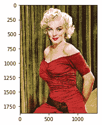

5.  调整样式图像的大小并显示它只是为了了解它的状态。 请注意，内容图像和样式图像现在具有相同的大小和相同数量的颜色通道：

```py
style_image = scipy.misc.imread(STYLE_IMAGE) 
# Get shape of target and make the style image the same 
target_shape = content_image.shape 
print "target_shape=", target_shape 
print "style_shape=", style_image.shape 
#ratio = target_shape[1] / style_image.shape[1] 
#print "resize ratio=", ratio 
style_image = scipy.misc.imresize(style_image, target_shape) 
scipy.misc.imsave(STYLE_IMAGE, style_image) 
imshow(style_image)
```

这是前面代码的输出：

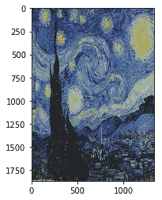

An example of Vicent Van Gogh painting as seen in https://commons.wikimedia.org/wiki/File:VanGogh-starry_night_ballance1.jpg

6.  下一步是按照原始论文中的描述定义 VGG 模型。 请注意，深度学习网络相当复杂，因为它结合了具有 ReLU 激活函数和最大池的多个卷积网络层。 另外需要注意的是，在原始论文《转移样式》（Leon A. Gatys，Alexander S. Ecker 和 Matthias Bethge 撰写的《一种艺术风格的神经算法》）中，许多实验表明，平均合并实际上优于最大池化。 因此，我们将改用平均池：

```py
def load_vgg_model(path, image_height, image_width, color_channels):
   """
   Returns the VGG model as defined in the paper
       0 is conv1_1 (3, 3, 3, 64)
       1 is relu
       2 is conv1_2 (3, 3, 64, 64)
       3 is relu    
       4 is maxpool
       5 is conv2_1 (3, 3, 64, 128)
       6 is relu
       7 is conv2_2 (3, 3, 128, 128)
       8 is relu
       9 is maxpool
       10 is conv3_1 (3, 3, 128, 256)
       11 is relu
       12 is conv3_2 (3, 3, 256, 256)
       13 is relu
       14 is conv3_3 (3, 3, 256, 256)
       15 is relu
       16 is conv3_4 (3, 3, 256, 256)
       17 is relu
       18 is maxpool
       19 is conv4_1 (3, 3, 256, 512)
       20 is relu
       21 is conv4_2 (3, 3, 512, 512)
       22 is relu
       23 is conv4_3 (3, 3, 512, 512)
       24 is relu
       25 is conv4_4 (3, 3, 512, 512)
       26 is relu
       27 is maxpool
       28 is conv5_1 (3, 3, 512, 512)
       29 is relu
       30 is conv5_2 (3, 3, 512, 512)
       31 is relu
       32 is conv5_3 (3, 3, 512, 512)
       33 is relu
       34 is conv5_4 (3, 3, 512, 512)
       35 is relu
       36 is maxpool
       37 is fullyconnected (7, 7, 512, 4096)       38 is relu
       39 is fullyconnected (1, 1, 4096, 4096)
       40 is relu
       41 is fullyconnected (1, 1, 4096, 1000)
       42 is softmax
   """
   vgg = scipy.io.loadmat(path)
   vgg_layers = vgg['layers']   

   def _weights(layer, expected_layer_name):
       """       Return the weights and bias from the VGG model for a given layer.
"""
       W = vgg_layers[0][layer][0][0][0][0][0]
       b = vgg_layers[0][layer][0][0][0][0][1]
       layer_name = vgg_layers[0][layer][0][0][-2]
       assert layer_name == expected_layer_name
       return W, b

   def _relu(conv2d_layer):
       """
       Return the RELU function wrapped over a TensorFlow layer. Expects a
       Conv2d layer input.
       """
       return tf.nn.relu(conv2d_layer)

   def _conv2d(prev_layer, layer, layer_name):
       """
       Return the Conv2D layer using the weights, biases from the VGG
       model at 'layer'.
       """
       W, b = _weights(layer, layer_name)
       W = tf.constant(W)
       b = tf.constant(np.reshape(b, (b.size)))
       return tf.nn.conv2d(
           prev_layer, filter=W, strides=[1, 1, 1, 1], padding='SAME') + b

   def _conv2d_relu(prev_layer, layer, layer_name):
       """
       Return the Conv2D + RELU layer using the weights, biases from the VGG
       model at 'layer'.
       """
       return _relu(_conv2d(prev_layer, layer, layer_name))

   def _avgpool(prev_layer):
       """
       Return the AveragePooling layer.
       """
       return tf.nn.avg_pool(prev_layer, ksize=[1, 2, 2, 1], strides=[1, 2, 2, 1], padding='SAME')

   # Constructs the graph model.
   graph = {}
   graph['input']   = tf.Variable(np.zeros((1,
                                            image_height, image_width, color_channels)),
                                  dtype = 'float32')
   graph['conv1_1']  = _conv2d_relu(graph['input'], 0, 'conv1_1')
   graph['conv1_2']  = _conv2d_relu(graph['conv1_1'], 2, 'conv1_2')
   graph['avgpool1'] = _avgpool(graph['conv1_2'])
   graph['conv2_1']  = _conv2d_relu(graph['avgpool1'], 5, 'conv2_1')
   graph['conv2_2']  = _conv2d_relu(graph['conv2_1'], 7, 'conv2_2')
   graph['avgpool2'] = _avgpool(graph['conv2_2'])
   graph['conv3_1']  = _conv2d_relu(graph['avgpool2'], 10, 'conv3_1')
   graph['conv3_2']  = _conv2d_relu(graph['conv3_1'], 12, 'conv3_2')
   graph['conv3_3']  = _conv2d_relu(graph['conv3_2'], 14, 'conv3_3')
   graph['conv3_4']  = _conv2d_relu(graph['conv3_3'], 16, 'conv3_4')
   graph['avgpool3'] = _avgpool(graph['conv3_4'])
   graph['conv4_1']  = _conv2d_relu(graph['avgpool3'], 19, 'conv4_1')
   graph['conv4_2']  = _conv2d_relu(graph['conv4_1'], 21, 'conv4_2')
   graph['conv4_3']  = _conv2d_relu(graph['conv4_2'], 23, 'conv4_3')
   graph['conv4_4']  = _conv2d_relu(graph['conv4_3'], 25, 'conv4_4')
   graph['avgpool4'] = _avgpool(graph['conv4_4'])
   graph['conv5_1']  = _conv2d_relu(graph['avgpool4'], 28, 'conv5_1')
   graph['conv5_2']  = _conv2d_relu(graph['conv5_1'], 30, 'conv5_2')
   graph['conv5_3']  = _conv2d_relu(graph['conv5_2'], 32, 'conv5_3')
   graph['conv5_4']  = _conv2d_relu(graph['conv5_3'], 34, 'conv5_4')
   graph['avgpool5'] = _avgpool(graph['conv5_4'])
   return graph
```

7.  定义内容`loss`功能，如原始论文中所述：

```py
def content_loss_func(sess, model): 
""" Content loss function as defined in the paper. """ 

def _content_loss(p, x): 
# N is the number of filters (at layer l). 
N = p.shape[3] 
# M is the height times the width of the feature map (at layer l). 
M = p.shape[1] * p.shape[2] return (1 / (4 * N * M)) * tf.reduce_sum(tf.pow(x - p, 2)) 
return _content_loss(sess.run(model['conv4_2']), model['conv4_2'])
```

8.  定义我们要重用的 VGG 层。 如果我们希望具有更柔和的功能，则需要增加较高层的重量（`conv5_1`）和降低较低层的重量（`conv1_1`）。 如果我们想拥有更难的功能，我们需要做相反的事情：

```py
STYLE_LAYERS = [ 
('conv1_1', 0.5), 
('conv2_1', 1.0), 
('conv3_1', 1.5), 
('conv4_1', 3.0), 
('conv5_1', 4.0), 
]
```

9.  定义样式损失函数，如原始论文中所述：

```py
def style_loss_func(sess, model):
   """
   Style loss function as defined in the paper.
   """

   def _gram_matrix(F, N, M):
    """
       The gram matrix G.
       """
       Ft = tf.reshape(F, (M, N))
       return tf.matmul(tf.transpose(Ft), Ft)

   def _style_loss(a, x):
       """
       The style loss calculation.
       """
       # N is the number of filters (at layer l).
       N = a.shape[3]
       # M is the height times the width of the feature map (at layer l).
       M = a.shape[1] * a.shape[2]
       # A is the style representation of the original image (at layer l).
       A = _gram_matrix(a, N, M)
       # G is the style representation of the generated image (at layer l).
       G = _gram_matrix(x, N, M)
       result = (1 / (4 * N**2 * M**2)) * tf.reduce_sum(tf.pow(G - A, 2))
       return result
       E = [_style_loss(sess.run(model[layer_name]), model[layer_name])
           for layer_name, _ in STYLE_LAYERS]
       W = [w for _, w in STYLE_LAYERS]
       loss = sum([W[l] * E[l] for l in range(len(STYLE_LAYERS))])
   return loss
```

10.  定义一个函数以生成噪声图像，并将其与内容图像按给定比例混合。 定义两种辅助方法来预处理和保存图像：

```py
def generate_noise_image(content_image, noise_ratio = NOISE_RATIO):
 """   Returns a noise image intermixed with the content image at a certain ratio.
"""
   noise_image = np.random.uniform(
           -20, 20,
           (1,
            content_image[0].shape[0],
            content_image[0].shape[1],
            content_image[0].shape[2])).astype('float32')
   # White noise image from the content representation. Take a weighted average
   # of the values
   input_image = noise_image * noise_ratio + content_image * (1 - noise_ratio)
   return input_image

def process_image(image):
   # Resize the image for convnet input, there is no change but just
   # add an extra dimension.
   image = np.reshape(image, ((1,) + image.shape))
   # Input to the VGG model expects the mean to be subtracted.
   image = image - MEAN_VALUES
   return image

def save_image(path, image):
   # Output should add back the mean.
   image = image + MEAN_VALUES
   # Get rid of the first useless dimension, what remains is the image.
   image = image[0]
   image = np.clip(image, 0, 255).astype('uint8')
   scipy.misc.imsave(path, image)
```

11.  开始一个 TensorFlow 交互式会话：

```py
sess = tf.InteractiveSession()
```

12.  加载处理后的内容图像并显示：

```py
content_image = load_image(CONTENT_IMAGE) imshow(content_image[0])
```

我们得到以下代码的输出（请注意，我们使用了来自[这里](https://commons.wikimedia.org/wiki/File:Marilyn_Monroe_in_1952.jpg)的图像）：

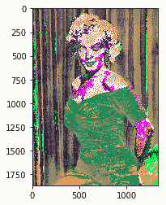

13.  加载处理后的样式图像并显示它：

```py
style_image = load_image(STYLE_IMAGE) imshow(style_image[0])
```

内容如下：

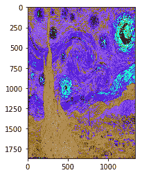

14.  加载`model`并显示：

```py
model = load_vgg_model(VGG_MODEL, style_image[0].shape[0], style_image[0].shape[1], style_image[0].shape[2]) print(model)
```

15.  生成用于引导重新绘制的随机噪声图像：

```py
input_image = generate_noise_image(content_image) imshow(input_image[0])
```

16.  运行 TensorFlow 会话：

```py
sess.run(tf.initialize_all_variables())
```

17.  用相应的图像构造`content_loss`和`sytle_loss`：

```py
# Construct content_loss using content_image. sess.run(model['input'].assign(content_image))
content_loss = content_loss_func(sess, model) 
# Construct style_loss using style_image. sess.run(model['input'].assign(style_image)) 
style_loss = style_loss_func(sess, model)
```

18.  将`total_loss`构造为`content_loss`和`sytle_loss`的加权组合：

```py
# Construct total_loss as weighted combination of content_loss and sytle_loss 
total_loss = BETA * content_loss + ALPHA * style_loss
```

19.  建立一个优化器以最大程度地减少总损失。 在这种情况下，我们采用 Adam 优化器：

```py
# The content is built from one layer, while the style is from five 
# layers. Then we minimize the total_loss 
optimizer = tf.train.AdamOptimizer(2.0) 
train_step = optimizer.minimize(total_loss)
```

20.  使用输入映像引导网络：

```py
sess.run(tf.initialize_all_variables()) sess.run(model['input'].assign(input_image))
```

21.  对模型运行固定的迭代次数，并生成中间的重绘图像：

```py
sess.run(tf.initialize_all_variables())
sess.run(model['input'].assign(input_image))
print "started iteration"
for it in range(ITERATIONS):
   sess.run(train_step)
   print it , " "
   if it%100 == 0:
       # Print every 100 iteration.
       mixed_image = sess.run(model['input'])
       print('Iteration %d' % (it))
       print('sum : ',
sess.run(tf.reduce_sum(mixed_image)))
       print('cost: ', sess.run(total_loss))
       if not os.path.exists(OUTPUT_DIR):
           os.mkdir(OUTPUT_DIR)
       filename = 'output/%d.png' % (it)
       save_image(filename, mixed_image)
```

22.  在此图像中，我们显示了在 200、400 和 600 次迭代后如何重新绘制内容图像：


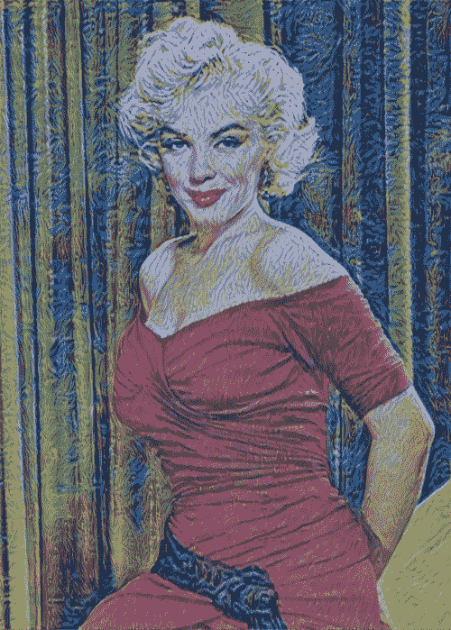

An example of style transfer

# 这个怎么运作...

在本食谱中，我们已经看到了如何使用样式转换来重绘内容图像。 样式图像已作为神经网络的输入提供，该网络学习了定义画家采用的样式的关键方面。 这些方面已用于将样式转移到内容图像。

# 还有更多...

自 2015 年提出原始建议以来，样式转换一直是活跃的研究领域。已经提出了许多新想法来加速计算并将样式转换扩展到视频分析。 其中有两个结果值得一提

这篇文章是 [Logan Engstrom](https://github.com/lengstrom/fast-style-transfer/) 的快速样式转换，介绍了一种非常快速的实现，该实现也可以与视频一起使用。

通过 [deepart](https://deepart.io/) 网站，您可以播放自己的图像，并以自己喜欢的艺术家的风格重新绘制图片。 还提供了 Android 应用程序，iPhone 应用程序和 Web 应用程序。

# 使用预训练的 VGG16 网络进行迁移学习

在本食谱中，我们将讨论转移学习，这是一种非常强大的深度学习技术，在不同领域中都有许多应用程序。 直觉非常简单，可以用类推来解释。 假设您想学习一种新的语言，例如西班牙语，那么从另一种语言（例如英语）已经知道的内容开始可能会很有用。

按照这种思路，计算机视觉研究人员现在通常使用经过预训练的 CNN 来生成新颖任务的表示形式，其中数据集可能不足以从头训练整个 CNN。 另一个常见的策略是采用经过预先训练的 ImageNet 网络，然后将整个网络微调到新颖的任务。 此处提出的示例的灵感来自 [Francois Chollet 在 Keras 的著名博客文章](https://blog.keras.io/building-powerful-image-classification-models-using-very-little-data.html)。

# 做好准备

想法是使用在大型数据集（如 ImageNet）上预训练的 VGG16 网络。 请注意，训练在计算上可能会相当昂贵，因此可以重用已经预先训练的网络：


A VGG16 Network

那么，如何使用 VGG16？ Keras 使该库变得容易，因为该库具有可作为库使用的标准 VGG16 应用程序，并且自动下载了预先计算的权重。 请注意，我们明确省略了最后一层，并用我们的自定义层替换了它，这将在预构建的 VGG16 的顶部进行微调。 在此示例中，您将学习如何对 Kaggle 提供的猫狗图像进行分类。

# 怎么做...

我们按以下步骤进行：

1.  从 Kaggle（https://www.kaggle.com/c/dogs-vs-cats/data）下载猫狗数据，并创建一个包含两个子目录的数据目录，`train`和`validation`，每个子目录都有两个附加子目录， 狗和猫。
2.  导入 Keras 模块，这些模块将在以后的计算中使用，并保存一些有用的常量：

```py
from keras import applications
from keras.preprocessing.image import ImageDataGenerator
from keras import optimizers
from keras.models import Sequential, Model
from keras.layers import Dropout, Flatten, Dense
from keras import optimizers
img_width, img_height = 256, 256
batch_size = 16
epochs = 50
train_data_dir = 'data/dogs_and_cats/train'
validation_data_dir = 'data/dogs_and_cats/validation'
#OUT CATEGORIES
OUT_CATEGORIES=1
#number of train, validation samples
nb_train_samples = 2000
nb_validation_samples =
```

3.  将预训练的图像加载到 ImageNet VGG16 网络上，并省略最后一层，因为我们将在预构建的 VGG16 的顶部添加自定义分类网络并替换最后的分类层：

```py
# load the VGG16 model pretrained on imagenet 
base_model = applications.VGG16(weights = "imagenet", include_top=False, input_shape = (img_width, img_height, 3)) 
base_model.summary()
```

这是前面代码的输出：

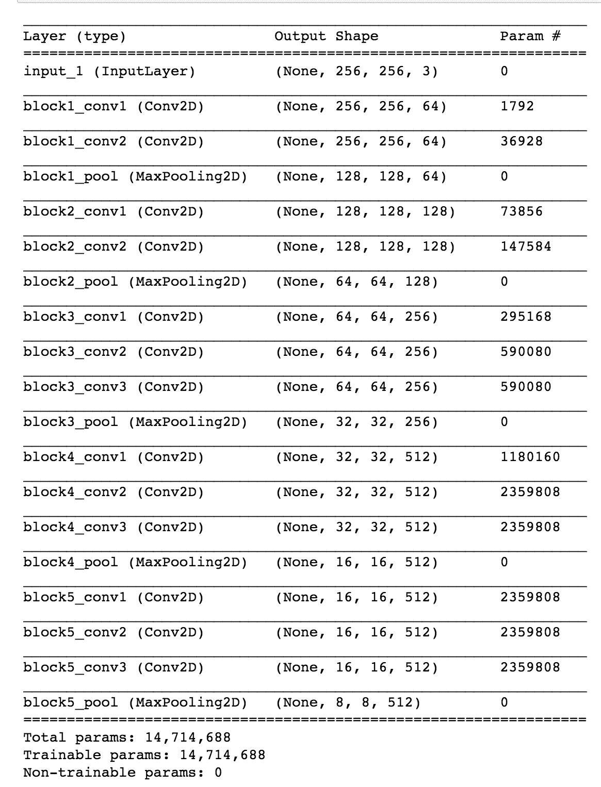

4.  冻结一定数量的较低层用于预训练的 VGG16 网络。 在这种情况下，我们决定冻结最初的 15 层：

```py
# Freeze the 15 lower layers for layer in base_model.layers[:15]: layer.trainable = False
```

5.  添加一组自定义的顶层进行分类：

```py
# Add custom to layers # build a classifier model to put on top of the convolutional model top_model = Sequential() top_model.add(Flatten(input_shape=base_model.output_shape[1:])) 
top_model.add(Dense(256, activation='relu')) top_model.add(Dropout(0.5)) top_model.add(Dense(OUT_CATEGORIES, activation='sigmoid'))
```

6.  定制网络应单独进行预训练，在这里，为简单起见，我们省略了这一部分，将这一任务留给了读者：

```py
#top_model.load_weights(top_model_weights_path)
```

7.  创建一个新网络，该网络与预训练的 VGG16 网络和我们的预训练的自定义网络并置：

```py
# creating the final model, a composition of 
# pre-trained and 
model = Model(inputs=base_model.input, outputs=top_model(base_model.output)) 
# compile the model 
model.compile(loss = "binary_crossentropy", optimizer = optimizers.SGD(lr=0.0001, momentum=0.9), metrics=["accuracy"])
```

8.  重新训练并列的新模型，仍将 VGG16 的最低 15 层冻结。 在这个特定的例子中，我们还使用图像增幅器来增加训练集：

```py
# Initiate the train and test generators with data Augumentation
train_datagen = ImageDataGenerator(
rescale = 1./255,
horizontal_flip = True)
test_datagen = ImageDataGenerator(rescale=1\. / 255)
train_generator = train_datagen.flow_from_directory(
   train_data_dir,
   target_size=(img_height, img_width),
   batch_size=batch_size,
   class_mode='binary')
validation_generator = test_datagen.flow_from_directory(
   validation_data_dir,
   target_size=(img_height, img_width),
   batch_size=batch_size,
   class_mode='binary', shuffle=False)
model.fit_generator(
   train_generator,
   steps_per_epoch=nb_train_samples // batch_size,
   epochs=epochs,
   validation_data=validation_generator,
   validation_steps=nb_validation_samples // batch_size,
   verbose=2, workers=12)
```

9.  在并置的网络上评估结果：

```py
score = model.evaluate_generator(validation_generator, nb_validation_samples/batch_size) 
scores = model.predict_generator(validation_generator, nb_validation_samples/batch_size)
```

# 这个怎么运作...

标准的 VGG16 网络已经在整个 ImageNet 上进行了预训练，并具有从互联网下载的预先计算的权重。 然后，将该网络与也已单独训练的自定义网络并置。 然后，并列的网络作为一个整体进行了重新训练，使 VGG16 的 15 个较低层保持冻结。

这种组合非常有效。 通过对网络在 ImageNet 上学到的知识进行转移学习，将其应用于我们的新特定领域，从而执行微调分类任务，它可以节省大量的计算能力，并重复使用已为 VGG16 执行的工作。

# 还有更多...

根据特定的分类任务，需要考虑一些经验法则：

*   如果新数据集很小并且类似于 ImageNet 数据集，那么我们可以冻结所有 VGG16 网络并仅重新训练自定义网络。 通过这种方式，我们还将并置网络的过拟合风险降至最低：

＃冻结`base_model.layers`中所有较低的层：`layer.trainable = False`

*   如果新数据集很大且类似于 ImageNet 数据集，则我们可以重新训练整个并列的网络。 我们仍然将预先计算的权重作为起点，并进行一些迭代以进行微调：

＃取消冻结`model.layers`中所有较低层的图层：`layer.trainable = True`

*   如果新数据集与 ImageNet 数据集非常不同，则在实践中，使用预训练模型中的权重进行初始化可能仍然很好。 在这种情况下，我们将有足够的数据和信心来调整整个网络。 可以在[这里](http://cs231n.github.io/transfer-learning/)在线找到更多信息。

# 创建 DeepDream 网络

Google 于 2014 年训练了神经网络以应对 **ImageNet 大规模视觉识别挑战**（**ILSVRC**），并于 2015 年 7 月将其开源。[“深入了解卷积”](https://arxiv.org/abs/1409.4842)中介绍了原始算法。 网络学会了每个图像的表示。 较低的层学习诸如线条和边缘之类的底层特征，而较高的层则学习诸如眼睛，鼻子，嘴等更复杂的图案。 因此，如果尝试在网络中代表更高的级别，我们将看到从原始 ImageNet 提取的各种不同特征的混合，例如鸟的眼睛和狗的嘴巴。 考虑到这一点，如果我们拍摄一张新图像并尝试使与网络上层的相似性最大化，那么结果就是一张新的有远见的图像。 在这个有远见的图像中，较高层学习的某些模式在原始图像中被梦到（例如，想象中）。 这是此类有远见的图像的示例：

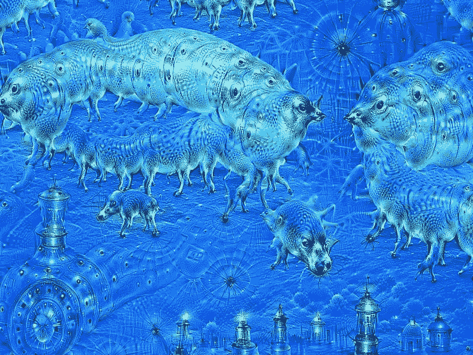

[如以下所示的 Google DeepDreams 示例](https://commons.wikimedia.org/wiki/File:Aurelia-aurita-3-0009.jpg)

# 做好准备

从网上下载预训练的 [Inception 模型](https://github.com/martinwicke/tensorflow-tutorial/blob/master/tensorflow_inception_graph.pb)。

# 怎么做...

我们按以下步骤进行操作：

1.  导入`numpy`进行数值计算，导入`functools`定义已填充一个或多个参数的部分函数，​​导入 Pillow 进行图像处理，并导入`matplotlib`呈现图像：

```py
import numpy as np from functools 
import partial import PIL.Image 
import tensorflow as tf 
import matplotlib.pyplot as plt
```

2.  设置内容图像和预训练模型的路径。 从只是随机噪声的种子图像开始：

```py
content_image = 'data/gulli.jpg' 
# start with a gray image with a little noise 
img_noise = np.random.uniform(size=(224,224,3)) + 100.0 
model_fn = 'data/tensorflow_inception_graph.pb'
```

3.  在图表中加载从互联网下载的 Inception 网络。 初始化 TensorFlow 会话，使用`FastGFile(..)`加载图形，然后使用`ParseFromstring(..)`解析图形。 之后，使用`placeholder(..)`方法创建一个输入作为占位符。 `imagenet_mean`是一个预先计算的常数，将从我们的内容图像中删除以标准化数据。 实际上，这是在训练过程中观察到的平均值，归一化可以更快地收敛。 该值将从输入中减去，并存储在`t_preprocessed`变量中，该变量然后用于加载图形定义：

```py
# load the graph
graph = tf.Graph()
sess = tf.InteractiveSession(graph=graph)
with tf.gfile.FastGFile(model_fn, 'rb') as f:
       graph_def = tf.GraphDef()
       graph_def.ParseFromString(f.read())
t_input = tf.placeholder(np.float32, name='input') # define
the input tensor
imagenet_mean = 117.0
t_preprocessed = tf.expand_dims(t_input-imagenet_mean, 0)
tf.import_graph_def(graph_def, {'input':t_preprocessed})  
```

4.  定义一些`util`函数以可视化图像并将 TF-graph 生成函数转换为常规 Python 函数（请参见以下示例以调整大小）：

```py
# helper
#pylint: disable=unused-variable
def showarray(a):
   a = np.uint8(np.clip(a, 0, 1)*255)
   plt.imshow(a)
   plt.show()   
def visstd(a, s=0.1):
   '''Normalize the image range for visualization'''
   return (a-a.mean())/max(a.std(), 1e-4)*s + 0.5   

def T(layer):
   '''Helper for getting layer output tensor'''
   return graph.get_tensor_by_name("import/%s:0"%layer)   

def tffunc(*argtypes):
   '''Helper that transforms TF-graph generating function into a regular one.
   See "resize" function below.
   '''
   placeholders = list(map(tf.placeholder, argtypes))
   def wrap(f):
       out = f(*placeholders)
       def wrapper(*args, **kw):
           return out.eval(dict(zip(placeholders, args)), session=kw.get('session'))
       return wrapper
   return wrap   

def resize(img, size):
   img = tf.expand_dims(img, 0)
   return tf.image.resize_bilinear(img, size)[0,:,:,:]
resize = tffunc(np.float32, np.int32)(resize)
```

5.  计算图像上的梯度上升。 为了提高效率，请应用分块计算，其中在不同分块上计算单独的梯度上升。 将随机移位应用于图像，以在多次迭代中模糊图块边界：

```py
def calc_grad_tiled(img, t_grad, tile_size=512):
   '''Compute the value of tensor t_grad over the image in a tiled way.
   Random shifts are applied to the image to blur tile boundaries over
   multiple iterations.'''
   sz = tile_size
   h, w = img.shape[:2]
   sx, sy = np.random.randint(sz, size=2)
   img_shift = np.roll(np.roll(img, sx, 1), sy, 0)
   grad = np.zeros_like(img)
   for y in range(0, max(h-sz//2, sz),sz):
       for x in range(0, max(w-sz//2, sz),sz):
           sub = img_shift[y:y+sz,x:x+sz]
           g = sess.run(t_grad, {t_input:sub})
           grad[y:y+sz,x:x+sz] = g

   return np.roll(np.roll(grad, -sx, 1), -sy, 0)    
```

6.  定义优化对象以减少输入层的均值。 `gradient`函数允许我们通过考虑输入张量来计算优化张量的符号梯度。 为了提高效率，将图像分成多个八度，然后调整大小并添加到八度数组中。 然后，对于每个八度，我们使用`calc_grad_tiled`函数：

```py
def render_deepdream(t_obj, img0=img_noise,
                        iter_n=10, step=1.5, octave_n=4, octave_scale=1.4):
   t_score = tf.reduce_mean(t_obj) # defining the optimization objective
 t_grad = tf.gradients(t_score, t_input)[0] # behold the power of automatic differentiation!

   # split the image into a number of octaves
   img = img0
   octaves = []
   for _ in range(octave_n-1):
       hw = img.shape[:2]
       lo = resize(img,
np.int32(np.float32(hw)/octave_scale))
       hi = img-resize(lo, hw)
       img = lo
       octaves.append(hi)       
# generate details octave by octave
   for octave in range(octave_n):
       if octave>0:
           hi = octaves[-octave]
           img = resize(img, hi.shape[:2])+hi
       for _ in range(iter_n):
           g = calc_grad_tiled(img, t_grad)
           img += g*(step / (np.abs(g).mean()+1e-7))

           #this will usually be like 3 or 4 octaves
           #Step 5 output deep dream image via matplotlib
       showarray(img/255.0)
```

7.  加载特定的内容图像并开始做梦。 在此示例中，作者的面孔已转变为类似于狼的事物：


An example of Deep Dream transformation. One of the authors transformed into a wolf

# 这个怎么运作...

神经网络存储训练图像的抽象：较低的层存储诸如线条和边缘之类的特征，而较高的层则存储诸如眼睛，面部和鼻子之类的更复杂的图像特征。 通过应用梯度上升过程，我们最大化了`loss`函数，并有助于发现类似于高层存储的图案的内容图像。 这导致了网络看到虚幻图像的梦想。

# 还有更多...

许多网站都允许您直接玩 DeepDream。 我特别喜欢[`DeepArt.io`](https://deepart.io/)，它允许您上传内容图像和样式图像并在云上进行学习。

# 也可以看看

在 2015 年发布初步结果之后，还发布了许多有关 DeepDream 的新论文和博客文章：

```py
DeepDream: A code example to visualize Neural Networks--https://research.googleblog.com/2015/07/deepdream-code-example-for-visualizing.html

When Robots Hallucinate, LaFrance, Adrienne--https://www.theatlantic.com/technology/archive/2015/09/robots-hallucinate-dream/403498/
```

此外，了解如何可视化预训练网络的每一层并更好地了解网络如何记忆较低层的基本功能以及较高层的较复杂功能可能会很有趣。 在线提供有关此主题的有趣博客文章：

*   [卷积神经网络如何看待世界](https://blog.keras.io/category/demo.html)