# 七、无监督学习

到目前为止，我们在本书中涵盖的所有模型都是基于监督学习范式的。 训练数据集包括输入和该输入的所需标签。 相反，本章重点介绍无监督的学习范式。 本章将包括以下主题：

*   主成分分析
*   K 均值聚类
*   自组织图
*   受限玻尔兹曼机
*   使用 RBM 的推荐系统
*   用于情感检测的 DBN 

# 介绍

在机器学习中，存在三种不同的学习范式：监督学习，无监督学习和强化学习。

在**监督学习**（也称为与老师一起学习）中，向网络提供输入和各自所需的输出。 例如，在 MNIST 数据集中，手写数字的每个图像都有一个标签，表示与之关联的数字值。

在**强化学习**（也称为与批评家学习）中，没有为网络提供所需的输出； 相反，环境会提供奖励或惩罚方面的反馈。 当其输出正确时，环境奖励网络，而当输出不正确时，环境对其进行惩罚。

在**无监督学习**（也称为无老师学习）中，没有向网络提供有关其输出的信息。 网络接收输入，但是既不提供期望的输出，也不提供来自环境的奖励； 网络自己学习输入的隐藏结构。 无监督学习非常有用，因为正常情况下可用的数据没有标签。 它可以用于模式识别，特征提取，数据聚类和降维等任务。 在本章和下一章中，您将学习基于无监督学习的不同机器学习和 NN 技术。

# 主成分分析

**主成分分析**（**PCA**）是用于降维的最流行的多元统计技术。 它分析了由几个因变量组成的训练数据，这些因变量通常是相互关联的，并以一组称为**主成分**的新正交变量的形式从训练数据中提取重要信息。 我们可以使用两种方法执行 PCA -- **特征值分解**或**奇异值分解**（**SVD**）。

# 准备

PCA 将`n`维输入数据还原为`r`维输入数据，其中`r < n`。 简单来说，PCA 涉及平移原点并执行轴的旋转，以使其中一个轴（主轴）与数据点的差异最小。 通过执行此变换，然后以高方差落下（删除）正交轴，可以从原始数据集中获得降维数据集。 在这里，我们采用 SVD 方法降低 PCA 尺寸。 考虑`X`，`n`维数据，具有`p`个点`X[p,n]`。 任何实数（`p × n`）矩阵都可以分解为：

`X = U ∑ V^T`

在这里， `U`和`V`是正交矩阵（即`U · U^T = V^T · V = E`），大小分别为`p × n`和`n × n`。 `∑`是大小为`n × n`的对角矩阵。 接下来，将`∑`矩阵切成`r`列，得到`∑[r]`； 使用`U`和`V`，我们找到了降维数据点`Y[r]`：

`Y[r] = U ∑[r]`

[此处提供的代码已从以下 GitHub 链接进行改编](https://github.com/eliorc/Medium/blob/master/PCA-tSNE-AE.ipynb)

# 操作步骤

我们按以下步骤进行操作：

1.  导入所需的模块。 我们肯定会使用 TensorFlow; 我们还需要`numpy`进行一些基本矩阵计算，并需要`matplotlib`，`mpl_toolkit`和`seaborn`进行绘图：

```py
import tensorflow as tf
import numpy as np
import matplotlib.pyplot as plt
from mpl_toolkits.mplot3d import Axes3D
import seaborn as sns
%matplotlib inline
```

2.  我们加载数据集-我们将使用我们最喜欢的 MNIST 数据集：

```py
from tensorflow.examples.tutorials.mnist import input_data
mnist = input_data.read_data_sets("MNIST_data/")
```

3.  我们定义了一个`TF_PCA`类，它将实现我们的所有工作。 该类的初始化如下：

```py
def __init__(self, data,  dtype=tf.float32):
        self._data = data
        self._dtype = dtype
        self._graph = None
        self._X = None
        self._u = None
        self._singular_values = None
        self._sigma = None)
```

4.  给定输入数据的 SVD 用`fit`方法计算。 该方法定义了计算图，并执行该计算图以计算奇异值和正交矩阵`U`。需要`self.data`来输入占位符`self._X`。 `tf.svd`以降序返回形状`[..., p]`的`s`（`singular_values`）。 我们使用`tf.diag`将其转换为对角矩阵：

```py
def fit(self):
        self._graph = tf.Graph()
        with self._graph.as_default():
            self._X = tf.placeholder(self._dtype, shape=self._data.shape)
            # Perform SVD
            singular_values, u, _ = tf.svd(self._X)
            # Create sigma matrix
            sigma = tf.diag(singular_values)
        with tf.Session(graph=self._graph) as session:
            self._u, self._singular_values, self._sigma = session.run([u, singular_values, sigma], feed_dict={self._X: self._data})
```

5.  现在我们有了`sigma`矩阵，正交`U`矩阵和奇异值，我们通过定义`reduce`方法来计算降维数据。 该方法需要两个输入参数之一`n_dimensions`或`keep_info`。 `n_dimensions`参数表示我们要保留在降维数据集中的维数。 另一方面，`keep_info`参数确定我们要保留的信息的百分比（值为 0.8 表示我们要保留 80% 的原始数据）。 该方法创建一个切片 Sigma 矩阵的图，并计算降维数据集`Y[r]`：

```py
def reduce(self, n_dimensions=None, keep_info=None):
        if keep_info:
            # Normalize singular values
            normalized_singular_values = self._singular_values / sum(self._singular_values)
            # information per dimension
            info = np.cumsum(normalized_singular_values)            # Get the first index which is above the given information threshold
           it = iter(idx for idx, value in enumerate(info) if value >= keep_info)
            n_dimensions = next(it) + 1 
       with self.graph.as_default():
            # Cut out the relevant part from sigma
            sigma = tf.slice(self._sigma, [0, 0], [self._data.shape[1], n_dimensions])
            # PCA
            pca = tf.matmul(self._u, sigma)

        with tf.Session(graph=self._graph) as session:
            return session.run(pca, feed_dict={self._X: self._data})
```

6.  我们的`TF_PCA`类已准备就绪。 现在，我们将使用它来将 MNIST 数据从尺寸为 784（`28 x 28`）的每个输入减少为尺寸为 3 的每个点的新数据。这里，我们仅保留了 10% 的信息以便于查看，但是通常需要保留大约 80% 的信息：

```py
tf_pca.fit()
pca = tf_pca.reduce(keep_info=0.1)  # The reduced dimensions dependent upon the % of information
print('original data shape', mnist.train.images.shape)
print('reduced data shape', pca.shape) 
```

以下是以下代码的输出：


7.  现在，让我们在三维空间中绘制 55,000 个数据点：

```py
Set = sns.color_palette("Set2", 10)
color_mapping = {key:value for (key,value) in enumerate(Set)}
colors = list(map(lambda x: color_mapping[x], mnist.train.labels))
fig = plt.figure()
ax = Axes3D(fig)
ax.scatter(pca[:, 0], pca[:, 1],pca[:, 2], c=colors)
```

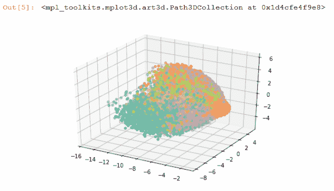

# 工作原理

前面的代码对 MNIST 图像执行降维。 每个原始图像的尺寸为`28 x 28`； 使用 PCA 方法，我们可以将其减小到较小的尺寸。 通常，对于图像数据，降维是必要的。 之所以如此，是因为图像很大，并且包含大量的冗余数据。

# 更多

TensorFlow 提供了一种称为**嵌入**的技术，该技术是将对象映射到向量中。 TensorBoard 的嵌入式投影仪允许我们以交互方式可视化模型中的嵌入。 嵌入式投影仪提供了三种降低尺寸的方法：PCA，t-SNE 和自定义。 我们可以使用 TensorBoard 的嵌入投影器实现与上一个类似的结果。 我们需要从`tensorflow.contrib.tensorboard.plugins`导入`projector`类，以从`tensorflow.contrib.tensorboard.plugins`导入`projector`进行相同的操作。 我们可以通过三个简单的步骤来做到这一点：

1.  加载要探索其嵌入的数据：

```py
mnist = input_data.read_data_sets('MNIST_data')
images = tf.Variable(mnist.test.images, name='images')
```

2.  创建一个`metadata`文件（（`metadata`文件是制表符分隔的`.tsv`文件）：

```py
with open(metadata, 'w') as metadata_file:
    for row in mnist.test.labels:
        metadata_file.write('%d\n' % row)
```

3.  将嵌入内容保存在所需的`Log_DIR`中：

```py
with tf.Session() as sess:
    saver = tf.train.Saver([images])

    sess.run(images.initializer)
    saver.save(sess, os.path.join(LOG_DIR, 'images.ckpt'))

    config = projector.ProjectorConfig()
    # One can add multiple embeddings.
    embedding = config.embeddings.add()
    embedding.tensor_name = images.name
    # Link this tensor to its metadata file (e.g. labels).
    embedding.metadata_path = metadata
    # Saves a config file that TensorBoard will read during startup.
    projector.visualize_embeddings(tf.summary.FileWriter(LOG_DIR), config)
```

嵌入已准备就绪，现在可以使用 TensorBoard 看到。 通过 CLI `tensorboard --logdir=log`启动 TensorBoard，在 Web 浏览器中打开 TensorBoard，然后转到`EMBEDDINGS`选项卡。 这是使用 PCA 的 TensorBoard 投影，前三个主要成分为轴：

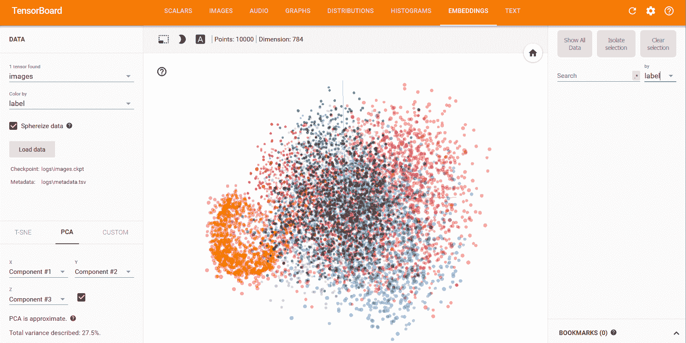

# 另见

*   <https://arxiv.org/abs/1404.1100>
*   <http://www.cs.otago.ac.nz/cosc453/student_tutorials/principal_components.pdf>
*   <http://mplab.ucsd.edu/tutorials/pca.pdf>
*   <http://projector.tensorflow.org/>

# K 均值聚类

顾名思义，K 均值聚类是一种对数据进行聚类的技术，即将数据划分为指定数量的数据点。 这是一种无监督的学习技术。 它通过识别给定数据中的模式来工作。 还记得哈利波特成名的分拣帽子吗？ 书中的工作是聚类-将新生（未标记）的学生分成四个不同的类：格兰芬多，拉文克劳，赫奇帕奇和斯莱特林。

人类非常擅长将对象分组在一起。 聚类算法试图为计算机提供类似的功能。 有许多可用的聚类技术，例如“层次”，“贝叶斯”或“局部”。 K 均值聚类属于部分聚类； 它将数据划分为`k`簇。 每个簇都有一个中心，称为**重心**。 簇数`k`必须由用户指定。

K 均值算法以以下方式工作：

1.  随机选择`k`个数据点作为初始质心（集群中心）
2.  将每个数据点分配给最接近的质心； 可以找到接近度的不同方法，最常见的是欧几里得距离
3.  使用当前簇成员资格重新计算质心，以使平方和的距离减小
4.  重复最后两个步骤，直到达到收敛

# 准备

我们将使用 TensorFlow `KmeansClustering`估计器类来实现 K 均值。 它在[这个链接](https://github.com/tensorflow/tensorflow/blob/r1.3/tensorflow/contrib/learn/python/learn/estimators/kmeans.py)中定义。它创建一个模型来运行 K 均值和推理。 根据 TensorFlow 文档，一旦创建了`KmeansClustering`类对象，就可以使用以下`__init__`方法实例化该对象：

```py
__init__(
num_clusters,
model_dir=None,
initial_clusters=RANDOM_INIT,
distance_metric=SQUARED_EUCLIDEAN_DISTANCE,
random_seed=0,
use_mini_batch=True,
mini_batch_steps_per_iteration=1,
kmeans_plus_plus_num_retries=2,
relative_tolerance=None,
config=None
)
```

TensorFlow 文档对这些参数的定义如下：

**Args:**
**num_clusters**: The number of clusters to train.
**model_dir:** The directory to save the model results and log files.
**initial_clusters:** Specifies how to initialize the clusters for training. See clustering_ops.kmeans for the possible values.
**distance_metric:** The distance metric used for clustering. See clustering_ops.kmeans for the possible values.
**random_seed**: Python integer. Seed for PRNG used to initialize centers.
**use_mini_batch**: If true, use the mini-batch k-means algorithm. Or else assume full batch.
**mini_batch_steps_per_iteration**: The number of steps after which the updated cluster centers are synced back to a master copy. See clustering_ops.py for more details.
**kmeans_plus_plus_num_retries:** For each point that is sampled during kmeans++ initialization, this parameter specifies the number of additional points to draw from the current distribution before selecting the best. If a negative value is specified, a heuristic is used to sample O(log(num_to_sample)) additional points.
**relative_tolerance**: A relative tolerance of change in the loss between iterations. Stops learning if the loss changes less than this amount. Note that this may not work correctly if use_mini_batch=True.
**config**: See Estimator.

TensorFlow 支持欧几里得距离和余弦距离作为质心的量度。 TensorFlow `KmeansClustering`提供了各种与`KmeansClustering`对象进行交互的方法。 在本食谱中，我们将使用`fit()`，`clusters()`和`predict_clusters_idx()`方法：

```py
fit(
 x=None,
 y=None,
 input_fn=None,
 steps=None,
 batch_size=None,
 monitors=None,
 max_steps=None
)
```

根据 TensorFlow 文档，对于`KmeansClustering`估计器，我们需要向`fit()`提供`input_fn()`。 `cluster`方法返回聚类中心，`predict_cluster_idx`方法返回预测的聚类索引。

# 操作步骤

这是我们进行食谱的方法：

1.  和以前一样，我们从加载必要的模块开始。 我们将像往常一样需要 TensorFlow，NumPy 和 Matplotlib。 在本食谱中，我们使用的是鸢尾花数据集，该数据集包含三个类别，每个类别有 50 个实例，其中每个类别都代表一种鸢尾花植物。 我们可以从[这里](https://archive.ics.uci.edu/ml/datasets/iris)下载数据作为`.csv`文件，也可以使用 sklearn 的数据集模块（scikit-learn） 做任务：

```py
import numpy as np
import tensorflow as tf
import matplotlib.pyplot as plt
from matplotlib.colors import ListedColormap
# dataset Iris
from sklearn import datasets

%matplotlib inline
```

2.  我们加载数据集：

```py
# import some data to play with
iris = datasets.load_iris()
x = iris.data[:, :2] # we only take the first two features.
y = iris.target
```

3.  让我们看看该数据集的外观：

```py
# original data without clustering
plt.scatter(hw_frame[:,0], hw_frame[:,1])
plt.xlabel('Sepia Length')
plt.ylabel('Sepia Width')
```

以下是以下代码的输出：

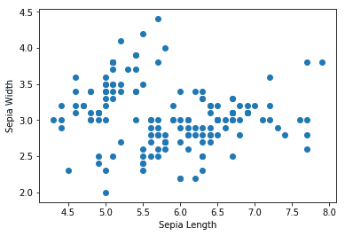

4.  我们可以看到在数据中没有明显可见的聚类。 现在我们定义`input_fn`，它将用于提供`fit`方法。 我们的输入函数返回一个 TensorFlow 常数，该常数被分配了`x`的值和形状，并且类型为`float`：

```py
def input_fn():
 return tf.constant(np.array(x), tf.float32, x.shape),None
```

5.  现在我们使用`KmeansClustering`类； 在这里，我们已经知道类的数量为 3，因此我们将`num_clusters=3`设置为。 通常，我们不知道集群的数量。 在这种情况下，常用的方法是**肘部法则**：

```py
kmeans = tf.contrib.learn.KMeansClustering(num_clusters=3, relative_tolerance=0.0001, random_seed=2) 
kmeans.fit(input_fn=input_fn)
```

6.  我们使用`clusters()`方法找到聚类，并使用`predict_cluster_idx()`方法为每个输入点分配聚类索引：

```py
clusters = kmeans.clusters()
assignments = list(kmeans.predict_cluster_idex(input_fn=input_fn))
```

7.  现在让我们可视化由 K 均值创建的聚类。 为此，我们创建一个包装器函数`ScatterPlot`，该函数将`X`和`Y`值以及每个数据点的簇和簇索引一起使用：

```py
def ScatterPlot(X, Y, assignments=None, centers=None):
 if assignments is None:
 assignments = [0] * len(X)
 fig = plt.figure(figsize=(14,8))
 cmap = ListedColormap(['red', 'green', 'blue'])
 plt.scatter(X, Y, c=assignments, cmap=cmap)
 if centers is not None:
 plt.scatter(centers[:, 0], centers[:, 1], c=range(len(centers)), 
 marker='+', s=400, cmap=cmap) 
 plt.xlabel('Sepia Length')
 plt.ylabel('Sepia Width')
```

我们用它来绘制我们的`clusters`：

```py
ScatterPlot(x[:,0], x[:,1], assignments, clusters)
```

情节如下：

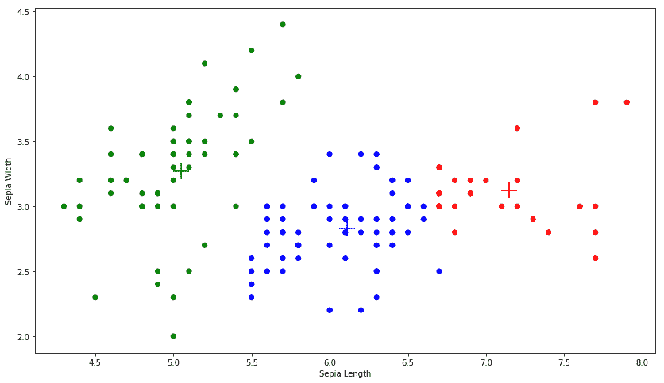

`+`标记是三个簇的质心。

# 工作原理

前面的配方使用 TensorFlow 的 K 均值聚类估计器将给定数据聚类为聚类。 在这里，由于我们知道集群的数量，我们决定保留`num_clusters=3`，但是在大多数情况下，如果使用未标记的数据，则永远无法确定存在多少集群。 可以使用弯头法确定最佳簇数。 该方法基于以下原则：我们应选择能减少**平方误差和**（**SSE**）距离的簇数。 如果`k`是簇数，则随着`k`增加，SSE 减少，`SSE = 0`； 当`k`等于数据点数时，每个点都是其自己的簇。 我们想要一个`k`较低的值，以使 SSE 也较低。 在 TensorFlow 中，我们可以使用`KmeansClustering`类中定义的`score()`方法找到 SSE； 该方法将距离的总和返回到最近的聚类：

```py
sum_distances = kmeans.score(input_fn=input_fn, steps=100)
```

对于鸢尾数据，如果我们针对不同的`k`值绘制 SSE，则可以看到对于`k = 3`而言，SSE 的方差最高； 之后，它开始减小，因此肘点为`k = 3`：

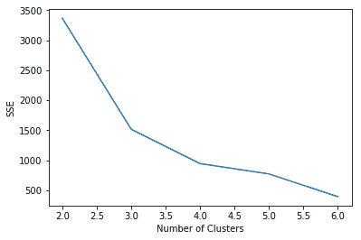

# 更多

K 均值聚类非常流行，因为它快速，简单且健壮。 它还有一些缺点：最大的缺点是用户必须指定簇的数量。 其次，该算法不能保证全局最优。 第三，它对异常值非常敏感。

# 另见

*   `Kanungo, Tapas, et al. An efficient k-means clustering algorithm: Analysis and implementation. IEEE transactions on pattern analysis and machine intelligence 24.7 (2002): 881-892.`

*   `Ortega, Joaquín Pérez, et al. Research issues on k-means algorithm: An experimental trial using matlab. CEUR Workshop Proceedings: Semantic Web and New Technologies.`

*   <http://home.deib.polimi.it/matteucc/Clustering/tutorial_html/kmeans.html>

*   `Chen, Ke. On coresets for k-median and k-means clustering in metric and euclidean spaces and their applications. SIAM Journal on Computing 39.3 (2009): 923-947.`

*   <https://en.wikipedia.org/wiki/Determining_the_number_of_clusters_in_a_data_set>

# 自组织图

**自组织地图**（**SOM**），有时也称为 **Kohonen 网络**或**胜者通吃单元**（**WTU**），是一种非常特殊的神经网络，受人脑的独特特征驱动。 在我们的大脑中，不同的感觉输入以拓扑有序的方式表示。 与其他神经网络不同，神经元并非都通过权重相互连接，而是会影响彼此的学习。 SOM 的最重要方面是神经元以拓扑方式表示学习的输入。

在 SOM 中，神经元通常放置在（1D 或 2D）晶格的节点上。 更大的尺寸也是可能的，但实际上很少使用。 晶格中的每个神经元都通过权重矩阵连接到所有输入单元。 在这里，您可以看到一个具有`3 x 4`（12 个神经元）和七个输入的 SOM。 为了清楚起见，仅显示将所有输入连接到一个神经元的权重向量。 在这种情况下，每个神经元将具有七个元素，从而形成大小为（`12 x 7`）的组合权重矩阵：

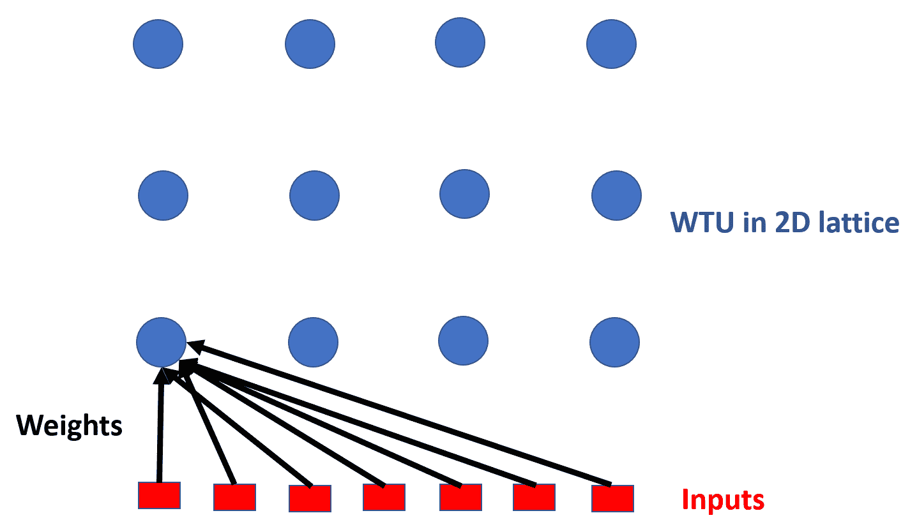

SOM 通过竞争性学习来学习。 可以将其视为 PCA 的非线性概括，因此，像 PCA 一样，可以用于降维。

# 准备

为了实现 SOM，让我们首先了解它是如何工作的。 第一步，将网络的权重初始化为某个随机值，或者通过从输入中获取随机样本进行初始化。 占据晶格中空间的每个神经元将被分配特定的位置。 现在，作为输入出现，与输入距离最小的神经元被宣布为 Winner（WTU）。 这是通过测量所有神经元的权重向量（`W`）和输入向量（`X`）之间的距离来完成的：


在此，`d[j]`是神经元`j`的权重与输入`X`的距离。 最小`d`值的神经元是赢家。

接下来，以一种方式调整获胜神经元及其相邻神经元的权重，以确保如果下次出现相同的输入，则相同的神经元将成为获胜者。 为了确定哪些相邻神经元需要修改，网络使用邻域函数`Λ(r)`； 通常，选择高斯墨西哥帽函数作为邻域函数。 邻域函数在数学上表示如下：


在这里，`σ`是神经元的时间依赖性半径，`d`是其与获胜神经元的距离：

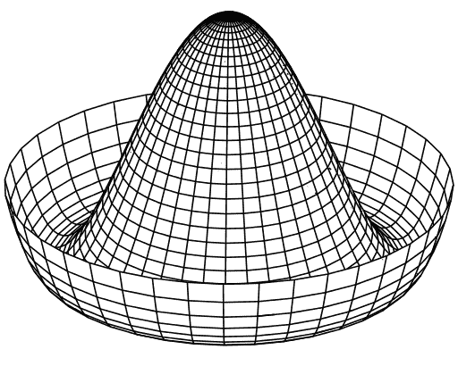

邻域函数的另一个重要属性是其半径随时间减小。 结果，一开始，许多相邻神经元的权重被修改，但是随着网络的学习，最终在学习过程中，一些神经元的权重（有时只有一个或没有）被修改。 重量变化由以下公式给出：

`dW = η * Λ(X - W)`

我们继续所有输入的过程，并重复给定的迭代次数。 随着迭代的进行，我们将学习率和半径减小一个取决于迭代次数的因素。

# 操作步骤

我们按以下步骤进行：

1.  与往常一样，我们从导入必要的模块开始：

```py
import tensorflow as tf
import numpy as np
import matplotlib.pyplot as plt
%matplotlib inline
```

2.  接下来，我们声明一个类 WTU，它将执行所有任务。 用`m x n` 2D SOM 格的大小，`dim`输入数据中的维数以及迭代总数来实例化该类：

```py
def __init__(self, m, n, dim, num_iterations, eta = 0.5, sigma = None):
    """
    m x n : The dimension of 2D lattice in which neurons are     arranged
    dim : Dimension of input training data
    num_iterations: Total number of training iterations
    eta : Learning rate
    sigma: The radius of neighbourhood function.
    """
    self._m = m
    self._n = n
    self._neighbourhood = []
    self._topography = []
    self._num_iterations = int(num_iterations) 
    self._learned = False
```

3.  在`__init__`本身中，我们定义了计算图和会话。
4.  如果网络未提供任何`sigma`值，它将采用默认值，该值通常是 SOM 晶格最大尺寸的一半：

```py
if sigma is None:
    sigma = max(m,n)/2.0 # Constant radius
else:
    sigma = float(sigma)
```

5.  接下来，在图中，我们声明权重矩阵的变量，输入的占位符以及计算获胜者并更新其及其邻居权重的计算步骤。 由于 SOM 提供了地形图，因此我们还添加了操作以获得神经元的地形位置：

```py
self._graph = tf.Graph()

# Build Computation Graph of SOM
 with self._graph.as_default():
# Weight Matrix and the topography of neurons
    self._W = tf.Variable(tf.random_normal([m*n, dim], seed = 0))
    self._topography = tf.constant(np.array(list(self._neuron_location(m, n))))

    # Placeholders for training data
    self._X = tf.placeholder('float', [dim])

    # Placeholder to keep track of number of iterations
    self._iter = tf.placeholder('float')

    # Finding the Winner and its location
    d = tf.sqrt(tf.reduce_sum(tf.pow(self._W - tf.stack([self._X 
          for i in range(m*n)]),2),1))
    self.WTU_idx = tf.argmin(d,0)
    slice_start = tf.pad(tf.reshape(self.WTU_idx, [1]),np.array([[0,1]]))
    self.WTU_loc = tf.reshape(tf.slice(self._topography, slice_start,             [1,2]), [2])
    # Change learning rate and radius as a function of iterations
    learning_rate = 1 - self._iter/self._num_iterations
    _eta_new = eta * learning_rate
    _sigma_new = sigma * learning_rate

    # Calculating Neighbourhood function
    distance_square = tf.reduce_sum(tf.pow(tf.subtract(
    self._topography, tf.stack([self.WTU_loc for i in range(m * n)])), 2), 1)
    neighbourhood_func = tf.exp(tf.negative(tf.div(tf.cast(
distance_square, "float32"), tf.pow(_sigma_new, 2))))

    # multiply learning rate with neighbourhood func
    eta_into_Gamma = tf.multiply(_eta_new, neighbourhood_func)

    # Shape it so that it can be multiplied to calculate dW
    weight_multiplier = tf.stack([tf.tile(tf.slice(
eta_into_Gamma, np.array([i]), np.array([1])), [dim])
for i in range(m * n)])
    delta_W = tf.multiply(weight_multiplier,
tf.subtract(tf.stack([self._X for i in range(m * n)]),self._W))
    new_W = self._W + delta_W
    self._training = tf.assign(self._W,new_W)

   # Initialize All variables
   init = tf.global_variables_initializer()
   self._sess = tf.Session()
   self._sess.run(init)
```

6.  我们为该类定义一个`fit`方法，该方法执行在该类的默认图中声明的训练操作。 该方法还计算质心网格：

```py
def fit(self, X):
 """
 Function to carry out training
 """
 for i in range(self._num_iterations):
   for x in X:
       self._sess.run(self._training, feed_dict= {self._X:x, self._iter: i})

 # Store a centroid grid for easy retreival
 centroid_grid = [[] for i in range(self._m)]
 self._Wts = list(self._sess.run(self._W))
 self._locations = list(self._sess.run(self._topography))
 for i, loc in enumerate(self._locations):
      centroid_grid[loc[0]].append(self._Wts[i])
 self._centroid_grid = centroid_grid

 self._learned = True
```

7.  我们定义一个函数来确定获胜神经元在 2D 晶格中的索引和位置：

```py
def winner(self, x):
    idx = self._sess.run([self.WTU_idx,self.WTU_loc], feed_dict = {self._X:x})
    return idx
```

8.  我们定义一些更多的辅助函数，以执行晶格中神经元的 2D 映射并将输入向量映射到 2D 晶格中的相关神经元：

```py
def _neuron_location(self,m,n):
    """
    Function to generate the 2D lattice of neurons
    """
    for i in range(m):
       for j in range(n):
           yield np.array([i,j])

def get_centroids(self):
    """
    Function to return a list of 'm' lists, with each inner     list containing the 'n' corresponding centroid locations     as 1-D NumPy arrays.
    """
    if not self._learned:
       raise ValueError("SOM not trained yet")
    return self._centroid_grid
```

```py
def map_vects(self, X):
    """
    Function to map each input vector to the relevant neuron         in the lattice
    """
    if not self._learned:
        raise ValueError("SOM not trained yet")
    to_return = []
    for vect in X:
       min_index = min([i for i in range(len(self._Wts))],
       key=lambda x: np.linalg.norm(vect -
self._Wts[x]))
       to_return.append(self._locations[min_index])
return to_return
```

9.  现在我们的 WTU 类已经准备好，我们从`.csv`文件中读取数据并对其进行规范化：

```py
def normalize(df):
    result = df.copy()
    for feature_name in df.columns:
       max_value = df[feature_name].max()
       min_value = df[feature_name].min()
       result[feature_name] = (df[feature_name] - min_value) / (max_value - min_value)
    return result

# Reading input data from file
import pandas as pd
df = pd.read_csv('colors.csv') # The last column of data file is a label
data = normalize(df[['R', 'G', 'B']]).values
name = df['Color-Name'].values
n_dim = len(df.columns) - 1

# Data for Training
colors = data
color_names = name
```

10.  最后，我们使用我们的类执行降维并将其布置在美丽的地形图中：

```py
som = WTU(30, 30, n_dim, 400, sigma=10.0)
som.fit(colors)

# Get output grid
image_grid = som.get_centroids()

# Map colours to their closest neurons
mapped = som.map_vects(colors)

# Plot
plt.imshow(image_grid)
plt.title('Color Grid SOM')
for i, m in enumerate(mapped):
     plt.text(m[1], m[0], color_names[i], ha='center', va='center', bbox=dict(facecolor='white', alpha=0.5, lw=0))
```

情节如下：

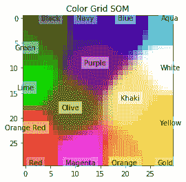

# 工作原理

SOM 在计算上很昂贵，因此对于非常大的数据集并没有真正的用处。 尽管如此，它们仍然易于理解，并且可以很好地找到输入数据之间的相似性。 因此，它们已被用于图像分割和确定 NLP 中的单词相似度图。

# 另见

*   [这是一篇非常不错的博客文章，用简单的语言解释了 SOM](http://www.ai-junkie.com/ann/som/som1.html)
*   [关于 SOM 的简要介绍](https://en.wikipedia.org/wiki/Self-organizing_map)
*   [Kohonen 关于 SOM 的开创性论文：“自组织图”。 神经计算 21.1（1998）：1-6](https://pdfs.semanticscholar.org/8c6a/aea3159e9f49283de252d0548b337839ca6f.pdf)

# 受限玻尔兹曼机

**受限玻尔兹曼机**（**RBM**）是两层神经网络，第一层称为**可见层**，第二层称为隐藏层。 它们被称为**浅层神经网络**，因为它们只有两层深。 它们最初是由 1986 年由保罗·斯莫伦斯基（Paul Smolensky）提出的（他称其为 Harmony Networks），后来由 Geoffrey Hinton 提出，于 2006 年提出了**对比发散**（**CD**）作为训练他们的方法。 可见层中的所有神经元都与隐藏层中的所有神经元相连，但是存在**限制**-同一层中没有神经元可以连接。 所有神经元本质上都是二进制的：

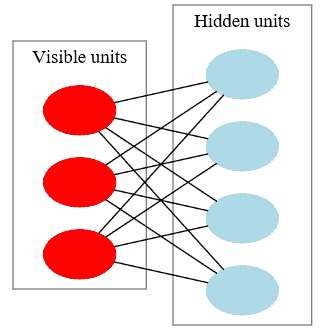

[资料来源：Qwertyus 自己的作品，CC BY-SA 3.0](https://commons.wikimedia.org/w/index.php?curid=22717044)

RBM 可用于降维，特征提取和协作过滤。 RBM 中的训练可分为三个部分：前进，后退和比较。

# 准备

让我们看看制作 RBM 所需的表达式：

**正向传递**：可见单元（`V`）上的信息通过权重（`W`）和偏差（`c`）传递给隐藏的对象单元（`h[0]`）。 隐藏单元是否可以触发取决于随机概率（`σ`是随机概率）：

`p(h[i]|v[0]) = σ(V^T · W + c)[i]`

**向后传递**：隐藏的单元表示（`h[0]`）然后通过相同的权重`W`但不同的偏置`c`传递回可见单元，它们在其中重构输入。 再次，对输入进行采样：

`p(v[i]|h[0]) = σ(W^T · h[0] + b)[i]`*

将这两个遍重复 k 步或直到达到收敛。 根据研究人员的说法，`k = 1`给出了很好的结果，因此我们将保持`k = 1`。

可见矢量`V`和隐藏矢量的联合构型具有如下能量：


自由能还与每个可见矢量`V`相关，为与具有`V`的所有构型具有相同概率的单个配置所需的能量：


使用对比度发散目标函数，即`Mean(F(Voriginal))- Mean(F(Vreconstructed))`，权重的变化由此给出：


在此，`η`是学习率。 对于偏差`b`和`c`存在相似的表达式。

# 操作步骤

我们按以下步骤进行：

1.  导入模块：

```py
import tensorflow as tf
import numpy as np
from tensorflow.examples.tutorials.mnist import input_data
import matplotlib.pyplot as plt
%matplotlib inline
```

2.  声明 RBM 类，它将完成主要任务。 `__init__`将建立完整的图形，正向和反向传递以及目标函数； 我们将使用 TensorFlow 内置的优化器来更新权重和偏差：

```py
class RBM(object):
    def __init__(self, m, n):
        """
        m: Number of neurons in visible layer
        n: number of neurons in hidden layer
        """
        self._m = m
        self._n = n
        # Create the Computational graph
        # Weights and biases
        self._W = tf.Variable(tf.random_normal(shape=(self._m,self._n)))
        self._c = tf.Variable(np.zeros(self._n).astype(np.float32)) #bias for hidden layer
        self._b = tf.Variable(np.zeros(self._m).astype(np.float32)) #bias for Visible layer
         # Placeholder for inputs
        self._X = tf.placeholder('float', [None, self._m])
         # Forward Pass
        _h = tf.nn.sigmoid(tf.matmul(self._X, self._W) + self._c)
        self.h = tf.nn.relu(tf.sign(_h -         tf.random_uniform(tf.shape(_h))))
        #Backward pass
        _v = tf.nn.sigmoid(tf.matmul(self.h, tf.transpose(self._W)) + self._b)
        self.V = tf.nn.relu(tf.sign(_v - tf.random_uniform(tf.shape(_v))))
        # Objective Function
        objective = tf.reduce_mean(self.free_energy(self._X)) - tf.reduce_mean(
self.free_energy(self.V))
        self._train_op = tf.train.GradientDescentOptimizer(1e-3).minimize(objective)
        # Cross entropy cost
        reconstructed_input = self.one_pass(self._X)
        self.cost = tf.reduce_mean(tf.nn.sigmoid_cross_entropy_with_logits(
labels=self._X, logits=reconstructed_input))
```

3.  我们在`RBM`类中定义`fit()`方法。 在`__init__`中声明了所有操作后，训练只是在会话中调用`train_op`。 我们使用批量训练：

```py
 def fit(self, X, epochs = 1, batch_size = 100):
        N, D = X.shape
        num_batches = N // batch_size

        obj = []
        for i in range(epochs):
            #X = shuffle(X)
            for j in range(num_batches):
                batch = X[j * batch_size: (j * batch_size + batch_size)]
                _, ob = self.session.run([self._train_op,self.cost ], feed_dict={self._X: batch})
                if j % 10 == 0:
                    print('training epoch {0} cost {1}'.format(j,ob)) 
                obj.append(ob)
        return obj
```

4.  还有其他帮助程序功能可计算对率误差并从网络返回重建的图像：

```py
def set_session(self, session):
    self.session = session

def free_energy(self, V):
    b = tf.reshape(self._b, (self._m, 1))
    term_1 = -tf.matmul(V,b)
    term_1 = tf.reshape(term_1, (-1,))
    term_2 = -tf.reduce_sum(tf.nn.softplus(tf.matmul(V,self._W) +
        self._c))
    return term_1 + term_2

def one_pass(self, X):
    h = tf.nn.sigmoid(tf.matmul(X, self._W) + self._c)
    return tf.matmul(h, tf.transpose(self._W)) + self._b

def reconstruct(self,X):
    x = tf.nn.sigmoid(self.one_pass(X))
    return self.session.run(x, feed_dict={self._X: X})

```

5.  我们加载 MNIST 数据集：

```py
mnist = input_data.read_data_sets("MNIST_data/", one_hot=True)
trX, trY, teX, teY = mnist.train.images, mnist.train.labels, mnist.test.images, mnist.test.labels
```

6.  接下来，我们在 MNIST 数据集上训练`RBM`：

```py
Xtrain = trX.astype(np.float32)
Xtest = teX.astype(np.float32)
_, m = Xtrain.shape
rbm = RBM(m, 100)
#Initialize all variables
init = tf.global_variables_initializer()
with tf.Session() as sess:
    sess.run(init)
    rbm.set_session(sess)
    err = rbm.fit(Xtrain)
    out = rbm.reconstruct(Xest[0:100])  # Let us reconstruct Test Data
```

7.  不同**周期**的函数误差：

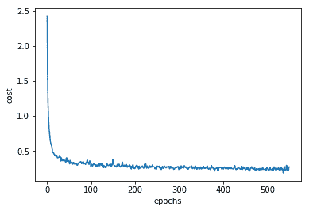

# 工作原理

由于其具有重建图像的能力，RBM 可用于从现有数据中生成更多数据。 通过制作一个小的助手绘图代码，我们可以看到原始和重建的 MNIST 图像：

```py
row, col = 2, 8
idx = np.random.randint(0, 100, row * col // 2)
f, axarr = plt.subplots(row, col, sharex=True, sharey=True, figsize=(20,4))
for fig, row in zip([Xtest_noisy,out], axarr):
    for i,ax in zip(idx,row):
        ax.imshow(fig[i].reshape((28, 28)), cmap='Greys_r')
        ax.get_xaxis().set_visible(False)
        ax.get_yaxis().set_visible(False)
```

我们得到的结果如下：


# 另见

*   `Smolensky, Paul. Information processing in dynamical systems: Foundations of harmony theory. No. CU-CS-321-86. COLORADO UNIV AT BOULDER DEPT OF COMPUTER SCIENCE, 1986.`

    <http://stanford.edu/~jlmcc/papers/PDP/Volume%201/Chap6_PDP86.pdf>

*   `Salakhutdinov, Ruslan, Andriy Mnih, and Geoffrey Hinton. Restricted Boltzmann machines for collaborative filtering. Proceedings of the 24th international conference on Machine learning. ACM, 2007.`

    <http://machinelearning.wustl.edu/mlpapers/paper_files/icml2007_SalakhutdinovMH07.pdf>

*   `Hinton, Geoffrey. A practical guide to training restricted Boltzmann machines. Momentum 9.1 (2010): 926.`

    <http://www.csri.utoronto.ca/~hinton/absps/guideTR.pdf)>

*   如果您对数学感兴趣，[这是一个很好的教程](http://deeplearning.net/tutorial/rbm.html#rbm)

# 使用 RBM 的推荐系统

网上零售商广泛使用推荐系统向客户推荐产品。 例如，亚马逊会告诉您购买此商品的其他客户对什么感兴趣，或者 Netflix 根据您所观看的内容以及有相同兴趣的其他 Netflix 用户所观看的内容推荐电视连续剧和电影。 这些推荐器系统在协作筛选的基础上工作。 在协作过滤中，系统根据用户的过去行为来构建模型。 我们将使用上一个食谱中的 RBM 构建一个使用协作过滤来推荐电影的推荐器系统。 这项工作中的一个重要挑战是，大多数用户不会对所有产品/电影进行评分，因此大多数数据都将丢失。 如果有 M 个产品和 N 个用户，则我们需要构建一个数组`N x M`，其中包含用户的已知等级并将所有未知值设为零。

# 准备

为了使用协作过滤创建推荐系统，我们需要修改数据。 作为说明，我们将使用来自[这里](https://grouplens.org/datasets/movielens/)的电影数据集。 数据由两个`.dat`文件组成：`movies.dat`和`ratings.dat`。 `movies.dat`文件包含 3 列：3883 个电影的 MovieID，Title 和 Genre。 `ratings.dat`文件包含四列：UserID，MovieID，Rating 和 Time。 我们需要合并这两个数据文件，以便能够构建一个数组，其中对于每个用户，我们对所有 3,883 部电影都有一个评分。 问题在于用户通常不会对所有电影进行评级，因此我们仅对某些电影进行非零（标准化）评级。 其余部分设为零，因此不会对隐藏层有所贡献。

# 操作步骤

1.  我们将使用在先前配方中创建的`RBM`类。 让我们定义我们的 RBM 网络； 可见单位的数量将是电影的数量，在我们的示例中为 3883（`movies_df`是包含`movies.dat`文件中的数据的数据帧）：

```py
m = len(movies_df)  # Number of visible units
n = 20  # Number of Hidden units
recommender = rbm.RBM(m,n)
```

2.  我们使用 Pandas 合并和`groupby`命令创建了一个列表`trX`，该列表包含大约 1,000 个用户的规范化电影评分。 列表的大小为`1000 x 3883`。我们使用它来训练我们的 RBM：

```py
Xtrain = np.array(trX) 
init = tf.global_variables_initializer()
with tf.Session() as sess:
 sess.run(init)
 recommender.set_session(sess)
 err = recommender.fit(Xtrain, epochs=10)
```

3.  每个周期的跨逻辑误差减少：

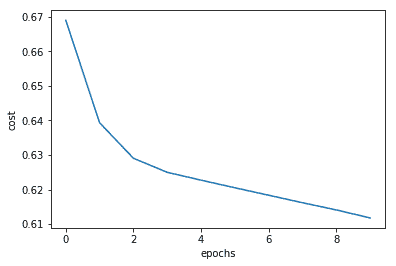

4.  网络现已接受训练； 我们使用它为索引为 150 的随机用户（可能是任何现有用户）获得推荐：

```py
user_index = 150
x = np.array([Xtrain[user_index, :]])
init = tf.global_variables_initializer()
with tf.Session() as sess:
 sess.run(init)
 recommender.set_session(sess)
 out = recommender.reconstruct(x.astype(np.float32))
```

5.  结果与现有数据帧合并，我们可以看到该用户的推荐分数：


# 更多

杰弗里·欣顿（Geoffrey Hinton）教授领导的多伦多大学团队赢得了 Netflix 最佳协作过滤竞赛的冠军，该协作过滤使用 [RBM](https://en.wikipedia.org/wiki/Netflix_Prize) 来预测电影的用户收视率。 [可以从他们的论文中获取其工作的详细信息](http://www.cs.toronto.edu/~hinton/absps/netflixICML.pdf)。

一个 RBM 的隐藏单元的输出可以馈送到另一个 RBM 的可见单元，可以重复此过程以形成 RBM 的堆栈。 这导致**栈式 RBM** 。 假定不存在其他堆叠式 RBM，则对其进行独立训练。 大量栈式 RBM 构成了**深度信念网络（DBN）**。 可以使用有监督或无监督的训练来训练 DBN。 您将在下一个食谱中了解有关它们的更多信息。

# 用于情感检测的 DBN

在本食谱中，我们将学习如何首先堆叠 RBM 来制作 DBN，然后训练它来检测情感。 食谱中有趣的部分是我们采用了两种不同的学习范例：首先，我们使用无监督学习对 RBM 进行了预训练，最后，我们有了一个 MLP 层，该层是使用监督学习进行了训练的。

# 准备

我们使用已经在配方*受限玻尔兹曼机*中创建的 RBM 类，只需进行一次更改即可，现在无需在训练后重建图像。 取而代之的是，我们栈式 RBM 将仅将数据转发至 DBN 的最后一个 MLP 层。 这是通过从类中删除`reconstruct()`函数并将其替换为`rbm_output()`函数来实现的：

```py
def rbm_output(self,X):
    x = tf.nn.sigmoid(tf.matmul(X, self._W) + self._c)
    return self.session.run(x, feed_dict={self._X: X})
```

对于数据，我们考虑了 Kaggle 面部表情识别数据，该数据可从[这里](https://www.kaggle.com/c/challenges-in-representation-learning-facial-expression-recognition-challenge)获得。 此处给出的数据描述为：

数据由`48 x 48`像素的面部灰度图像组成。 面部已自动注册，因此面部或多或少居中，并且在每个图像中占据大约相同的空间量。 任务是根据面部表情中显示的情感将每个面孔分类为七个类别之一（0 为愤怒，1 恶心，2 为恐惧，3 为快乐，4 为悲伤，5 为惊奇，6 为中性） 。

`train.csv`包含两列，“情感”和“像素”。 “情感”列包含图像中存在的情感的数字代码，范围从 0 到 6（含）。 “像素”列包含每个图像用引号引起来的字符串。 该字符串的内容是按行主要顺序分隔的像素值。 `test.csv`仅包含“像素”列，您的任务是预测情感列。

训练集包含 28,709 个示例。 用于排行榜的公共测试集包含 3,589 个示例。 最终测试集用于确定比赛的获胜者，另外还有 3,589 个示例。

该数据集由 Pierre-Luc Carrier 和 Aaron Courville 进行，是正在进行的研究项目的一部分。 他们为研讨会的组织者提供了他们数据集的初步版本，供比赛使用。

完整的数据合而为一。 名为`fer2013.csv`的`csv`文件。 我们从中分离出训练，验证和测试数据：

```py
data = pd.read_csv('data/fer2013.csv')
tr_data = data[data.Usage == "Training"]
test_data = data[data.Usage == "PublicTest"]
mask = np.random.rand(len(tr_data)) < 0.8
train_data = tr_data[mask]
val_data = tr_data[~mask]
```

我们将需要预处理数据，即将像素和情感标签分开。 为此，我们制作了两个函数`dense_to_one_hot ()`，它对标签执行了一个热编码。 第二个功能是`preprocess_data()`，它将单个像素分离为一个数组。 在这两个功能的帮助下，我们生成了训练，验证和测试数据集的输入特征和标签：

```py
def dense_to_one_hot(labels_dense, num_classes):
     num_labels = labels_dense.shape[0]
     index_offset = np.arange(num_labels) * num_classes
     labels_one_hot = np.zeros((num_labels, num_classes))
     labels_one_hot.flat[index_offset + labels_dense.ravel()] = 1
     return labels_one_hot
def preprocess_data(dataframe):
     pixels_values = dataframe.pixels.str.split(" ").tolist()
     pixels_values = pd.DataFrame(pixels_values, dtype=int)
     images = pixels_values.values
     images = images.astype(np.float32)
     images = np.multiply(images, 1.0/255.0)
     labels_flat = dataframe["emotion"].values.ravel()
     labels_count = np.unique(labels_flat).shape[0]
     labels = dense_to_one_hot(labels_flat, labels_count)
     labels = labels.astype(np.uint8)
     return images, labels
```

使用前面代码中定义的函数，我们以训练所需的格式获取数据。 基于本文针对 MNIST 提到的相似原理，我们构建了[情感检测 DBN](https://www.cs.toronto.edu/~hinton/absps/fastnc.pdf)。

# 操作步骤

我们按以下步骤进行：

1.  我们需要导入标准模块 TensorFlow，NumPy 和 Pandas，以读取`.csv`文件和 Matplolib：

```py
import tensorflow as tf
import numpy as np
import pandas as pd
import matplotlib.pyplot as plt
```

2.  训练，验证和测试数据是使用帮助程序功能获得的：

```py
X_train, Y_train = preprocess_data(train_data)
X_val, Y_val = preprocess_data(val_data)
X_test, Y_test = preprocess_data(test_data)
```

3.  让我们来探讨一下我们的数据。 我们绘制平均图像并找到每个训练，验证和测试数据集中的图像数量：

```py
# Explore Data
mean_image = X_train.mean(axis=0)
std_image = np.std(X_train, axis=0)
print("Training Data set has {} images".format(len(X_train)))
print("Validation Data set has {} images".format(len(X_val)))
print("Test Data set has {} images".format(len(X_test)))
plt.imshow(mean_image.reshape(48,48), cmap='gray')
```

我们得到的结果如下：

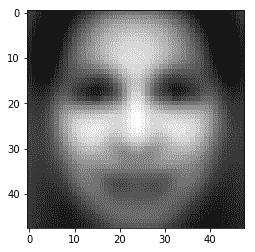

4.  我们还会看到训练样本中的图像及其各自的标签：

```py
classes = ['angry','disgust','fear','happy','sad','surprise','neutral']
num_classes = len(classes)
samples_per_class = 7
for y,cls in enumerate(classes):
     idxs = np.flatnonzero(np.argmax(Y_train, axis =1) == y)
     idxs = np.random.choice(idxs, samples_per_class, replace=False)
     for i, idx in enumerate(idxs):
         plt_idx = i * num_classes + y + 1
         plt.subplot(samples_per_class, num_classes, plt_idx)
         plt.imshow(X_train[idx].reshape(48,48), cmap='gray') #pixel height and width
         plt.axis('off')
         if i == 0:
             plt.title(cls)
plt.show()
```

情节如下：

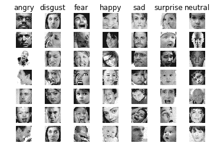

5.  接下来，我们定义 RBM 堆栈； 每个 RBM 都将先前 RBM 的输出作为其输入：

```py
RBM_hidden_sizes = [1500, 700, 400] #create 4 layers of RBM with size 1500, 700, 400 and 100
#Set input as training data
inpX = X_train
#Create list to hold our RBMs
rbm_list = []
#Size of inputs is the number of inputs in the training set
input_size = inpX.shape[1]
#For each RBM we want to generate
for i, size in enumerate(RBM_hidden_sizes):
     print ('RBM: ',i,' ',input_size,'->', size)
     rbm_list.append(RBM(input_size, size))
     input_size = size
```

这将生成三个 RBM：第一个 RBM 具有 2304（`48×48`）个输入和 1500 个隐藏单元，第二个 RBM 具有 1500 个输入和 700 个隐藏单元，最后第三个 RBM 具有 700 个输入和 400 个隐藏单元。

6.  我们逐一训练每个 RBM。 该技术也称为**贪婪训练**。 在原始论文中，用于在 MNIST 上训练每个 RBM 的时期数是 30，因此在这里，增加时期也应会改善网络的性能：

```py
# Greedy wise training of RBMs
init = tf.global_variables_initializer()
for rbm in rbm_list:
     print ('New RBM:')
     #Train a new one
     with tf.Session() as sess:
         sess.run(init)
         rbm.set_session(sess)
         err = rbm.fit(inpX, 5)
         inpX_n = rbm.rbm_output(inpX)
         print(inpX_n.shape)
         inpX = inpX_n
```

7.  我们定义一个`DBN`类。 在课堂上，我们用三层 RBM 和另外两层 MLP 构建完整的 DBN。 从预训练的 RBM 中加载 RBM 层的权重。 我们还声明了训练和预测 DBN 的方法； 为了进行微调，网络尝试最小化均方损失函数：

```py
class DBN(object):

     def __init__(self, sizes, X, Y, eta = 0.001, momentum = 0.0, epochs = 10, batch_size = 100):
         #Initialize hyperparameters
         self._sizes = sizes
         print(self._sizes)
         self._sizes.append(1000) # size of the first FC layer
         self._X = X
         self._Y = Y
         self.N = len(X)
         self.w_list = []
         self.c_list = []
         self._learning_rate = eta
         self._momentum = momentum
         self._epochs = epochs
         self._batchsize = batch_size
         input_size = X.shape[1]

         #initialization loop
         for size in self._sizes + [Y.shape[1]]:
             #Define upper limit for the uniform distribution range
             max_range = 4 * math.sqrt(6\. / (input_size + size))

             #Initialize weights through a random uniform distribution
             self.w_list.append(
             np.random.uniform( -max_range, max_range, [input_size,         size]).astype(np.float32))

             #Initialize bias as zeroes
             self.c_list.append(np.zeros([size], np.float32))
             input_size = size

         # Build DBN
         #Create placeholders for input, weights, biases, output
         self._a = [None] * (len(self._sizes) + 2)
         self._w = [None] * (len(self._sizes) + 1)
         self._c = [None] * (len(self._sizes) + 1)
         self._a[0] = tf.placeholder("float", [None, self._X.shape[1]])
         self.y = tf.placeholder("float", [None, self._Y.shape[1]])

         #Define variables and activation function
         for i in range(len(self._sizes) + 1):
             self._w[i] = tf.Variable(self.w_list[i])
             self._c[i] = tf.Variable(self.c_list[i])
         for i in range(1, len(self._sizes) + 2):
             self._a[i] = tf.nn.sigmoid(tf.matmul(self._a[i - 1], self._w[i - 1]) + self._c[i - 1])

         #Define the cost function
         cost = tf.reduce_mean(tf.nn.softmax_cross_entropy_with_logits(labels=self.y, logits= self._a[-1]))
         #cost = tf.reduce_mean(tf.square(self._a[-1] - self.y))

         #Define the training operation (Momentum Optimizer minimizing the Cost function)
         self.train_op = tf.train.AdamOptimizer(learning_rate=self._learning_rate).minimize(cost)

         #Prediction operation
         self.predict_op = tf.argmax(self._a[-1], 1)

     #load data from rbm
     def load_from_rbms(self, dbn_sizes,rbm_list):
         #Check if expected sizes are correct
         assert len(dbn_sizes) == len(self._sizes)

         for i in range(len(self._sizes)):
             #Check if for each RBN the expected sizes are correct
             assert dbn_sizes[i] == self._sizes[i]

         #If everything is correct, bring over the weights and biases
         for i in range(len(self._sizes)-1):
             self.w_list[i] = rbm_list[i]._W
             self.c_list[i] = rbm_list[i]._c

     def set_session(self, session):
         self.session = session

    #Training method
     def train(self, val_x, val_y):
         #For each epoch
         num_batches = self.N // self._batchsize

         batch_size = self._batchsize
         for i in range(self._epochs):
             #For each step
             for j in range(num_batches):
                 batch = self._X[j * batch_size: (j * batch_size + batch_size)]
                 batch_label = self._Y[j * batch_size: (j * batch_size + batch_size)]

                 self.session.run(self.train_op, feed_dict={self._a[0]: batch, self.y: batch_label})

                 for j in range(len(self._sizes) + 1):
                     #Retrieve weights and biases
                     self.w_list[j] = sess.run(self._w[j])
                     self.c_list[j] = sess.run(self._c[j])

             train_acc = np.mean(np.argmax(self._Y, axis=1) ==
 self.session.run(self.predict_op, feed_dict={self._a[0]: self._X, self.y: self._Y}))

             val_acc = np.mean(np.argmax(val_y, axis=1) ==
 self.session.run(self.predict_op, feed_dict={self._a[0]: val_x, self.y: val_y}))
             print (" epoch " + str(i) + "/" + str(self._epochs) + " Training Accuracy: " +  str(train_acc) + " Validation Accuracy: " + str(val_acc))

     def predict(self, X):
         return self.session.run(self.predict_op, feed_dict={self._a[0]: X})
```

8.  现在，我们训练实例化`DBN`对象并对其进行训练。 并预测测试数据的标签：

```py
nNet = DBN(RBM_hidden_sizes, X_train, Y_train, epochs = 80)
with tf.Session() as sess:
     #Initialize Variables
     sess.run(tf.global_variables_initializer())
     nNet.set_session(sess)
     nNet.load_from_rbms(RBM_hidden_sizes,rbm_list)
     nNet.train(X_val, Y_val)
     y_pred = nNet.predict(X_test)
```

# 工作原理

RBM 使用无监督学习来学习模型的隐藏表示/功能，然后对与预训练 RBM 一起添加的全连接层进行微调。

这里的精度在很大程度上取决于图像表示。 在前面的食谱中，我们没有使用图像处理，仅使用了 0 到 1 之间缩放的灰度图像。但是，如果我们按照以下论文所述添加图像处理，[则会进一步提高精度](http://deeplearning.net/wp-content/uploads/2013/03/dlsvm.pdf)。 因此，我们在`preprocess_data`函数中将每个图像乘以 100.0/255.0，然后将以下几行代码添加到主代码中：

```py
std_image = np.std(X_train, axis=0)
X_train = np.divide(np.subtract(X_train,mean_image), std_image)
X_val = np.divide(np.subtract(X_val,mean_image), std_image)
X_test = np.divide(np.subtract(X_test,mean_image), std_image)
```

# 更多

在前面的示例中，没有进行预处理，这三个数据集的准确性大约为 40%。 但是，当我们添加预处理时，训练数据的准确性将提高到 90%，但是对于验证和测试，我们仍然可以获得约 45% 的准确性。

可以引入许多更改来改善结果。 首先，我们在配方中使用的数据集是只有 22,000 张图像的 Kaggle 数据集。 如果观察这些图像，则会发现仅过滤面部的步骤会改善结果。 如下文所述，[另一种策略是增加隐藏层的大小而不是减小它们的大小](https://www.cs.swarthmore.edu/~meeden/cs81/s14/papers/KevinVincent.pdf)。

在识别情感方面确实非常成功的另一个更改是[使用面部关键点而不是整个面部训练](http://cs229.stanford.edu/proj2010/McLaughlinLeBayanbat-RecognizingEmotionsWithDeepBeliefNets.pdf)。

使用前面的配方，您可以尝试这些更改并探索性能如何提高。 愿 GPU 力量与您同在！