# 十、移动计算

在本章中，我们将讨论在移动设备上使用深度学习的问题，并为以下内容提供一些方法：

*   安装适用于 macOS 和 Android 的 TensorFlow Mobile
*   玩转 TensorFlow 和 Android 示例
*   为 MacOS 和 iPhone 安装 TensorFlow Mobile
*   为移动设备优化 TensorFlow 图
*   转换移动设备的 TensorFlow 图

# 介绍

在本节中，我们将介绍移动深度学习的一些用例。 这与台式机或云深度学习的情况大不相同，在台式机或云深度学习中，GPU 和电力通常可用。 实际上，在移动设备上，保存电池非常重要，并且 GPU 经常不可用。 但是，深度学习在许多情况下可能非常有用。 让我们回顾一下：

*   **图像识别**：现代手机具有功能强大的摄像头，用户热衷于尝试对图像和图片产生效果。 通常，了解图片中的内容也很重要，并且有多种适用于此的预训练模型，如专用于 CNN 的章节所述。 [这里给出了用于图像识别的模型的一个很好的例子](https://github.com/tensorflow/models/tree/master/official/resnet)。

*   **对象定位**：识别运动对象是一项关键操作，对于视频和图像处理是必需的。 例如，可以想象如果在图像中识别出多个人，那么相机将使用多个对焦点。 [这里提供了对象本地化示例的集合](https://github.com/tensorflow/models/tree/master/research/object_detection)。
*   **光学字符识别**：在许多活动（例如文本分类和推荐）中，识别手写字符都是至关重要的。 深度学习可以为开展这些活动提供根本帮助。 在专用于 CNN 的章节中，我们研究了 MNIST 识别的一些示例。 关于 MNIST 的信息也可以在[这个页面](https://github.com/TensorFlow/models/tree/master/official/mnist)中找到。
*   **语音识别**：语音识别是访问现代电话的常用界面。 因此，深度学习用于识别语音和口头命令。 在过去的几年中，这方面的进展令人印象深刻。
*   **翻译**：处理多种语言是现代多元文化世界的一部分。 手机在各种语言之间进行即时翻译的准确性越来越高，深度学习帮助打破了障碍，而这在几年前是无法想象的。 在专门针对 RNN 的一章中，我们研究了一些机器翻译示例。
*   **手势识别**：电话开始使用手势作为接收命令的界面。 当然，有一些模型。
*   **压缩**：压缩是手机的关键方面。 可以想象，在通过网络发送图像或视频之前减少空间是有益的。 同样，在本地存储在设备上之前压缩数据可能会很方便。 在所有这些情况下，深度学习都可以提供帮助。 使用 RNNS 进行压缩的模型位于[这里](https://github.com/tensorflow/models/tree/master/research/compression)。

# TensorFlow，移动和云

如上所述，电话通常没有 GPU，因此节省电池电量非常重要。 为了减轻成本，需要将许多昂贵的计算卸载到云中。 当然，要折衷考虑各种因素，包括在移动设备上执行深度学习模型的成本，将数据移至云的成本，用于此传输的电池成本以及云计算的成本。 没有单一的解决方案，最佳策略取决于您的具体情况。

# 安装适用于 macOS 和 Android 的 TensorFlow Mobile

在本食谱中，我们将学习如何为移动环境设置 TensorFlow。 我的环境是 macOS，我为 Android 开发。 但是，在以下食谱中将描述其他配置。

# 做好准备

我们将使用 Android Studio，这是适用于 Google Android 操作系统的官方**集成开发环境**（**IDE**）。

# 怎么做...

我们继续按以下步骤安装适用于 macOS 和 Android 的 TensorFlow mobile：

1.  从[这里](https://developer.android.com/studio/install.html)安装 Android Studio。

2.  创建一个新的项目名称`AndroidExampleTensorflow`，如以下屏幕截图所示：

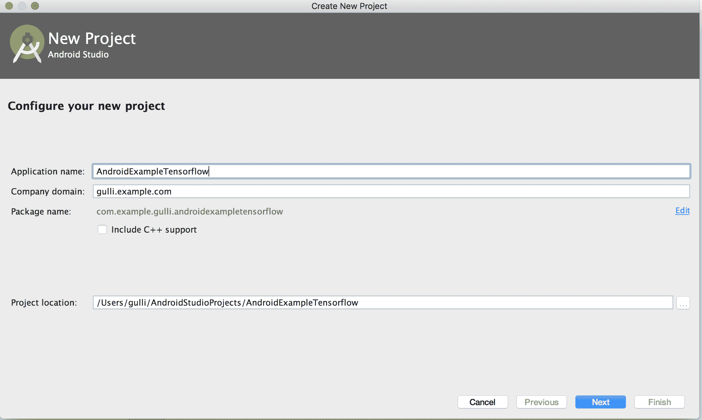

在 AndroidStudio 中创建 TensorFlow 移动应用程序的示例，第一步如下图所示：选择电话和表格选项：

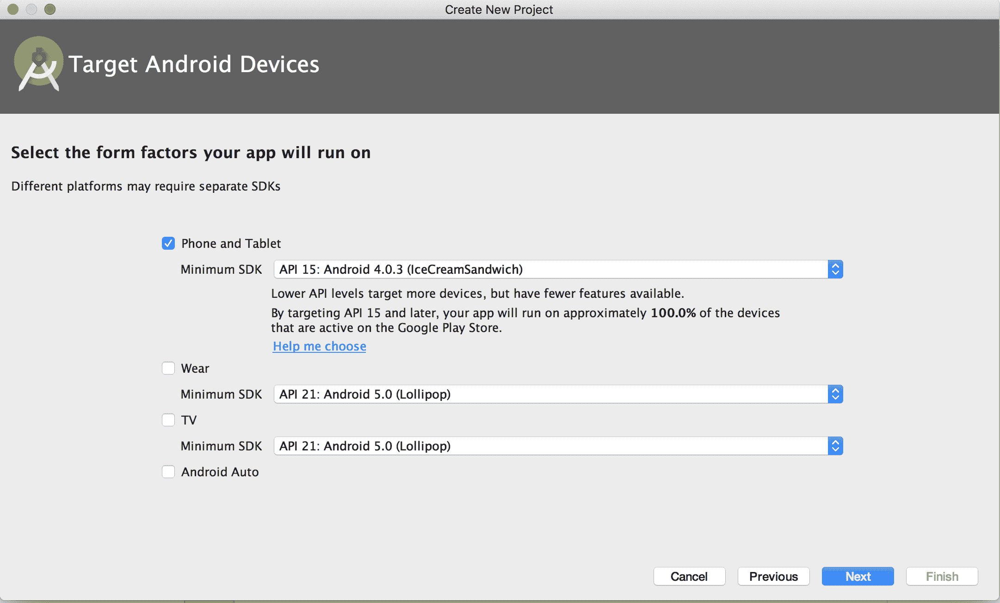

在 AndroidStudio 中创建 TensorFlow 移动应用程序的示例，第二步并选择一个空活动，如下图所示：

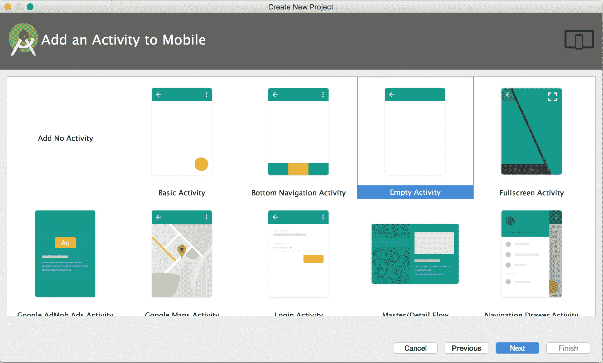

在 AndroidStudio 中创建 TensorFlow 移动应用程序的示例，第三步然后自定义`MainActivity`，如下图所示：

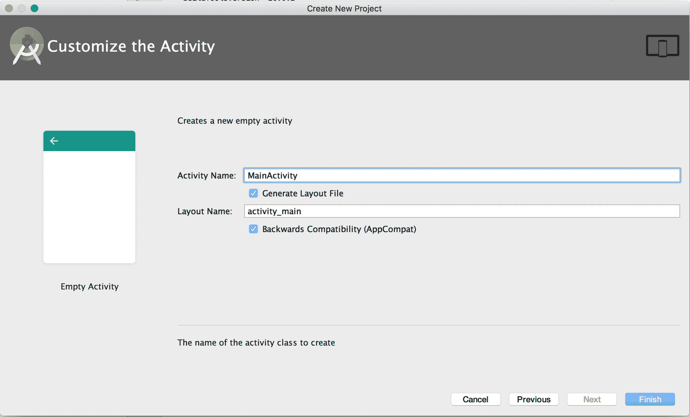

An example of creating TensorFlow mobile application in AndroidStudio, fourth step

3.  将以下行插入`build.gradle`应用中，如以下代码所示：

```py
// added for automatically connect to TensorFlow via maven
repositories {
jcenter()
maven {
url 'https://google.bintray.com/TensorFlow'
}
}
dependencies {
compile fileTree(dir: 'libs', include: ['*.jar'])
androidTestCompile('com.android.support.test.espresso:espresso-core:2.2.2', {
exclude group: 'com.android.support', module: 'support-annotations'
})
compile 'com.android.support:appcompat-v7:26.+'
compile 'com.android.support.constraint:constraint-layout:1.0.2'
// added for automatically compile TensorFlow
compile 'org.TensorFlow:TensorFlow-android:+'
testCompile 'junit:junit:4.12'
}
```

以下屏幕截图显示了插入的代码：

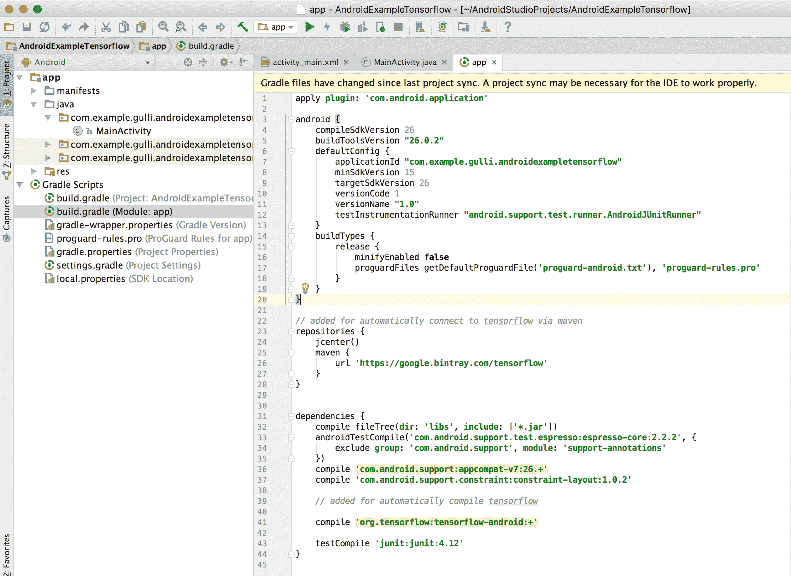

4.  运行项目并获得结果：

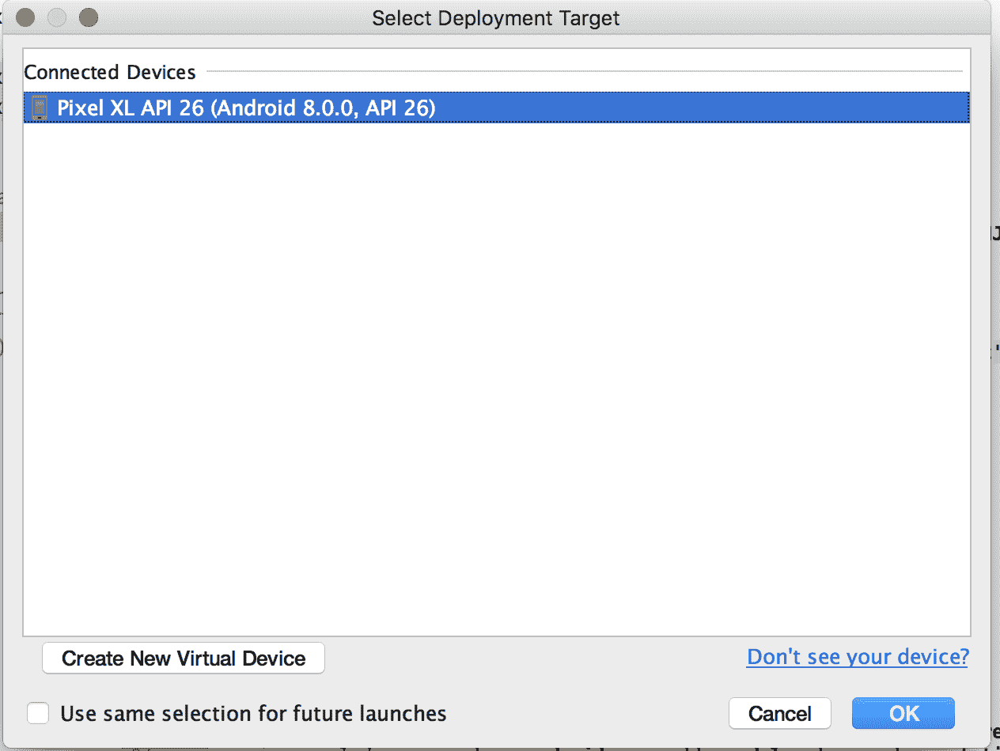

使用 AndroidStudio 进行编译的示例，其中显示了连接的设备。

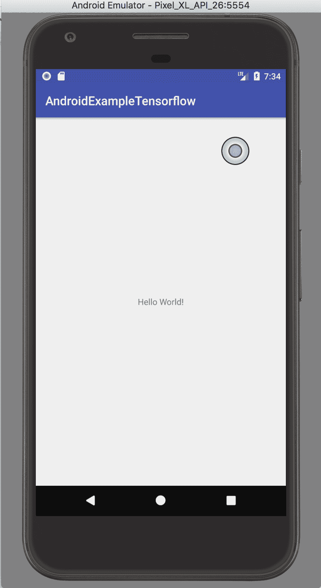

在 AndroidStudio 中创建 TensorFlow 移动应用程序的示例。 一个简单的`Hello World`应用程序

# 这个怎么运作...

使用 Android Studio 设置 Android TensorFlow 非常简单。 您只需要在应用程序的`build.gradle`文件中添加一些配置行，Android Studio 就会代表您执行所有操作。

# 还有更多...

如果要直接从 TensorFlow 源构建，则需要安装 Bazel 和 TensorFlow。 Bazel 是一个快速，可扩展，多语言和可扩展的构建系统。 Google 内部使用了构建工具 Blaze，并将 Blaze 工具的开源部分称为 Bazel。 名称是 Blaze 的字谜。

[此页面将指导您完成该过程](https://github.com/tensorflow/tensorflow/tree/master/tensorflow/examples/android/)。

如果您正在运行 macOS，则过程非常简单：

1.  按照[这个页面](https://docs.bazel.build/versions/master/install.html)上的说明安装 Bazel。 对于 macOS，我们将使用 Homebrew：

```py
/usr/bin/ruby -e "$(curl -fsSL \
 https://raw.githubusercontent.com/Homebrew/install/master/install)"
brew install bazel
bazel version
brew upgrade bazel
```

2.  从 GitHub 克隆 TensorFlow 发行版。

```py
git clone https://github.com/TensorFlow/TensorFlow.git
```

# 玩 TensorFlow 和 Android 示例

在本食谱中，我们将考虑 TensorFlow 发行版中提供的标准 Android 示例并将其安装在我们的移动设备上。

# 做好准备

TensorFlow 移动 Android 应用程序[可在 GitHub 上的以下地址获得](https://github.com/tensorflow/tensorflow/tree/master/tensorflow/examples/android)。 2017 年 10 月，该页面包含以下示例：

*   **TF 分类**：使用 Google Inception 模型实时对相机帧进行分类，并在相机图像上以重叠显示顶部结果。
*   **TF 检测**：演示使用 TensorFlow 对象检测 API 训练的 SSD-Mobilenet 模型。 这是在现代卷积目标检测器的速度/精度折衷中引入的，以实时定位和跟踪摄像机预览中的目标（来自 80 个类别）。
*   **TF 风格化**：使用基于*艺术风格的学习表示*的模型将相机预览图像重新设置为许多不同艺术风格的图像。
*   **TF 语音**：运行在音频训练教程中构建的简单语音识别模型。 侦听一小部分单词，并在识别它们时在 UI 中突出显示它们。

# 怎么做...

我们按以下步骤进行：

1.  安装软件包的最佳方法是使用每晚创建的预构建 APK。 将浏览器指向[这里](https://ci.tensorflow.org/view/Nightly/job/nightly-android/)并下载`TensorFlow_demo.apk`，如以下屏幕截图所示：

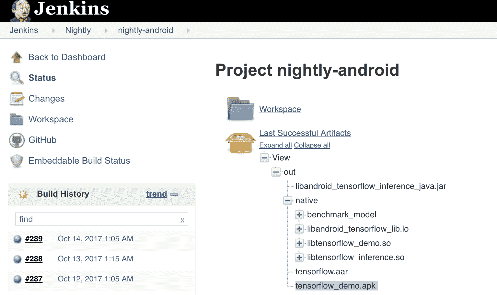

2.  在您的设备上安装应用程序。 在我的示例中，我将使用 Android Studio 中可用的 Pixel XL 仿真设备。 这是直接从 Android Studio 内部模拟的终端设备。 命令`adb devices`列出所有连接的设备。 在这种情况下，我有一个 Pixel XL 模拟器，可以安装`TensorFlow_demo apk`。

```py
adb devices
List of devices attached
emulator-5554 device
adb install -r TensorFlow_demo.apk
```

安装后，仿真器将具有一组新的 TensorFlow 应用程序可供使用，如下图所示。


3.  运行您喜欢的应用程序。 例如，以下图像是 TF Stylize 的示例，用于通过 Transfer Learning 将相机预览图像重新设置为多种不同艺术风格的图像：

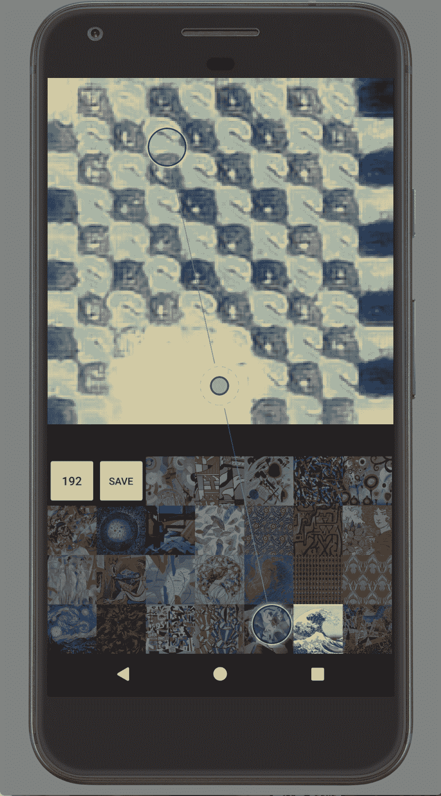

下图是 TF 语音的示例（请记住为仿真器激活麦克风）：

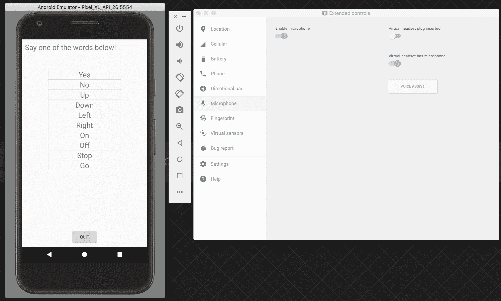

# 这个怎么运作...

如果您使用夜间构建演示和`adb`工具在设备上安装 APK，则安装 Android 的 TensorFlow 示例非常容易。

# 为 MacOS 和 iPhone 安装 TensorFlow Mobile

在本食谱中，我们将学习如何在移动环境中设置 TensorFlow。 我的环境是 macOS，这里的想法是为 iOS 和 iPhone 开发。

# 做好准备

我们将使用 Xcode 开发环境和 CocoaPods 来预安装 TensorFlow。 我将假定您的环境中已经安装了 Xcode。 如果没有，请从[这里](https://developer.apple.com/xcode/)下载。

# 怎么做...

我们将按照以下步骤进行操作：

1.  使用以下命令安装 CocoaPods

```py
sudo gem install cocoapods
pod setup
Setting up CocoaPods master repo
$ /usr/local/git/current/bin/git clone https://github.com/CocoaPods/Specs.git master --progress
Cloning into 'master'...
remote: Counting objects: 1602077, done.
remote: Compressing objects: 100% (243/243), done.
remote: Total 1602077 (delta 125), reused 172 (delta 74), pack-reused 1601747
Receiving objects: 100% (1602077/1602077), 432.12 MiB | 1.83 MiB/s, done.
Resolving deltas: 100% (849517/849517), done.
Checking out files: 100% (188907/188907), done.
```

2.  使用 CocoaPods 安装 TensorFlow 发行版：

```py
cd TensorFlow/TensorFlow/examples/ios/benchmark
pod install
Analyzing dependencies
Downloading dependencies
Installing TensorFlow-experimental (1.1.1)
Generating Pods project
Integrating client project
[!] Please close any current Xcode sessions and use `tf_benchmark_example.xcworkspace` for this project from now on.
Sending stats
Pod installation complete! There is 1 dependency from the Podfile and 1 total pod installed.
```

3.  从 Inception v1 下载一些样本数据。 将标签和图形文件提取到`simple`和`camera`文件夹内的数据文件夹中：

```py
mkdir -p ~/graphs
 curl -o ~/graphs/inception5h.zip \
 https://storage.googleapis.com/download.TensorFlow.org/models/inception5h.zip \
 && unzip ~/graphs/inception5h.zip -d ~/graphs/inception5h
 cp ~/graphs/inception5h/* TensorFlow/examples/ios/benchmark/data/
 cp ~/graphs/inception5h/* TensorFlow/examples/ios/camera/data/
 cp ~/graphs/inception5h/* TensorFlow/examples/ios/simple/data/
```

4.  从中下载用作测试的映像并将其复制到基准目录：

<https://upload.wikimedia.org/wikipedia/commons/5/55/Grace_Hopper.jpg>

```py
cp grace_hopper.jpg ../../benchmark/data/
```


An image of Grace Hopper

5.  打开以前使用的示例项目。 以下命令将打开已经可用的 TensorFlow 的 Xcode 之后，运行编译，如以下代码和图像所示：

```py
open tf_benchmark_example.xcworkspace
```

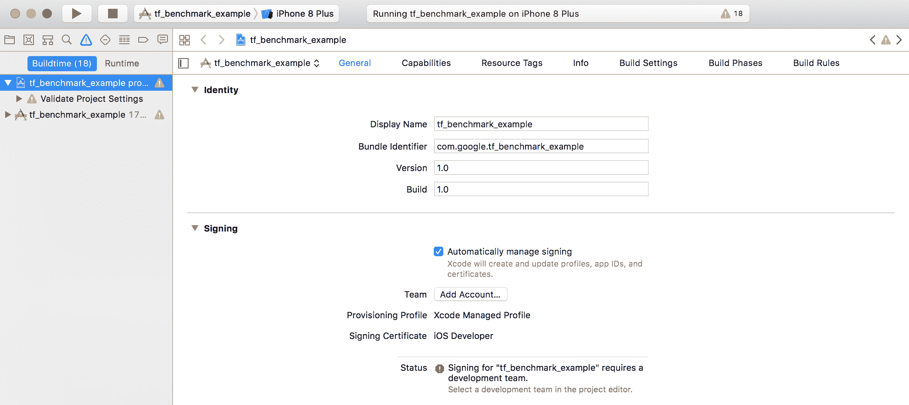

6.  在 iPhone 模拟器中查看结果。 根据 Inception v1 类别，将步骤 4 中使用的图像识别为*军服*的图像：

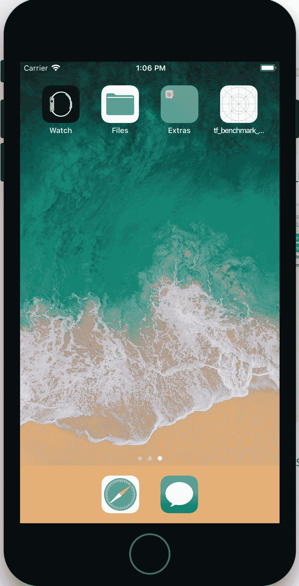

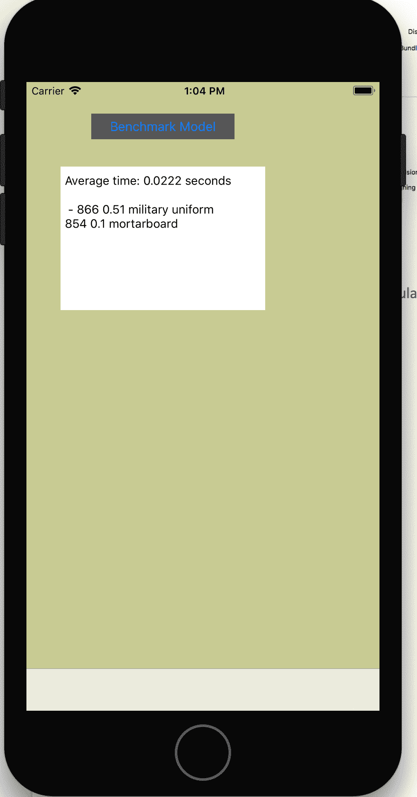

An example of Iphone application for Tensorflow computation

# 这个怎么运作...

Xcode 和 CocoaPods 用于编译 TensorFlow 应用程序，该应用程序用于对不同 Inception 类别中的图像进行分类。 结果使用 iPhone 模拟器可视化。

# 还有更多...

您可以直接在应用程序中使用 TensorFlow。 [可在此处获得更多信息](https://github.com/TensorFlow/TensorFlow/blob/master/TensorFlow/examples/ios/README.md)。

# 为移动设备优化 TensorFlow 图

在本食谱中，我们将考虑不同的选项来优化在移动设备上运行的 TensorFlow 代码。 从减小模型的大小到量化，分析了不同的选项。

# 做好准备

我们将使用 Bazel 构建 TensorFlow 的不同组件。 因此，第一步是确保同时安装了 Bazel 和 TensorFlow。

# 怎么做...

我们按以下步骤进行优化：

1.  从[这里](https://developer.android.com/studio/install.html)安装 Android Studio。

2.  按照[这个页面](https://docs.bazel.build/versions/master/install.html)上的说明安装 Bazel。 对于 macOS，我们将使用 Homebrew：

```py
/usr/bin/ruby -e "$(curl -fsSL \
 https://raw.githubusercontent.com/Homebrew/install/master/install)"
brew install bazel
bazel version
brew upgrade bazel
```

3.  从 GitHub 克隆 TensorFlow 发行版：

```py
git clone https://github.com/TensorFlow/TensorFlow.git
```

4.  构建一个图形转换器，总结一下图形本身：

```py
cd ~/TensorFlow/
bazel build TensorFlow/tools/graph_transforms:summarize_graph
[2,326 / 2,531] Compiling TensorFlow/core/kernels/cwise_op_greater.cc
INFO: From Linking TensorFlow/tools/graph_transforms/summarize_graph:
clang: warning: argument unused during compilation: '-pthread' [-Wunused-command-line-argument]
Target //TensorFlow/tools/graph_transforms:summarize_graph up-to-date:
bazel-bin/TensorFlow/tools/graph_transforms/summarize_graph
INFO: Elapsed time: 1521.260s, Critical Path: 103.87s
```

7.  下载 TensorFlow 图以用作示例。 在这种情况下，我们将使用 Inception v1 TensorFlow 图：

```py
mkdir -p ~/graphs
 curl -o ~/graphs/inception5h.zip \
 https://storage.googleapis.com/download.TensorFlow.org/models/inception5h.zip \
 && unzip ~/graphs/inception5h.zip -d ~/graphs/inception5h
```

8.  汇总 Inception 图并注意常参数的数量：1,346 万。 它们每个都存储有 32 位浮点数，这非常昂贵：

```py
bazel-bin/TensorFlow/tools/graph_transforms/summarize_graph --in_graph=/Users/gulli/graphs/TensorFlow_inception_graph.pb
Found 1 possible inputs: (name=input, type=float(1), shape=[])
No variables spotted.
Found 3 possible outputs: (name=output, op=Identity) (name=output1, op=Identity) (name=output2, op=Identity)
Found 13462015 (13.46M) const parameters, 0 (0) variable parameters, and 0 control_edges
370 nodes assigned to device '/cpu:0'Op types used: 142 Const, 64 BiasAdd, 61 Relu, 59 Conv2D, 13 MaxPool, 9 Concat, 5 Reshape, 5 MatMul, 3 Softmax, 3 Identity, 3 AvgPool, 2 LRN, 1 Placeholder
To use with TensorFlow/tools/benchmark:benchmark_model try these arguments:
bazel run TensorFlow/tools/benchmark:benchmark_model -- --graph=/Users/gulli/graphs/TensorFlow_inception_graph.pb --show_flops --input_layer=input --input_layer_type=float --input_layer_shape= --output_layer=output,output1,output2
```

9.  编译该工具以将常量操作量化至 8 位：

```py
bazel build TensorFlow/tools/graph_transforms:transform_graph
INFO: From Linking TensorFlow/tools/graph_transforms/transform_graph:
clang: warning: argument unused during compilation: '-pthread' [-Wunused-command-line-argument]
Target //TensorFlow/tools/graph_transforms:transform_graph up-to-date:
bazel-bin/TensorFlow/tools/graph_transforms/transform_graph
INFO: Elapsed time: 294.421s, Critical Path: 28.83s
```

10.  运行该工具以量化 Inception V1 图形：

```py
bazel-bin/TensorFlow/tools/graph_transforms/transform_graph --in_graph=/Users/gulli/graphs/inception5h/TensorFlow_inception_graph.pb --out_graph=/tmp/TensorFlow_inception_quantized.pb --inputs='Mul:0' --outputs='softmax:0' --transforms='quantize_weights'
2017-10-15 18:56:01.192498: I TensorFlow/tools/graph_transforms/transform_graph.cc:264] Applying quantize_weights
```

11.  比较两个模型：

```py
ls -lah /Users/gulli/graphs/inception5h/TensorFlow_inception_graph.pb
-rw-r----- 1 gulli 5001 51M Nov 19 2015 /Users/gulli/graphs/inception5h/TensorFlow_inception_graph.pb
ls -lah /tmp/TensorFlow_inception_quantized.pb
-rw-r--r-- 1 gulli wheel 13M Oct 15 18:56 /tmp/TensorFlow_inception_quantized.pb
```

# 这个怎么运作...

量化通过将常量操作从 32 位缩减为 8 位来帮助减小模型的大小。 通常，该模型不会遭受性能的显着降低。 但是，这必须根据具体情况进行验证。

# 为移动设备分析 TensorFlow 图

在本食谱中，我们将考虑不同的选项来优化 TensorFlow 代码以在移动设备上运行。 从减小模型的大小到量化，分析了不同的选项。

# 做好准备

我们将使用 Bazel 构建 TensorFlow 的不同组件。 因此，第一步是确保同时安装了 Bazel 和 TensorFlow。

# 怎么做...

我们进行如下分析：

1.  从[这里](https://developer.android.com/studio/install.html)安装 Android Studio。

2.  按照[这个页面](https://docs.bazel.build/versions/master/install.html)上的说明安装 Bazel。 对于 macOS，我们将使用 Homebrew：

```py
/usr/bin/ruby -e "$(curl -fsSL \
 https://raw.githubusercontent.com/Homebrew/install/master/install)"
brew install bazel
bazel version
brew upgrade bazel
```

3.  从 GitHub 克隆 TensorFlow 发行版：

```py
git clone https://github.com/TensorFlow/TensorFlow.git
```

4.  构建图变压器，该图变压器对图本身进行配置：

```py
cd ~/TensorFlow/
bazel build -c opt TensorFlow/tools/benchmark:benchmark_model
INFO: Found 1 target...
Target //TensorFlow/tools/benchmark:benchmark_model up-to-date:
bazel-bin/TensorFlow/tools/benchmark/benchmark_model
INFO: Elapsed time: 0.493s, Critical Path: 0.01s
```

5.  通过在桌面上运行以下命令来对模型进行基准测试：

```py
bazel-bin/TensorFlow/tools/benchmark/benchmark_model --graph=/Users/gulli/graphs/TensorFlow_inception_graph.pb --show_run_order=false --show_time=false --show_memory=false --show_summary=true --show_flops=true
Graph: [/Users/gulli/graphs/TensorFlow_inception_graph.pb]
Input layers: [input:0]
Input shapes: [1,224,224,3]
Input types: [float]
Output layers: [output:0]
Num runs: [1000]
Inter-inference delay (seconds): [-1.0]
Inter-benchmark delay (seconds): [-1.0]
Num threads: [-1]
Benchmark name: []
Output prefix: []
Show sizes: [0]
Warmup runs: [2]
Loading TensorFlow.
Got config, 0 devices
Running benchmark for max 2 iterations, max -1 seconds without detailed stat logging, with -1s sleep between inferences
count=2 first=279182 curr=41827 min=41827 max=279182 avg=160504 std=118677
Running benchmark for max 1000 iterations, max 10 seconds without detailed stat logging, with -1s sleep between inferences
count=259 first=39945 curr=44189 min=36539 max=51743 avg=38651.1 std=1886
Running benchmark for max 1000 iterations, max 10 seconds with detailed stat logging, with -1s sleep between inferences
count=241 first=40794 curr=39178 min=37634 max=153345 avg=41644.8 std=8092
Average inference timings in us: Warmup: 160504, no stats: 38651, with stats: 41644
```


6.  通过在运行 64 位 ARM 处理器的目标 android 设备上运行以下命令来对模型进行基准测试。 请注意，以下命令将初始图推送到设备上并运行可在其中执行基准测试的外壳程序：

```py
bazel build -c opt --config=android_arm64 \ TensorFlow/tools/benchmark:benchmark_model
adb push bazel-bin/TensorFlow/tools/benchmark/benchmark_model \ /data/local/tmp
adb push /tmp/TensorFlow_inception_graph.pb /data/local/tmp/
adb push ~gulli/graphs/inception5h/TensorFlow_inception_graph.pb /data/local/tmp/
/Users/gulli/graphs/inception5h/TensorFlow_inception_graph.pb: 1 file pushed. 83.2 MB/s (53884595 bytes in 0.618s)
adb shell
generic_x86:/ $
/data/local/tmp/benchmark_model --graph=/data/local/tmp/TensorFlow_inception_graph.pb --show_run_order=false --show_time=false --show_memory=false --show_summary=true
```

# 这个怎么运作...

正如预期的那样，该模型在 Conv2D 操作上花费了大量时间。 总体而言，这大约占我台式机平均时间的 77.5%。 如果在移动设备上运行此程序，那么花时间执行神经网络中的每一层并确保它们处于受控状态至关重要。 要考虑的另一个方面是内存占用。 在这种情况下，桌面执行约为 10 Mb。

# 转换移动设备的 TensorFlow 图

在本食谱中，我们将学习如何转换 TensorFlow 图，以便删除所有仅训练节点。 这将减小图形的大小，使其更适合于移动设备。

**What is a graph transform tool?** According to https://github.com/tensorflow/tensorflow/blob/master/tensorflow/tools/graph_transforms/README.md "When you have finished training a model and want to deploy it in production, you'll often want to modify it to better run in its final environment. For example if you're targeting a phone you might want to shrink the file size by quantizing the weights, or optimize away batch normalization or other training-only features. The Graph Transform framework offers a suite of tools for modifying computational graphs, and a framework to make it easy to write your own modifications".

# 做好准备

我们将使用 Bazel 构建 TensorFlow 的不同组件。 因此，第一步是确保同时安装了 Bazel 和 TensorFlow。

# 怎么做...

这是我们如何转换 TensorFlow 的方法：

1.  从[这里](https://developer.android.com/studio/install.html)安装 Android Studio。

2.  按照[这个页面](https://docs.bazel.build/versions/master/install.html)上的说明安装 Bazel。 对于 macOS，我们将使用 Homebrew：

```py
/usr/bin/ruby -e "$(curl -fsSL \
 https://raw.githubusercontent.com/Homebrew/install/master/install)"
brew install bazel
bazel version
brew upgrade bazel
```

3.  从 GitHub 克隆 TensorFlow 发行版：

```py
git clone https://github.com/TensorFlow/TensorFlow.git
```

4.  构建一个图形转换器，它总结了图形本身：

```py
bazel run TensorFlow/tools/graph_transforms:summarize_graph -- --in_graph=/Users/gulli/graphs/inception5h/TensorFlow_inception_graph.pb
WARNING: /Users/gulli/TensorFlow/TensorFlow/core/BUILD:1783:1: in includes attribute of cc_library rule //TensorFlow/core:framework_headers_lib: '../../external/nsync/public' resolves to 'external/nsync/public' not below the relative path of its package 'TensorFlow/core'. This will be an error in the future. Since this rule was created by the macro 'cc_header_only_library', the error might have been caused by the macro implementation in /Users/gulli/TensorFlow/TensorFlow/TensorFlow.bzl:1054:30.
INFO: Found 1 target...
Target //TensorFlow/tools/graph_transforms:summarize_graph up-to-date:
bazel-bin/TensorFlow/tools/graph_transforms/summarize_graph
INFO: Elapsed time: 0.395s, Critical Path: 0.01s
INFO: Running command line: bazel-bin/TensorFlow/tools/graph_transforms/summarize_graph '--in_graph=/Users/gulli/graphs/inception5h/TensorFlow_inception_graph.pb'
Found 1 possible inputs: (name=input, type=float(1), shape=[])
No variables spotted.
Found 3 possible outputs: (name=output, op=Identity) (name=output1, op=Identity) (name=output2, op=Identity)
Found 13462015 (13.46M) const parameters, 0 (0) variable parameters, and 0 control_edges
370 nodes assigned to device '/cpu:0'Op types used: 142 Const, 64 BiasAdd, 61 Relu, 59 Conv2D, 13 MaxPool, 9 Concat, 5 Reshape, 5 MatMul, 3 Softmax, 3 Identity, 3 AvgPool, 2 LRN, 1 Placeholder
To use with TensorFlow/tools/benchmark:benchmark_model try these arguments:
bazel run TensorFlow/tools/benchmark:benchmark_model -- --graph=/Users/gulli/graphs/inception5h/TensorFlow_inception_graph.pb --show_flops --input_layer=input --input_layer_type=float --input_layer_shape= --output_layer=output,output1,output2
```

5.  剥去用于训练的所有节点，当在移动设备上使用图进行推理时，不需要这些节点：

```py
bazel run TensorFlow/tools/graph_transforms:transform_graph -- --in_graph=/Users/gulli/graphs/inception5h/TensorFlow_inception_graph.pb --out_graph=/tmp/optimized_inception_graph.pb --transforms="strip_unused_nodes fold_constants(ignore_errors=true) fold_batch_norms fold_old_batch_norms"
WARNING: /Users/gulli/TensorFlow/TensorFlow/core/BUILD:1783:1: in includes attribute of cc_library rule //TensorFlow/core:framework_headers_lib: '../../external/nsync/public' resolves to 'external/nsync/public' not below the relative path of its package 'TensorFlow/core'. This will be an error in the future. Since this rule was created by the macro 'cc_header_only_library', the error might have been caused by the macro implementation in /Users/gulli/TensorFlow/TensorFlow/TensorFlow.bzl:1054:30.
INFO: Found 1 target...
Target //TensorFlow/tools/graph_transforms:transform_graph up-to-date:
bazel-bin/TensorFlow/tools/graph_transforms/transform_graph
INFO: Elapsed time: 0.578s, Critical Path: 0.01s
INFO: Running command line: bazel-bin/TensorFlow/tools/graph_transforms/transform_graph '--in_graph=/Users/gulli/graphs/inception5h/TensorFlow_inception_graph.pb' '--out_graph=/tmp/optimized_inception_graph.pb' '--transforms=strip_unused_nodes fold_constants(ignore_errors=true) fold_batch_norms fold_old_batch_norms'
2017-10-15 22:26:59.357129: I TensorFlow/tools/graph_transforms/transform_graph.cc:264] Applying strip_unused_nodes
2017-10-15 22:26:59.367997: I TensorFlow/tools/graph_transforms/transform_graph.cc:264] Applying fold_constants
2017-10-15 22:26:59.387800: I TensorFlow/core/platform/cpu_feature_guard.cc:137] Your CPU supports instructions that this TensorFlow binary was not compiled to use: SSE4.2 AVX AVX2 FMA
2017-10-15 22:26:59.388676: E TensorFlow/tools/graph_transforms/transform_graph.cc:279] fold_constants: Ignoring error Must specify at least one target to fetch or execute.
2017-10-15 22:26:59.388695: I TensorFlow/tools/graph_transforms/transform_graph.cc:264] Applying fold_batch_norms
2017-10-15 22:26:59.388721: I TensorFlow/tools/graph_transforms/transform_graph.cc:264] Applying fold_old_batch_norms
```

# 这个怎么运作...

为了创建可以在设备上加载的更轻的模型，我们使用了图形变换工具应用的`strip_unused_nodes`规则删除了所有不需要的节点。 该操作将删除用于学习的所有操作，并保留用于推理的操作。