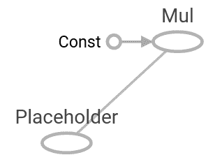

# 计算图中的操作

现在我们可以将对象放入计算图中，我们将介绍对这些对象起作用的操作。

## 做好准备

要启动图，我们加载 TensorFlow 并创建一个会话，如下所示：

```py
import tensorflow as tf 
sess = tf.Session() 
```

## 操作步骤

在这个例子中，我们将结合我们学到的东西并将列表中的每个数字提供给图中的操作并打印输出：

首先，我们宣布我们的张量和占位符。在这里，我们将创建一个 NumPy 数组来提供给我们的操作：

```py
import numpy as np 
x_vals = np.array([1., 3., 5., 7., 9.]) 
x_data = tf.placeholder(tf.float32) 
m_const = tf.constant(3.) 
my_product = tf.multiply(x_data, m_const) 
for x_val in x_vals: 
    print(sess.run(my_product, feed_dict={x_data: x_val})) 
```

上述代码的输出如下：

```py
3.0 
9.0 
15.0 
21.0 
27.0 
```

## 工作原理

本节中的代码在计算图上创建数据和操作。下图是计算图的样子：



图 1：`x_data`占位符以及乘法常数输入到乘法运算中