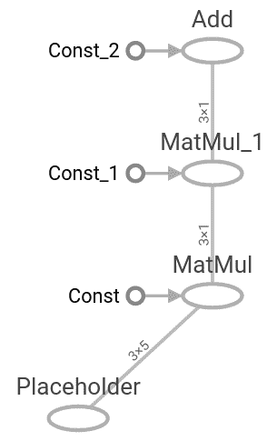

# 对嵌套操作分层

在本文中，我们将学习如何在同一计算图上放置多个操作。

## 做好准备

了解如何将操作链接在一起非常重要。这将在计算图中设置分层操作。对于演示，我们将占位符乘以两个矩阵，然后执行加法。我们将以三维 NumPy 数组的形式提供两个矩阵：

```py
import tensorflow as tf 
sess = tf.Session() 
```

## 操作步骤

同样重要的是要注意数据在通过时如何改变形状。我们将输入两个大小为`3` x `5`的 NumPy 数组。我们将每个矩阵乘以一个大小常数`5` x `1,`，这将产生一个大小为`3` x `1`的矩阵。然后我们将其乘以`1` x `1`矩阵，再次产生`3` x `1`矩阵。最后，我们在最后添加`3` x `1`矩阵，如下所示：

1.  首先，我们创建要输入的数据和相应的占位符：

```py
my_array = np.array([[1., 3., 5., 7., 9.], 
                   [-2., 0., 2., 4., 6.], 
                   [-6., -3., 0., 3., 6.]]) 
x_vals = np.array([my_array, my_array + 1]) 
x_data = tf.placeholder(tf.float32, shape=(3, 5)) 
```

1.  接下来，我们创建将用于矩阵乘法和加法的常量：

```py
m1 = tf.constant([[1.], [0.], [-1.], [2.], [4.]]) 
m2 = tf.constant([[2.]]) 
a1 = tf.constant([[10.]]) 
```

1.  现在，我们声明操作并将它们添加到图中：

```py
prod1 = tf.matmul(x_data, m1) 
prod2 = tf.matmul(prod1, m2) 
add1 = tf.add(prod2, a1)
```

1.  最后，我们通过图提供数据：

```py
for x_val in x_vals: 
    print(sess.run(add1, feed_dict={x_data: x_val})) 
[[ 102.] 
 [  66.] 
 [  58.]] 
[[ 114.] 
 [  78.] 
 [  70.]] 
```

## 工作原理

我们刚刚创建的计算图可以使用 TensorBoard 进行可视化。 TensorBoard 是 TensorFlow 的一个功能，它允许我们可视化计算图和这些图中的值。与其他机器学习框架不同，这些功能是本机提供的。要了解如何完成此操作，请参阅第 11 章中的 TensorBoard 秘籍中的可视化图，更多内容使用 TensorFlow。以下是我们的分层图如下所示：



图 2：向上传播到图时的数据大小

## 更多

在通过图运行数据之前，我们必须声明数据形状并知道操作的结果形状。这并非总是如此。可能有一两个我们事先不知道的维度，或者一些可能变化的维度。为实现此目的，我们将可以改变（或未知）的维度或维度指定为值`None`。例如，要使先前的数据占位符具有未知数量的列，我们将编写以下行：

```py
x_data = tf.placeholder(tf.float32, shape=(3,None))
```

这允许我们打破矩阵乘法规则，但我们仍然必须遵守乘法常数必须具有相同行数的事实。当我们将数据输入图时，我们可以动态生成或重新整形`x_data`。当我们以不同批次大小的多批次提供数据时，这将在后面的章节中派上用场。

> 虽然使用`None`作为尺寸允许我们使用可变尺寸的尺寸，但在填充尺寸时始终建议尽可能明确。如果我们将尺寸标准化为固定尺寸，那么我们应该明确地将该尺寸写为尺寸。建议将`None`用作维度，以限制数据的批量大小（或我们一次计算的数据点数）。