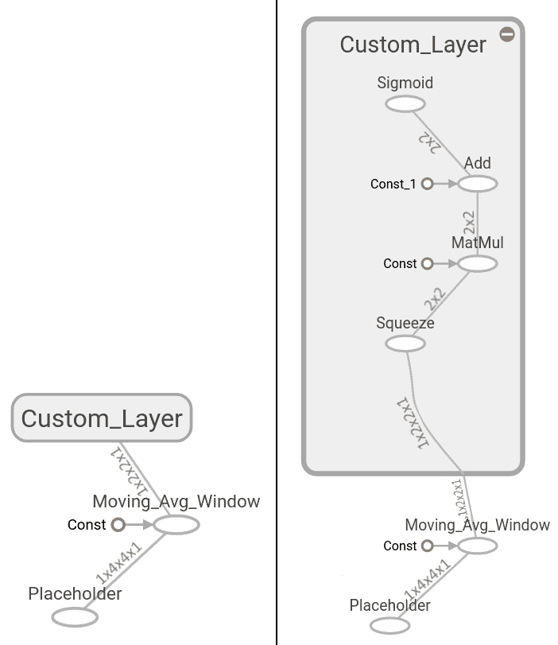

# 使用多个层

现在我们已经介绍了多个操作，我们将介绍如何连接具有通过它们传播的数据的各个层。

## 做好准备

在本文中，我们将介绍如何最好地连接各种层，包括自定义层。我们将生成和使用的数据将代表小型随机图像。最好通过一个简单的例子来理解这种类型的操作，看看我们如何使用一些内置层来执行计算。我们将探索的第一层称为移动窗口。我们将在 2D 图像上执行小的移动窗口平均值，然后第二层将是自定义操作层。

在本节中，我们将看到计算图可能变得庞大且难以查看。为了解决这个问题，我们还将介绍命名操作和创建层范围的方法。首先，加载`numpy`和`tensorflow`，然后使用以下命令创建图：

```py
import tensorflow as tf 
import numpy as np 
sess = tf.Session() 
```

## 操作步骤

我们按如下方式处理秘籍：

1.  首先，我们使用 NumPy 创建示例 2D 图像。该图像将是`4` x `4`像素图像。我们将在四个方面创建它;第一个和最后一个维度的大小为 1.请注意，某些 TensorFlow 图像函数将在四维图像上运行。这四个维度是图像编号，高度，宽度和通道，为了使其成为一个具有一个通道的图像，我们将两个维度设置为`1`，如下所示：

```py
x_shape = [1, 4, 4, 1] 
x_val = np.random.uniform(size=x_shape) 
```

1.  现在，我们必须在图中创建占位符，我们可以在其中提供示例图像，如下所示：

```py
x_data = tf.placeholder(tf.float32, shape=x_shape) 
```

1.  为了在我们的`4` x `4`图像上创建一个移动窗口平均值，我们将使用一个内置函数，它将在形状窗口`2` x `2`上收敛一个常量。我们将使用的函数是`conv2d()`;此函数在图像处理和 TensorFlow 中非常常用。此函数采用窗口的分段产品和我们指定的过滤器。我们还必须在两个方向上指定移动窗口的步幅。在这里，我们将计算四个移动窗口平均值：左上角，右上角，左下角和右下角四个像素。我们通过创建`2` x `2`窗口并在每个方向上具有长度`2`的步幅来实现这一点。为取平均值，我们将`2` x `2`窗口用`0.25`的常数卷积，如下：

```py
my_filter = tf.constant(0.25, shape=[2, 2, 1, 1]) 
my_strides = [1, 2, 2, 1] 
mov_avg_layer= tf.nn.conv2d(x_data, my_filter, my_strides, 
                            padding='SAME', name='Moving_Avg_Window') 
```

> 请注意，我们还使用函数的`name`参数命名此层`Moving_Avg_Window`。 为了计算卷积层的输出大小，我们可以使用下面的公式`: Output = (W - F + 2P) / S + 1`，其中`W`是输入大小，`F`是过滤器大小，`P`是零填充，并且`S`是步幅。

1.  现在，我们定义一个自定义层，它将在移动窗口平均值的`2` x `2`输出上运行。自定义函数将首先将输入乘以另一个`2` x `2`矩阵张量，然后为每个条目添加 1。在此之后，我们取每个元素的 sigmoid 并返回`2` x `2`矩阵。由于矩阵乘法仅对二维矩阵进行操作，因此我们需要删除大小为`1`的图像的额外维度。 TensorFlow 可以使用内置的`squeeze()`函数执行此操作。在这里，我们定义新层：

```py
    def custom_layer(input_matrix): 
        input_matrix_sqeezed = tf.squeeze(input_matrix) 
        A = tf.constant([[1., 2.], [-1., 3.]]) 
        b = tf.constant(1., shape=[2, 2]) 
        temp1 = tf.matmul(A, input_matrix_sqeezed) 
        temp = tf.add(temp1, b) # Ax + b 
        return tf.sigmoid(temp) 
```

1.  现在，我们必须将新层放在图上。我们将使用命名范围执行此操作，以便它在计算图上可识别和可折叠/可扩展，如下所示：

```py
with tf.name_scope('Custom_Layer') as scope: 
    custom_layer1 = custom_layer(mov_avg_layer) 
```

1.  现在，我们只需输入`4` x `4`图像来替换占位符并告诉 TensorFlow 运行图，如下所示：

```py
print(sess.run(custom_layer1, feed_dict={x_data: x_val})) 
[[ 0.91914582 0.96025133] 
 [ 0.87262219  0.9469803 ]] 
```

## 工作原理

通过命名操作和层范围，可视化绘图看起来更好。我们可以折叠和展开自定义层，因为我们在命名范围内创建了它。在下图中，请参阅左侧的折叠版本和右侧的展开版本：



图 3：具有两层的计算图

第一层名为 Moving_Avg_Window。第二个是名为 Custom_Layer 的操作集合。它在左侧折叠并在右侧展开。