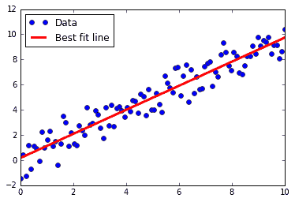

# 使用矩阵逆方法

在这个秘籍中，我们将使用 TensorFlow 用矩阵逆方法求解二维线性回归。

## 做好准备

线性回归可以表示为一组矩阵方程，比如`Ax = b`。在这里，我们感兴趣的是求解矩阵`x`中的系数。如果我们的观察矩阵（设计矩阵）`A`不是正方形，我们必须要小心。解决`x`的解决方案可以表示为：


为了证明确实如此，我们将生成二维数据，在 TensorFlow 中解决它，并绘制结果。

## 操作步骤

我们按如下方式处理秘籍：

1.  首先，我们加载必要的库，初始化图并创建数据。请参阅以下代码：

```py
import matplotlib.pyplot as plt 
import numpy as np 
import tensorflow as tf 
sess = tf.Session() 
x_vals = np.linspace(0, 10, 100) 
y_vals = x_vals + np.random.normal(0, 1, 100) 
```

1.  接下来，我们创建要在逆方法中使用的矩阵。我们首先创建`A`矩阵，它将是`x`数据列和 1s 列。然后，我们从`y`数据创建`b`矩阵。使用以下代码：

```py
x_vals_column = np.transpose(np.matrix(x_vals)) 
ones_column = np.transpose(np.matrix(np.repeat(1, 100))) 
A = np.column_stack((x_vals_column, ones_column)) 
b = np.transpose(np.matrix(y_vals)) 
```

1.  然后我们将`A`和`b`矩阵转换为张量，如下所示：

```py
A_tensor = tf.constant(A) 
b_tensor = tf.constant(b)
```

1.  现在我们已经设置了矩阵，我们可以使用 TensorFlow 通过矩阵逆方法解决这个问题，如下所示：

```py
tA_A = tf.matmul(tf.transpose(A_tensor), A_tensor) 
tA_A_inv = tf.matrix_inverse(tA_A) 
product = tf.matmul(tA_A_inv, tf.transpose(A_tensor)) 
solution = tf.matmul(product, b_tensor) 
solution_eval = sess.run(solution) 
```

1.  我们现在使用以下代码从解，斜率和 y 截距中提取系数：

```py
slope = solution_eval[0][0] 
y_intercept = solution_eval[1][0] 
print('slope: ' + str(slope)) 
print('y_intercept: ' + str(y_intercept)) 
slope: 0.955707151739 
y_intercept: 0.174366829314 
best_fit = [] 
for i in x_vals: 
    best_fit.append(slope*i+y_intercept) 

plt.plot(x_vals, y_vals, 'o', label='Data') 
plt.plot(x_vals, best_fit, 'r-', label='Best fit line', linewidth=3) 
plt.legend(loc='upper left') 
plt.show() 
```

我们得到前面代码的图，如下所示：



图 1：数据点和通过矩阵逆方法获得的最佳拟合线

## 工作原理

与之前的秘籍或本书中的大多数秘籍不同，此处的解决方案仅通过矩阵运算找到。我们将使用的大多数 TensorFlow 算法都是通过训练循环实现的，并利用自动反向传播来更新模型变量。在这里，我们通过实现将模型拟合到数据的直接解决方案来说明 TensorFlow 的多功能性。

> 我们在这里使用了一个二维数据示例来显示与数据拟合的图。值得注意的是，用于求解系数的公式
> 
> 
> 
> 将根据需要扩展到数据中的许多特征（除非存在任何共线性问题）。