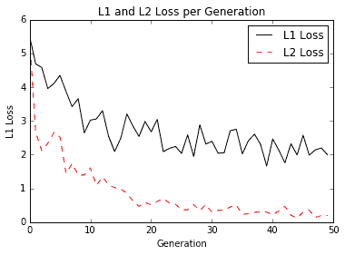
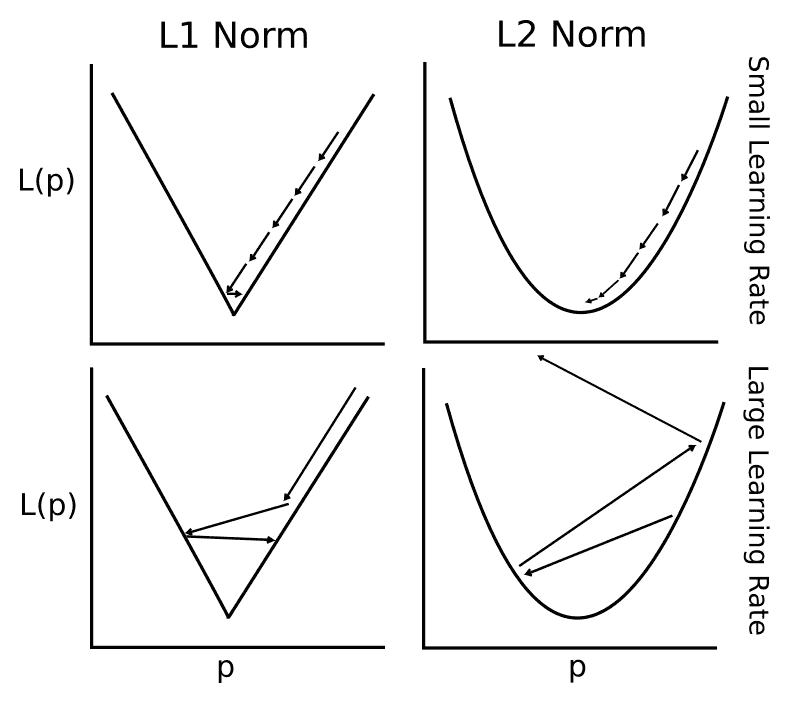

# 理解线性回归中的损失函数

了解损失函数在算法收敛中的作用非常重要。在这里，我们将说明 L1 和 L2 损失函数如何影响线性回归中的收敛。

## 做好准备

我们将使用与先前秘籍中相同的虹膜数据集，但我们将更改损失函数和学习率以查看收敛如何变化。

## 操作步骤

我们按如下方式处理秘籍：

1.  程序的开始与上一个秘籍相同，直到我们达到我们的损失函数。我们加载必要的库，启动会话，加载数据，创建占位符，并定义我们的变量和模型。需要注意的一点是，我们正在提取学习率和模型迭代。我们这样做是因为我们希望显示快速更改这些参数的效果。使用以下代码：

```py
import matplotlib.pyplot as plt 
import numpy as np 
import tensorflow as tf 
from sklearn import datasets 
sess = tf.Session() 
iris = datasets.load_iris() 
x_vals = np.array([x[3] for x in iris.data]) 
y_vals = np.array([y[0] for y in iris.data]) 
batch_size = 25 
learning_rate = 0.1 # Will not converge with learning rate at 0.4 
iterations = 50 
x_data = tf.placeholder(shape=[None, 1], dtype=tf.float32) 
y_target = tf.placeholder(shape=[None, 1], dtype=tf.float32) 
A = tf.Variable(tf.random_normal(shape=[1,1])) 
b = tf.Variable(tf.random_normal(shape=[1,1])) 
model_output = tf.add(tf.matmul(x_data, A), b)
```

1.  我们的损失函数将变为 L1 损失（`loss_l1`），如下所示：

```py
loss_l1 = tf.reduce_mean(tf.abs(y_target - model_output)) 
```

1.  现在，我们通过初始化变量，声明我们的优化器以及通过训练循环迭代数据来恢复。请注意，我们也在节省每一代的损失来衡量收敛。使用以下代码：

```py
init = tf.global_variables_initializer() 
sess.run(init) 
my_opt_l1 = tf.train.GradientDescentOptimizer(learning_rate) 
train_step_l1 = my_opt_l1.minimize(loss_l1) 
loss_vec_l1 = [] 
for i in range(iterations): 
    rand_index = np.random.choice(len(x_vals), size=batch_size) 
    rand_x = np.transpose([x_vals[rand_index]]) 
    rand_y = np.transpose([y_vals[rand_index]]) 
    sess.run(train_step_l1, feed_dict={x_data: rand_x, y_target: rand_y}) 
    temp_loss_l1 = sess.run(loss_l1, feed_dict={x_data: rand_x, y_target: rand_y}) 
    loss_vec_l1.append(temp_loss_l1) 
    if (i+1)%25==0: 
        print('Step #' + str(i+1) + ' A = ' + str(sess.run(A)) + ' b = ' + str(sess.run(b))) 

plt.plot(loss_vec_l1, 'k-', label='L1 Loss') 
plt.plot(loss_vec_l2, 'r--', label='L2 Loss') 
plt.title('L1 and L2 Loss per Generation') 
plt.xlabel('Generation') 
plt.ylabel('L1 Loss') 
plt.legend(loc='upper right') 
plt.show() 
```

## 工作原理

在选择损失函数时，我们还必须选择适合我们问题的相应学习率。在这里，我们将说明两种情况，一种是首选 L2，另一种是首选 L1。

如果我们的学习率很小，我们的收敛会花费更多时间。但是如果我们的学习速度太大，我们的算法就会遇到问题从不收敛。下面是当学习率为 0.05 时，虹膜线性回归问题的 L1 和 L2 损失的损失函数图：



图 5：虹膜线性回归问题的学习率为 0.05 的 L1 和 L2 损失

学习率为 0.05 时，似乎 L2 损失是首选，因为它会收敛到较低的损失。下面是我们将学习率提高到 0.4 时的损失函数图：


图 6：虹膜线性回归问题的 L1 和 L2 损失，学习率为 0.4;请注意，由于 y 轴的高比例，L1 损失不可见

在这里，我们可以看到高学习率可以在 L2 范数中超调，而 L1 范数收敛。

## 更多

为了理解正在发生的事情，我们应该看看大学习率和小学习率如何影响 L1 规范和 L2 规范。为了使这个可视化，我们查看两个规范的学习步骤的一维表示，如下所示：



图 7：学习率越来越高的 L1 和 L2 规范会发生什么