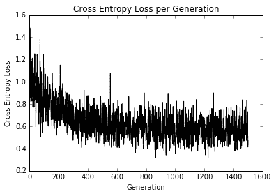
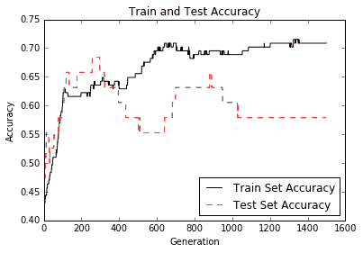

# 实现逻辑回归

对于这个秘籍，我们将实现逻辑回归来预测样本人群中低出生体重的概率。

## 做好准备

逻辑回归是将线性回归转换为二元分类的一种方法。这是通过将线性输出转换为 Sigmoid 函数来实现的，该函数将输出在 0 和 1 之间进行缩放。目标是零或一，表示数据点是在一个类还是另一个类中。由于我们预测 0 和 1 之间的数字，如果预测高于指定的截止值，则预测被分类为类值 1，否则分类为 0。出于此示例的目的，我们将指定 cutoff 为 0.5，这将使分类像舍入输出一样简单。

我们将用于此示例的数据将是从作者的 GitHub 仓库获得的[低出生体重数据](https://github.com/nfmcclure/tensorflow_cookbook/raw/master/01_Introduction/07_Working_with_Data_Sources/birthweight_data/birthweight.dat)。我们将从其他几个因素预测低出生体重。

## 操作步骤

我们按如下方式处理秘籍：

1.  我们首先加载库，包括`request`库，因为我们将通过超链接访问低出生体重数据。我们还发起了一个会议：

```py
import matplotlib.pyplot as plt 
import numpy as np 
import tensorflow as tf 
import requests 
from sklearn import datasets 
from sklearn.preprocessing import normalize 
from tensorflow.python.framework import ops 
ops.reset_default_graph() 
sess = tf.Session()
```

1.  接下来，我们通过请求模块加载数据并指定我们要使用的特征。我们必须具体，因为一个特征是实际出生体重，我们不想用它来预测出生体重是大于还是小于特定量。我们也不想将 ID 列用作预测器：

```py
birth_weight_file = 'birth_weight.csv'
# Download data and create data file if file does not exist in current directory
if not os.path.exists(birth_weight_file):
    birthdata_url = 'https://github.com/nfmcclure/tensorflow_cookbook/raw/master/01_Introduction/07_Working_with_Data_Sources/birthweight_data/birthweight.dat'
    birth_file = requests.get(birthdata_url)
    birth_data = birth_file.text.split('\r\n')
    birth_header = birth_data[0].split('\t')
    birth_data = [[float(x) for x in y.split('\t') if len(x)>=1] for y in birth_data[1:] if len(y)>=1]
    with open(birth_weight_file, 'w', newline='') as f:
        writer = csv.writer(f)
        writer.writerow(birth_header)
        writer.writerows(birth_data)

# Read birth weight data into memory
birth_data = []
with open(birth_weight_file, newline='') as csvfile:
    csv_reader = csv.reader(csvfile)
    birth_header = next(csv_reader)
    for row in csv_reader:
        birth_data.append(row)
    birth_data = [[float(x) for x in row] for row in birth_data]
# Pull out target variable
y_vals = np.array([x[0] for x in birth_data])
# Pull out predictor variables (not id, not target, and not birthweight)
x_vals = np.array([x[1:8] for x in birth_data])
```

1.  首先，我们将数据集拆分为测试和训练集：

```py
train_indices = np.random.choice(len(x_vals), round(len(x_vals)*0.8), replace=False) 
test_indices = np.array(list(set(range(len(x_vals))) - set(train_indices))) 
x_vals_train = x_vals[train_indices] 
x_vals_test = x_vals[test_indices] 
y_vals_train = y_vals[train_indices] 
y_vals_test = y_vals[test_indices]
```

1.  当特征在 0 和 1 之间缩放（最小 - 最大缩放）时，逻辑回归收敛效果更好。那么，接下来我们将扩展每个特征：

```py
def normalize_cols(m, col_min=np.array([None]), col_max=np.array([None])):
    if not col_min[0]:
        col_min = m.min(axis=0)
    if not col_max[0]:
        col_max = m.max(axis=0)
    return (m-col_min) / (col_max - col_min), col_min, col_max

x_vals_train, train_min, train_max = np.nan_to_num(normalize_cols(x_vals_train))
x_vals_test = np.nan_to_num(normalize_cols(x_vals_test, train_min, train_max))
```

> 请注意，在缩放数据集之前，我们将数据集拆分为 train 和 test。这是一个重要的区别。我们希望确保测试集完全不影响训练集。如果我们在分裂之前缩放整个集合，那么我们不能保证它们不会相互影响。我们确保从训练组中保存缩放以缩放测试集。

1.  接下来，我们声明批量大小，占位符，变量和逻辑模型。我们不将输出包装在 sigmoid 中，因为该操作内置于 loss 函数中。另请注意，每次观察都有七个输入特征，因此`x_data`占位符的大小为`[None, 7]`。

```py
batch_size = 25 
x_data = tf.placeholder(shape=[None, 7], dtype=tf.float32) 
y_target = tf.placeholder(shape=[None, 1], dtype=tf.float32) 
A = tf.Variable(tf.random_normal(shape=[7,1])) 
b = tf.Variable(tf.random_normal(shape=[1,1])) 
model_output = tf.add(tf.matmul(x_data, A), b)
```

1.  现在，我们声明我们的损失函数，它具有 sigmoid 函数，初始化我们的变量，并声明我们的优化函数：

```py
loss = tf.reduce_mean(tf.nn.sigmoid_cross_entropy_with_logits(model_output, y_target)) 
init = tf.global_variables_initializer() 
sess.run(init) 
my_opt = tf.train.GradientDescentOptimizer(0.01) 
train_step = my_opt.minimize(loss)
```

1.  在记录损失函数的同时，我们还希望在训练和测试集上记录分类准确率。因此，我们将创建一个预测函数，返回任何大小的批量的准确率：

```py
prediction = tf.round(tf.sigmoid(model_output)) 
predictions_correct = tf.cast(tf.equal(prediction, y_target), tf.float32) 
accuracy = tf.reduce_mean(predictions_correct)
```

1.  现在，我们可以开始我们的训练循环并记录损失和准确率：

```py
loss_vec = [] 
train_acc = [] 
test_acc = [] 
for i in range(1500): 
    rand_index = np.random.choice(len(x_vals_train), size=batch_size) 
    rand_x = x_vals_train[rand_index] 
    rand_y = np.transpose([y_vals_train[rand_index]]) 
    sess.run(train_step, feed_dict={x_data: rand_x, y_target: rand_y}) 
    temp_loss = sess.run(loss, feed_dict={x_data: rand_x, y_target: rand_y}) 
    loss_vec.append(temp_loss) 
    temp_acc_train = sess.run(accuracy, feed_dict={x_data: x_vals_train, y_target: np.transpose([y_vals_train])}) 
    train_acc.append(temp_acc_train) 
    temp_acc_test = sess.run(accuracy, feed_dict={x_data: x_vals_test, y_target: np.transpose([y_vals_test])}) 
    test_acc.append(temp_acc_test)
```

1.  以下是查看损失和准确率图的代码：

```py
plt.plot(loss_vec, 'k-') 
plt.title('Cross' Entropy Loss per Generation') 
plt.xlabel('Generation') 
plt.ylabel('Cross' Entropy Loss') 
plt.show() 
plt.plot(train_acc, 'k-', label='Train Set Accuracy') 
plt.plot(test_acc, 'r--', label='Test Set Accuracy') 
plt.title('Train and Test Accuracy') 
plt.xlabel('Generation') 
plt.ylabel('Accuracy') 
plt.legend(loc='lower right') 
plt.show() 
```

## 工作原理

这是迭代和训练和测试精度的损失。由于数据集仅为 189 次观测，因此随着数据集的随机分裂，训练和测试精度图将发生变化。第一个数字是交叉熵损失：



图 11：在 1,500 次迭代过程中绘制的交叉熵损失

第二个图显示了训练和测试装置的准确率：

Figure 12: Test and train set accuracy plotted over 1,500 generations