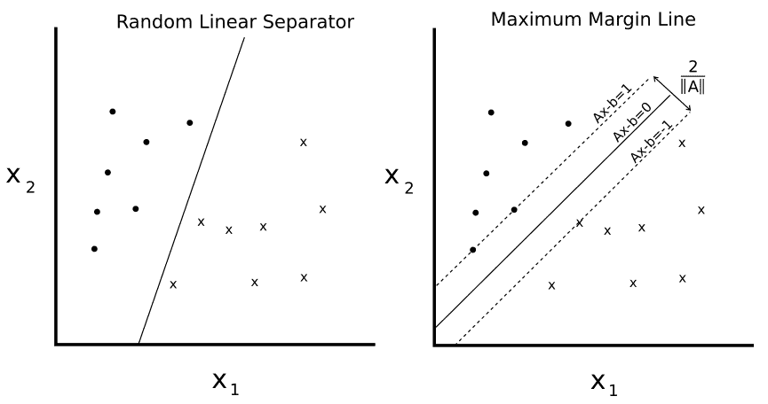

# 介绍

SVM 是二分类的方法。基本思想是在两个类之间找到二维的线性分离线（或更多维度的超平面）。我们首先假设二进制类目标是-1 或 1，而不是先前的 0 或 1 目标。由于可能有许多行分隔两个类，我们定义最佳线性分隔符，以最大化两个类之间的距离：

图 1

给定两个可分类`o`和`x`，我们希望找到两者之间的线性分离器的等式。左侧绘图显示有许多行将两个类分开。右侧绘图显示了唯一的最大边际线。边距宽度由`2 / ||A||`给出。通过最小化`A`的 L2 范数找到该线。

我们可以编写如下超平面：

这里，`A`是我们部分斜率的向量，`x`是输入向量。最大边距的宽度可以显示为 2 除以`A`的 L2 范数。这个事实有许多证明，但是对于几何思想，求解从 2D 点到直线的垂直距离可以提供前进的动力。

对于线性可分的二进制类数据，为了最大化余量，我们最小化`A`，的 L2 范数。我们还必须将此最小值置于以下约束条件下：

前面的约束确保我们来自相应类的所有点都在分离线的同一侧。

由于并非所有数据集都是线性可分的，因此我们可以为跨越边界线的点引入损失函数。对于`n`数据点，我们引入了所谓的软边际损失函数，如下所示：

请注意，如果该点位于边距的正确一侧，则乘积`y[i](Ax[i] - b)`始终大于 1。这使得损失函数的左手项等于 0，并且对损失函数的唯一影响是余量的大小。

前面的损失函数将寻找线性可分的线，但允许穿过边缘线的点。根据`α`的值，这可以是硬度或软度量。`α`的较大值导致更加强调边距的扩大，而`α`的较小值导致模型更像是一个硬边缘，同时允许数据点跨越边距，如果需要的话。

在本章中，我们将建立一个软边界 SVM，并展示如何将其扩展到非线性情况和多个类。