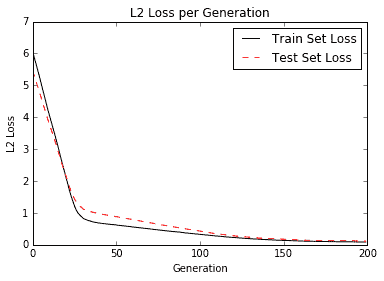

# 简化为线性回归

SVM 可用于拟合线性回归。在本节中，我们将探讨如何使用 TensorFlow 执行此操作。

## 做好准备

可以将相同的最大边际概念应用于拟合线性回归。我们可以考虑最大化包含最多（`x`，`y`）点的边距，而不是最大化分隔类的边距。为了说明这一点，我们将使用相同的虹膜数据集，并表明我们可以使用此概念来拟合萼片长度和花瓣宽度之间的线。

相应的损失函数类似于：


这里，`ε`是边距宽度的一半，如果一个点位于该区域，则损失等于 0。

## 操作步骤

我们按如下方式处理秘籍：

1.  首先，我们加载必要的库，启动图，然后加载虹膜数据集。之后，我们将数据集拆分为训练集和测试集，以显示两者的损失。使用以下代码：

```py
import matplotlib.pyplot as plt 
import numpy as np 
import tensorflow as tf 
from sklearn import datasets 
sess = tf.Session() 
iris = datasets.load_iris() 
x_vals = np.array([x[3] for x in iris.data]) 
y_vals = np.array([y[0] for y in iris.data]) 
train_indices = np.random.choice(len(x_vals), round(len(x_vals)*0.8), replace=False) 
test_indices = np.array(list(set(range(len(x_vals))) - set(train_indices))) 
x_vals_train = x_vals[train_indices] 
x_vals_test = x_vals[test_indices] 
y_vals_train = y_vals[train_indices] 
y_vals_test = y_vals[test_indices]
```

> 对于此示例，我们将数据拆分为训练集和测试集。将数据拆分为三个数据集也很常见，其中包括验证集。我们可以使用此验证集来验证我们在训练它们时不会过拟合模型。

1.  让我们声明我们的批量大小，占位符和变量，并创建我们的线性模型，如下所示：

```py
batch_size = 50 

x_data = tf.placeholder(shape=[None, 1], dtype=tf.float32) 
y_target = tf.placeholder(shape=[None, 1], dtype=tf.float32) 

A = tf.Variable(tf.random_normal(shape=[1,1])) 
b = tf.Variable(tf.random_normal(shape=[1,1])) 

model_output = tf.add(tf.matmul(x_data, A), b) 
```

1.  现在，我们宣布我们的损失函数。如前文所述，损失函数实现为`ε = 0.5`。请记住，epsilon 是我们的损失函数的一部分，它允许软边距而不是硬边距：

```py
epsilon = tf.constant([0.5]) 
loss = tf.reduce_mean(tf.maximum(0., tf.subtract(tf.abs(tf.subtract(model_output, y_target)), epsilon))) 
```

1.  我们创建一个优化器并接下来初始化我们的变量，如下所示：

```py
my_opt = tf.train.GradientDescentOptimizer(0.075) 
train_step = my_opt.minimize(loss) 

init = tf.global_variables_initializer() 
sess.run(init) 
```

1.  现在，我们迭代 200 次训练迭代并保存训练和测试损失以便以后绘图：

```py
train_loss = [] 
test_loss = [] 
for i in range(200): 
    rand_index = np.random.choice(len(x_vals_train), size=batch_size) 
    rand_x = np.transpose([x_vals_train[rand_index]]) 
    rand_y = np.transpose([y_vals_train[rand_index]]) 
    sess.run(train_step, feed_dict={x_data: rand_x, y_target: rand_y}) 

    temp_train_loss = sess.run(loss, feed_dict={x_data: np.transpose([x_vals_train]), y_target: np.transpose([y_vals_train])}) 
    train_loss.append(temp_train_loss) 

    temp_test_loss = sess.run(loss, feed_dict={x_data: np.transpose([x_vals_test]), y_target: np.transpose([y_vals_test])}) 
    test_loss.append(temp_test_loss) 
    if (i+1)%50==0: 
        print('-----------') 
        print('Generation: ' + str(i)) 
        print('A = ' + str(sess.run(A)) + ' b = ' + str(sess.run(b))) 
        print('Train Loss = ' + str(temp_train_loss)) 
        print('Test Loss = ' + str(temp_test_loss)) 
```

1.  这导致以下输出：

```py
Generation: 50 
A = [[ 2.20651722]] b = [[ 2.71290684]] 
Train Loss = 0.609453 
Test Loss = 0.460152 
----------- 
Generation: 100 
A = [[ 1.6440177]] b = [[ 3.75240564]] 
Train Loss = 0.242519 
Test Loss = 0.208901 
----------- 
Generation: 150 
A = [[ 1.27711761]] b = [[ 4.3149066]] 
Train Loss = 0.108192 
Test Loss = 0.119284 
----------- 
Generation: 200 
A = [[ 1.05271816]] b = [[ 4.53690529]] 
Train Loss = 0.0799957 
Test Loss = 0.107551 
```

1.  我们现在可以提取我们找到的系数，并获得最佳拟合线的值。出于绘图目的，我们也将获得边距的值。使用以下代码：

```py
[[slope]] = sess.run(A) 
[[y_intercept]] = sess.run(b) 
[width] = sess.run(epsilon) 

best_fit = [] 
best_fit_upper = [] 
best_fit_lower = [] 
for i in x_vals: 
  best_fit.append(slope*i+y_intercept) 
  best_fit_upper.append(slope*i+y_intercept+width) 
  best_fit_lower.append(slope*i+y_intercept-width) 
```

1.  最后，这里是用拟合线和训练测试损失绘制数据的代码：

```py
plt.plot(x_vals, y_vals, 'o', label='Data Points') 
plt.plot(x_vals, best_fit, 'r-', label='SVM Regression Line', linewidth=3) 
plt.plot(x_vals, best_fit_upper, 'r--', linewidth=2) 
plt.plot(x_vals, best_fit_lower, 'r--', linewidth=2) 
plt.ylim([0, 10]) 
plt.legend(loc='lower right') 
plt.title('Sepal Length vs Petal Width') 
plt.xlabel('Petal Width') 
plt.ylabel('Sepal Length') 
plt.show() 
plt.plot(train_loss, 'k-', label='Train Set Loss') 
plt.plot(test_loss, 'r--', label='Test Set Loss') 
plt.title('L2 Loss per Generation') 
plt.xlabel('Generation') 
plt.ylabel('L2 Loss') 
plt.legend(loc='upper right') 
plt.show() 
```

上述代码的图如下：


图 5：虹膜数据上有 0.5 个边缘的 SVM 回归（萼片长度与花瓣宽度）

以下是训练迭代中的训练和测试损失：



图 6：训练和测试集上每代的 SVM 回归损失

## 工作原理

直觉上，我们可以将 SVM 回归看作是一个函数，试图尽可能多地在`2ε`宽度范围内拟合点。该线的拟合对该参数有些敏感。如果我们选择太小的 epsilon，算法将无法适应边距中的许多点。如果我们选择太大的 epsilon，将会有许多行能够适应边距中的所有数据点。我们更喜欢较小的 epsilon，因为距离边缘较近的点比较远的点贡献较少的损失。