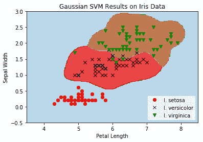

# 实现多类 SVM

我们还可以使用 SVM 对多个类进行分类，而不仅仅是两个类。在本文中，我们将使用多类 SVM 对虹膜数据集中的三种类型的花进行分类。

## 做好准备

通过设计，SVM 算法是二元分类器。但是，有一些策略可以让他们在多个类上工作。两种主要策略称为“一对一”，“一对一”。

一对一是一种策略，其中为每个可能的类对创建二分类器。然后，对具有最多投票的类的点进行预测。这可能在计算上很难，因为我们必须为`k`类创建`k!/(k - 2)!2!`个分类器。

实现多类分类器的另一种方法是执行一对一策略，我们为`k`类的每个类创建一个分类器。点的预测类将是创建最大 SVM 边距的类。这是我们将在本节中实现的策略。

在这里，我们将加载虹膜数据集并使用高斯内核执行多类非线性 SVM。虹膜数据集是理想的，因为有三个类（setosa，virginica 和 versicolor）。我们将为每个类创建三个高斯核 SVM，并预测存在最高边界的点。

## 操作步骤

我们按如下方式处理秘籍：

1.  首先，我们加载我们需要的库并启动图，如下所示：

```py
import matplotlib.pyplot as plt 
import numpy as np 
import tensorflow as tf 
from sklearn import datasets 
sess = tf.Session()
```

1.  接下来，我们将加载虹膜数据集并拆分每个类的目标。我们将仅使用萼片长度和花瓣宽度来说明，因为我们希望能够绘制输出。我们还将每个类的`x`和`y`值分开，以便最后进行绘图。使用以下代码：

```py
iris = datasets.load_iris() 
x_vals = np.array([[x[0], x[3]] for x in iris.data]) 
y_vals1 = np.array([1 if y==0 else -1 for y in iris.target]) 
y_vals2 = np.array([1 if y==1 else -1 for y in iris.target]) 
y_vals3 = np.array([1 if y==2 else -1 for y in iris.target]) 
y_vals = np.array([y_vals1, y_vals2, y_vals3]) 
class1_x = [x[0] for i,x in enumerate(x_vals) if iris.target[i]==0] 
class1_y = [x[1] for i,x in enumerate(x_vals) if iris.target[i]==0] 
class2_x = [x[0] for i,x in enumerate(x_vals) if iris.target[i]==1] 
class2_y = [x[1] for i,x in enumerate(x_vals) if iris.target[i]==1] 
class3_x = [x[0] for i,x in enumerate(x_vals) if iris.target[i]==2] 
class3_y = [x[1] for i,x in enumerate(x_vals) if iris.target[i]==2] 
```

1.  与实现非线性 SVM 秘籍相比，我们在此示例中所做的最大改变是，许多维度将发生变化（我们现在有三个分类器而不是一个）。我们还将利用矩阵广播和重塑技术一次计算所有三个 SVM。由于我们一次性完成这一操作，我们的`y_target`占位符现在具有`[3, None]`的尺寸，我们的模型变量`b`将被初始化为`[3, batch_size]`。使用以下代码：

```py
batch_size = 50 

x_data = tf.placeholder(shape=[None, 2], dtype=tf.float32) 
y_target = tf.placeholder(shape=[3, None], dtype=tf.float32) 
prediction_grid = tf.placeholder(shape=[None, 2], dtype=tf.float32) 

b = tf.Variable(tf.random_normal(shape=[3,batch_size])) 
```

1.  接下来，我们计算高斯核。由于这仅取决于输入的 x 数据，因此该代码不会改变先前的秘籍。使用以下代码：

```py
gamma = tf.constant(-10.0) 
dist = tf.reduce_sum(tf.square(x_data), 1) 
dist = tf.reshape(dist, [-1,1]) 
sq_dists = tf.add(tf.subtract(dist, tf.multiply(2., tf.matmul(x_data, tf.transpose(x_data)))), tf.transpose(dist)) 
my_kernel = tf.exp(tf.multiply(gamma, tf.abs(sq_dists)))
```

1.  一个重大变化是我们将进行批量矩阵乘法。我们将最终得到三维矩阵，我们将希望在第三个索引上广播矩阵乘法。我们没有为此设置数据和目标矩阵。为了使`x^T · x`等操作跨越额外维度，我们创建一个函数来扩展这样的矩阵，将矩阵重新整形为转置，然后在额外维度上调用 TensorFlow 的`batch_matmul`。使用以下代码：

```py
def reshape_matmul(mat): 
    v1 = tf.expand_dims(mat, 1) 
    v2 = tf.reshape(v1, [3, batch_size, 1]) 
    return tf.batch_matmul(v2, v1)
```

1.  创建此函数后，我们现在可以计算双重损失函数，如下所示：

```py
model_output = tf.matmul(b, my_kernel) 
first_term = tf.reduce_sum(b) 
b_vec_cross = tf.matmul(tf.transpose(b), b) 
y_target_cross = reshape_matmul(y_target) 

second_term = tf.reduce_sum(tf.multiply(my_kernel, tf.multiply(b_vec_cross, y_target_cross)),[1,2]) 
loss = tf.reduce_sum(tf.negative(tf.subtract(first_term, second_term))) 
```

1.  现在，我们可以创建预测内核。请注意，我们必须小心`reduce_sum`函数并且不要在所有三个 SVM 预测中减少，因此我们必须告诉 TensorFlow 不要用第二个索引参数对所有内容求和。使用以下代码：

```py
rA = tf.reshape(tf.reduce_sum(tf.square(x_data), 1),[-1,1]) 
rB = tf.reshape(tf.reduce_sum(tf.square(prediction_grid), 1),[-1,1]) 
pred_sq_dist = tf.add(tf.subtract(rA, tf.multiply(2., tf.matmul(x_data, tf.transpose(prediction_grid)))), tf.transpose(rB)) 
pred_kernel = tf.exp(tf.multiply(gamma, tf.abs(pred_sq_dist))) 
```

1.  当我们完成预测内核时，我们可以创建预测。这里的一个重大变化是预测不是输出的`sign()`。由于我们正在实现一对一策略，因此预测是具有最大输出的分类器。为此，我们使用 TensorFlow 的内置`argmax()`函数，如下所示：

```py
prediction_output = tf.matmul(tf.mul(y_target,b), pred_kernel) 
prediction = tf.arg_max(prediction_output-tf.expand_dims(tf.reduce_mean(prediction_output,1), 1), 0) 
accuracy = tf.reduce_mean(tf.cast(tf.equal(prediction, tf.argmax(y_target,0)), tf.float32)) 
```

1.  现在我们已经拥有了内核，损失和预测函数，我们只需要声明我们的优化函数并初始化我们的变量，如下所示：

```py
my_opt = tf.train.GradientDescentOptimizer(0.01) 
train_step = my_opt.minimize(loss) 
init = tf.global_variables_initializer() 
sess.run(init)
```

1.  该算法收敛速度相对较快，因此我们不必运行训练循环超过 100 次迭代。我们使用以下代码执行此操作：

```py
loss_vec = [] 
batch_accuracy = [] 
for i in range(100): 
    rand_index = np.random.choice(len(x_vals), size=batch_size) 
    rand_x = x_vals[rand_index] 
    rand_y = y_vals[:,rand_index] 
    sess.run(train_step, feed_dict={x_data: rand_x, y_target: rand_y}) 

    temp_loss = sess.run(loss, feed_dict={x_data: rand_x, y_target: rand_y}) 
    loss_vec.append(temp_loss) 

    acc_temp = sess.run(accuracy, feed_dict={x_data: rand_x, y_target: rand_y, prediction_grid:rand_x}) 
    batch_accuracy.append(acc_temp) 

    if (i+1)%25==0: 
        print('Step #' + str(i+1)) 
        print('Loss = ' + str(temp_loss)) 

Step #25 
Loss = -2.8951 
Step #50 
Loss = -27.9612 
Step #75 
Loss = -26.896 
Step #100 
Loss = -30.2325
```

1.  我们现在可以创建点的预测网格并对所有点运行预测函数，如下所示：

```py
x_min, x_max = x_vals[:, 0].min() - 1, x_vals[:, 0].max() + 1 
y_min, y_max = x_vals[:, 1].min() - 1, x_vals[:, 1].max() + 1 
xx, yy = np.meshgrid(np.arange(x_min, x_max, 0.02), 
                     np.arange(y_min, y_max, 0.02)) 
grid_points = np.c_[xx.ravel(), yy.ravel()] 
grid_predictions = sess.run(prediction, feed_dict={x_data: rand_x, 
                                                   y_target: rand_y, 
                                                   prediction_grid: grid_points}) 
grid_predictions = grid_predictions.reshape(xx.shape)
```

1.  以下是绘制结果，批量准确率和损失函数的代码。为简洁起见，我们只显示最终结果：

```py
plt.contourf(xx, yy, grid_predictions, cmap=plt.cm.Paired, alpha=0.8) 
plt.plot(class1_x, class1_y, 'ro', label='I. setosa') 
plt.plot(class2_x, class2_y, 'kx', label='I. versicolor') 
plt.plot(class3_x, class3_y, 'gv', label='I. virginica') 
plt.title('Gaussian SVM Results on Iris Data') 
plt.xlabel('Petal Length') 
plt.ylabel('Sepal Width') 
plt.legend(loc='lower right') 
plt.ylim([-0.5, 3.0]) 
plt.xlim([3.5, 8.5])  
plt.show() 

plt.plot(batch_accuracy, 'k-', label='Accuracy') 
plt.title('Batch Accuracy') 
plt.xlabel('Generation') 
plt.ylabel('Accuracy') 
plt.legend(loc='lower right') 
plt.show() 

plt.plot(loss_vec, 'k-') 
plt.title('Loss per Generation') 
plt.xlabel('Generation') 
plt.ylabel('Loss') 
plt.show() 
```

然后我们得到以下绘图：



图 10：在伽马= 10 的虹膜数据集上的多类（三类）非线性高斯 SVM 结果

我们观察前面的屏幕截图，其中显示了所有三个虹膜类，以及为每个类分类的点网格。

## 工作原理

本文中需要注意的重点是我们如何改变算法以同时优化三个 SVM 模型。我们的模型参数`b`有一个额外的维度可以考虑所有三个模型。在这里，我们可以看到，由于 TensorFlow 处理额外维度的内置函数，算法扩展到多个类似算法相对容易。

下一章将介绍最近邻方法，这是一种用于预测目的的非常强大的算法。