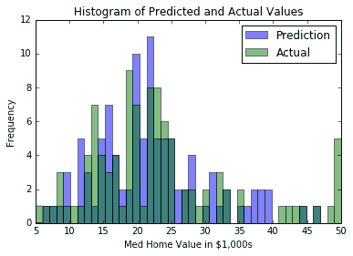

# 使用混合距离函数的计算

在处理具有多个特征的数据观察时，我们应该意识到特征可以在不同的尺度上以不同的方式缩放。在这个方案中，我们将考虑到这一点，以改善我们的住房价值预测。

## 做好准备

扩展最近邻算法很重要，要考虑不同缩放的变量。在这个例子中，我们将说明如何缩放不同变量的距离函数。具体来说，我们将距离函数作为特征方差的函数进行缩放。

加权距离函数的关键是使用权重矩阵。用矩阵运算写的距离函数变为以下公式：


这里，`A`是一个对角线权重矩阵，我们将用它来缩放每个特征的距离度量。

在本文中，我们将尝试在波士顿住房价值数据集上改进我们的 MSE。该数据集是不同尺度上的特征的一个很好的例子，并且最近邻算法将受益于缩放距离函数。

## 操作步骤

我们将按如下方式处理秘籍：

1.  首先，我们将加载必要的库并启动图会话：

```py
import matplotlib.pyplot as plt
import numpy as np
import tensorflow as tf
import requests
sess = tf.Session() 
```

1.  接下来，我们将加载数据并将其存储在 NumPy 数组中。再次注意，我们只会使用某些列进行预测。我们不使用 id，也不使用方差非常低的变量：

```py
housing_url = 'https://archive.ics.uci.edu/ml/machine-learning-databases/housing/housing.data' 
housing_header = ['CRIM', 'ZN', 'INDUS', 'CHAS', 'NOX', 'RM', 'AGE', 'DIS', 'RAD', 'TAX', 'PTRATIO', 'B', 'LSTAT', 'MEDV'] 
cols_used = ['CRIM', 'INDUS', 'NOX', 'RM', 'AGE', 'DIS', 'TAX', 'PTRATIO', 'B', 'LSTAT'] 
num_features = len(cols_used) 
housing_file = requests.get(housing_url) 
housing_data = [[float(x) for x in y.split(' ') if len(x)>=1] for y in housing_file.text.split('\n') if len(y)>=1] 
y_vals = np.transpose([np.array([y[13] for y in housing_data])]) 
x_vals = np.array([[x for i,x in enumerate(y) if housing_header[i] in cols_used] for y in housing_data]) 
```

1.  现在，我们将`x`值缩放到 0 到 1 之间，最小 - 最大缩放：

```py
x_vals = (x_vals - x_vals.min(0)) / x_vals.ptp(0)
```

1.  然后，我们将创建对角线权重矩阵，该矩阵将通过特征的标准偏差提供距离度量的缩放：

```py
weight_diagonal = x_vals.std(0) 
weight_matrix = tf.cast(tf.diag(weight_diagonal), dtype=tf.float32)
```

1.  现在，我们将数据分成训练和测试集。我们还将声明`k`，最近邻居的数量，并使批量大小等于测试集大小：

```py
train_indices = np.random.choice(len(x_vals), round(len(x_vals)*0.8), replace=False) 
test_indices = np.array(list(set(range(len(x_vals))) - set(train_indices))) 
x_vals_train = x_vals[train_indices] 
x_vals_test = x_vals[test_indices] 
y_vals_train = y_vals[train_indices] 
y_vals_test = y_vals[test_indices] 
k = 4 
batch_size=len(x_vals_test) 
```

1.  我们将声明接下来需要的占位符。我们有四个占位符 - 训练和测试集的[​​HTG0] - 输入和`y` - 目标：

```py
x_data_train = tf.placeholder(shape=[None, num_features], dtype=tf.float32) 
x_data_test = tf.placeholder(shape=[None, num_features], dtype=tf.float32) 
y_target_train = tf.placeholder(shape=[None, 1], dtype=tf.float32) 
y_target_test = tf.placeholder(shape=[None, 1], dtype=tf.float32) 
```

1.  现在，我们可以声明我们的距离函数。为了便于阅读，我们将把距离函数分解为其组件。请注意，我们必须按批量大小平铺权重矩阵，并使用`batch_matmul()`函数在批量大小中执行批量矩阵乘法：

```py
subtraction_term =  tf.subtract(x_data_train, tf.expand_dims(x_data_test,1)) 
first_product = tf.batch_matmul(subtraction_term, tf.tile(tf.expand_dims(weight_matrix,0), [batch_size,1,1])) 
second_product = tf.batch_matmul(first_product, tf.transpose(subtraction_term, perm=[0,2,1])) 
distance = tf.sqrt(tf.batch_matrix_diag_part(second_product))
```

1.  在我们计算每个测试点的所有训练距离之后，我们将需要返回顶部 k-NN。我们可以使用`top_k()`函数执行此操作。由于此函数返回最大值，并且我们想要最小距离，因此我们返回最大的负距离值。然后，我们将预测作为顶部`k`邻居的距离的加权平均值：

```py
top_k_xvals, top_k_indices = tf.nn.top_k(tf.neg(distance), k=k) 
x_sums = tf.expand_dims(tf.reduce_sum(top_k_xvals, 1),1) 
x_sums_repeated = tf.matmul(x_sums,tf.ones([1, k], tf.float32)) 
x_val_weights = tf.expand_dims(tf.div(top_k_xvals,x_sums_repeated), 1) 
top_k_yvals = tf.gather(y_target_train, top_k_indices) 
prediction = tf.squeeze(tf.batch_matmul(x_val_weights,top_k_yvals), squeeze_dims=[1]) 
```

1.  为了评估我们的模型，我们将计算预测的 MSE：

```py
mse = tf.divide(tf.reduce_sum(tf.square(tf.subtract(prediction, y_target_test))), batch_size) 
```

1.  现在，我们可以遍历我们的测试批次并计算每个的 MSE：

```py
num_loops = int(np.ceil(len(x_vals_test)/batch_size))
for i in range(num_loops):
    min_index = i*batch_size
    max_index = min((i+1)*batch_size,len(x_vals_train))
    x_batch = x_vals_test[min_index:max_index]
    y_batch = y_vals_test[min_index:max_index]
    predictions = sess.run(prediction, feed_dict={x_data_train: x_vals_train, x_data_test: x_batch, y_target_train: y_vals_train, y_target_test: y_batch})
    batch_mse = sess.run(mse, feed_dict={x_data_train: x_vals_train, x_data_test: x_batch, y_target_train: y_vals_train, y_target_test: y_batch})
    print('Batch #' + str(i+1) + ' MSE: ' + str(np.round(batch_mse,3))) 

Batch #1 MSE: 21.322
```

1.  作为最终比较，我们可以使用以下代码绘制实际测试集的住房值分布和测试集的预测：

```py
bins = np.linspace(5, 50, 45) 
plt.hist(predictions, bins, alpha=0.5, label='Prediction') 
plt.hist(y_batch, bins, alpha=0.5, label='Actual') 
plt.title('Histogram of Predicted and Actual Values') 
plt.xlabel('Med Home Value in $1,000s') 
plt.ylabel('Frequency') 
plt.legend(loc='upper right') 
plt.show() 
```

我们将获得前面代码的以下直方图：



图 3：Boston 数据集上预测房屋价值和实际房屋价值的两个直方图;这一次，我们为每个特征不同地缩放了距离函数

## 工作原理

我们通过引入一种缩放每个特征的距离函数的方法来减少测试集上的 MSE。在这里，我们通过特征标准偏差的因子来缩放距离函数。这提供了更准确的测量视图，其中测量哪些点是最近的邻居。由此，我们还将顶部`k`邻域的加权平均值作为距离的函数，以获得住房价值预测。

## 更多

该缩放因子还可以用于最近邻距离计算中的向下加权或向上加权的特征。这在我们比某些特征更信任某些特征的情况下非常有用。