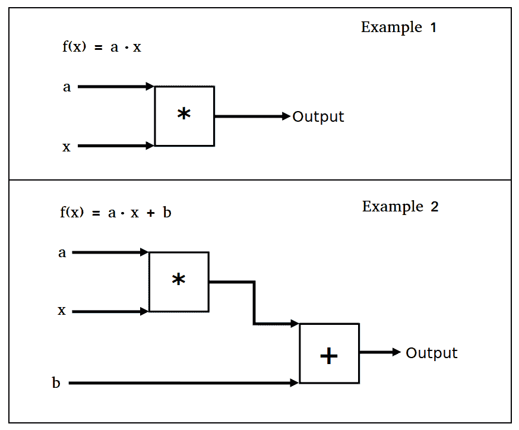

# 实现操作门

神经网络最基本的概念之一是作为操作门操作。在本节中，我们将从乘法操作开始作为门，然后再继续考虑嵌套门操作。

## 做好准备

我们将实现的第一个操作门是`f(x) = a · x`。为优化此门，我们将`a`输入声明为变量，将`x`输入声明为占位符。这意味着 TensorFlow 将尝试更改`a`值而不是`x`值。我们将创建损失函数作为输出和目标值之间的差异，即 50。

第二个嵌套操作门将是`f(x) = a · x + b`。同样，我们将`a`和`b`声明为变量，将`x`声明为占位符。我们再次将输出优化到目标值 50。值得注意的是，第二个例子的解决方案并不是唯一的。有许多模型变量组合可以使输出为 50.对于神经网络，我们并不关心中间模型变量的值，而是更加强调所需的输出。

将这些操作视为我们计算图上的操作门。下图描绘了前面两个示例：



图 1：本节中的两个操作门示例

## 操作步骤

要在 TensorFlow 中实现第一个操作门`f(x) = a · x`并将输出训练为值 50，请按照下列步骤操作：

1.  首先加载`TensorFlow`并创建图会话，如下所示：

```py
import tensorflow as tf 
sess = tf.Session() 
```

1.  现在我们需要声明我们的模型变量，输入数据和占位符。我们使输入数据等于值`5`，因此得到 50 的乘法因子将为 10（即`5X10=50`），如下所示：

```py
a = tf.Variable(tf.constant(4.))
x_val = 5.
x_data = tf.placeholder(dtype=tf.float32)
```

1.  接下来，我们使用以下输入将操作添加到计算图中：

```py
multiplication = tf.multiply(a, x_data) 
```

1.  我们现在将损失函数声明为输出与`50`的期望目标值之间的 L2 距离，如下所示：

```py
loss = tf.square(tf.subtract(multiplication, 50.)) 
```

1.  现在我们初始化我们的模型变量并将我们的优化算法声明为标准梯度下降，如下所示：

```py
init = tf.global_variables_initializer() 
sess.run(init) 
my_opt = tf.train.GradientDescentOptimizer(0.01) 
train_step = my_opt.minimize(loss)
```

1.  我们现在可以将模型输出优化到`50`的期望值。我们通过连续输入 5 的输入值并反向传播损失来将模型变量更新为`10`的值，如下所示：

```py
print('Optimizing a Multiplication Gate Output to 50.') 
for i in range(10): 
    sess.run(train_step, feed_dict={x_data: x_val}) 
    a_val = sess.run(a) 
    mult_output = sess.run(multiplication, feed_dict={x_data: x_val}) 
    print(str(a_val) + ' * ' + str(x_val) + ' = ' + str(mult_output)) 
```

1.  上一步应该产生以下输出：

```py
Optimizing a Multiplication Gate Output to 50\. 
7.0 * 5.0 = 35.0 
8.5 * 5.0 = 42.5 
9.25 * 5.0 = 46.25 
9.625 * 5.0 = 48.125 
9.8125 * 5.0 = 49.0625 
9.90625 * 5.0 = 49.5312 
9.95312 * 5.0 = 49.7656 
9.97656 * 5.0 = 49.8828 
9.98828 * 5.0 = 49.9414 
9.99414 * 5.0 = 49.9707 
```

接下来，我们将对两个嵌套的操作门`f(x) = a · x + b`进行相同的操作。

1.  我们将以与前面示例完全相同的方式开始，但将初始化两个模型变量`a`和`b`，如下所示：

```py
from tensorflow.python.framework import ops 
ops.reset_default_graph() 
sess = tf.Session() 

a = tf.Variable(tf.constant(1.)) 
b = tf.Variable(tf.constant(1.)) 
x_val = 5\. 
x_data = tf.placeholder(dtype=tf.float32) 

two_gate = tf.add(tf.multiply(a, x_data), b) 

loss = tf.square(tf.subtract(two_gate, 50.)) 

my_opt = tf.train.GradientDescentOptimizer(0.01) 
train_step = my_opt.minimize(loss) 

init = tf.global_variables_initializer() 
sess.run(init) 
```

1.  我们现在优化模型变量以将输出训练到`50`的目标值，如下所示：

```py
print('Optimizing Two Gate Output to 50.') 
for i in range(10): 
    # Run the train step 
    sess.run(train_step, feed_dict={x_data: x_val}) 
    # Get the a and b values 
    a_val, b_val = (sess.run(a), sess.run(b)) 
    # Run the two-gate graph output 
    two_gate_output = sess.run(two_gate, feed_dict={x_data: x_val}) 
    print(str(a_val) + ' * ' + str(x_val) + ' + ' + str(b_val) + ' = ' + str(two_gate_output)) 
```

1.  上一步应该产生以下输出：

```py
Optimizing Two Gate Output to 50\. 
5.4 * 5.0 + 1.88 = 28.88 
7.512 * 5.0 + 2.3024 = 39.8624 
8.52576 * 5.0 + 2.50515 = 45.134 
9.01236 * 5.0 + 2.60247 = 47.6643 
9.24593 * 5.0 + 2.64919 = 48.8789 
9.35805 * 5.0 + 2.67161 = 49.4619 
9.41186 * 5.0 + 2.68237 = 49.7417 
9.43769 * 5.0 + 2.68754 = 49.876 
9.45009 * 5.0 + 2.69002 = 49.9405 
9.45605 * 5.0 + 2.69121 = 49.9714 
```

> 这里需要注意的是，第二个例子的解决方案并不是唯一的。这在神经网络中并不重要，因为所有参数都被调整为减少损失。这里的最终解决方案将取决于 a 和 b 的初始值。如果这些是随机初始化的，而不是值 1，我们会看到每次迭代的模型变量的不同结束值。

## 工作原理

我们通过 TensorFlow 的隐式反向传播实现了计算门的优化。 TensorFlow 跟踪我们的模型的操作和变量值，并根据我们的优化算法规范和损失函数的输出进行调整。

我们可以继续扩展操作门，同时跟踪哪些输入是变量，哪些输入是数据。这对于跟踪是很重要的，因为 TensorFlow 将更改所有变量以最小化损失而不是数据，这被声明为占位符。

每个训练步骤自动跟踪计算图并自动更新模型变量的隐式能力是 TensorFlow 的强大功能之一，也是它如此强大的原因之一。