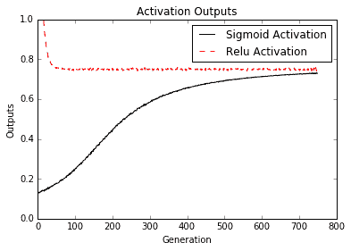
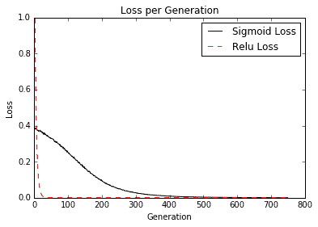

# 使用门和激活函数

现在我们可以将操作门连接在一起，我们希望通过激活函数运行计算图输出。在本节中，我们将介绍常见的激活函数。

## 做好准备

在本节中，我们将比较和对比两种不同的激活函数：S 形和整流线性单元（ReLU）。回想一下，这两个函数由以下公式给出：


在这个例子中，我们将创建两个具有相同结构的单层神经网络，除了一个将通过 sigmoid 激活并且一个将通过 ReLU 激活。损失函数将由距离值 0.75 的 L2 距离控制。我们将从正态分布`(Normal(mean=2, sd=0.1))` 中随机抽取批量数据，然后将输出优化为 0.75。

## 操作步骤

我们按如下方式处理秘籍：

1.  我们将首先加载必要的库并初始化图。这也是我们可以提出如何使用 TensorFlow 设置随机种子的好点。由于我们将使用 NumPy 和 TensorFlow 中的随机数生成器，因此我们需要为两者设置随机种子。使用相同的随机种子集，我们应该能够复制结果。我们通过以下输入执行此操作：

```py
import tensorflow as tf 
import numpy as np 
import matplotlib.pyplot as plt 
sess = tf.Session() 
tf.set_random_seed(5) 
np.random.seed(42) 
```

1.  现在我们需要声明我们的批量大小，模型变量，数据和占位符来输入数据。我们的计算图将包括将我们的正态分布数据输入到两个相似的神经网络中，这两个神经网络的区别仅在于激活函数。结束，如下所示：

```py
batch_size = 50 
a1 = tf.Variable(tf.random_normal(shape=[1,1])) 
b1 = tf.Variable(tf.random_uniform(shape=[1,1])) 
a2 = tf.Variable(tf.random_normal(shape=[1,1])) 
b2 = tf.Variable(tf.random_uniform(shape=[1,1])) 
x = np.random.normal(2, 0.1, 500) 
x_data = tf.placeholder(shape=[None, 1], dtype=tf.float32) 
```

1.  接下来，我们将声明我们的两个模型，即 sigmoid 激活模型和 ReLU 激活模型，如下所示：

```py
sigmoid_activation = tf.sigmoid(tf.add(tf.matmul(x_data, a1), b1)) 
relu_activation = tf.nn.relu(tf.add(tf.matmul(x_data, a2), b2)) 
```

1.  损失函数将是模型输出与值 0.75 之间的平均 L2 范数，如下所示：

```py
loss1 = tf.reduce_mean(tf.square(tf.subtract(sigmoid_activation, 0.75))) 
loss2 = tf.reduce_mean(tf.square(tf.subtract(relu_activation, 0.75)))
```

1.  现在我们需要声明我们的优化算法并初始化我们的变量，如下所示：

```py
my_opt = tf.train.GradientDescentOptimizer(0.01) 
train_step_sigmoid = my_opt.minimize(loss1) 
train_step_relu = my_opt.minimize(loss2) 
init = tf.global_variable_initializer() 
sess.run(init) 
```

1.  现在，我们将针对两个模型循环我们的 750 次迭代训练，如下面的代码块所示。我们还将保存损失输出和激活输出值，以便稍后进行绘图：

```py
loss_vec_sigmoid = [] 
loss_vec_relu = [] 
activation_sigmoid = [] 
activation_relu = [] 
for i in range(750): 
    rand_indices = np.random.choice(len(x), size=batch_size) 
    x_vals = np.transpose([x[rand_indices]]) 
    sess.run(train_step_sigmoid, feed_dict={x_data: x_vals}) 
    sess.run(train_step_relu, feed_dict={x_data: x_vals}) 

    loss_vec_sigmoid.append(sess.run(loss1, feed_dict={x_data: x_vals})) 
    loss_vec_relu.append(sess.run(loss2, feed_dict={x_data: x_vals}))     

    activation_sigmoid.append(np.mean(sess.run(sigmoid_activation, feed_dict={x_data: x_vals}))) 
    activation_relu.append(np.mean(sess.run(relu_activation, feed_dict={x_data: x_vals})))
```

1.  要绘制损失和激活输出，我们需要输入以下代码：

```py
plt.plot(activation_sigmoid, 'k-', label='Sigmoid Activation') 
plt.plot(activation_relu, 'r--', label='Relu Activation') 
plt.ylim([0, 1.0]) 
plt.title('Activation Outputs') 
plt.xlabel('Generation') 
plt.ylabel('Outputs') 
plt.legend(loc='upper right') 
plt.show() 
plt.plot(loss_vec_sigmoid, 'k-', label='Sigmoid Loss') 
plt.plot(loss_vec_relu, 'r--', label='Relu Loss') 
plt.ylim([0, 1.0]) 
plt.title('Loss per Generation') 
plt.xlabel('Generation') 
plt.ylabel('Loss') 
plt.legend(loc='upper right') 
plt.show() 
```

激活输出需要绘制，如下图所示：



图 2：来自具有 S 形激活的网络和具有 ReLU 激活的网络的计算图输出

两个神经网络使用类似的架构和目标（0.75），但有两个不同的激活函数，sigmoid 和 ReLU。重要的是要注意 ReLU 激活网络收敛到比 sigmoid 激活所需的 0.75 目标更快，如下图所示：



图 3：该图描绘了 S 形和 ReLU 激活网络的损耗值。注意迭代开始时 ReLU 损失的极端程度

## 工作原理

由于 ReLU 激活函数的形式，它比 sigmoid 函数更频繁地返回零值。我们认为这种行为是一种稀疏性。这种稀疏性导致收敛速度加快，但失去了受控梯度。另一方面，S 形函数具有非常良好控制的梯度，并且不会冒 ReLU 激活所带来的极值的风险，如下图所示：

| 激活函数 | 好处 | 缺点 |
| --- | --- | --- |
| Sigmoid | 不太极端的产出 | 收敛速度较慢 |
| RELU | 更快地融合 | 极端输出值可能 |

## 更多

在本节中，我们比较了神经网络的 ReLU 激活函数和 S 形激活函数。还有许多其他激活函数通常用于神经网络，但大多数属于两个类别之一;第一类包含形状类似于 sigmoid 函数的函数，如 arctan，hypertangent，heavyiside step 等;第二类包含形状的函数，例如 ReLU 函数，例如 softplus，leaky ReLU 等。我们在本节中讨论的关于比较这两个函数的大多数内容都适用于任何类别的激活。然而，重要的是要注意激活函数的选择对神经网络的收敛和输出有很大影响。