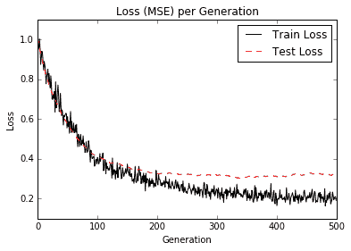

# 实现单层神经网络

我们拥有实现对真实数据进行操作的神经网络所需的所有工具，因此在本节中我们将创建一个神经网络，其中一个层在`Iris`数据集上运行。

## 做好准备

在本节中，我们将实现一个具有一个隐藏层的神经网络。重要的是要理解完全连接的神经网络主要基于矩阵乘法。因此，重要的是数据和矩阵的尺寸正确排列。

由于这是一个回归问题，我们将使用均方误差作为损失函数。

## 操作步骤

我们按如下方式处理秘籍：

1.  要创建计算图，我们首先加载以下必要的库：

```py
import matplotlib.pyplot as plt
import numpy as np
import tensorflow as tf
from sklearn import datasets 
```

1.  现在我们将加载`Iris`数据并将长度存储为目标值。然后我们将使用以下代码启动图会话：

```py
iris = datasets.load_iris() 
x_vals = np.array([x[0:3] for x in iris.data]) 
y_vals = np.array([x[3] for x in iris.data]) 
sess = tf.Session() 
```

1.  由于数据集较小，我们需要设置种子以使结果可重现，如下所示：

```py
seed = 2 
tf.set_random_seed(seed) 
np.random.seed(seed)
```

1.  为了准备数据，我们将创建一个 80-20 训练测试分割，并通过最小 - 最大缩放将 x 特征标准化为 0 到 1 之间，如下所示：

```py
train_indices = np.random.choice(len(x_vals), round(len(x_vals)*0.8), replace=False) 
test_indices = np.array(list(set(range(len(x_vals))) - set(train_indices))) 
x_vals_train = x_vals[train_indices] 
x_vals_test = x_vals[test_indices] 
y_vals_train = y_vals[train_indices] 
y_vals_test = y_vals[test_indices]

def normalize_cols(m): 
    col_max = m.max(axis=0) 
    col_min = m.min(axis=0) 
    return (m-col_min) / (col_max - col_min) 

x_vals_train = np.nan_to_num(normalize_cols(x_vals_train)) 
x_vals_test = np.nan_to_num(normalize_cols(x_vals_test))
```

1.  现在，我们将使用以下代码声明数据和目标的批量大小和占位符：

```py
batch_size = 50 
x_data = tf.placeholder(shape=[None, 3], dtype=tf.float32) 
y_target = tf.placeholder(shape=[None, 1], dtype=tf.float32) 
```

1.  重要的是要用适当的形状声明我们的模型变量。我们可以将隐藏层的大小声明为我们希望的任何大小;在下面的代码块中，我们将其设置为有五个隐藏节点：

```py
hidden_layer_nodes = 5 
A1 = tf.Variable(tf.random_normal(shape=[3,hidden_layer_nodes])) 
b1 = tf.Variable(tf.random_normal(shape=[hidden_layer_nodes])) 
A2 = tf.Variable(tf.random_normal(shape=[hidden_layer_nodes,1])) 
b2 = tf.Variable(tf.random_normal(shape=[1]))
```

1.  我们现在分两步宣布我们的模型。第一步是创建隐藏层输出，第二步是创建模型的`final_output`，如下所示：

> 请注意，我们的模型从三个输入特征到五个隐藏节点，最后到一个输出值。

```py
hidden_output = tf.nn.relu(tf.add(tf.matmul(x_data, A1), b1)) 
final_output = tf.nn.relu(tf.add(tf.matmul(hidden_output, A2), b2)) 
```

1.  我们作为`loss`函数的均方误差如下：

```py
loss = tf.reduce_mean(tf.square(y_target - final_output)) 
```

1.  现在我们将声明我们的优化算法并使用以下代码初始化我们的变量：

```py
my_opt = tf.train.GradientDescentOptimizer(0.005) 
train_step = my_opt.minimize(loss) 
init = tf.global_variables_initializer() 
sess.run(init)
```

1.  接下来，我们循环我们的训练迭代。我们还将初始化两个列表，我们可以存储我们的训练和`test_loss`函数。在每个循环中，我们还希望从训练数据中随机选择一个批量以适合模型，如下所示：

```py
# First we initialize the loss vectors for storage. 
loss_vec = [] 
test_loss = [] 
for i in range(500): 
    # We select a random set of indices for the batch. 
    rand_index = np.random.choice(len(x_vals_train), size=batch_size) 
    # We then select the training values 
    rand_x = x_vals_train[rand_index] 
    rand_y = np.transpose([y_vals_train[rand_index]]) 
    # Now we run the training step 
    sess.run(train_step, feed_dict={x_data: rand_x, y_target: rand_y}) 
    # We save the training loss 
    temp_loss = sess.run(loss, feed_dict={x_data: rand_x, y_target: rand_y}) 
    loss_vec.append(np.sqrt(temp_loss)) 

    # Finally, we run the test-set loss and save it. 
    test_temp_loss = sess.run(loss, feed_dict={x_data: x_vals_test, y_target: np.transpose([y_vals_test])}) 
    test_loss.append(np.sqrt(test_temp_loss)) 
    if (i+1)%50==0: 
        print('Generation: ' + str(i+1) + '. Loss = ' + str(temp_loss))
```

1.  我们可以用`matplotlib`和以下代码绘制损失：

```py
plt.plot(loss_vec, 'k-', label='Train Loss') 
plt.plot(test_loss, 'r--', label='Test Loss') 
plt.title('Loss (MSE) per Generation') 
plt.xlabel('Generation') 
plt.ylabel('Loss') 
plt.legend(loc='upper right') 
plt.show() 
```

我们通过绘制下图来继续秘籍：



图 4：我们绘制了训练和测试装置的损失（MSE）。请注意，我们在 200 代之后略微过拟合模型，因为测试 MSE 不会进一步下降，但训练 MSE 确实

## 工作原理

我们的模型现已可视化为神经网络图，如下图所示：


图 5：上图是我们的神经网络的可视化，在隐藏层中有五个节点。我们喂养三个值：萼片长度（S.L），萼片宽度（S.W.）和花瓣长度（P.L.）。目标将是花瓣宽度。总的来说，模型中总共有 26 个变量

## 更多

请注意，通过查看测试和训练集上的`loss`函数，我们可以确定模型何时开始过拟合训练数据。我们还可以看到训练损失并不像测试装置那样平稳。这是因为有两个原因：第一个原因是我们使用的批量小于测试集，尽管不是很多;第二个原因是由于我们正在训练训练组，而测试装置不会影响模型的变量。