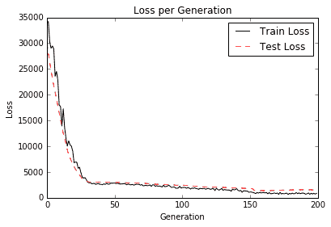

# 使用多层神经网络

我们现在将通过在低出生体重数据集上使用多层神经网络将我们对不同层的知识应用于实际数据。

## 做好准备

现在我们知道如何创建神经网络并使用层，我们将应用此方法，以预测低出生体重数据集中的出生体重。我们将创建一个具有三个隐藏层的神经网络。低出生体重数据集包括实际出生体重和出生体重是否高于或低于 2,500 克的指标变量。在这个例子中，我们将目标设为实际出生体重（回归），然后在最后查看分类的准确率。最后，我们的模型应该能够确定出生体重是否为&lt; 2,500 克。

## 操作步骤

我们按如下方式处理秘籍：

1.  我们将首先加载库并初始化我们的计算图，如下所示：

```py
import tensorflow as tf 
import matplotlib.pyplot as plt 
import os
import csv
import requests 
import numpy as np 
sess = tf.Session() 
```

1.  我们现在将使用`requests`模块从网站加载数据。在此之后，我们将数据拆分为感兴趣的特征和目标值，如下所示：

```py
# Name of data file
birth_weight_file = 'birth_weight.csv'
birthdata_url = 'https://github.com/nfmcclure/tensorflow_cookbook/raw/master' \
'/01_Introduction/07_Working_with_Data_Sources/birthweight_data/birthweight.dat'

# Download data and create data file if file does not exist in current directory
if not os.path.exists(birth_weight_file):
    birth_file = requests.get(birthdata_url)
    birth_data = birth_file.text.split('\r\n')
    birth_header = birth_data[0].split('\t')
    birth_data = [[float(x) for x in y.split('\t') if len(x) >= 1]
                  for y in birth_data[1:] if len(y) >= 1]
    with open(birth_weight_file, "w") as f:
        writer = csv.writer(f)
        writer.writerows([birth_header])
        writer.writerows(birth_data)

# Read birth weight data into memory
birth_data = []
with open(birth_weight_file, newline='') as csvfile:
    csv_reader = csv.reader(csvfile)
    birth_header = next(csv_reader)
    for row in csv_reader:
        birth_data.append(row)

birth_data = [[float(x) for x in row] for row in birth_data]

# Pull out target variable
y_vals = np.array([x[0] for x in birth_data])
# Pull out predictor variables (not id, not target, and not birthweight)
x_vals = np.array([x[1:8] for x in birth_data])
```

1.  为了帮助实现可重复性，我们现在需要为 NumPy 和 TensorFlow 设置随机种子。然后我们声明我们的批量大小如下：

```py
seed = 4 
tf.set_random_seed(seed) 
np.random.seed(seed) 
batch_size = 100 
```

1.  接下来，我们将数据分成 80-20 训练测试分组。在此之后，我们需要正则化我们的输入特征，使它们在 0 到 1 之间，具有最小 - 最大缩放比例，如下所示：

```py
train_indices = np.random.choice(len(x_vals), round(len(x_vals)*0.8), replace=False) 
test_indices = np.array(list(set(range(len(x_vals))) - set(train_indices))) 
x_vals_train = x_vals[train_indices] 
x_vals_test = x_vals[test_indices] 
y_vals_train = y_vals[train_indices] 
y_vals_test = y_vals[test_indices] 

# Normalize by column (min-max norm)
def normalize_cols(m, col_min=np.array([None]), col_max=np.array([None])):
    if not col_min[0]:
        col_min = m.min(axis=0)
    if not col_max[0]:
        col_max = m.max(axis=0)
    return (m-col_min) / (col_max - col_min), col_min, col_max

x_vals_train, train_min, train_max = np.nan_to_num(normalize_cols(x_vals_train)) 
x_vals_test, _, _ = np.nan_to_num(normalize_cols(x_vals_test), train_min, train_max)
```

> 归一化输入特征是一种常见的特征转换，尤其适用于神经网络。如果我们的数据以 0 到 1 的中心为激活函数，它将有助于收敛。

1.  由于我们有多个层具有相似的初始化变量，我们现在需要创建一个函数来初始化权重和偏差。我们使用以下代码执行此操作：

```py
def init_weight(shape, st_dev): 
    weight = tf.Variable(tf.random_normal(shape, stddev=st_dev)) 
    return weight

def init_bias(shape, st_dev): 
    bias = tf.Variable(tf.random_normal(shape, stddev=st_dev)) 
    return bias 
```

1.  我们现在需要初始化占位符。将有八个输入特征和一个输出，出生权重以克为单位，如下所示：

```py
x_data = tf.placeholder(shape=[None, 8], dtype=tf.float32) 
y_target = tf.placeholder(shape=[None, 1], dtype=tf.float32) 
```

1.  对于所有三个隐藏层，完全连接的层将使用三次。为了防止重复代码，我们将在初始化模型时创建一个层函数，如下所示：

```py
def fully_connected(input_layer, weights, biases): 
    layer = tf.add(tf.matmul(input_layer, weights), biases) 
    return tf.nn.relu(layer) 
```

1.  现在是时候创建我们的模型了。对于每个层（和输出层），我们将初始化权重矩阵，偏置矩阵和完全连接的层。对于此示例，我们将使用大小为 25,10 和 3 的隐藏层：

> 我们使用的模型将有 522 个变量适合。为了得到这个数字，我们可以看到数据和第一个隐藏层之间有`8*25 +25=225`变量。如果我们以这种方式继续添加它们，我们将有`225+260+33+4=522`变量。这远远大于我们在逻辑回归模型中使用的九个变量。

```py
# Create second layer (25 hidden nodes) 
weight_1 = init_weight(shape=[8, 25], st_dev=10.0) 
bias_1 = init_bias(shape=[25], st_dev=10.0) 
layer_1 = fully_connected(x_data, weight_1, bias_1) 

# Create second layer (10 hidden nodes) 
weight_2 = init_weight(shape=[25, 10], st_dev=10.0) 
bias_2 = init_bias(shape=[10], st_dev=10.0) 
layer_2 = fully_connected(layer_1, weight_2, bias_2) 

# Create third layer (3 hidden nodes) 
weight_3 = init_weight(shape=[10, 3], st_dev=10.0) 
bias_3 = init_bias(shape=[3], st_dev=10.0) 
layer_3 = fully_connected(layer_2, weight_3, bias_3) 
# Create output layer (1 output value) 
weight_4 = init_weight(shape=[3, 1], st_dev=10.0)   
bias_4 = init_bias(shape=[1], st_dev=10.0) 
final_output = fully_connected(layer_3, weight_4, bias_4) 
```

1.  我们现在将使用 L1 损失函数（绝对值），声明我们的优化器（使用 Adam 优化），并按如下方式初始化变量：

```py
loss = tf.reduce_mean(tf.abs(y_target - final_output)) 
my_opt = tf.train.AdamOptimizer(0.05) 
train_step = my_opt.minimize(loss) 
init = tf.global_variables_initializer()
sess.run(init) 
```

> 虽然我们在前一步骤中用于 Adam 优化函数的学习率是 0.05，但有研究表明较低的学习率始终产生更好的结果。对于这个秘籍，由于数据的一致性和快速收敛的需要，我们使用了更大的学习率。

1.  接下来，我们需要训练我们的模型进行 200 次迭代。我们还将包含存储`train`和`test`损失的代码，选择随机批量大小，并每 25 代打印一次状态，如下所示：

```py
# Initialize the loss vectors 
loss_vec = [] 
test_loss = [] 
for i in range(200): 
    # Choose random indices for batch selection 
    rand_index = np.random.choice(len(x_vals_train), size=batch_size) 
    # Get random batch 
    rand_x = x_vals_train[rand_index] 
    rand_y = np.transpose([y_vals_train[rand_index]]) 
    # Run the training step 
    sess.run(train_step, feed_dict={x_data: rand_x, y_target: rand_y}) 
    # Get and store the train loss 
    temp_loss = sess.run(loss, feed_dict={x_data: rand_x, y_target: rand_y}) 
    loss_vec.append(temp_loss) 
    # Get and store the test loss 
    test_temp_loss = sess.run(loss, feed_dict={x_data: x_vals_test, y_target: np.transpose([y_vals_test])}) 
    test_loss.append(test_temp_loss) 
    if (i+1)%25==0: 
        print('Generation: ' + str(i+1) + '. Loss = ' + str(temp_loss)) 
```

1.  上一步应该产生以下输出：

```py
Generation: 25\. Loss = 5922.52 
Generation: 50\. Loss = 2861.66 
Generation: 75\. Loss = 2342.01 
Generation: 100\. Loss = 1880.59 
Generation: 125\. Loss = 1394.39 
Generation: 150\. Loss = 1062.43 
Generation: 175\. Loss = 834.641 
Generation: 200\. Loss = 848.54 
```

1.  以下是使用`matplotlib`绘制训练和测试损失的代码片段：

```py
plt.plot(loss_vec, 'k-', label='Train Loss') 
plt.plot(test_loss, 'r--', label='Test Loss') 
plt.title('Loss per Generation') 
plt.xlabel('Generation') 
plt.ylabel('Loss') 
plt.legend(loc='upper right') 
plt.show() 
```

我们通过绘制下图来继续秘籍：



图 6：在上图中，我们绘制了我们训练的神经网络的训练和测试损失，以克数表示出生体重。请注意，大约 30 代后我们已经达到了良好的模型

1.  我们现在想将我们的出生体重结果与我们之前的后勤结果进行比较。使用逻辑线性回归（如第 3 章中的实现逻辑回归秘籍，线性回归），我们在数千次迭代后获得了大约 60％的准确率结果。为了将其与我们在上一节中所做的进行比较，我们需要输出训练并测试回归结果，并通过创建指标（如果它们高于或低于 2,500 克）将其转换为分类结果。要找出模型的准确率，我们需要使用以下代码：

```py
actuals = np.array([x[1] for x in birth_data]) 
test_actuals = actuals[test_indices] 
train_actuals = actuals[train_indices] 
test_preds = [x[0] for x in sess.run(final_output, feed_dict={x_data: x_vals_test})] 
train_preds = [x[0] for x in sess.run(final_output, feed_dict={x_data: x_vals_train})] 
test_preds = np.array([1.0 if x<2500.0 else 0.0 for x in test_preds]) 
train_preds = np.array([1.0 if x<2500.0 else 0.0 for x in train_preds]) 
# Print out accuracies 
test_acc = np.mean([x==y for x,y in zip(test_preds, test_actuals)]) 
train_acc = np.mean([x==y for x,y in zip(train_preds, train_actuals)]) 
print('On predicting the category of low birthweight from regression output (<2500g):') 
print('Test Accuracy: {}'.format(test_acc)) 
print('Train Accuracy: {}'.format(train_acc)) 
```

1.  上一步应该产生以下输出：

```py
Test Accuracy: 0.631578947368421 
Train Accuracy: 0.7019867549668874 
```

## 工作原理

在这个秘籍中，我们创建了一个回归神经网络，其中包含三个完全连接的隐藏层，以预测低出生体重数据集的出生体重。当将其与物流输出进行比较以预测高于或低于 2,500 克时，我们获得了类似的结果并且在更少的几代中实现了它们。在下一个方案中，我们将尝试通过使其成为多层逻辑类神经网络来改进逻辑回归。