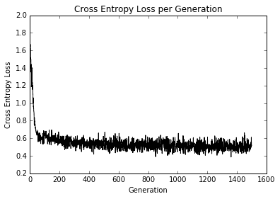
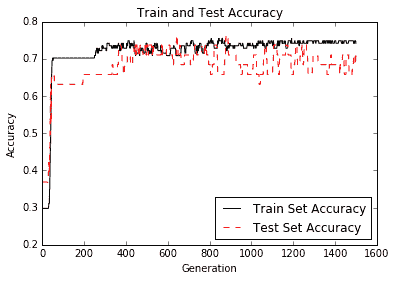

# 改进线性模型的预测

在前面的秘籍中，我们注意到我们拟合的参数数量远远超过等效的线性模型。在这个秘籍中，我们将尝试通过使用神经网络来改进我们的低出生体重的逻辑模型。

## 做好准备

对于这个秘籍，我们将加载低出生体重数据，并使用神经网络与两个隐藏的完全连接的层与 sigmoid 激活，以适应低出生体重的概率。

## 操作步骤

我们按如下方式处理秘籍：

1.  我们首先加载库并初始化我们的计算图，如下所示：

```py
import matplotlib.pyplot as plt 
import numpy as np 
import tensorflow as tf 
import requests 
sess = tf.Session() 
```

1.  接下来，我们按照前面的秘籍加载，提取和标准化我们的数据，除了在这里我们将使用低出生体重指示变量作为我们的目标而不是实际出生体重，如下所示：

```py
# Name of data file
birth_weight_file = 'birth_weight.csv'
birthdata_url = 'https://github.com/nfmcclure/tensorflow_cookbook/raw/master' \
                '/01_Introduction/07_Working_with_Data_Sources/birthweight_data/birthweight.dat'

# Download data and create data file if file does not exist in current directory
if not os.path.exists(birth_weight_file):
    birth_file = requests.get(birthdata_url)
    birth_data = birth_file.text.split('\r\n')
    birth_header = birth_data[0].split('\t')
    birth_data = [[float(x) for x in y.split('\t') if len(x) >= 1]
                  for y in birth_data[1:] if len(y) >= 1]
    with open(birth_weight_file, "w") as f:
        writer = csv.writer(f)
        writer.writerows([birth_header])
        writer.writerows(birth_data) 

# read birth weight data into memory
birth_data = []
with open(birth_weight_file, newline='') as csvfile:
    csv_reader = csv.reader(csvfile)
    birth_header = next(csv_reader)
    for row in csv_reader:
        birth_data.append(row)

birth_data = [[float(x) for x in row] for row in birth_data]

# Pull out target variable
y_vals = np.array([x[0] for x in birth_data])
# Pull out predictor variables (not id, not target, and not birthweight)
x_vals = np.array([x[1:8] for x in birth_data])

train_indices = np.random.choice(len(x_vals), round(len(x_vals)*0.8), replace=False) 
test_indices = np.array(list(set(range(len(x_vals))) - set(train_indices))) 
x_vals_train = x_vals[train_indices] 
x_vals_test = x_vals[test_indices] 
y_vals_train = y_vals[train_indices] 
y_vals_test = y_vals[test_indices] 

def normalize_cols(m, col_min=np.array([None]), col_max=np.array([None])):
    if not col_min[0]:
        col_min = m.min(axis=0)
    if not col_max[0]:
        col_max = m.max(axis=0)
    return (m - col_min) / (col_max - col_min), col_min, col_max

x_vals_train, train_min, train_max = np.nan_to_num(normalize_cols(x_vals_train))
x_vals_test, _, _ = np.nan_to_num(normalize_cols(x_vals_test, train_min, train_max))
```

1.  接下来，我们需要声明我们的批量大小和数据的占位符，如下所示：

```py
batch_size = 90 
x_data = tf.placeholder(shape=[None, 7], dtype=tf.float32) 
y_target = tf.placeholder(shape=[None, 1], dtype=tf.float32)
```

1.  如前所述，我们现在需要声明在模型中初始化变量和层的函数。为了创建更好的逻辑函数，我们需要创建一个在输入层上返回逻辑层的函数。换句话说，我们将使用完全连接的层并为每个层返回一个 sigmoid 元素。重要的是要记住我们的损失函数将包含最终的 sigmoid，因此我们要在最后一层指定我们不会返回输出的 sigmoid，如下所示：

```py
def init_variable(shape): 
    return tf.Variable(tf.random_normal(shape=shape)) 
# Create a logistic layer definition 
def logistic(input_layer, multiplication_weight, bias_weight, activation = True): 
    linear_layer = tf.add(tf.matmul(input_layer, multiplication_weight), bias_weight) 

    if activation: 
        return tf.nn.sigmoid(linear_layer) 
    else: 
        return linear_layer 
```

1.  现在我们将声明三个层（两个隐藏层和一个输出层）。我们将首先为每个层初始化权重和偏差矩阵，并按如下方式定义层操作：

```py
# First logistic layer (7 inputs to 14 hidden nodes) 
A1 = init_variable(shape=[7,14]) 
b1 = init_variable(shape=[14]) 
logistic_layer1 = logistic(x_data, A1, b1)

# Second logistic layer (14 hidden inputs to 5 hidden nodes) 
A2 = init_variable(shape=[14,5]) 
b2 = init_variable(shape=[5]) 
logistic_layer2 = logistic(logistic_layer1, A2, b2) 
# Final output layer (5 hidden nodes to 1 output) 
A3 = init_variable(shape=[5,1]) 
b3 = init_variable(shape=[1]) 
final_output = logistic(logistic_layer2, A3, b3, activation=False)
```

1.  接下来，我们声明我们的损失（交叉熵）和优化算法，并初始化以下变量：

```py
# Create loss function 
loss = tf.reduce_mean(tf.nn.sigmoid_cross_entropy_with_logits(logits=final_output, labels=y_target)) 
# Declare optimizer 
my_opt = tf.train.AdamOptimizer(learning_rate = 0.002) 
train_step = my_opt.minimize(loss) 
# Initialize variables 
init = tf.global_variables_initializer() 
sess.run(init)
```

> 交叉熵是一种测量概率之间距离的方法。在这里，我们想要测量确定性（0 或 1）与模型概率（`0&lt;x&lt;1`）之间的差异。 TensorFlow 使用内置的 sigmoid 函数实现交叉熵。这也是超参数调整的一部分，因为我们更有可能找到最佳的损失函数，学习率和针对当前问题的优化算法。为简洁起见，我们不包括超参数调整。

1.  为了评估和比较我们的模型与以前的模型，我们需要在图上创建预测和精度操作。这将允许我们提供整个测试集并确定准确率，如下所示：

```py
prediction = tf.round(tf.nn.sigmoid(final_output)) 
predictions_correct = tf.cast(tf.equal(prediction, y_target), tf.float32) 
accuracy = tf.reduce_mean(predictions_correct) 
```

1.  我们现在准备开始我们的训练循环。我们将训练 1500 代并保存模型损失并训练和测试精度以便以后进行绘图。我们的训练循环使用以下代码启动：

```py
# Initialize loss and accuracy vectors loss_vec = [] train_acc = [] test_acc = [] 
for i in range(1500): 
    # Select random indicies for batch selection 
    rand_index = np.random.choice(len(x_vals_train), size=batch_size) 
    # Select batch 
    rand_x = x_vals_train[rand_index] 
    rand_y = np.transpose([y_vals_train[rand_index]]) 
    # Run training step 
    sess.run(train_step, feed_dict={x_data: rand_x, y_target: rand_y}) 
    # Get training loss 
    temp_loss = sess.run(loss, feed_dict={x_data: rand_x, y_target: rand_y}) 
    loss_vec.append(temp_loss) 
    # Get training accuracy 
    temp_acc_train = sess.run(accuracy, feed_dict={x_data: x_vals_train, y_target: np.transpose([y_vals_train])}) 
    train_acc.append(temp_acc_train) 
    # Get test accuracy 
    temp_acc_test = sess.run(accuracy, feed_dict={x_data: x_vals_test, y_target: np.transpose([y_vals_test])}) 
    test_acc.append(temp_acc_test) 
    if (i+1)%150==0: 
        print('Loss = '' + str(temp_loss)) 
```

1.  上一步应该产生以下输出：

```py
Loss = 0.696393 
Loss = 0.591708 
Loss = 0.59214 
Loss = 0.505553 
Loss = 0.541974 
Loss = 0.512707 
Loss = 0.590149 
Loss = 0.502641 
Loss = 0.518047 
Loss = 0.502616 
```

1.  以下代码块说明了如何使用`matplotlib`绘制交叉熵损失以及训练和测试集精度：

```py
# Plot loss over time 
plt.plot(loss_vec, 'k-') 
plt.title('Cross Entropy Loss per Generation') 
plt.xlabel('Generation') 
plt.ylabel('Cross Entropy Loss') 
plt.show() 
# Plot train and test accuracy 
plt.plot(train_acc, 'k-', label='Train Set Accuracy') 
plt.plot(test_acc, 'r--', label='Test Set Accuracy') 
plt.title('Train and Test Accuracy') 
plt.xlabel('Generation') 
plt.ylabel('Accuracy') 
plt.legend(loc='lower right') 
plt.show()
```

我们得到每代交叉熵损失的图如下：



图 7：超过 1500 次迭代的训练损失

在大约 50 代之内，我们已经达到了良好的模式。在我们继续训练时，我们可以看到在剩余的迭代中获得的很少，如下图所示：



图 8：训练组和测试装置的准确率

正如您在上图中所看到的，我们很快就找到了一个好模型。

## 工作原理

在考虑使用神经网络建模数据时，您必须考虑优缺点。虽然我们的模型比以前的模型融合得更快，并且可能具有更高的准确率，但这需要付出代价;我们正在训练更多的模型变量，并且更有可能过拟合。为了检查是否发生过拟合，我们会查看测试和训练集的准确率。如果训练集的准确率继续增加而测试集的精度保持不变或甚至略微下降，我们可以假设过拟合正在发生。

为了对抗欠拟合，我们可以增加模型深度或训练模型以进行更多迭代。为了解决过拟合问题，我们可以为模型添加更多数据或添加正则化技术。

同样重要的是要注意我们的模型变量不像线性模型那样可解释。神经网络模型具有比线性模型更难解释的系数，因为它们解释了模型中特征的重要性。