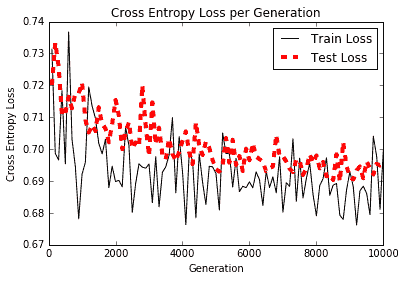
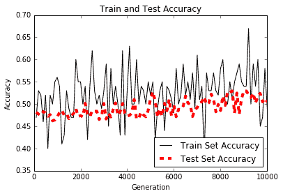

# 使用 word2vec 进行预测

在本文中，我们将使用先前学习的嵌入策略来执行分类。

## 做好准备

现在我们已经创建并保存了 CBOW 字嵌入，我们需要使用它们来对电影数据集进行情感预测。在本文中，我们将学习如何加载和使用预先训练的嵌入，并使用这些嵌入来通过训练逻辑线性模型来预测好的或坏的评论来执行情绪分析。

情感分析是一项非常艰巨的任务，因为人类语言使得很难掌握所谓意义的真实含义的微妙之处和细微差别。讽刺，笑话和含糊不清的引用都使这项任务成倍增加。我们将在电影评论数据集上创建一个简单的逻辑回归，以查看我们是否可以从我们在上一个秘籍中创建并保存的 CBOW 嵌入中获取任何信息。由于本文的重点是加载和使用已保存的嵌入，我们不会追求更复杂的模型。

## 操作步骤

我们将按如下方式处理秘籍：

1.  我们将首先加载必要的库并开始图会话：

```py
import tensorflow as tf 
import matplotlib.pyplot as plt 
import numpy as np 
import random 
import os 
import pickle 
import string 
import requests 
import collections 
import io 
import tarfile 
import urllib.request 
import text_helpers 
from nltk.corpus import stopwords 
sess = tf.Session() 
```

1.  现在我们将声明模型参数。嵌入大小应与我们用于创建前面的 CBOW 嵌入的嵌入大小相同。使用以下代码执行此操作：

```py
embedding_size = 200 
vocabulary_size = 2000 
batch_size = 100 
max_words = 100 
stops = stopwords.words('english') 
```

1.  我们将从我们创建的`text_helpers.py`文件加载和转换文本数据。使用以下代码执行此操作：

```py
texts, target = text_helpers.load_movie_data() 
# Normalize text 
print('Normalizing Text Data') 
texts = text_helpers.normalize_text(texts, stops) 
# Texts must contain at least 3 words 
target = [target[ix] for ix, x in enumerate(texts) if len(x.split()) > 2] 
texts = [x for x in texts if len(x.split()) > 2] 
train_indices = np.random.choice(len(target), round(0.8*len(target)), replace=False) 
test_indices = np.array(list(set(range(len(target))) - set(train_indices))) 
texts_train = [x for ix, x in enumerate(texts) if ix in train_indices] 
texts_test = [x for ix, x in enumerate(texts) if ix in test_indices] 
target_train = np.array([x for ix, x in enumerate(target) if ix in train_indices]) 
target_test = np.array([x for ix, x in enumerate(target) if ix in test_indices])
```

1.  我们现在加载我们在拟合 CBOW 嵌入时创建的单词字典。重要的是我们加载它以便我们具有从单词到嵌入索引的完全相同的映射，如下所示：

```py
dict_file = os.path.join(data_folder_name, 'movie_vocab.pkl') 
word_dictionary = pickle.load(open(dict_file, 'rb')) 
```

1.  我们现在可以使用我们的单词字典将我们加载的句子数据转换为数字`numpy`数组：

```py
text_data_train = np.array(text_helpers.text_to_numbers(texts_train, word_dictionary)) 
text_data_test = np.array(text_helpers.text_to_numbers(texts_test, word_dictionary)) 
```

1.  由于电影评论的长度不同，我们将它们标准化，因此它们的长度都相同。在我们的例子中，我们将其设置为 100 个单词。如果评论少于 100 个单词，我们将用零填充它。使用以下代码执行此操作：

```py
text_data_train = np.array([x[0:max_words] for x in [y+[0]*max_words for y in text_data_train]]) 
text_data_test = np.array([x[0:max_words] for x in [y+[0]*max_words for y in text_data_test]]) 
```

1.  现在我们将声明我们的模型变量和占位符以进行逻辑回归。使用以下代码执行此操作：

```py
A = tf.Variable(tf.random_normal(shape=[embedding_size,1])) 
b = tf.Variable(tf.random_normal(shape=[1,1])) 
# Initialize placeholders 
x_data = tf.placeholder(shape=[None, max_words], dtype=tf.int32) 
y_target = tf.placeholder(shape=[None, 1], dtype=tf.float32)
```

1.  为了让 TensorFlow 恢复我们预先训练的嵌入，我们必须首先给`Saver`方法一个变量来恢复，所以我们将创建一个嵌入变量，其形状与我们将加载的嵌入相同：

```py
embeddings = tf.Variable(tf.random_uniform([vocabulary_size, embedding_size], -1.0, 1.0))
```

1.  现在我们将`embedding_lookup`函数放在图上，并将句子中所有单词的平均嵌入。使用以下代码执行此操作：

```py
embed = tf.nn.embedding_lookup(embeddings, x_data) 
# Take average of all word embeddings in documents 
embed_avg = tf.reduce_mean(embed, 1)
```

1.  接下来，我们将声明我们的模型操作和损失函数，记住我们的损失函数已经内置了 sigmoid 操作，如下所示：

```py
model_output = tf.add(tf.matmul(embed_avg, A), b) 
# Declare loss function (Cross Entropy loss) 
loss = tf.reduce_mean(tf.nn.sigmoid_cross_entropy_with_logits(logits=model_output, labels=y_target)) 
```

1.  现在我们将向图添加预测和精度函数，以便我们可以在使用以下代码训练模型时评估精度：

```py
prediction = tf.round(tf.sigmoid(model_output)) 
predictions_correct = tf.cast(tf.equal(prediction, y_target), tf.float32) 
accuracy = tf.reduce_mean(predictions_correct) 
```

1.  我们将声明我们的优化函数并初始化以下模型变量：

```py
my_opt = tf.train.AdagradOptimizer(0.005) 
train_step = my_opt.minimize(loss) 
init = tf.global_variables_initializer() 
sess.run(init) 
```

1.  现在我们有一个随机初始化嵌入，我们可以告诉`Saver`方法将我们之前的 CBOW 嵌入加载到嵌入变量中。使用以下代码执行此操作：

```py
model_checkpoint_path = os.path.join(data_folder_name,'cbow_movie_embeddings.ckpt') 
saver = tf.train.Saver({"embeddings": embeddings}) 
saver.restore(sess, model_checkpoint_path)
```

1.  现在我们可以开始训练几代。请注意，我们每 100 代就可以节省训练和测试损失和准确率。我们只会每 500 代打印一次模型状态，如下所示：

```py
train_loss = [] 
test_loss = [] 
train_acc = [] 
test_acc = [] 
i_data = [] 
for i in range(10000): 
    rand_index = np.random.choice(text_data_train.shape[0], size=batch_size) 
    rand_x = text_data_train[rand_index] 
    rand_y = np.transpose([target_train[rand_index]]) 
    sess.run(train_step, feed_dict={x_data: rand_x, y_target: rand_y}) 

    # Only record loss and accuracy every 100 generations 
    if (i+1)%100==0: 
        i_data.append(i+1) 
        train_loss_temp = sess.run(loss, feed_dict={x_data: rand_x, y_target: rand_y}) 
        train_loss.append(train_loss_temp) 

        test_loss_temp = sess.run(loss, feed_dict={x_data: text_data_test, y_target: np.transpose([target_test])}) 
        test_loss.append(test_loss_temp) 

        train_acc_temp = sess.run(accuracy, feed_dict={x_data: rand_x, y_target: rand_y}) 
        train_acc.append(train_acc_temp) 
        test_acc_temp = sess.run(accuracy, feed_dict={x_data: text_data_test, y_target: np.transpose([target_test])}) 
        test_acc.append(test_acc_temp) 
    if (i+1)%500==0: 
        acc_and_loss = [i+1, train_loss_temp, test_loss_temp, train_acc_temp, test_acc_temp] 
        acc_and_loss = [np.round(x,2) for x in acc_and_loss] 
        print('Generation # {}. Train Loss (Test Loss): {:.2f} ({:.2f}). Train Acc (Test Acc): {:.2f} ({:.2f})'.format(*acc_and_loss))
```

1.  结果如下：

```py
Generation # 500\. Train Loss (Test Loss): 0.70 (0.71). Train Acc (Test Acc): 0.52 (0.48) 
Generation # 1000\. Train Loss (Test Loss): 0.69 (0.72). Train Acc (Test Acc): 0.56 (0.47) 
... 
Generation # 9500\. Train Loss (Test Loss): 0.69 (0.70). Train Acc (Test Acc): 0.57 (0.55) 
Generation # 10000\. Train Loss (Test Loss): 0.70 (0.70). Train Acc (Test Acc): 0.59 (0.55) 
```

1.  以下是绘制训练和测试损失和准确率的代码，我们每 100 代保存一次：

```py
# Plot loss over time 
plt.plot(i_data, train_loss, 'k-', label='Train Loss') 
plt.plot(i_data, test_loss, 'r--', label='Test Loss', linewidth=4) 
plt.title('Cross Entropy Loss per Generation') 
plt.xlabel('Generation') 
plt.ylabel('Cross Entropy Loss') 
plt.legend(loc='upper right') 
plt.show() 

# Plot train and test accuracy 
plt.plot(i_data, train_acc, 'k-', label='Train Set Accuracy') 
plt.plot(i_data, test_acc, 'r--', label='Test Set Accuracy', linewidth=4) 
plt.title('Train and Test Accuracy') 
plt.xlabel('Generation') 
plt.ylabel('Accuracy') 
plt.legend(loc='lower right') 
plt.show() 
```

每代交叉熵损失的图如下：

Figure 6: Here we observe the train and test loss over 10,000 generations

上述代码的训练图和测试精度如下：



图 7：我们可以观察到训练和测试装置的准确率正在缓慢提高 10,000 代。值得注意的是，该模型表现非常差，并且仅比随机预测器略好。

## 工作原理

我们加载了我们之前的 CBOW 嵌入并对平均嵌入评论进行了逻辑回归。这里要注意的重要方法是我们如何将模型变量从磁盘加载到当前模型中已经初始化的变量。我们还必须记住在训练嵌入之前存储和加载我们创建的词汇表。使用相同的嵌入时，从单词到嵌入索引具有相同的映射非常重要。

## 更多

我们可以看到，我们在预测情绪方面几乎达到了 60％的准确率。例如，要知道单词`great;`背后的含义是一项艰巨的任务，它可以在评论中用于消极或积极的背景。

为了解决这个问题，我们希望以某种方式为文档本身创建嵌入并解决情绪问题。通常，整个评论是积极的，或者整个评论是否定的。我们可以利用这个优势，我们将在下面的使用 doc2vec 以获取情绪分析方法中查看如何执行此操作。