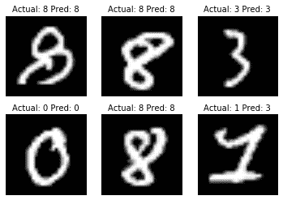

# 实现简单的 CNN

在本文中，我们将开发一个四层卷积神经网络，以提高我们预测 MNIST 数字的准确率。前两个卷积层将各自由卷积-ReLU-Max 池操作组成，最后两个层将是完全连接的层。

## 做好准备

为了访问 MNIST 数据，TensorFlow 有一个`examples.tutorials`包，它具有很好的数据集加载函数。加载数据后，我们将设置模型变量，创建模型，批量训练模型，然后可视化损失，准确率和一些样本数字。

## 操作步骤

执行以下步骤：

1.  首先，我们将加载必要的库并启动图会话：

```py
import matplotlib.pyplot as plt
import numpy as np
import tensorflow as tf
from tensorflow.examples.tutorials.mnist import input_data
from tensorflow.python.framework import ops
ops.reset_default_graph()

sess = tf.Session()
```

1.  接下来，我们将加载数据并将图像转换为`28x28`数组：

```py
data_dir = 'temp' 
mnist = input_data.read_data_sets(data_dir, one_hot=False)
train_xdata = np.array([np.reshape(x, (28,28)) for x in mnist.train.images]) 
test_xdata = np.array([np.reshape(x, (28,28)) for x in mnist.test.images]) 
train_labels = mnist.train.labels 
test_labels = mnist.test.labels 
```

> 请注意，此处下载的 MNIST 数据集还包括验证集。此验证集通常与测试集的大小相同。如果我们进行任何超参数调整或模型选择，最好将其加载到其他测试中。

1.  现在我们将设置模型参数。请记住，图像的深度（通道数）为 1，因为这些图像是灰度的：

```py
batch_size = 100 
learning_rate = 0.005 
evaluation_size = 500 
image_width = train_xdata[0].shape[0] 
image_height = train_xdata[0].shape[1] 
target_size = max(train_labels) + 1 
num_channels = 1 
generations = 500 
eval_every = 5 
conv1_features = 25 
conv2_features = 50 
max_pool_size1 = 2 
max_pool_size2 = 2 
fully_connected_size1 = 100 
```

1.  我们现在可以声明数据的占位符。我们将声明我们的训练数据变量和测试数据变量。我们将针对训练和评估规模使用不同的批量大小。您可以根据可用于训练和评估的物理内存来更改这些内容：

```py
x_input_shape = (batch_size, image_width, image_height, num_channels) 
x_input = tf.placeholder(tf.float32, shape=x_input_shape) 
y_target = tf.placeholder(tf.int32, shape=(batch_size)) 
eval_input_shape = (evaluation_size, image_width, image_height, num_channels) 
eval_input = tf.placeholder(tf.float32, shape=eval_input_shape) 
eval_target = tf.placeholder(tf.int32, shape=(evaluation_size)) 
```

1.  我们将使用我们在前面步骤中设置的参数声明我们的卷积权重和偏差：

```py
conv1_weight = tf.Variable(tf.truncated_normal([4, 4, num_channels, conv1_features], stddev=0.1, dtype=tf.float32)) 
conv1_bias = tf.Variable(tf.zeros([conv1_features],dtype=tf.float32)) 
conv2_weight = tf.Variable(tf.truncated_normal([4, 4, conv1_features, conv2_features], stddev=0.1, dtype=tf.float32)) 
conv2_bias = tf.Variable(tf.zeros([conv2_features],dtype=tf.float32)) 
```

1.  接下来，我们将为模型的最后两层声明完全连接的权重和偏差：

```py
resulting_width = image_width // (max_pool_size1 * max_pool_size2) 
resulting_height = image_height // (max_pool_size1 * max_pool_size2) 
full1_input_size = resulting_width * resulting_height*conv2_features 
full1_weight = tf.Variable(tf.truncated_normal([full1_input_size, fully_connected_size1], stddev=0.1, dtype=tf.float32)) 
full1_bias = tf.Variable(tf.truncated_normal([fully_connected_size1], stddev=0.1, dtype=tf.float32)) 
full2_weight = tf.Variable(tf.truncated_normal([fully_connected_size1, target_size], stddev=0.1, dtype=tf.float32)) 
full2_bias = tf.Variable(tf.truncated_normal([target_size], stddev=0.1, dtype=tf.float32)) 
```

1.  现在我们将宣布我们的模型。我们首先创建一个模型函数。请注意，该函数将在全局范围内查找所需的层权重和偏差。此外，为了使完全连接的层工作，我们将第二个卷积层的输出展平，这样我们就可以在完全连接的层中使用它：

```py
def my_conv_net(input_data): 
   # First Conv-ReLU-MaxPool Layer 
    conv1 = tf.nn.conv2d(input_data, conv1_weight, strides=[1, 1, 1, 1], padding='SAME') 
    relu1 = tf.nn.relu(tf.nn.bias_add(conv1, conv1_bias)) 
    max_pool1 = tf.nn.max_pool(relu1, ksize=[1, max_pool_size1, max_pool_size1, 1], strides=[1, max_pool_size1, max_pool_size1, 1], padding='SAME') 
    # Second Conv-ReLU-MaxPool Layer 
    conv2 = tf.nn.conv2d(max_pool1, conv2_weight, strides=[1, 1, 1, 1], padding='SAME') 
    relu2 = tf.nn.relu(tf.nn.bias_add(conv2, conv2_bias)) 
    max_pool2 = tf.nn.max_pool(relu2, ksize=[1, max_pool_size2, max_pool_size2, 1], strides=[1, max_pool_size2, max_pool_size2, 1], padding='SAME') 
    # Transform Output into a 1xN layer for next fully connected layer 
    final_conv_shape = max_pool2.get_shape().as_list() 
    final_shape = final_conv_shape[1] * final_conv_shape[2] * final_conv_shape[3] 
    flat_output = tf.reshape(max_pool2, [final_conv_shape[0], final_shape]) 
    # First Fully Connected Layer 
    fully_connected1 = tf.nn.relu(tf.add(tf.matmul(flat_output, full1_weight), full1_bias)) 
    # Second Fully Connected Layer 
    final_model_output = tf.add(tf.matmul(fully_connected1, full2_weight), full2_bias) 
    return final_model_output 
```

1.  接下来，我们可以在训练和测试数据上声明模型：

```py
model_output = my_conv_net(x_input) 
test_model_output = my_conv_net(eval_input) 
```

1.  我们将使用的损失函数是 softmax 函数。我们使用稀疏 softmax，因为我们的预测只是一个类别，而不是多个类别。我们还将使用一个对 logits 而不是缩放概率进行操作的损失函数：

```py
loss = tf.reduce_mean(tf.nn.sparse_softmax_cross_entropy_with_logits(logits=model_output, labels=y_target)) 
```

1.  接下来，我们将创建一个训练和测试预测函数。然后我们还将创建一个准确率函数来确定模型在每个批次上的准确率：

```py
prediction = tf.nn.softmax(model_output) 
test_prediction = tf.nn.softmax(test_model_output) 
# Create accuracy function 
def get_accuracy(logits, targets): 
    batch_predictions = np.argmax(logits, axis=1) 
    num_correct = np.sum(np.equal(batch_predictions, targets)) 
    return 100\. * num_correct/batch_predictions.shape[0] 
```

1.  现在我们将创建我们的优化函数，声明训练步骤，并初始化所有模型变量：

```py
my_optimizer = tf.train.MomentumOptimizer(learning_rate, 0.9) 
train_step = my_optimizer.minimize(loss) 
# Initialize Variables 
init = tf.global_variables_initializer() 
sess.run(init)
```

1.  我们现在可以开始训练我们的模型。我们以随机选择的批次循环数据。我们经常选择在训练上评估模型并测试批次并记录准确率和损失。我们可以看到，经过 500 代，我们可以在测试数据上快速达到 96％-97％的准确率：

```py
train_loss = [] 
train_acc = [] 
test_acc = [] 
for i in range(generations): 
    rand_index = np.random.choice(len(train_xdata), size=batch_size) 
    rand_x = train_xdata[rand_index] 
    rand_x = np.expand_dims(rand_x, 3) 
    rand_y = train_labels[rand_index] 
    train_dict = {x_input: rand_x, y_target: rand_y} 
    sess.run(train_step, feed_dict=train_dict) 
    temp_train_loss, temp_train_preds = sess.run([loss, prediction], feed_dict=train_dict) 
    temp_train_acc = get_accuracy(temp_train_preds, rand_y) 
    if (i+1) % eval_every == 0: 
        eval_index = np.random.choice(len(test_xdata), size=evaluation_size) 
        eval_x = test_xdata[eval_index] 
        eval_x = np.expand_dims(eval_x, 3) 
        eval_y = test_labels[eval_index] 
        test_dict = {eval_input: eval_x, eval_target: eval_y} 
        test_preds = sess.run(test_prediction, feed_dict=test_dict) 
        temp_test_acc = get_accuracy(test_preds, eval_y) 
        # Record and print results 
        train_loss.append(temp_train_loss) 
        train_acc.append(temp_train_acc) 
        test_acc.append(temp_test_acc) 
        acc_and_loss = [(i+1), temp_train_loss, temp_train_acc, temp_test_acc] 
        acc_and_loss = [np.round(x,2) for x in acc_and_loss] 
        print('Generation # {}. Train Loss: {:.2f}. Train Acc (Test Acc): {:.2f} ({:.2f})'.format(*acc_and_loss)) 
```

1.  这导致以下输出：

```py
Generation # 5\. Train Loss: 2.37\. Train Acc (Test Acc): 7.00 (9.80) 
Generation # 10\. Train Loss: 2.16\. Train Acc (Test Acc): 31.00 (22.00) 
Generation # 15\. Train Loss: 2.11\. Train Acc (Test Acc): 36.00 (35.20) 
...
Generation # 490\. Train Loss: 0.06\. Train Acc (Test Acc): 98.00 (97.40) 
Generation # 495\. Train Loss: 0.10\. Train Acc (Test Acc): 98.00 (95.40) 
Generation # 500\. Train Loss: 0.14\. Train Acc (Test Acc): 98.00 (96.00) 
```

1.  以下是使用`Matplotlib`绘制损耗和精度的代码：

```py
eval_indices = range(0, generations, eval_every) 
# Plot loss over time 
plt.plot(eval_indices, train_loss, 'k-') 
plt.title('Softmax Loss per Generation') 
plt.xlabel('Generation') 
plt.ylabel('Softmax Loss') 
plt.show() 

# Plot train and test accuracy 
plt.plot(eval_indices, train_acc, 'k-', label='Train Set Accuracy') 
plt.plot(eval_indices, test_acc, 'r--', label='Test Set Accuracy') 
plt.title('Train and Test Accuracy') 
plt.xlabel('Generation') 
plt.ylabel('Accuracy') 
plt.legend(loc='lower right') 
plt.show() 
```

然后我们得到以下图：


图 3：左图是我们 500 代训练中的训练和测试集精度。右图是超过 500 代的 softmax 损失值。

1.  如果我们想要绘制最新批次结果的样本，下面是绘制由六个最新结果组成的样本的代码：

```py
# Plot the 6 of the last batch results: 
actuals = rand_y[0:6] 
predictions = np.argmax(temp_train_preds,axis=1)[0:6] 
images = np.squeeze(rand_x[0:6]) 
Nrows = 2 
Ncols = 3 
for i in range(6): 
    plt.subplot(Nrows, Ncols, i+1) 
    plt.imshow(np.reshape(images[i], [28,28]), cmap='Greys_r') 
    plt.title('Actual: ' + str(actuals[i]) + ' Pred: ' + str(predictions[i]), fontsize=10) 
    frame = plt.gca() 
    frame.axes.get_xaxis().set_visible(False) 
    frame.axes.get_yaxis().set_visible(False) 
```

我们得到前面代码的以下输出：



图 4：六个随机图像的绘图，标题中包含实际值和预测值。右下图预计是 3，而事实上它是 1

## 工作原理

我们提高了 MNIST 数据集的表现，并构建了一个模型，在从头开始训练时，可快速达到约 97％的准确率。我们的前两层是卷积，ReLU 和 Max Pooling 的组合。第二层是完全连接的层。我们以 100 个批次进行了训练，并研究了我们训练的几代的准确率和损失。最后，我们还绘制了六个随机数字和每个数字的预测/实际值。

CNN 非常适合图像识别。造成这种情况的部分原因是卷积层创建了自己的低级特征，当它们遇到重要的部分图像时会被激活。这种类型的模型自己创建特征并将其用于预测。

## 更多

在过去几年中，CNN 模型在图像识别方面取得了巨大进步。正在探索许多新颖的想法，并且经常发现新的架构。该领域的一个很好的论文库是一个名为 [Arxiv.org](https://arxiv.org/) 的仓库网站，由康奈尔大学创建和维护。 Arxiv.org 包括许多领域的一些最新论文，包括计算机科学和计算机科学子领域，如[计算机视觉和图像识别](https://arxiv.org/list/cs.CV/recent)。

## 另见

以下列出了一些可用于了解 CNN 的优秀资源：

*   [斯坦福大学有一个很棒的维基](http://scarlet.stanford.edu/teach/index.php/An_Introduction_to_Convolutional_Neural_Networks)
*   [迈克尔·尼尔森的深度学习](http://neuralnetworksanddeeplearning.com/chap6.html)
*   [吴建新介绍卷积神经网络](https://pdfs.semanticscholar.org/450c/a19932fcef1ca6d0442cbf52fec38fb9d1e5.pdf)