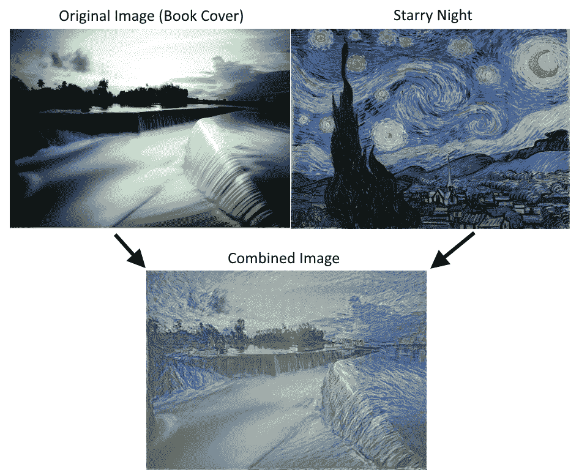

# 应用 StyleNet 和 NeuralStyle 项目

一旦我们对 CNN 进行了图像识别训练，我们就可以将网络本身用于一些有趣的数据和图像处理。 Stylenet 是一种尝试从一张图片中学习图像样式并将其应用于第二张图片同时保持第二图像结构（或内容）完整的过程。如果我们能够找到与样式强烈相关的中间 CNN 节点，这可能是可能的，与图像的内容分开。

## 做好准备

Stylenet 是一个过程，它接收两个图像并将一个图像的样式应用于第二个图像的内容。它基于 2015 年的着名论文“艺术风格的神经算法”（参见下一节的第一个要点）。作者在一些 CNN 中找到了一个属性，其中存在中间层，它们似乎编码图片的样式，有些编码图片的内容。为此，如果我们训练样式图片上的样式层和原始图像上的内容层，并反向传播那些计算的损失，我们可以将原始图像更改为更像样式图像。

为了实现这一目标，我们将下载本文推荐的网络;叫做 imagenet-vgg-19。还有一个 imagenet-vgg-16 网络也可以使用，但是本文推荐使用 imagenet-vgg-19。

## 操作步骤

执行以下步骤：

1.  首先，我们将以`mat`格式下载预先训练好的网络。 `mat`格式是`matlab`对象，Python 中的`scipy`包有一个可以读取它的方法。下载`mat`对象的链接在这里。我们将此模型保存在 Python 脚本所在的同一文件夹中，以供参考：

```py
http://www.vlfeat.org/matconvnet/models/beta16/imagenet-vgg-verydeep-19.mat 
```

1.  我们将通过加载必要的库来启动我们的 Python 脚本：

```py
import os
import scipy.io
import scipy.misc
import imageio
from skimage.transform import resize
from operator import mul
from functools import reduce
import numpy as np
import tensorflow as tf
from tensorflow.python.framework import ops
ops.reset_default_graph()
```

1.  然后我们可以声明两个图像的位置：原始图像和样式图像。出于我们的目的，我们将使用本书的封面图片作为原始图像;对于风格形象，我们将使用 Vincent van Gough 的星夜。随意使用您想要的任何两张图片。如果您选择使用这些图片，[可以在本书的 GitHub 网站上找到（导航到 Styelnet 部分）](https://github.com/nfmcclure/tensorflow_cookbook)：

```py
original_image_file = 'temp/book_cover.jpg' 
style_image_file = 'temp/starry_night.jpg' 
```

1.  我们将为我们的模型设置一些参数：`mat`文件的位置，权重，学习率，代数以及输出中间图像的频率。对于权重，有助于在原始图像上高度加权样式图像。应根据所需结果的变化调整这些超参数：

```py
vgg_path = 'imagenet-vgg-verydeep-19.mat'
original_image_weight = 5.0
style_image_weight = 500.0
regularization_weight = 100
learning_rate = 10
generations = 100
output_generations = 25
beta1 = 0.9
beta2 = 0.999
```

1.  现在我们将使用`scipy`加载两个图像并更改样式图像以适合原始图像尺寸：

```py
original_image = imageio.imread(original_image_file)
style_image = imageio.imread(style_image_file)

# Get shape of target and make the style image the same
target_shape = original_image.shape
style_image = resize(style_image, target_shape)
```

1.  从论文中，我们可以按照它们出现的顺序定义层。我们将使用作者的命名约定：

```py
vgg_layers = ['conv1_1', 'relu1_1', 
              'conv1_2', 'relu1_2', 'pool1', 
              'conv2_1', 'relu2_1', 
              'conv2_2', 'relu2_2', 'pool2', 
              'conv3_1', 'relu3_1', 
              'conv3_2', 'relu3_2', 
              'conv3_3', 'relu3_3', 
              'conv3_4', 'relu3_4', 'pool3', 
              'conv4_1', 'relu4_1', 
              'conv4_2', 'relu4_2', 
              'conv4_3', 'relu4_3', 
              'conv4_4', 'relu4_4', 'pool4', 
              'conv5_1', 'relu5_1', 
              'conv5_2', 'relu5_2', 
              'conv5_3', 'relu5_3', 
              'conv5_4', 'relu5_4'] 
```

1.  现在我们将定义一个从`mat`文件中提取参数的函数：

```py
def extract_net_info(path_to_params): 
    vgg_data = scipy.io.loadmat(path_to_params) 
    normalization_matrix = vgg_data['normalization'][0][0][0] 
    mat_mean = np.mean(normalization_matrix, axis=(0,1)) 
    network_weights = vgg_data['layers'][0] 
    return mat_mean, network_weights
```

1.  根据加载的权重和`layer`定义，我们可以使用以下函数在 TensorFlow 中重新创建网络。我们将遍历每一层并使用适当的`weights`和`biases`分配相应的函数，如果适用：

```py
def vgg_network(network_weights, init_image): 
    network = {} 
    image = init_image 
    for i, layer in enumerate(vgg_layers): 
        if layer[1] == 'c': 
            weights, bias = network_weights[i][0][0][0][0] 
            weights = np.transpose(weights, (1, 0, 2, 3)) 
            bias = bias.reshape(-1) 
            conv_layer = tf.nn.conv2d(image, tf.constant(weights), (1, 1, 1, 1), 'SAME') 
            image = tf.nn.bias_add(conv_layer, bias) 
        elif layer[1] == 'r': 
            image = tf.nn.relu(image) 
        else: 
            image = tf.nn.max_pool(image, (1, 2, 2, 1), (1, 2, 2, 1), 'SAME') 
        network[layer] = image 
    return(network)
```

1.  本文推荐了一些策略，用于将中间层分配给原始图像和样式图像。虽然我们应该为原始图像保留`relu4_2`，但我们可以为样式图像尝试其他`reluX_1`层输出的不同组合：

```py
original_layer = ['relu4_2'] 
style_layers = ['relu1_1', 'relu2_1', 'relu3_1', 'relu4_1', 'relu5_1'] 
```

1.  接下来，我们将运行前面的函数来获取权重和均值。我们还需要均匀设置 VGG19 样式层权重。如果您愿意，可以通过更改权重进行实验。现在，我们假设它们对于两个层都是 0.5：

```py
# Get network parameters
normalization_mean, network_weights = extract_net_info(vgg_path)
shape = (1,) + original_image.shape
style_shape = (1,) + style_image.shape
original_features = {}
style_features = {}

# Set style weights
style_weights = {l: 1./(len(style_layers)) for l in style_layers}
```

1.  为了忠实于原始图片外观，我们希望添加一个损失值，将内容/原始特征与原始内容特征进行比较。为此，我们加载 VGG19 模型并计算原始内容特征的内容/原始特征：

```py
g_original = tf.Graph()
with g_original.as_default(), tf.Session() as sess1:
    image = tf.placeholder('float', shape=shape)
    vgg_net = vgg_network(network_weights, image)
    original_minus_mean = original_image - normalization_mean
    original_norm = np.array([original_minus_mean])
    for layer in original_layers:
        original_features[layer] = vgg_net[layer].eval(feed_dict={image: original_norm})
```

1.  与步骤 11 类似，我们希望将原始图像的样式特征更改为样式图片的样式特征。为此，我们将为损失函数添加样式损失值。此损失值需要查看我们预先确定的样式层中样式图像的值。我们还将通过单独的图运行此操作。我们按如下方式计算这些样式特征：

```py
# Get style image network
g_style = tf.Graph()
with g_style.as_default(), tf.Session() as sess2:
    image = tf.placeholder('float', shape=style_shape)
    vgg_net = vgg_network(network_weights, image)
    style_minus_mean = style_image - normalization_mean
    style_norm = np.array([style_minus_mean])
    for layer in style_layers:
        features = vgg_net[layer].eval(feed_dict={image: style_norm})
        features = np.reshape(features, (-1, features.shape[3]))
        gram = np.matmul(features.T, features) / features.size
        style_features[layer] = gram 
```

1.  我们启动默认图来计算损失和训练步骤。首先，我们首先将随机图像初始化为 TensorFlow 变量：

```py
# Make Combined Image via loss function
with tf.Graph().as_default():
    # Get network parameters
    initial = tf.random_normal(shape) * 0.256
    init_image = tf.Variable(initial)
    vgg_net = vgg_network(network_weights, init_image) 
```

1.  接下来，我们计算原始内容损失（将其缩进到默认图下）。这个损失部分将尽可能保持原始图像的结构完整：

```py
# Loss from Original Image
original_layers_w = {'relu4_2': 0.5, 'relu5_2': 0.5}
original_loss = 0
for o_layer in original_layers:
    temp_original_loss = original_layers_w[o_layer] * original_image_weight *\
                (2 * tf.nn.l2_loss(vgg_net[o_layer] - original_features[o_layer]))
    original_loss += (temp_original_loss / original_features[o_layer].size) 
```

1.  仍然在默认图缩进下，我们创建第二个损失项，即样式损失。此损失将比较我们预先计算的样式特征与输入图像的样式特征（随机初始化）：

```py
# Loss from Style Image
style_loss = 0
style_losses = []
for style_layer in style_layers:
    layer = vgg_net[style_layer]
    feats, height, width, channels = [x.value for x in layer.get_shape()]
    size = height * width * channels
    features = tf.reshape(layer, (-1, channels))
    style_gram_matrix = tf.matmul(tf.transpose(features), features) / size
    style_expected = style_features[style_layer]
    style_losses.append(style_weights[style_layer] * 2 *
                        tf.nn.l2_loss(style_gram_matrix - style_expected) /
                        style_expected.size)
style_loss += style_image_weight * tf.reduce_sum(style_losses) 
```

1.  第三个也是最后一个损失条款将有助于平滑图像。我们在这里使用总变差损失来惩罚相邻像素的剧烈变化，如下所示：

```py
total_var_x = reduce(mul, init_image[:, 1:, :, :].get_shape().as_list(), 1)
total_var_y = reduce(mul, init_image[:, :, 1:, :].get_shape().as_list(), 1)
first_term = regularization_weight * 2
second_term_numerator = tf.nn.l2_loss(init_image[:, 1:, :, :] - init_image[:, :shape[1]-1, :, :])
second_term = second_term_numerator / total_var_y
third_term = (tf.nn.l2_loss(init_image[:, :, 1:, :] - init_image[:, :, :shape[2]-1, :]) / total_var_x)
total_variation_loss = first_term * (second_term + third_term)
```

1.  接下来，我们结合损失项并创建优化函数和训练步骤，如下所示：

```py
# Combined Loss
loss = original_loss + style_loss + total_variation_loss

# Declare Optimization Algorithm
optimizer = tf.train.AdamOptimizer(learning_rate, beta1, beta2)
train_step = optimizer.minimize(loss)
```

1.  现在我们运行训练步骤，保存中间图像，并保存最终输出图像，如下所示：

```py
# Initialize variables and start training
with tf.Session() as sess:
    tf.global_variables_initializer().run()
    for i in range(generations):
        train_step.run()

        # Print update and save temporary output
        if (i+1) % output_generations == 0:
            print('Generation {} out of {}, loss: {}'.format(i + 1, generations, sess.run(loss)))
            image_eval = init_image.eval()
            best_image_add_mean = image_eval.reshape(shape[1:]) + normalization_mean
            output_file = 'temp_output_{}.jpg'.format(i)
            imageio.imwrite(output_file, best_image_add_mean.astype(np.uint8))

    # Save final image
    image_eval = init_image.eval()
    best_image_add_mean = image_eval.reshape(shape[1:]) + normalization_mean
    output_file = 'final_output.jpg'
    scipy.misc.imsave(output_file, best_image_add_mean)
```



图 6：使用 Stylenet 算法将书籍封面图像与 Starry Night 相结合。请注意，可以通过更改脚本开头的权重来使用不同的样式重点

## 工作原理

我们首先加载两个图像，然后将预先训练的网络权重和指定的层加载到原始图像和样式图像。我们计算了三种损失函数：原始图像损失，样式损失和总变差损失。然后我们训练随机噪声图片以使用样式图像的样式和原始图像的内容。

[损失函数受 GitHub 神经风格项目的影响很大](https://github.com/anishathalye/neural-style)。我们还强烈建议读者查看这些项目中的代码以获得改进，更多细节，以及通常更强大的算法，可以提供更好的结果。

## 另见

*   [Gatys，Ecker，Bethge 的艺术风格神经算法，2015](https://arxiv.org/abs/1508.06576)
*   Leon Gatys 在 CVPR 2016（计算机视觉和模式识别）上的[一个很好的推荐视频](https://www.youtube.com/watch?v=UFffxcCQMPQ)