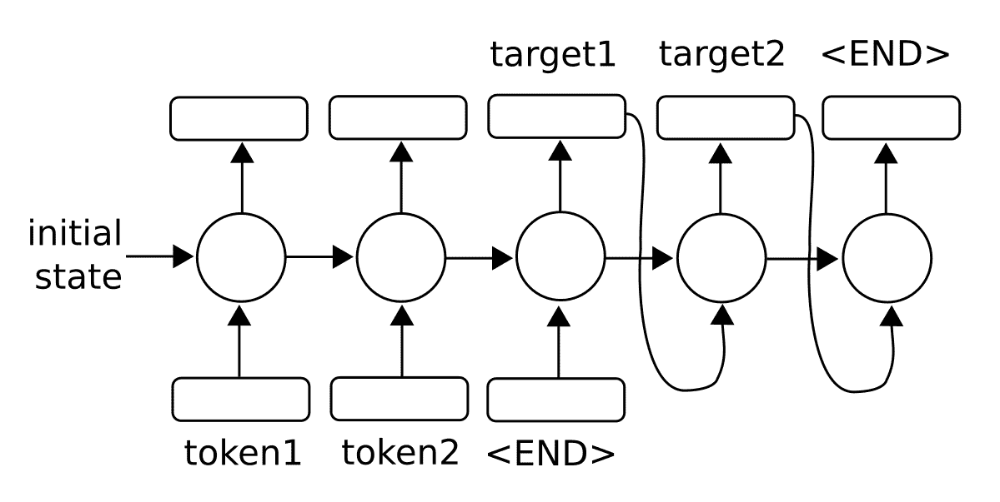

# 介绍

在迄今为止我们考虑过的所有机器学习算法中，没有人将数据视为序列。为了考虑序列数据，我们扩展了存储先前迭代输出的神经网络。这种类型的神经网络称为 RNN。考虑完全连接的网络秘籍：

这里，权重由`A`乘以输入层`x`给出，然后通过激活函数`σ`，给出输出层`y`。

如果我们有一系列输入数据`x[1], x[2], x[3], ...`，我们可以调整完全连接的层以考虑先前的输入，如下所示：

在此循环迭代之上获取下一个输入，我们希望得到概率分布输出，如下所示：

一旦我们有一个完整的序列输出`{S[1], S[2], S[3], ...}`，我们可以通过考虑最后的输出将目标视为数字或类别。有关通用体系结构的工作原理，请参见下图：

图 1：为了预测单个数字或类别，我们采用一系列输入（标记）并将最终输出视为预测输出

我们还可以将序列输出视为序列到序列模型中的输入：

图 2：为了预测序列，我们还可以将输出反馈到模型中以生成多个输出

对于任意长序列，使用反向传播算法进行训练会产生长时间相关的梯度。因此，存在消失或爆炸的梯度问题。在本章的后面，我们将通过将 RNN 单元扩展为所谓的长短期记忆（LSTM）单元来探索该问题的解决方案。主要思想是 LSTM 单元引入另一个操作，称为门，它控制通过序列的信息流。我们将在后面的章节中详细介绍。

> 在处理 NLP 的 RNN 模型时，编码是用于描述将数据（NLP 中的字或字符）转换为数字 RNN 特征的过程的术语。术语解码是将 RNN 数字特征转换为输出字或字符的过程。