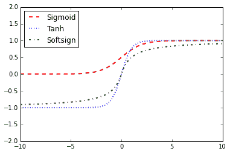

# 实现激活函数

激活函数是神经网络近似非线性输出并适应非线性特征的关键。他们将非线性运算引入神经网络。如果我们小心选择了哪些激活函数以及放置它们的位置，它们是非常强大的操作，我们可以告诉 TensorFlow 适合和优化。

## 做好准备

当我们开始使用神经网络时，我们将定期使用激活函数，因为激活函数是任何神经网络的重要组成部分。激活函数的目标只是调整权重和偏差。在 TensorFlow 中，激活函数是作用于张量的非线性操作。它们是以与先前的数学运算类似的方式运行的函数。激活函数有很多用途，但主要的概念是它们在对输出进行归一化的同时在图中引入了非线性。使用以下命令启动 TensorFlow 图：

```py
import tensorflow as tf 
sess = tf.Session() 
```

## 操作步骤

激活函数存在于 TensorFlow 中的神经网络（nn）库中。除了使用内置激活函数外，我们还可以使用 TensorFlow 操作设计自己的函数。我们可以导入预定义的激活函数（`import tensorflow.nn as nn`）或显式，并在函数调用中写入`nn`。在这里，我们选择明确每个函数调用：

1.  被整流的线性单元，称为 ReLU，是将非线性引入神经网络的最常见和最基本的方式。这个函数叫做`max(0,x)`。它是连续的，但不是平滑的。它看起来如下：

```py
print(sess.run(tf.nn.relu([-3., 3., 10.]))) 
[  0\.  3\.  10.] 
```

1.  有时我们会想要限制前面的 ReLU 激活函数的线性增加部分。我们可以通过将`max(0,x)`函数嵌套到`min()`函数中来实现。 TensorFlow 具有的实现称为 ReLU6 函数。这被定义为`min(max(0,x),6)`。这是硬 sigmoid 函数的一个版本，并且计算速度更快，并且不会消失（无穷小接近零）或爆炸值。当我们在第 8 章，卷积神经网络和第 9 章，循环神经网络中讨论更深层的神经网络时，这将派上用场。它看起来如下：

```py
print(sess.run(tf.nn.relu6([-3., 3., 10.]))) 
[ 0\. 3\. 6.]
```

1.  S 形函数是最常见的连续和平滑激活函数。它也被称为逻辑函数，其形式为`1 / (1 + exp(-x))`。 Sigmoid 函数不经常使用，因为它倾向于在训练期间将反向传播术语置零。它看起来如下：

```py
print(sess.run(tf.nn.sigmoid([-1., 0., 1.]))) 
[ 0.26894143  0.5         0.7310586 ] 
```

> 我们应该知道一些激活函数不是以零为中心的，例如 sigmoid。这将要求我们在大多数计算图算法中使用之前将数据归零。

1.  另一个平滑激活函数是超切线。超正切函数与 sigmoid 非常相似，除了它的范围在 0 和 1 之间，它的范围在-1 和 1 之间。该函数具有双曲正弦与双曲余弦的比率的形式。写这个的另一种方法是`(exp(x) - exp(-x)) / (exp(x) + exp(-x))`。此激活函数如下：

```py
print(sess.run(tf.nn.tanh([-1., 0., 1.]))) 
[-0.76159418  0\.         0.76159418 ] 
```

1.  `softsign`函数也可用作激活函数。该函数的形式是`x / (|x| + 1)`。 `softsign`函数应该是符号函数的连续（但不是平滑）近似。请参阅以下代码：

```py
print(sess.run(tf.nn.softsign([-1., 0., -1.]))) 
[-0.5  0\.   0.5] 
```

1.  另一个函数是`softplus`函数，是 ReLU 函数的流畅版本。该函数的形式是`log(exp(x) + 1)`。它看起来如下：

```py
print(sess.run(tf.nn.softplus([-1., 0., -1.]))) 
[ 0.31326166  0.69314718  1.31326163] 
```

> 当输入增加时，`softplus`函数变为无穷大，而`softsign`函数变为 1.然而，当输入变小时，`softplus`函数接近零，`softsign`函数变为-1。

1.  指数线性单元（ELU）与 softplus 函数非常相似，只是底部渐近线为-1 而不是 0.如果`x &lt; 0`其他`x`，则形式为`exp(x) + 1`。它看起来如下：

```py
print(sess.run(tf.nn.elu([-1., 0., -1.]))) 
[-0.63212055  0\.          1\.        ] 
```

## 工作原理

这些激活函数是我们将来可以在神经网络或其他计算图中引入非线性的方法。重要的是要注意我们的网络中我们使用激活函数的位置。如果激活函数的范围在 0 和 1（sigmoid）之间，则计算图只能输出 0 到 1 之间的值。如果激活函数在内部并隐藏在节点之间，那么我们想要知道当我们传递它们时，范围可以在我们的张量上。如果我们的张量被缩放到平均值为零，我们将希望使用一个激活函数来保持尽可能多的方差在零附近。这意味着我们想要选择激活函数，例如双曲正切（tanh）或 softsign。如果张量都被缩放为正数，那么我们理想地选择一个激活函数来保留正域中的方差。

## 更多

以下是两个绘图，说明了不同的激活函数。下图显示了 ReLU，ReLU6，softplus，指数 LU，sigmoid，softsign 和双曲正切函数：


图 3：softplus，ReLU，ReLU6 和指数 LU 的激活函数

在这里，我们可以看到四个激活函数：softplus，ReLU，ReLU6 和指数 LU。这些函数在零的左边展平并线性增加到零的右边，但 ReLU6 除外，其最大值为 6：



图 4：Sigmoid，双曲正切（tanh）和 softsign 激活函数

这是 sigmoid，双曲正切（tanh）和 softsign 激活函数。这些激活函数都是平滑的，具有`S n`形状。请注意，这些函数有两个水平渐近线。