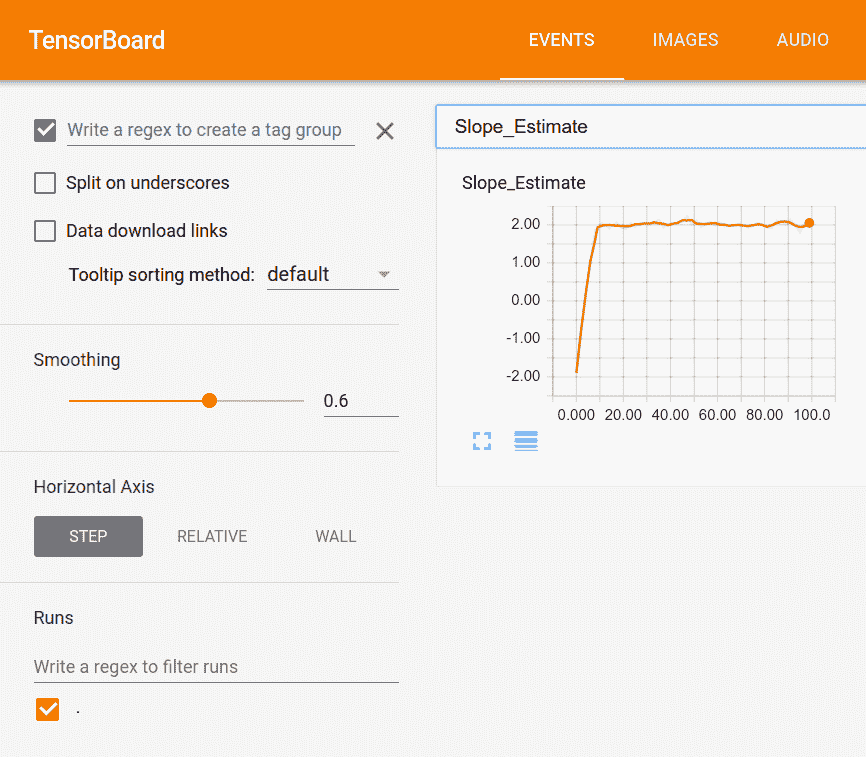
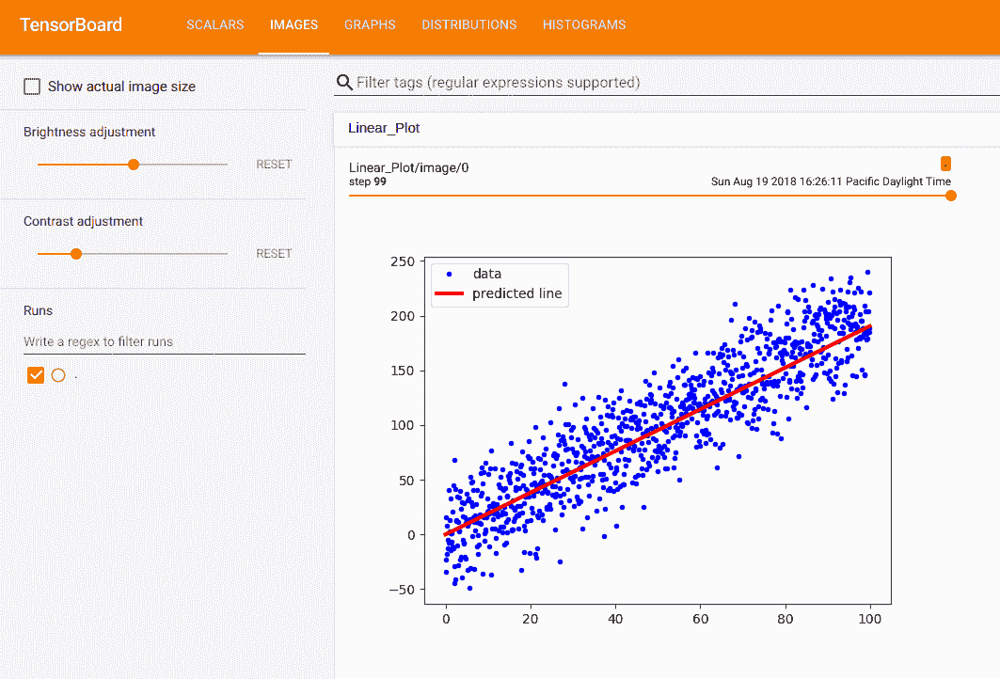

# 可视化 TensorBoard 中的图

监视和排除机器学习算法可能是一项艰巨的任务，尤其是在您知道结果之前必须等待很长时间才能完成训练。为了解决这个问题，TensorFlow 包含一个名为 TensorBoard 的计算图可视化工具。使用 TensorBoard，即使在训练期间，我们也可以可视化和绘制重要值（损失，准确率，批次训练时间等）。

## 做好准备

为了说明我们可以使用 TensorBoard 的各种方法，我们将从第 3 章，线性回归中的线性回归方法的 TensorFlow 方法重新实现线性回归模型。我们将生成带有错误的线性数据，并使用 TensorFlow 损失和反向传播来匹配数据线。我们将展示如何监控数值，值集的直方图以及如何在 TensorBoard 中创建图像。

## 操作步骤

1.  首先，我们将加载脚本所需的库：

```py
import os 
import io 
import time 
import numpy as np 
import matplotlib.pyplot as plt 
import tensorflow as tf 
```

1.  我们现在将初始化一个会话并创建一个可以将 TensorBoard 摘要写入`tensorboard`文件夹的摘要编写器：

```py
sess = tf.Session() 
# Create a visualizer object 
summary_writer = tf.summary.FileWriter('tensorboard', sess.graph)
```

1.  我们需要确保`tensorboard`文件夹存在，以便摘要编写者编写`tensorboard`日志：

```py
if not os.path.exists('tensorboard'): 
   os.makedirs('tensorboard') 
```

1.  我们现在将设置模型参数并生成模型的线性数据。请注意，由于我们生成数据的方式，我们的真实斜率值是`2`。我们将随着时间的推移想象出变化的斜率，并看到它接近真正的价值：

```py
batch_size = 50 
generations = 100 
# Create sample input data 
x_data = np.arange(1000)/10\. 
true_slope = 2\. 
y_data = x_data * true_slope + np.random.normal(loc=0.0, scale=25, size=1000) 
```

1.  接下来，我们将数据集拆分为训练和测试集：

```py
train_ix = np.random.choice(len(x_data), size=int(len(x_data)*0.9), replace=False) 
test_ix = np.setdiff1d(np.arange(1000), train_ix) 
x_data_train, y_data_train = x_data[train_ix], y_data[train_ix] 
x_data_test, y_data_test = x_data[test_ix], y_data[test_ix] 
```

1.  现在我们可以创建占位符，变量，模型运算，损失和优化操作：

```py
x_graph_input = tf.placeholder(tf.float32, [None]) 
y_graph_input = tf.placeholder(tf.float32, [None]) 
# Declare model variables 
m = tf.Variable(tf.random_normal([1], dtype=tf.float32), name='Slope') 
# Declare model 
output = tf.multiply(m, x_graph_input, name='Batch_Multiplication') 
# Declare loss function (L1) 
residuals = output - y_graph_input 
l2_loss = tf.reduce_mean(tf.abs(residuals), name="L2_Loss") 
# Declare optimization function 
my_optim = tf.train.GradientDescentOptimizer(0.01) 
train_step = my_optim.minimize(l2_loss) 
```

1.  我们现在可以创建一个 TensorBoard 操作来汇总标量值。我们将总结的标量值是模型的斜率估计值：

```py
with tf.name_scope('Slope_Estimate'): 
    tf.summary.scalar('Slope_Estimate', tf.squeeze(m))
```

1.  我们可以添加到 TensorBoard 的另一个摘要是直方图摘要，它在张量中输入多个值并输出图和直方图：

```py
with tf.name_scope('Loss_and_Residuals'): 
    tf.summary.histogram('Histogram_Errors', tf.squeeze(l1_loss))
    tf.summary.histogram('Histogram_Residuals', tf.squeeze(residuals)) 
```

1.  创建这些摘要操作后，我们需要创建一个将所有摘要组合在一起的摘要合并操作。然后我们可以初始化模型变量：

```py
summary_op = tf.summary.merge_all()
# Initialize Variables 
init = tf.global_variables_initializer()
sess.run(init) 
```

1.  现在，我们可以训练线性模型并编写每一代的摘要：

```py
for i in range(generations): 
    batch_indices = np.random.choice(len(x_data_train), size=batch_size) 
    x_batch = x_data_train[batch_indices] 
    y_batch = y_data_train[batch_indices] 
    _, train_loss, summary = sess.run([train_step, l2_loss, summary_op], 
                             feed_dict={x_graph_input: x_batch, 
                                        y_graph_input: y_batch}) 

    test_loss, test_resids = sess.run([l2_loss, residuals], feed_dict={x_graph_input: x_data_test, y_graph_input: y_data_test}) 

   if (i+1)%10==0: 
        print('Generation {} of {}. Train Loss: {:.3}, Test Loss: {:.3}.'.format(i+1, generations, train_loss, test_loss)) 

    log_writer = tf.train.SummaryWriter('tensorboard') 
    log_writer.add_summary(summary, i) 
```

1.  为了将最终的线性拟合图与 TensorBoard 中的数据点放在一起，我们必须以`protobuf`格式创建图的图像。为此，我们将创建一个输出`protobuf`图像的函数：

```py
def gen_linear_plot(slope): 
    linear_prediction = x_data * slope 
    plt.plot(x_data, y_data, 'b.', label='data') 
    plt.plot(x_data, linear_prediction, 'r-', linewidth=3, label='predicted line') 
    plt.legend(loc='upper left') 
    buf = io.BytesIO() 
    plt.savefig(buf, format='png') 
    buf.seek(0) 
    return(buf) 
```

1.  现在，我们可以创建`protobuf`图像并将其添加到 TensorBoard：

```py
# Get slope value
slope = sess.run(m)

# Generate the linear plot in buffer
plot_buf = gen_linear_plot(slope[0])

# Convert PNG buffer to TF image
image = tf.image.decode_png(plot_buf.getvalue(), channels=4)

# Add the batch dimension
image = tf.expand_dims(image, 0)

# Add image summary
image_summary_op = tf.summary.image("Linear_Plot", image)
image_summary = sess.run(image_summary_op)
log_writer.add_summary(image_summary, i)
log_writer.close()
```

Be careful writing image summaries too often to TensorBoard. For example, if we were to write an image summary every generation for 10,000 generations, that would generate 10,000 images worth of summary data. This tends to eat up disk space very quickly.

## 更多

1.  由于我们要从命令行运行描述的 python 脚本，我们打开命令提示符并运行以下命令：

```py
$ python3 using_tensorboard.py 

Run the command: $tensorboard --logdir="tensorboard"   Then navigate to http://127.0.0.0:6006 
Generation 10 of 100\. Train Loss: 20.4, Test Loss: 20.5\. 
Generation 20 of 100\. Train Loss: 17.6, Test Loss: 20.5\. 
Generation 90 of 100\. Train Loss: 20.1, Test Loss: 20.5\. 
Generation 100 of 100\. Train Loss: 19.4, Test Loss: 20.5\. 
```

1.  然后我们将运行前面指定的命令来启动 tensorboard：

```py
$ tensorboard --logdir="tensorboard" Starting tensorboard b'29' on port 6006 (You can navigate to http://127.0.0.1:6006) 
```

以下是我们在 TensorBoard 中可以看到的示例：



图 1：标量值，我们的斜率估计，在张量板中可视化

在这里，我们可以看到我们的标量总结的 100 代的绘图，斜率估计。事实上，我们可以看到它确实接近`2`的真正价值：


图 2：在这里，我们可视化模型的误差和残差的直方图

上图显示了查看直方图摘要的一种方法，可以将其视为多个折线图：



图 3：张量板中插入的图片

前面是我们以`protobuf`格式放入的最终拟合和数据点图，并插入到 TensorBoard 中的图像摘要中。